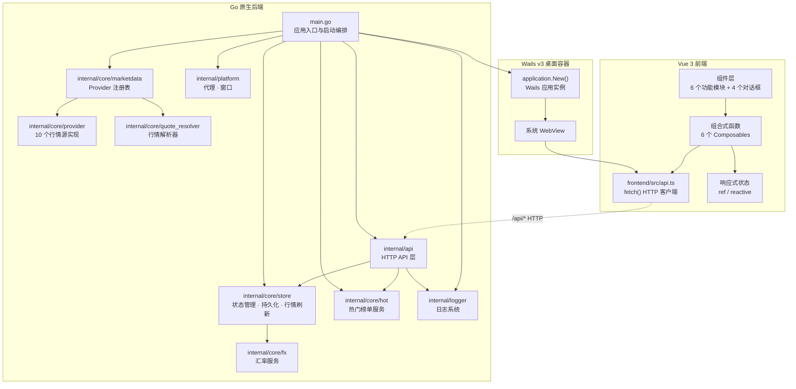
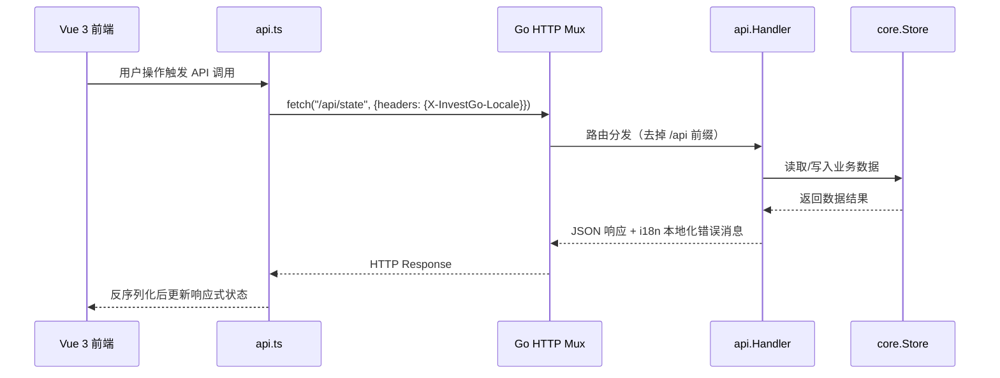

InvestGo 是一款基于 **Wails v3** 构建的轻量桌面投资跟踪工具，定位为个人自选股管理、持仓分析、热门榜单浏览与价格提醒的一站式应用。它选择了一条不同于 Electron 的路径——以 Go 作为原生后端、复用系统 WebView 渲染前端，从而避免了捆绑浏览器运行时的体积开销。项目以 MIT 协议开源，当前主要面向 Apple Silicon macOS 平台。

Sources: [README.zh-CN.md](README.zh-CN.md#L1-L144), [LICENSE](LICENSE#L1-L20)

## 项目定位与设计哲学

InvestGo 的核心设计决策可以归纳为三个原则：**轻量容器化**、**HTTP 优先通信**和**前后端可独立运行**。

Wails 在本项目中仅充当轻量桌面容器——Go 后端编译为原生二进制，前端通过系统 WebView 渲染，打包后的桌面应用无需携带 Chromium 或 Node.js 运行时。应用数据全部通过本地 HTTP `/api/*` 接口提供，前端使用标准 `fetch()` 调用后端，**不依赖 Wails JS bindings**。这意味着前端可以在普通 Vite 开发服务器中独立运行（端口 5173），后端也可以在纯 HTTP 模式下提供 API 服务，两者解耦程度极高。

需要留意的是，本项目当前使用 **Wails v3 alpha.54**，该版本仍处于 alpha 阶段，后续官方版本中的 API、运行时行为和构建细节都可能发生变化。InvestGo 主要是个人使用和学习项目，不保证长期维护或稳定的功能路线图。

Sources: [README.zh-CN.md](README.zh-CN.md#L5-L12), [main.go](main.go#L88-L89), [frontend/src/api.ts](frontend/src/api.ts#L25-L55)

## 核心功能一览

InvestGo 覆盖了投资跟踪的完整工作流，从前端模块划分即可一览功能全貌：

| 功能模块         | 前端组件              | 说明                                               |
| ---------------- | --------------------- | -------------------------------------------------- |
| **投资组合概览** | `OverviewModule.vue`  | 聚合总资产、盈亏统计、持仓分布饼图、组合趋势堆叠图 |
| **自选列表**     | `WatchlistModule.vue` | 管理关注的证券，支持搜索筛选、单个刷新、置顶排序   |
| **热门榜单**     | `HotModule.vue`       | 按市场分组（CN/HK/US）浏览热门股，支持多维度排序   |
| **持仓管理**     | `HoldingsModule.vue`  | 管理持仓数量与成本，支持 DCA（定投）记录与盈亏计算 |
| **价格提醒**     | `AlertsModule.vue`    | 设置价格触达提醒规则（above/below），跟踪触发状态  |
| **应用设置**     | `SettingsModule.vue`  | 分标签页管理通用、外观、区域、网络、开发者等设置   |

后端在 `WatchlistItem` 这一统一数据模型上同时支撑自选与持仓两种视图——前端通过是否存在持仓数据（`quantity > 0` 或 `dcaEntries` 非空）来区分展示，避免了数据模型的分裂。

Sources: [frontend/src/types.ts](frontend/src/types.ts#L82-L117), [internal/core/model.go](internal/core/model.go#L58-L107)

## 整体架构

下面的架构图展示了 InvestGo 从 Go 原生二进制启动到前端渲染的完整数据流：



**数据流核心路径**：前端组件通过 Composables 调用 `api.ts` 中的 `fetch()` → 请求 `/api/*` 路由 → `api.Handler` 协调 `Store` / `HotService` / `LogBook` → 返回 JSON 响应 → 前端更新响应式状态并渲染。全程无 Wails JS bindings 参与。

Sources: [main.go](main.go#L44-L130), [internal/api/http.go](internal/api/http.go#L58-L96)

## 项目目录结构

InvestGo **不是 monorepo**。Go module 根目录就是仓库根目录，前端代码位于 `frontend/` 子目录。以下为关键目录与文件的职责划分：

```
investgo/
├── main.go                          # 应用入口：启动编排、Wails 实例创建、HTTP mux 组装
├── go.mod / go.sum                  # Go 模块定义（依赖 Wails v3、utls、x/text）
├── package.json                     # 前端构建脚本（dev / build / typecheck）
├── vite.config.ts                   # Vite 构建配置
│
├── internal/                        # Go 后端核心（不可被外部导入）
│   ├── api/                         # HTTP API 层
│   │   ├── handler.go               #   请求处理器实现
│   │   ├── http.go                  #   路由注册与请求分发
│   │   ├── i18n/                    #   后端错误消息国际化
│   │   └── open_external.go         #   打开外部链接
│   ├── core/                        # 业务核心
│   │   ├── model.go                 #   核心数据模型定义
│   │   ├── store/                   #   状态管理与 JSON 持久化
│   │   ├── marketdata/              #   Provider 注册表与历史路由构建
│   │   ├── provider/                #   10 个行情源具体实现
│   │   ├── endpoint/                #   API 端点封装
│   │   ├── fx/                      #   汇率服务（Frankfurter API）
│   │   ├── hot/                     #   热门榜单服务
│   │   ├── quote_resolver.go        #   行情解析器
│   └── common/                      #   通用工具
│       ├── cache/                   #   缓存机制
│       └── errs/                    #   错误类型
│   ├── logger/                      #   日志系统（LogBook）
│   └── platform/                    #   平台层（代理检测、窗口选项）
│
├── frontend/                        # Vue 3 前端
│   └── src/
│       ├── main.ts                  #   前端入口
│       ├── App.vue                  #   根组件（全局状态编排）
│       ├── api.ts                   #   HTTP 客户端封装
│       ├── types.ts                 #   TypeScript 类型定义
│       ├── i18n.ts                  #   双语文案管理
│       ├── theme.ts                 #   主题系统
│       ├── format.ts                #   格式化工具
│       ├── forms.ts                 #   表单默认值与校验
│       ├── constants.ts             #   常量定义
│       ├── devlog.ts                #   开发日志工具
│       ├── wails-runtime.ts         #   Wails 运行时桥接（可空安全）
│       ├── components/              #   UI 组件
│       │   ├── modules/             #     6 个功能模块视图
│       │   └── dialogs/             #     4 个对话框组件
│       ├── composables/             #   6 个组合式函数
│       ├── styles/                  #   全局样式
│       └── assets/                  #   静态资源
│
├── scripts/                         # 构建与打包脚本（macOS）
└── assets/                          # README 截图
```

Sources: [main.go](main.go#L1-L189), [README.zh-CN.md](README.zh-CN.md#L30-L50)

## 技术栈总览

InvestGo 的技术选型围绕"原生后端 + 现代 Web 前端"的轻量桌面理念：

| 层次          | 技术              | 版本        | 说明                                        |
| ------------- | ----------------- | ----------- | ------------------------------------------- |
| **桌面框架**  | Wails             | v3 alpha.54 | Go 原生后端 + 系统 WebView，非 Electron     |
| **后端语言**  | Go                | 1.24        | 编译为原生二进制，无运行时依赖              |
| **后端 HTTP** | 标准库 `net/http` | —           | Go 1.22+ 路径参数模式匹配，无第三方路由框架 |
| **前端框架**  | Vue               | 3.5+        | Composition API + `<script setup>`          |
| **UI 组件库** | PrimeVue          | 4.5+        | 企业级组件库，支持主题定制                  |
| **类型系统**  | TypeScript        | 6.0+        | 前端类型安全，与后端 Go 结构体对齐          |
| **构建工具**  | Vite              | 8.0+        | 前端开发服务器与生产构建                    |
| **图表**      | Chart.js          | 4.5+        | 概览饼图与趋势堆叠图                        |
| **TLS 指纹**  | utls              | 1.8.2       | 部分行情源的 HTTP 客户端 TLS 指纹伪装       |
| **文本处理**  | golang.org/x/text | 0.33        | 后端国际化文本处理                          |

Sources: [go.mod](go.mod#L1-L53), [package.json](package.json#L1-L21)

## 行情数据源

InvestGo 集成了 **10 个行情数据源**，覆盖 A 股、港股、美股三大市场，并按市场智能路由到最优数据源：

| 数据源        | 文件                | 市场覆盖       | 类型                             |
| ------------- | ------------------- | -------------- | -------------------------------- |
| 东方财富      | `eastmoney.go`      | CN（A股、ETF） | 国内免费源，实时行情 + 历史 K 线 |
| 新浪财经      | `sina.go`           | CN             | 国内免费源，实时行情             |
| 雪球          | `xueqiu.go`         | CN             | 国内免费源，实时行情             |
| 腾讯财经      | `tencent.go`        | CN             | 国内免费源，实时行情             |
| Yahoo Finance | `yahoo.go`          | US、HK         | 国际源，行情 + 历史 + 搜索       |
| Alpha Vantage | `alphavantage.go`   | US             | 第三方 API（需 API Key）         |
| Finnhub       | `finnhub.go`        | US             | 第三方 API（需 API Key）         |
| Polygon       | `polygon.go`        | US             | 第三方 API（需 API Key）         |
| Twelve Data   | `twelvedata.go`     | US             | 第三方 API（需 API Key）         |
| Frankfurter   | `internal/core/fx/` | 汇率           | 开源汇率 API，多币种折算         |

后端通过 `marketdata.DefaultRegistry()` 注册所有 Provider，并按用户设置的 `cnQuoteSource` / `hkQuoteSource` / `usQuoteSource` 进行市场级路由选择。历史数据则通过 `HistoryRouter` 实现降级链——首选源失败时自动回退到备选源。

Sources: [internal/core/provider](internal/core/provider), [main.go](main.go#L61-L64), [README.zh-CN.md](README.zh-CN.md#L21-L24)

## 前后端通信机制

InvestGo 的前后端通信完全基于 **本地 HTTP REST API**，这是理解整个项目架构的关键：



API 路由一览（注册在 `api.Handler.buildMux()` 中）：

| 方法   | 路径                  | 功能                 |
| ------ | --------------------- | -------------------- |
| GET    | `/state`              | 获取完整应用状态快照 |
| GET    | `/overview`           | 获取组合概览分析数据 |
| GET    | `/hot`                | 获取热门榜单数据     |
| GET    | `/history`            | 获取历史 K 线数据    |
| GET    | `/logs`               | 获取开发日志         |
| DELETE | `/logs`               | 清除开发日志         |
| POST   | `/client-logs`        | 前端发送日志到后端   |
| POST   | `/refresh`            | 刷新全部行情         |
| POST   | `/open-external`      | 打开外部链接         |
| PUT    | `/settings`           | 更新应用设置         |
| POST   | `/items`              | 创建自选/持仓项      |
| PUT    | `/items/{id}`         | 更新项数据           |
| PUT    | `/items/{id}/pin`     | 置顶/取消置顶        |
| DELETE | `/items/{id}`         | 删除项               |
| POST   | `/items/{id}/refresh` | 刷新单项行情         |
| POST   | `/alerts`             | 创建提醒规则         |
| PUT    | `/alerts/{id}`        | 更新提醒规则         |
| DELETE | `/alerts/{id}`        | 删除提醒规则         |

前端通过 `X-InvestGo-Locale` 请求头传递当前语言偏好，后端据此对错误消息和行情源名称进行本地化处理。

Sources: [internal/api/http.go](internal/api/http.go#L58-L96), [frontend/src/api.ts](frontend/src/api.ts#L25-L55)

## 状态持久化与运行时路径

InvestGo 的应用状态以单个 JSON 文件持久化，路径遵循操作系统惯例：

| 数据类型 | macOS 默认路径                                        |
| -------- | ----------------------------------------------------- |
| 应用状态 | `~/Library/Application Support/investgo/state.json`   |
| 开发日志 | `~/Library/Application Support/investgo/logs/app.log` |

`main.go` 通过 `os.UserConfigDir()` 获取平台配置目录，若获取失败则回退到项目相对路径 `./data/`。应用关闭时通过 Wails 的 `OnShutdown` 回调确保状态保存。

Sources: [main.go](main.go#L141-L168), [README.zh-CN.md](README.zh-CN.md#L51-L57)

## 建议阅读路径

作为入门指南的第一篇，以下是按认知梯度推荐的后续阅读顺序：

1. **[快速开始](2-kuai-su-kai-shi)** — 立即动手，搭建开发环境并让应用跑起来
2. **[技术栈与依赖总览](3-ji-zhu-zhan-yu-yi-lai-zong-lan)** — 深入理解每一项技术选型的细节与依赖关系
3. **[开发环境搭建与调试模式](4-kai-fa-huan-jing-da-jian-yu-diao-shi-mo-shi)** — 掌握前端独立开发、后端调试、开发者模式等实操技巧
4. **[构建与打包发布（macOS）](5-gou-jian-yu-da-bao-fa-bu-macos)** — 从二进制编译到 `.app` / `.dmg` 打包的完整流程

完成入门指南后，可按兴趣深入 [深度解析](6-ying-yong-qi-dong-liu-cheng-yu-chu-shi-hua) 系列文档，从后端启动流程开始系统性地理解架构细节。
