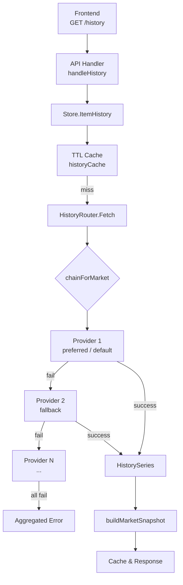
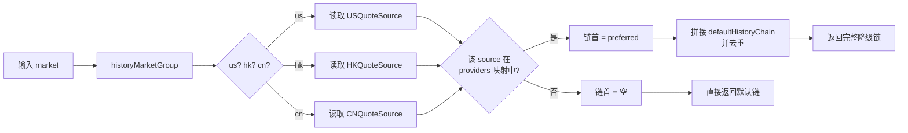

HistoryRouter 是 InvestGo 后端历史行情数据的分发与降级中枢。它本身并不直接请求任何外部 K 线接口，而是作为 `core.HistoryProvider` 接口的统一代理，依据两项输入为每一次历史数据请求动态构建**按优先级排序的 Provider 降级链**：一是标的所属的市场（CN / HK / US），决定哪些底层 Provider 在技术层面具备服务该市场的能力；二是用户为各市场独立配置的实时行情源偏好（`CNQuoteSource` / `HKQuoteSource` / `USQuoteSource`），在偏好源同样具备历史数据能力时被置于链首优先尝试。若链中任一 Provider 返回错误，Router 自动按序降级至下一个，直到成功或耗尽全链。该设计使得无论用户将实时行情源设为新浪、雪球这类仅支持报价的源，K 线图表始终可用，因为 Router 会自动将其跳过并fallback 至具备 K 线 API 的源。

Sources: [history_router.go](internal/core/marketdata/history_router.go#L11-L24)

## 架构定位与接口透明性

HistoryRouter 在整体数据架构中扮演**装饰器角色**。它对上层（Store、HTTP Handler）完全透明——Store 的 `ItemHistory` 方法只需持有一个 `core.HistoryProvider` 接口实例，无需关心背后是一个单一 Provider 还是一个多级降级链。Router 对下层则持有所有已注册的历史数据 Provider 实例映射，按需调度。

在 `main.go` 的应用启动流程中，`Registry` 先收集所有具备历史数据能力的 Provider，再通过 `registry.NewHistoryRouter` 将其注入 Store。Registry 的 `DefaultRegistry` 一次性创建所有 Provider 实例并共享同一个 `*http.Client`，确保代理配置与连接池在整个生命周期内一致。

Sources: [main.go](main.go#L59-L69), [registry.go](internal/core/marketdata/registry.go#L167-L174)

## 降级链构建逻辑

降级链的生成由 `chainForMarket` 主导，其内部遵循两条规则：首先，读取用户为该市场配置的 QuoteSource，但仅当该 Source 被注册在 Router 的 `providers` 映射中时才置于链首——这意味着新浪、雪球等无 K 线 API 的源天然被过滤，不会进入历史数据链路；其次，将市场对应的默认链作为尾部，并剔除已在首位的重复 ID，避免同一 Provider 被连续调用两次。

`defaultHistoryChain` 的编排体现了对不同市场生态的差异化策略。美股市场接入了大量第三方 API 数据源（Finnhub、Polygon、Alpha Vantage、Twelve Data），因此默认链较长，且 Yahoo Finance 被置于最前以保证零配置启动即可绘制图表；而中港市场目前主要依赖 EastMoney 与 Yahoo Finance，默认链更短。`historyMarketGroup` 将详细的市场标识符归并为三大组：`US-STOCK`、`US-ETF` 归入 `us`；`HK-MAIN`、`HK-GEM`、`HK-ETF` 归入 `hk`；其余全部归入 `cn`。

Sources: [history_router.go](internal/core/marketdata/history_router.go#L82-L160)

## Provider 能力矩阵与注册机制

并非所有在 Registry 中注册的 Source 都会进入 HistoryRouter 的调度池。Registry 中的 `DataSource` 结构同时持有 `quote` 和 `history` 两个接口字段，只有 `history != nil` 的源才会被 `HistoryProviders()` 方法筛选出来并注入 Router。

| Source ID | 报价能力 | 历史数据能力 | 覆盖市场 | 备注 |
|---|---|---|---|---|
| eastmoney | ✅ | ✅ | CN, HK, US | 默认全市场覆盖 |
| yahoo | ✅ | ✅ | CN, HK, US | 海外标的表现稳定 |
| sina | ✅ | ❌ | CN, HK, US | 仅实时报价，被 Router 自动跳过 |
| xueqiu | ✅ | ❌ | CN, HK, US | 仅实时报价，被 Router 自动跳过 |
| tencent | ✅ | ✅ | CN, HK, US | 轻量历史端点 |
| alpha-vantage | ✅ | ✅ | US | 需 API Key |
| twelve-data | ✅ | ✅ | US | 需 API Key |
| finnhub | ✅ | ✅ | US | 需 API Key |
| polygon | ✅ | ✅ | US | 需 API Key |

这一矩阵解释了为何 HistoryRouter 采用“按能力过滤”而非“按配置过滤”的策略：用户可能将实时行情源设为 Sina，但 Sina 未注册为 HistoryProvider，因此 `preferredSourceID` 返回空字符串，Router 直接回退到默认链，图表请求不会因用户配置而失败。

Sources: [registry.go](internal/core/marketdata/registry.go#L15-L48), [registry.go](internal/core/marketdata/registry.go#L181-L295)

## 与 Store 缓存层的协同

HistoryRouter 解决的是**数据源路由**问题，而 Store 的 `ItemHistory` 在此基础上叠加了**TTL 缓存**与**市场快照计算**两层能力。完整的端到端数据流如下：

1. HTTP Handler 调用 `store.ItemHistory(ctx, itemID, interval, force)`；
2. Store 以 `itemID + "|" + interval` 为键查询 `historyCache`，命中则直接返回克隆副本，并标记 `Cached = true`；
3. 缓存未命中时，Store 释放读锁，调用 `historyProvider.Fetch`（即 HistoryRouter）；
4. Router 内部构建降级链并依次尝试，返回首个成功的 `HistorySeries`；
5. Store 将返回的 Series 传入 `buildMarketSnapshot`，结合标的实时仓位信息计算 `PositionValue`、`PositionPnL` 等衍生字段；
6. 结果按区间粒度写入 TTL Cache：1 小时数据缓存 5 分钟，1 天数据缓存 10 分钟，1 周/1 月缓存 30 分钟，1 年以上缓存 4 小时；
7. 最终返回给 Handler 的 Series 已携带 `Snapshot`、`Cached`、`CacheExpiresAt` 等元数据。

特别值得注意的是，投资组合 Overview 的 Trend 计算也复用了同一条链路。`OverviewAnalytics` 在构建趋势图时，通过闭包将 `s.ItemHistory` 注入 `overviewCalculator`，而非直接调用 `historyProvider.Fetch`。这一设计确保 Overview 重建能够命中用户此前浏览个股图表时已缓存的历史数据，避免在每次价格刷新时产生冗余网络请求。

Sources: [runtime.go](internal/core/store/runtime.go#L203-L278), [cache.go](internal/core/store/cache.go#L52-L66)

## 错误聚合与诊断

HistoryRouter 的 `Fetch` 方法在降级链全部失败时，会返回一个聚合错误字符串，其中包含每一个被尝试的 Provider 名称及其原始错误信息。这一设计极大简化了线上问题的定位：当日志或前端调试面板中出现 `all history providers failed for AAPL (US-STOCK): [Yahoo Finance] ...; [Finnhub] ...` 时，开发者可以立刻判断是全局网络问题还是特定 Provider 的 API Key 失效。

如果某市场完全没有配置任何具备历史数据能力的 Provider（例如 Registry 未正确初始化），Router 会返回 `no history provider configured for market`。在 Store 层面，`historyProvider` 字段为 nil 时也会提前返回 `History provider is not configured`，防止空指针 panic。

Sources: [history_router.go](internal/core/marketdata/history_router.go#L54-L80), [runtime.go](internal/core/store/runtime.go#L226-L228)

## 懒加载设置与无状态设计

HistoryRouter 不缓存任何用户设置快照，而是通过构造函数注入的 `settings func() core.AppSettings` 在每次 `Fetch` 时实时读取最新配置。这意味着用户在 Settings 面板中切换行情源后，下一次历史数据请求立刻生效，无需重启应用或重建 Router。`main.go` 中利用闭包技巧实现了这一延迟绑定：启动时 Store 尚未就绪，因此 `settingsFunc` 初始化为返回空结构体的兜底函数；Store 初始化完成后，再将 `settingsFunc` 指向 `store.CurrentSettings`。

此外，Router 本身不维护任何请求间的可变状态（`providers` 映射在构造后只读），因此它是并发安全的，可以被 Store 的多个 goroutine 同时调用而无需加锁。

Sources: [history_router.go](internal/core/marketdata/history_router.go#L25-L49), [main.go](main.go#L58-L75)

## 下一步阅读

HistoryRouter 的降级链最终落到底层 Provider 的具体实现上。若想深入了解各 Provider 如何解析标的代码、构造 K 线请求、处理响应异常，可参考以下专题页面：

- [EastMoney Provider：实时行情与历史 K 线](26-eastmoney-provider-shi-shi-xing-qing-yu-li-shi-k-xian)
- [Yahoo Finance Provider：行情、历史与搜索](27-yahoo-finance-provider-xing-qing-li-shi-yu-sou-suo)
- [第三方 API 数据源集成（Alpha Vantage、Finnhub、Polygon、Twelve Data）](28-di-san-fang-api-shu-ju-yuan-ji-cheng-alpha-vantage-finnhub-polygon-twelve-data)
- [国内行情源（新浪、雪球、腾讯）](29-guo-nei-xing-qing-yuan-xin-lang-xue-qiu-teng-xun)

若关注 HistoryRouter 的上游调度方，可继续阅读 [Store：核心状态管理与持久化](7-store-he-xin-zhuang-tai-guan-li-yu-chi-jiu-hua) 了解缓存策略、持久化机制与状态快照的完整生命周期。