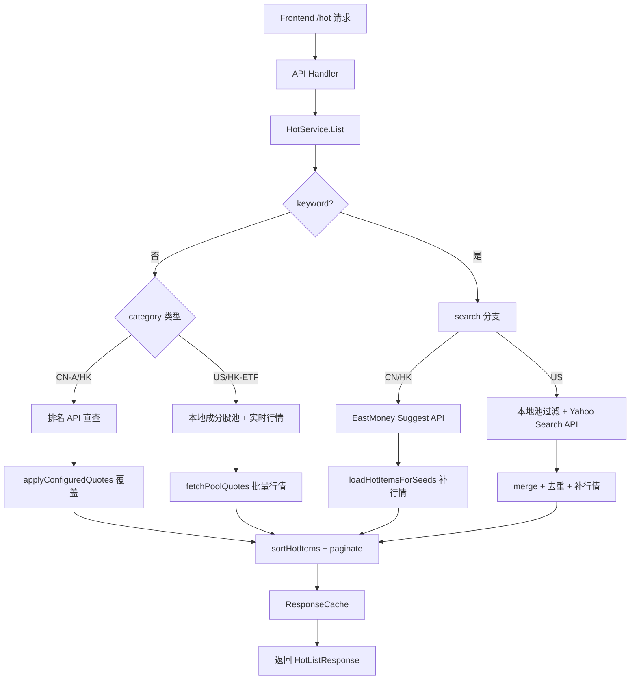

热门榜单服务（`HotService`）是 investgo 后端中负责多市场实时榜单查询的核心模块。它要解决的问题看似直接——返回某类股票按指定维度排序的列表——但背后涉及跨市场数据源协调、实时行情聚合、关键词搜索、服务端分页与缓存等多个复杂 concerns。本文将完整拆解其架构分层、缓存策略、搜索路由与排序模型，帮助你在维护或扩展该模块时建立清晰的认知地图。

Sources: [service.go](internal/core/hot/service.go#L30-L56)

## 整体架构与服务边界

`HotService` 的职责边界被严格限定在「榜单数据的获取、加工与缓存」之内，不包含持久化状态管理，也不直接处理 HTTP 序列化。它通过 HTTP 客户端与多个上游数据源（东方财富、新浪财经、雪球、Yahoo Finance）通信，并依赖 `marketdata.Registry` 在需要时将行情请求转发给用户配置的第三方 Provider（如 Alpha Vantage、Twelve Data 等）。

整个服务的调用链可概括为：前端通过 `/hot` 接口传入 category、sort、keyword、page、pageSize 等参数，handler 将其组装为 `HotListOptions` 后调用 `HotService.List()`；服务内部根据 category 与 keyword 的存在与否，决定走「排名 API 直查」「本地成分股池 + 实时行情」或「关键词搜索」三条路径之一，最后经过排序、分页、缓存后返回。



Sources: [service.go](internal/core/hot/service.go#L58-L101), [handler.go](internal/api/handler.go#L103-L132)

## 分类体系与数据源路由

服务将榜单划分为 8 个细分类别，并按市场归属选择不同的「排名源」（membership source）与「行情源」（quote source）。两者的解耦是设计的核心：排名源决定「有哪些股票」，行情源决定「显示什么价格」。例如，当用户将 A 股行情源设为 Sina 时，排名列表仍可由 EastMoney 提供，但最终价格会重新抓取 Sina 数据覆盖上去。

| 分类（HotCategory） | 排名源（默认） | 支持的其他排名源 | 行情源可配置 |
|---|---|---|---|
| `cn-a` | EastMoney | Sina、Xueqiu | 是 |
| `cn-etf` | Sina | Xueqiu | 是 |
| `hk` | EastMoney | Xueqiu | 是 |
| `hk-etf` | 本地池 | — | 是（EastMoney 默认回退 Tencent） |
| `us-sp500` | 本地池 | — | 是 |
| `us-nasdaq` | 本地池 | — | 是 |
| `us-dow` | 本地池 | — | 是 |
| `us-etf` | 本地池 | — | 是 |

本地池（pool-backed）类别的本质是「维护一份预定义的成分股代码列表 + 批量获取实时行情」，而非调用上游排名 API。这适用于美股指数成分股与港股 ETF，因为这些领域的免费排名 API 要么不稳定，要么不支持服务端排序。

Sources: [category.go](internal/core/hot/category.go#L10-L106), [pool.go](internal/core/hot/pool.go#L38-L61)

## 双层缓存机制

为了在高频翻页或关键词搜索时减少不必要的网络 I/O，`HotService` 内置了两层 TTL 缓存，均基于通用的 `internal/common/cache.TTL` 实现。

**第一层：searchCache** 缓存「某分类 + 某排序 + 某行情源」下的完整 `[]HotItem`。它主要服务于搜索场景中的 `listAllSearchableItems`——当用户输入关键词后，系统需要先有全量数据才能做本地过滤。对 CN/HK 分类，这会通过分页拉取把上游 API 的全部数据缓存下来；对 US 分类，则缓存本地池的行情结果。

**第二层：responseCache** 缓存「最终的 HTTP 响应」，即已经过排序、过滤、分页后的 `HotListResponse`。其缓存键包含 category、sort、keyword、page、pageSize 与 quoteSource，因此同一份全量数据在不同分页参数下会有各自的缓存条目。

默认缓存 TTL 为 60 秒，可通过 `HotListOptions.CacheTTL` 覆盖，也支持通过 `BypassCache` 强制穿透。

```mermaid
graph LR
    subgraph HotService
        SC[searchCache<br/>[]HotItem]
        RC[responseCache<br/>HotListResponse]
    end
    A[List 请求] --> RC
    RC -- miss --> B[执行业务逻辑]
    B --> SC
    SC -- miss --> C[fetchAllHotPages / loadPoolItems]
    C --> SC
    B --> RC
```

`TTL` 缓存实现采用读写锁保护 map，支持懒删除（lazy eviction）：`Get` 时发现条目过期会立即删除并返回 miss，无需额外的定时清理协程。若配置了 `maxSize`，则在插入新键时按 FIFO 淘汰最老的条目。

Sources: [cache.go](internal/core/hot/cache.go#L1-L93), [ttl.go](internal/common/cache/ttl.go#L1-L118)

## 搜索实现：按市场分流策略

搜索路径的设计体现了「最小网络 I/O」原则：不同市场采用完全不同的策略，而非统一拉取全量数据后过滤。

**CN / HK 市场** 使用东方财富的 Suggest API。该接口接受关键词参数，仅返回匹配的代码与名称，通常一次请求即可返回 30 条结果，避免了下载数千只 A 股全量数据。为了提升覆盖率，系统还会从 `searchCache` 中取出该分类的缓存全量数据，做本地关键词过滤，将结果与 Suggest API 返回的种子合并去重，最后只为这些种子补行情。

**美股（US-SP500 / US-Nasdaq / US-Dow）** 采用「本地池预过滤 + Yahoo Search API 兜底」的混合模式。首先在无网络开销的前提下，对预定义的 `hotConstituents` 做基于 symbol 与 name 的本地字符串匹配；然后调用 Yahoo Finance Search API 扩大搜索范围（例如用户输入公司名而非 ticker）。两路结果通过 `mergeHotSeeds` 按 `Market|Symbol` 去重合并，最终批量获取行情。

**美股 ETF（US-ETF）** 逻辑与美股类似，但 Yahoo Search API 侧会额外过滤 `quoteType` 与 `typeDisp`，确保只保留 ETF 类型。

Sources: [service.go](internal/core/hot/service.go#L103-L123), [eastmoney.go](internal/core/hot/eastmoney.go#L225-L266), [yahoo.go](internal/core/hot/yahoo.go#L30-L98)

## 排序与分页模型

服务端排序定义了 5 个维度，以 `HotSort` 类型强约束：

| 排序值 | 语义 | 服务端排序字段 | 上游 API 委托 |
|---|---|---|---|
| `volume` | 成交额 / 成交量降序 | `Volume` | EastMoney `f5`、Sina `volume`、Xueqiu `volume` |
| `gainers` | 涨幅降序 | `ChangePercent` | EastMoney `f3` desc、Sina `changepercent` desc |
| `losers` | 跌幅升序 | `ChangePercent` | EastMoney `f3` asc、Sina `changepercent` asc |
| `market-cap` | 市值降序 | `MarketCap` | EastMoney `f20`、Sina `mktcap` |
| `price` | 现价降序 | `CurrentPrice` | Sina `trade`、Xueqiu `current` |

一个关键细节是：对于调用上游排名 API 的类别（CN-A、CN-ETF、HK），排序参数会直接映射到对应 API 的查询字段，由上游完成首次排序。但数据返回后，`sortHotItems` 仍会执行一次服务端稳定排序，这是为了确保行情覆盖（overlay）后价格变动不会破坏排序一致性，同时也让本地池类别拥有统一的排序语义。

分页由 `paginateHotItems` 实现，逻辑简单直接：计算 `(page-1)*pageSize` 的起始偏移，并安全处理越界（返回空切片）。默认 pageSize 为 20。

Sources: [sort.go](internal/core/hot/sort.go#L1-L50), [category.go](internal/core/hot/category.go#L119-L126)

## 行情覆盖（Quote Overlay）

当用户配置的 quote source 与当前排名源不一致时，`HotService` 会启动「覆盖」流程：`applyConfiguredQuotes` 将已有 `HotItem` 列表转换为 `WatchlistItem`，通过 `marketdata.Registry` 查找对应的 `QuoteProvider` 批量获取实时行情，再用新数据覆盖价格、涨跌幅、成交量等字段。若覆盖后的 provider 名称与现有 `QuoteSource` 一致，则跳过重复请求。

该机制的典型场景是：用户将 A 股行情源设为 `sina`，但 A 股排名默认由 EastMoney 提供。此时榜单的排序框架仍来自 EastMoney，但最终显示的价格与涨跌幅来自 Sina，保证用户自选股与榜单的数值同源。

Sources: [enrich.go](internal/core/hot/enrich.go#L1-L116)

## 预定义成分股池

对于没有免费排名 API 的类别，服务在 `constituent.go` 中维护了预定义的成分股种子（`hotSeed`）。`hotSeed` 只包含 Symbol、Name、Market、Currency 四个字段，是最小化的元数据结构。

- **美股指数池**：`us-sp500` 约 500+ 只（含 dual-class）、`us-nasdaq` 约 100 只、`us-dow` 30 只。代码列表通过 `usStockSeeds` 生成，并附带 `usEquitySeedNames` 映射提供 fallback 英文名称。
- **美股 ETF 池**：`us-etf` 维护约 100 只主流 ETF。
- **港股 ETF 池**：`hk-etf` 维护约 60+ 只香港上市 ETF，因雪球 screener API 不支持港股 ETF 类型过滤，故采用本地枚举。

获取行情时，`fetchPoolQuotes` 会根据 `sourceID` 分发到 Yahoo、EastMoney、Sina 或通用 `QuoteProvider`。其中 EastMoney 对美股池采用特殊的 `fetchUSPoolQuotesEastMoney`——直接调用其美股 clist API 批量返回行情，而非逐只请求；对 A 股/港股池则使用 `secids` 批量的 diff 接口，并将请求按 URL 长度切分为多批次，避免触发上游 502。

Sources: [constituent.go](internal/core/hot/constituent.go#L1-L52), [pool.go](internal/core/hot/pool.go#L63-L128)

## 缓存键设计与失效策略

缓存键的生成遵循「精确匹配请求参数」原则，确保不同查询条件之间不会相互污染。

- **searchCache Key**：`category|sort|sourceID`。例如 `cn-a|volume|eastmoney`。它只与分类、排序和行情源有关，与 keyword、page 无关，因此同一会话内的多次搜索可以共享同一份全量数据。
- **responseCache Key**：`category|sort|keyword|page|pageSize|sourceID`。例如 `us-sp500|gainers|apple|1|20|yahoo`。它精确对应一次前端请求，命中时可立即返回而无需任何计算。

当 `BypassCache` 为 true 时，两层缓存均被跳过；否则 `loadCachedResponse` 会在 `List` 入口处尝试命中，`loadCachedItems` 会在搜索前尝试命中。缓存条目在 TTL 到期后的第一次 `Get` 会被自动清除，不会长期占用内存。

Sources: [cache.go](internal/core/hot/cache.go#L110-L124)

## 从 API 层到服务的调用契约

`internal/api/handler.go` 中的 `handleHot` 是前端与 `HotService` 的唯一桥梁。它从 URL Query 中解析以下参数：

| 参数 | 类型 | 说明 |
|---|---|---|
| `category` | string | 映射为 `HotCategory`，非法值回退到 `cn-a` |
| `sort` | string | 映射为 `HotSort`，非法值回退到 `volume` |
| `q` | string | 关键词，空字符串表示非搜索模式 |
| `page` | int | 页码，小于 1 时归一化为 1 |
| `pageSize` | int | 每页条数，默认 20 |
| `force` | bool | 是否强制穿透缓存 |

`HotListOptions` 中的行情源字段则从 `store.CurrentSettings()` 读取，保证榜单行情与用户全局配置一致。若 `HotService` 未初始化（nil），handler 返回 503 Service Unavailable。

Sources: [handler.go](internal/api/handler.go#L103-L132)

---

至此，你已经完整了解了热门榜单服务的内部结构与数据流。如果你需要进一步深入，推荐按以下顺序阅读相关文档：

- 如需理解行情源注册与 Provider 选择逻辑，请参阅 [市场数据 Provider 注册表与路由机制](8-shi-chang-shu-ju-provider-zhu-ce-biao-yu-lu-you-ji-zhi)
- 如需了解行情解析与代码规范化，请参阅 [行情解析器：多市场代码规范化](9-xing-qing-jie-xi-qi-duo-shi-chang-dai-ma-gui-fan-hua)
- 如需查看 HTTP API 层的错误国际化处理，请参阅 [HTTP API 层设计与国际化错误处理](14-http-api-ceng-she-ji-yu-guo-ji-hua-cuo-wu-chu-li)