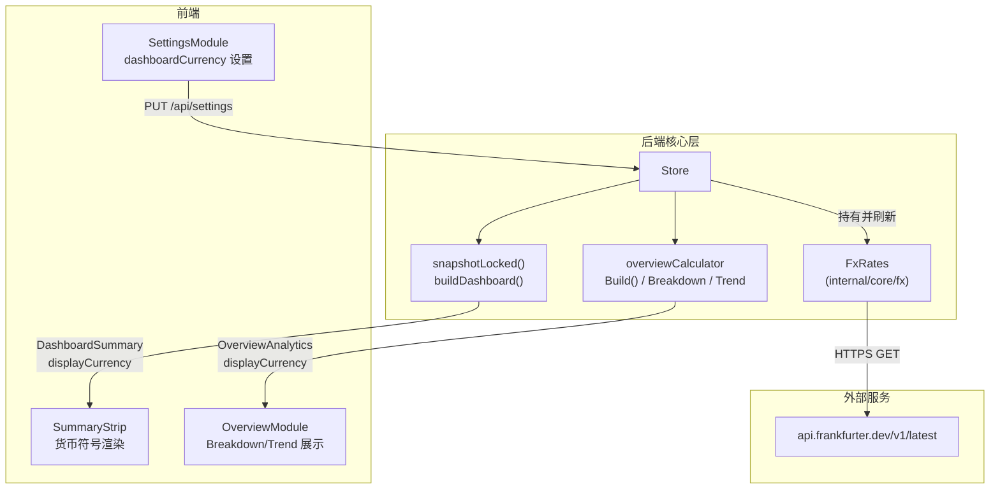
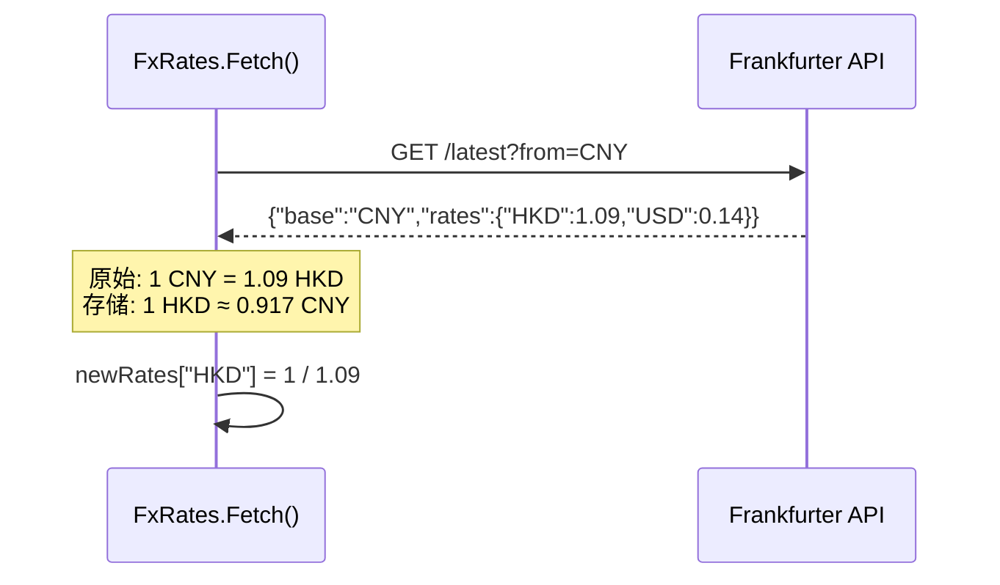

在跨市场投资组合管理中，持仓标的往往分布在人民币、港币、美元等多种计价货币下。若缺乏统一的汇率折算层，Dashboard 上的总成本、总市值与盈亏汇总将失去可比性，Overview 中的饼图与趋势堆叠图也会因币种混杂而产生误导。本章将深入解析后端如何通过 **Frankfurter 汇率 API** 构建轻量、自治的汇率服务，并以 CNY 为隐式中间锚点，在 Dashboard 聚合与 Overview 分析两条主链路中实现多币种标准化。

## 架构定位：FxRates 在核心层中的角色

`FxRates` 是一个独立封装的汇率缓存服务，位于 `internal/core/fx` 包中，由 `Store` 在初始化时持有实例，并在快照构建与 Overview 计算过程中被调用。它既不依赖 Store 的状态，也不感知前端视图，仅提供“读取-转换”两个原子能力。这种单向依赖使得汇率模块可以被独立测试，也便于未来替换为其他 ECB 数据源。

从上图可以看出，用户的展示货币偏好（`dashboardCurrency`）通过 Settings 持久化到 Store，随后被 `buildDashboard` 与 `overviewCalculator` 读取，作为目标币种传入 `FxRates.Convert`。所有汇率查询对前端完全透明，前端只需消费 `displayCurrency` 字段并渲染相应符号即可。

Sources: [fxrate.go](internal/core/fx/fxrate.go#L19-L37), [store.go](internal/core/store/store.go#L33-L71), [snapshot.go](internal/core/store/snapshot.go#L77-L85)

## Frankfurter API 集成与汇率标准化

后端选用 Frankfurter API（基于欧洲央行公开数据）作为汇率来源，请求端点固定为 `https://api.frankfurter.dev/v1/latest?from=CNY`。这里有一个关键设计决策：**始终以 CNY 为基准请求，再将返回的汇率取倒数存储**。Frankfurter 返回的原始语义是 `1 CNY = X foreign`，而系统内部统一存储为 `1 foreign = X CNY`。这种归一化消除了后续转换时的方向歧义，使得 `Convert` 方法可以用同一套公式处理任意币对。

`Fetch` 方法在成功获取并反序列化响应后，会遍历 `data.Rates`，对每个大于零的汇率取倒数写入内部 `rates` 映射，同时注入硬编码的 `CNY: 1.0`。若请求失败，错误信息会被记录到 `lastError` 中，并通过 `setError` 在锁保护下更新，避免 panic 或脏写。

Sources: [fxrate.go](internal/core/fx/fxrate.go#L86-L148)

## 缓存策略与并发控制

汇率数据属于低频变化的外部依赖，无需每次请求都穿透到网络。`FxRates` 采用**固定 2 小时 TTL** 的内存缓存，并通过双重锁机制保证并发安全：

| 锁/机制 | 类型 | 作用范围 | 设计意图 |
|---|---|---|---|
| `mu` | `sync.RWMutex` | `rates`、`validAt`、`lastError` | 保护读多写少的缓存数据，允许并发 `Convert` |
| `fetchMu` | `sync.Mutex` | `Fetch` 方法体内 | 使用 `TryLock()` 避免多 goroutine 同时发起 HTTP 请求，失败者直接返回 |

这种分层锁策略将“数据访问”与“网络飞行”解耦：高频的 `Convert` 调用只需获取读锁；而唯一可能阻塞的 `Fetch` 仅在缓存过期且尚未有飞行请求时才会执行。`IsStale()` 以 `validAt` 为基准判断，零值视为未初始化，同样受读锁保护。

Sources: [fxrate.go](internal/core/fx/fxrate.go#L19-L26), [fxrate.go](internal/core/fx/fxrate.go#L51-L77), [fxrate.go](internal/core/fx/fxrate.go#L89-L94)

## 多币种折算的消费端：Dashboard 与 Overview

汇率服务的价值体现在两个消费场景：**Dashboard 聚合**与 **Overview 分析**。两者共享同一目标币种，确保用户在任何视图下看到的金额口径一致。

### Dashboard 聚合（Snapshot 链路）

`Store.snapshotLocked()` 在构建 `DashboardSummary` 时调用 `buildDashboard`。该函数遍历所有 `WatchlistItem`，若持仓货币与 `displayCurrency` 不同，则调用 `fx.Convert` 将 `costBasis` 与 `marketValue` 统一折算。折算后的值再汇总为总成本、总市值、总盈亏及涨跌计数。这里有一个防御性细节：当 `fx` 为 nil 或币种为空时，函数直接回退到原值，避免阻塞快照生成。

Sources: [snapshot.go](internal/core/store/snapshot.go#L77-L123)

### Overview Breakdown 与 Trend

`overviewCalculator` 在 `Build()` 方法中同时产出饼图（Breakdown）与堆叠趋势图（Trend）数据。它持有 `fx` 指针与 `displayCurrency`，并通过私有方法 `convertValue` 统一封装折算逻辑。Breakdown 将每项持仓的当前市值折算为目标货币后，按市值降序排列并计算权重；Trend 则在回溯历史价格时，将每个时间点的复权持仓价值同样进行币种转换。由于 Trend 涉及大量历史点计算，统一的 `convertValue` 入口保证了全时间轴的货币一致性。

Sources: [overview.go](internal/core/store/overview.go#L40-L65), [overview.go](internal/core/store/overview.go#L326-L332)

## 刷新机制： opportunistic refresh 与运行时状态

`FxRates` 本身不维护后台定时器，而是由 Store 的 Refresh 流程**顺带（opportunistically）**触发。在 `refreshQuotesForItems` 中，系统先检查 `fxRates.IsStale()`，若过期则同步调用 `Fetch`，随后将 `fxFetched` 标记写入结果结构。无论汇率是否刷新，行情请求都会继续并行执行。这种设计避免了为汇率单独维护一套定时调度，也让代理配置、超时上下文自然复用于汇率请求。

运行时状态通过 `RuntimeStatus` 中的 `lastFxError` 与 `lastFxRefreshAt` 暴露给前端，用户可在状态栏或开发者模式中感知汇率服务是否健康。若 `Fetch` 失败，`lastFxError` 会保留最近一次错误信息，直到下次成功刷新才被清空；国际化层已将常见 FX 错误前缀映射为中文，例如“汇率服务不可达”“解析汇率数据失败”等。

Sources: [runtime.go](internal/core/store/runtime.go#L157-L168), [runtime.go](internal/core/store/runtime.go#L64-L74), [error_i18n.go](internal/api/i18n/error_i18n.go#L52-L114)

## 前端联动：设置、类型与渲染

前端通过 `dashboardCurrency` 设置项控制展示货币，当前仅支持 **CNY / HKD / USD**，选项定义在 `constants.ts` 中。`SettingsModule` 提供下拉选择，`SummaryStrip` 则根据 `dashboard.displayCurrency` 动态映射货币符号（`¥`、`HK$`、`$`）。`OverviewModule` 在展示空状态或加载分析数据时，同样读取该字段以保持显示口径。

前后端类型严格对齐：`AppSettings`（Go）与 `AppSettings`（TypeScript）均包含 `dashboardCurrency: string`；`RuntimeStatus` 也同步暴露了 `lastFxError?` 与 `lastFxRefreshAt?`，使前端能够在不解析业务逻辑的情况下直接渲染汇率服务状态。

Sources: [constants.ts](frontend/src/constants.ts#L173-L179), [SummaryStrip.vue](frontend/src/components/SummaryStrip.vue#L16-L30), [types.ts](frontend/src/types.ts#L131-L151), [model.go](internal/core/model.go#L117-L137)

## 测试策略：可注入的确定性汇率

为了在不依赖网络的情况下测试 Overview 与 Dashboard 计算，`FxRates` 提供了 `NewFxRatesWithRates(rates map[string]float64)` 工厂函数。测试用例可直接构造包含 `CNY: 1`、`HKD: 0.9`、`USD: 7` 等确定性汇率的实例，并注入 `overviewCalculator`。`internal/core/store/overview_test.go` 中的两个测试套件（`TestOverviewCalculatorBuild` 与 `TestOverviewCalculatorBuild_WithNonDCAHolding`）均使用此方式，验证跨币种 Breakdown 排序、Trend 数值计算以及 DCA / 非 DCA 持仓的混合场景。

Sources: [fxrate.go](internal/core/fx/fxrate.go#L39-L49), [overview_test.go](internal/core/store/overview_test.go#L42-L46)

## 相关阅读

- 若需了解 Store 如何协调行情刷新与持久化，请参阅 [Store：核心状态管理与持久化](7-store-he-xin-zhuang-tai-guan-li-yu-chi-jiu-hua)
- Dashboard 与 Overview 的详细计算逻辑位于 [投资组合概览分析：Breakdown 与 Trend 计算](13-tou-zi-zu-he-gai-lan-fen-xi-breakdown-yu-trend-ji-suan)
- 国际化错误映射的完整列表可参考 [HTTP API 层设计与国际化错误处理](14-http-api-ceng-she-ji-yu-guo-ji-hua-cuo-wu-chu-li)
- 想了解系统代理如何影响汇率请求的网络传输，可阅读 [平台层：系统代理检测与窗口管理](15-ping-tai-ceng-xi-tong-dai-li-jian-ce-yu-chuang-kou-guan-li)