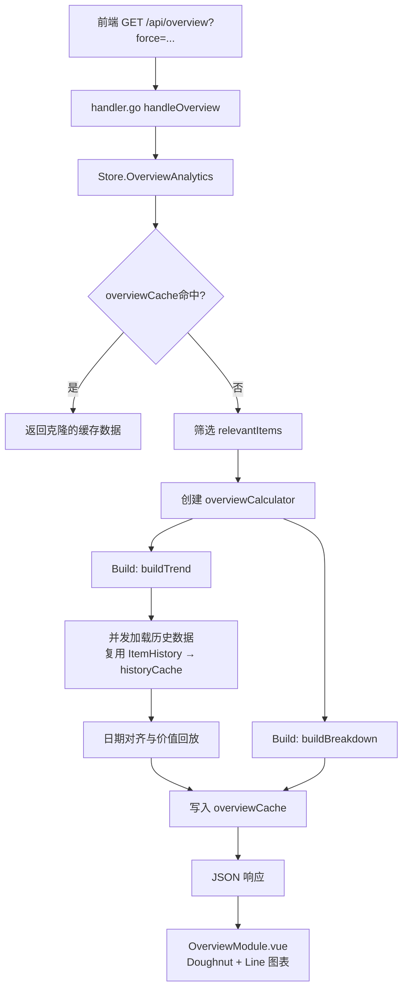
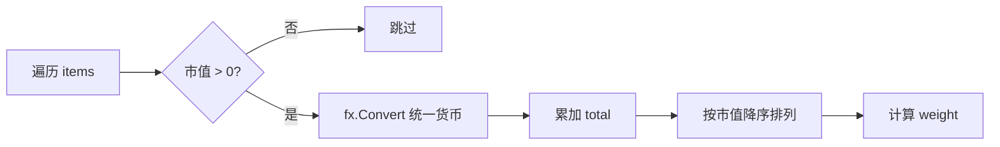
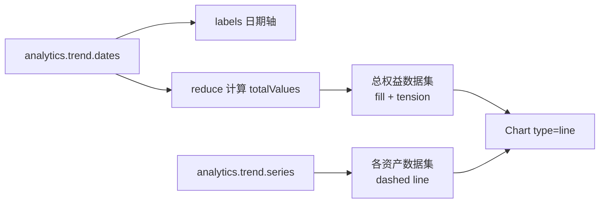

投资组合概览模块（Overview）是 InvestGo 中负责将用户持仓转化为可视化分析数据的核心后端服务。它围绕两大计算维度展开：**Breakdown（资产配置拆解）** 将当前持仓按市值转换为统一货币后生成加权切片，用于甜甜圈图展示；**Trend（资产趋势回溯）** 则基于历史收盘价与定投（DCA）记录，回放出各资产在不同日期的持仓价值，绘制为堆叠折线图与总权益曲线。两者共享同一套货币归一化逻辑，确保图表表面不会出现原始货币与折算货币混用的问题。

Sources: [overview.go](internal/core/store/overview.go#L51-L65)

## 核心架构与数据流

从 HTTP 请求到图表渲染的完整链路可分为四层：**API 路由层**、**缓存守卫层**、**计算引擎层**、**前端渲染层**。API 层仅负责解析 `force` 查询参数并透传；缓存层通过 `overviewCache` 与 `historyCache` 组成双层缓存，避免重复的网络请求；计算引擎层由 `overviewCalculator` 统一处理 Breakdown 与 Trend 的数学逻辑；前端则以 PrimeVue Chart 将返回的 JSON  payload 映射为 Doughnut 与 Line 两种图表形态。

Sources: [http.go](internal/api/http.go#L62), [handler.go](internal/api/handler.go#L14-L22), [runtime.go](internal/core/store/runtime.go#L243-L293)

## Breakdown 计算：市值加权资产配置

Breakdown 的核心任务是将多市场、多币种的持仓聚合为单一展示货币下的加权切片。`buildBreakdown` 遍历所有传入的 `WatchlistItem`，对每个项目调用 `item.MarketValue()`（即 `Quantity × CurrentPrice`）得到原始市值，再通过 `convertValue` 使用实时汇率折算为展示货币。为了避免零值或负值持仓污染甜甜圈图图例，任何折算后市值小于等于零的项目都会被静默过滤。过滤后的切片按市值降序排列，市值相同时按 Symbol 字典序升序排列，最后计算每个切片占总市值的权重 `Weight = Value / Total`。

这种设计确保了即使持仓跨越港币、美元、人民币等多个币种，前端收到的 Breakdown 数据始终处于同一货币维度，无需在前端再做汇率转换。排序规则让大头资产始终排在列表前端，提升图表可读性。

Sources: [overview.go](internal/core/store/overview.go#L67-L101)

## Trend 计算：持仓价值时间序列

Trend 的计算复杂度远高于 Breakdown，因为它需要为每个有持仓的资产回溯历史价格，并按日重建持仓价值曲线。整个流程分为四个阶段：**候选筛选**、**历史加载**、**日期对齐**、**价值回放**。

### 候选筛选与区间选择

首先，`buildTrend` 将输入项目分为三类：
1. **有 DCA 记录的项目**：以最早的 DCA 日期作为 `firstBuy`。
2. **无 DCA 但有持仓且 `AcquiredAt` 非空的项目**：以 `AcquiredAt` 作为起点。
3. **无 DCA 且无 `AcquiredAt` 的持仓**：跳过，因为缺乏时间锚点无法建立有意义的历史序列。

对于每一个候选项目，`overviewHistoryIntervalFor` 根据 `firstBuy` 距今的时长自动选择历史数据区间：一年内请求 `HistoryRange1y`，一到三年请求 `HistoryRange3y`，三年以上请求 `HistoryRangeAll`。这种自适应区间策略在数据精度与请求体积之间取得平衡，避免为短期持仓拉取过量历史数据。

Sources: [overview.go](internal/core/store/overview.go#L103-L137), [overview.go](internal/core/store/overview.go#L348-L358)

### 并发历史加载

候选确定后，`loadTrendSeeds` 使用信号量（`sem := make(chan struct{}, overviewHistoryConcurrency)`）将并发历史请求限制为 **4 个**。每个 goroutine 调用注入的 `loadHistory` 函数获取对应区间内的 OHLCV 序列。如果 `firstBuy` 为零值（即无 DCA 也无 `AcquiredAt` 的 fallback 情况），则以该资产历史数据的最早日期作为时间锚点。加载完成后，所有结果汇总为 `overviewTrendSeed` 列表，供后续日期对齐使用。

Sources: [overview.go](internal/core/store/overview.go#L38), [overview.go](internal/core/store/overview.go#L205-L270)

### 日期对齐与价值回放

日期对齐是 Trend 计算中最关键的一步。`collectTrendDates` 收集所有种子中的 `firstBuyDate` 以及每个历史数据点的归一化日期（UTC 午夜），去重后升序排列，形成全局统一的日期轴 `dates`。这个日期轴是后续所有资产价值序列的共同横坐标。

`buildTrendValues` 根据资产类型采用两种截然不同的回放策略：

| 资产类型 | 核心逻辑 | 适用场景 |
|---------|---------|---------|
| **非 DCA 持仓** (`hasPosition = true`) | 持仓数量恒定，逐日取历史收盘价乘以 `Quantity` | 一次性买入、无后续加仓 |
| **DCA 持仓** (`hasPosition = false`) | 逐日回放 DCA 记录，累加 `heldShares`，再乘以当日收盘价 | 定投、多次分批买入 |

对于非 DCA 持仓，算法使用双指针遍历日期轴与历史数据点：每当历史日期不大于当前日期轴位置时，更新 `lastClose`，然后将 `Quantity × lastClose` 折算为展示货币。对于 DCA 持仓，则额外维护一个 DCA 记录指针，在日期推进过程中不断将落在此日期及之前的定投份额累加到 `heldShares` 中，实现"时间上的持仓成本积累"效果。两种策略都依赖 `normalizeTrendDay` 将时间戳统一截断到 UTC 午夜，确保跨时区数据不会错位。

Sources: [overview.go](internal/core/store/overview.go#L272-L324), [overview.go](internal/core/store/overview.go#L344-L346)

## 缓存策略与性能优化

Overview 的计算涉及大量历史数据请求与日期对齐运算，因此缓存设计直接影响用户体验。系统采用**双层缓存**架构：`overviewCache` 缓存最终的分析结果，`historyCache` 缓存原始 OHLCV 序列。

### overviewCache：结果缓存与状态戳

`Store.OverviewAnalytics` 在计算前首先检查 `overviewCache`。缓存键为固定字符串 `"all"`，但缓存值附加了 `stateStamp` 字段，该字段等于 `holdingsUpdatedAt`（上次持仓结构变更时间）。这意味着：只要用户增删改持仓项或修改设置，`holdingsUpdatedAt` 就会推进，旧缓存立即失效，下次请求必须重新计算。命中缓存时，返回的数据会通过 `cloneOverviewAnalytics` 进行深拷贝，避免调用方意外修改缓存内部的切片与指针。

Sources: [runtime.go](internal/core/store/runtime.go#L244-L262), [cache.go](internal/core/store/cache.go#L9-L12), [cache.go](internal/core/store/cache.go#L110-L129)

### historyCache：历史数据复用

Trend 计算中的 `loadHistory` 并未直接调用底层 `historyProvider.Fetch`，而是路由到 `Store.ItemHistory`。`ItemHistory` 拥有自己独立的 TTL 缓存策略（`historyCacheTTLForInterval`），例如 1 小时数据缓存 5 分钟，年线数据缓存 4 小时。这意味着：当用户先在 K 线图页查看过某资产的历史走势后，再切换到 Overview 页，Trend 计算将直接命中 `historyCache`，无需任何额外网络请求。这一设计使得 `invalidatePriceCachesLocked` 在每次价格刷新后仅清空 `overviewCache` 而保留 `historyCache`，确保价格更新能低成本地反映到 Overview 中。

Sources: [runtime.go](internal/core/store/runtime.go#L276-L278), [cache.go](internal/core/store/cache.go#L52-L66), [cache.go](internal/core/store/cache.go#L78-L90)

### 缓存失效矩阵

| 操作类型 | 影响的缓存 | 说明 |
|---------|-----------|------|
| 价格自动/手动刷新 | `refreshCache`, `itemRefreshCache`, `overviewCache`, `snapshotCache` | 市值变化，Breakdown/Trend 需重算 |
| 增删改持仓项 | `invalidateAllCachesLocked` | 结构变化，所有缓存失效 |
| 修改设置（含展示货币） | `invalidateAllCachesLocked` | 货币变化，Breakdown/Trend 需重算 |
| 历史数据请求 | `historyCache` | 按区间独立 TTL，不受价格刷新影响 |

Sources: [cache.go](internal/core/store/cache.go#L68-L90)

## 前端渲染：图表配置与交互

前端 `OverviewModule.vue` 接收 `OverviewAnalytics` payload 后，将其映射为两张 PrimeVue Chart：一张 **Doughnut** 展示 Breakdown，一张 **Line** 展示 Trend。

### Breakdown 图表

甜甜圈图使用 `cutout: "70%"` 形成中空样式，中心区域显示总资产市值。图例被隐藏，取而代之的是右侧自定义列表，每个切片展示名称、百分比进度条与具体金额。颜色取自独立的 8 色图表调色板（`CHART_PALETTE_LIGHT` / `CHART_PALETTE_DARK`），该调色板与 UI 主题色解耦，确保多资产图表在任何主题下都保持感知上的可区分度。Tooltip 回调函数会实时计算并显示当前切片占总市值的百分比。

Sources: [OverviewModule.vue](frontend/src/components/modules/OverviewModule.vue#L95-L153), [OverviewModule.vue](frontend/src/components/modules/OverviewModule.vue#L415-L439)

### Trend 图表

趋势图采用**双 Y 轴**设计：左轴（`y`）绘制总权益的填充区域线（`fill: true`），右轴（`y1`）绘制各资产单独的价值折线（`borderDash: [6, 4]`，虚线样式）。所有数据集共享 `interaction: { mode: "index", intersect: false }`，鼠标悬停时同一日期的所有序列点同时高亮。总权益线使用 CSS 变量 `--accent-strong` 动态着色，确保与当前主题强调色一致；各资产线则复用与 Breakdown 相同的 8 色轮盘，维持跨图表的视觉一致性。

Sources: [OverviewModule.vue](frontend/src/components/modules/OverviewModule.vue#L155-L208), [OverviewModule.vue](frontend/src/components/modules/OverviewModule.vue#L210-L305)

### 请求管理与空状态

组件使用 `AbortController` 管理 inflight 请求。当 `generatedAt` 属性变化（通常由父组件在刷新后更新）时，`watch` 触发重新加载；组件卸载前会 abort 未完成的请求，避免竞态。若用户无任何持仓或总市值为零，`hasOverviewData` 返回 false，组件直接渲染空状态而不发起 API 调用，减少不必要的后端计算。

Sources: [OverviewModule.vue](frontend/src/components/modules/OverviewModule.vue#L307-L366), [OverviewModule.vue](frontend/src/components/modules/OverviewModule.vue#L84-L93)

## 测试验证

后端通过 `overview_test.go` 与 `cache_test.go` 对计算逻辑与缓存行为进行了多层覆盖。`TestOverviewCalculatorBuild` 验证了两币种持仓在汇率折算后的 Breakdown 排序与 Trend 序列长度；`TestOverviewCalculatorBuild_WithNonDCAHolding` 专门测试了非 DCA 持仓（恒定数量）与 DCA 持仓在 Trend 中的混合计算，确认无 `AcquiredAt` 的持仓被正确排除；`TestStoreOverviewAnalyticsCachesUntilStateChanges` 则验证了双层缓存的行为：第一次请求触发一次历史 provider 调用，第二次命中 overviewCache；当模拟持仓结构变化后，overviewCache 失效但 historyCache 仍然有效，因此历史 provider 不会被二次调用。

Sources: [overview_test.go](internal/core/store/overview_test.go#L12-L96), [overview_test.go](internal/core/store/overview_test.go#L98-L219), [cache_test.go](internal/core/store/cache_test.go#L54-L108)

## 延伸阅读

- 若要了解历史数据如何按区间降级获取并命中缓存，请参考 [HistoryRouter：历史数据降级链与市场感知路由](10-historyrouter-li-shi-shu-ju-jiang-ji-lian-yu-shi-chang-gan-zhi-lu-you)。
- 汇率折算依赖的 Frankfurter API 集成细节见 [汇率服务（Frankfurter API）与多币种折算](12-hui-lu-fu-wu-frankfurter-api-yu-duo-bi-chong-zhe-suan)。
- Store 的整体状态管理与持久化机制见 [Store：核心状态管理与持久化](7-store-he-xin-zhuang-tai-guan-li-yu-chi-jiu-hua)。
- 前端 Overview 模块在整体视图架构中的位置见 [模块化视图：Watchlist、Holdings、Overview、Hot、Alerts、Settings](21-mo-kuai-hua-shi-tu-watchlist-holdings-overview-hot-alerts-settings)。