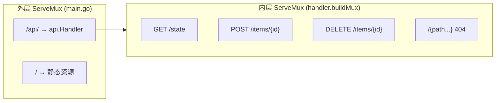
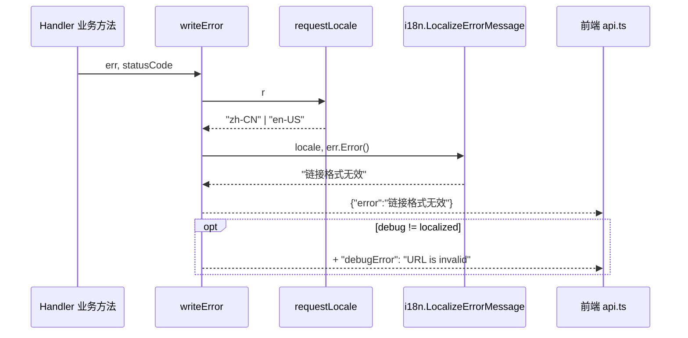
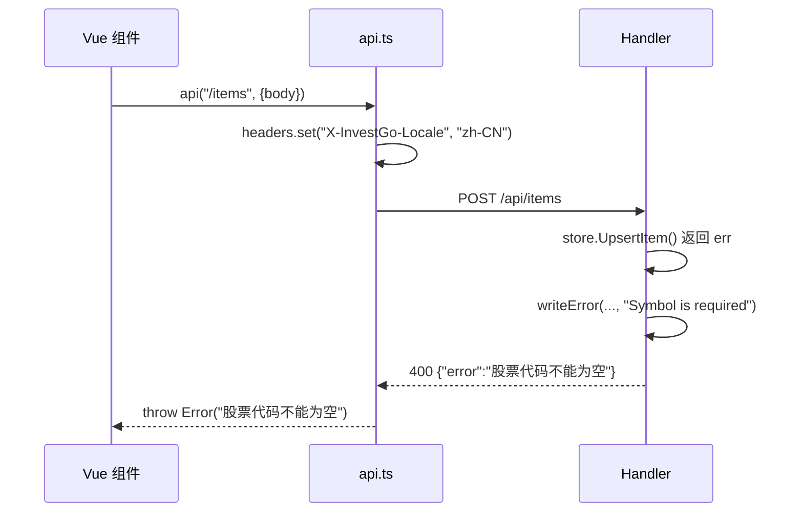

InvestGo 的后端 HTTP API 层承担两项核心使命：一是以最小依赖为前端提供类型一致的 RESTful 端点，二是在全链路中将英文内部错误转换为符合用户语言习惯的本地化消息。与引入 Gin、Echo 等重型框架不同，本层完全基于 Go 1.22+ 标准库的 `http.ServeMux` 构建，利用其新增的路径参数匹配与嵌套路由能力，配合显式的依赖注入模式，实现了轻量且可测试的 API 网关。本文档将从路由架构、统一响应契约、三层错误翻译策略以及前后端协同四个维度，系统阐述该层的设计原理与实现细节。

Sources: [http.go](internal/api/http.go#L1-L108), [main.go](main.go#L98-L100)

## 双层路由架构：外层挂载与内层分发

应用启动时，`main.go` 创建全局 `http.ServeMux` 并注册两条顶级路由：`/api/` 前缀委托给 `api.Handler`，其余路径由 Wails 内嵌资源服务器处理。`Handler` 内部再维护一个私有 `mux`，所有业务端点均以**相对路径**注册（如 `GET /state`、`POST /items/{id}`），形成清晰的“外层剥离前缀、内层精确匹配”的双层结构。`ServeHTTP` 方法负责将 `/api/state` 裁剪为 `/state` 后转发，使内层 Handler 无需关注挂载前缀，也方便在浏览器开发模式与 Wails 生产环境之间复用同一套路由表。

这种设计的另一个收益是统一响应头管理：`ServeHTTP` 在进入内层路由前即设置 `Content-Type: application/json; charset=utf-8`，确保所有 API 响应（包括 404）均返回合法 JSON，避免前端收到 `text/plain` 类型的错误而导致解析失败。

Sources: [http.go](internal/api/http.go#L88-L99), [main.go](main.go#L98-L100)

## Handler 职责与 RESTful 路由表

`Handler` 结构体通过构造函数注入四个核心依赖——`Store`、`HotService`、`LogBook` 与 `ProxyTransport`，各业务方法直接从这些依赖读取状态或触发命令，不维护任何请求级缓存。路由注册采用 Go 1.22 支持的 HTTP 方法限定语法（如 `GET /state`、`PUT /items/{id}`），路径参数通过 `r.PathValue("id")` 安全提取，无需正则或第三方路由解析器。下表汇总了当前全部端点：

| 方法 | 路径 | 处理函数 | 说明 |
|------|------|----------|------|
| GET | `/state` | `handleState` | 返回完整应用状态快照 |
| GET | `/overview` | `handleOverview` | 投资组合分析数据 |
| GET | `/logs` | `handleLogs` | 开发者日志 |
| DELETE | `/logs` | `handleClearLogs` | 清空日志 |
| POST | `/client-logs` | `handleClientLogs` | 接收前端日志 |
| GET | `/hot` | `handleHot` | 热门榜单 |
| GET | `/history` | `handleHistory` | 历史 K 线 |
| POST | `/refresh` | `handleRefresh` | 全量刷新行情 |
| POST | `/open-external` | `handleOpenExternal` | 系统默认浏览器打开外链 |
| PUT | `/settings` | `handleUpdateSettings` | 更新应用设置 |
| POST | `/items` | `handleCreateItem` | 新建盯盘/持仓项 |
| POST | `/items/{id}/refresh` | `handleRefreshItem` | 单条刷新 |
| PUT | `/items/{id}` | `handleUpdateItem` | 更新盯盘项 |
| PUT | `/items/{id}/pin` | `handlePinItem` | 置顶/取消置顶 |
| DELETE | `/items/{id}` | `handleDeleteItem` | 删除盯盘项 |
| POST | `/alerts` | `handleCreateAlert` | 新建价格提醒 |
| PUT | `/alerts/{id}` | `handleUpdateAlert` | 更新提醒 |
| DELETE | `/alerts/{id}` | `handleDeleteAlert` | 删除提醒 |

所有变更类端点在成功执行后，均返回经过 `localizeSnapshot` 处理后的最新状态快照，使前端无需在写操作后再次主动拉取 `/state`，从而将“命令-查询”合并为一次往返。

Sources: [http.go](internal/api/http.go#L17-L86), [handler.go](internal/api/handler.go#L14-L301)

## 统一响应契约：JSON 编码与错误封装

API 层约定所有输出必须经过两个辅助函数之一：`writeJSON` 负责序列化成功负载，`writeError` 负责构造标准错误 JSON。`writeError` 的响应体固定包含 `error` 字段（面向用户的本地化消息）；若原始调试信息与本地化消息不同，则额外附加 `debugError` 字段，便于开发者在 `DeveloperMode` 下排查根因，而普通用户始终只看到友好的母语提示。

语言协商由 `requestLocale` 完成：优先读取自定义请求头 `X-InvestGo-Locale`，其次回退到标准 `Accept-Language`，最终缺省为 `en-US`。这一设计让前端在切换语言后能立即通过请求头同步最新偏好，无需后端维护会话或 Cookie。

Sources: [http.go](internal/api/http.go#L119-L188)

## 国际化错误处理：三层翻译策略

后端业务代码（Store、Quote Provider、FX 服务等）全部使用英文硬编码错误字符串，以保持代码可读性与日志一致性。真正面向用户的翻译发生在 API 层出口，由 `internal/api/i18n/error_i18n.go` 中的 `LocalizeErrorMessage` 实施。该函数针对中文语境（`zh-CN`）设计了三层递进式翻译策略，英文语境则仅做分号标准化后原样返回。

### 1. 精确全文匹配（Exact Match）

适用于完全确定、无动态参数的静态错误。`localizedExactMessages` 映射表直接以英文原句为键，例如 `"URL is invalid"` → `"链接格式无效"`。当业务层新增校验规则时，只需在该映射表中追加一条键值对即可自动生效。

### 2. 前缀提取 + 可选递归（Prefix Match）

适用于包含动态参数的错误，如 `"Item not found: AAPL"`。`localizedPrefixMessages` 数组按前缀顺序扫描，匹配后将剩余后缀保留或递归翻译。例如 `"Unrecognized symbol: AAPL"` 先命中前缀 `"Unrecognized symbol: "`，输出 `"无法识别股票代码: AAPL"`。若条目标记 `recursive: true`，后缀本身也会再次进入翻译流水线，这对嵌套网络错误（如 `"Yahoo quote request failed: connection reset"`）尤为有效。

### 3. 正则模式提取（Regex Match）

针对结构复杂且包含多处动态内容的错误，使用预编译正则表达式提取变量。例如 `Did not receive EastMoney quote for (.+) \((.+)\)` 会被翻译为 `"未收到 {symbol} 的东方财富行情 ({market})"`；`^(EastMoney|Yahoo Finance): (.+)$` 则会将提供商名称一并本地化后继续翻译后半段错误。

下表对比三种策略的适用场景：

| 策略 | 数据结构 | 适用场景 | 示例（英文 → 中文） |
|------|----------|----------|---------------------|
| 精确匹配 | `map[string]string` | 静态、无参数错误 | `Invalid JSON request body` → `请求体 JSON 无效` |
| 前缀匹配 | `[]struct{prefix, zhPrefix, recursive}` | 含动态参数的简单错误 | `Item not found: AAPL` → `标的不存在: AAPL` |
| 正则提取 | `*regexp.Regexp` | 含多处动态内容的复杂错误 | `Did not receive EastMoney quote for AAPL (US)` → `未收到 AAPL 的东方财富行情 (US)` |

此外，`LocalizeErrorMessage` 内部会对包含分号的多段错误（如 `errs.JoinProblems` 合并的批量校验失败）按 `;` 拆分后逐段翻译，最终再用中文分号 `；` 拼接，确保长复合错误的可读性。

Sources: [error_i18n.go](internal/api/i18n/error_i18n.go#L8-L157)

## 数据本地化：超越错误信息

国际化处理并不止于错误文本。状态快照中的运行时错误字段（`LastQuoteError`、`LastFxError`）、行情源摘要（`QuoteSource`）、行情源下拉选项的名称与描述，乃至热门榜单和历史序列中的来源标识，均通过 `localizeSnapshot`、`localizeHotList`、`localizeHistorySeries` 等函数在响应前即时转换。以行情源为例，英文界面显示 `"EastMoney"`，中文界面则替换为 `"东方财富"`，其描述也会从英文 fallback 切换为针对 A 股、港股、美股特性的中文说明。这种“业务层保持英文中性表示，API 层按 Locale 渲染视图”的模式，与错误翻译遵循同一哲学，避免了在 Store 或 Provider 中植入语言逻辑。

Sources: [http.go](internal/api/http.go#L190-L282)

## 前端 API 客户端的协同

前端 `api.ts` 作为后端契约的唯一消费者，在每次请求时自动注入 `X-InvestGo-Locale` 请求头，其值取自当前 i18n 实例的活跃语言。当收到非 2xx 响应时，`api` 包装器将 JSON 体中的 `error` 字段作为用户可见消息抛出，若存在 `debugError` 则附加到异常对象的 `debugMessage` 属性，供开发者日志系统捕获。这种前后端对称设计确保了：用户看到的提示始终由其当前语言环境决定，而调试信息在 `DeveloperMode` 下仍可完整追溯原始英文错误。

Sources: [api.ts](frontend/src/api.ts#L1-L87)

## 设计决策总结

| 决策 | 选型 | 理由 |
|------|------|------|
| 路由框架 | 标准库 `http.ServeMux` | Go 1.22+ 已支持方法限定与路径参数，无额外依赖，与 Wails 资产服务器天然兼容 |
| 错误类型 | 自定义 `apiError` | 极简结构体实现 `error` 接口，避免引入 `pkg/errors` 等依赖，同时隔离 HTTP 层与业务层错误语义 |
| 语言传递 | 自定义 Header | Wails 桌面应用无传统 Cookie/Session，Header 是最轻量的无状态方案 |
| 翻译位置 | API 层出口 | 业务层保持英文以维持日志一致性；API 层面向用户，是翻译的唯一边界 |
| 批量错误 | `;` 分号拼接 | `errs.JoinProblems` 在业务层去重合并，i18n 层拆分翻译，兼顾机器可读与人可读 |

如需深入了解前端请求包装器的超时、取消与日志机制，可继续阅读 [API 客户端封装：超时、取消与错误日志](19-api-ke-hu-duan-feng-zhuang-chao-shi-qu-xiao-yu-cuo-wu-ri-zhi)。若希望探究应用启动时 Handler 如何被构造并挂载到 Wails 服务，请参阅 [应用启动流程与初始化](6-ying-yong-qi-dong-liu-cheng-yu-chu-shi-hua)。