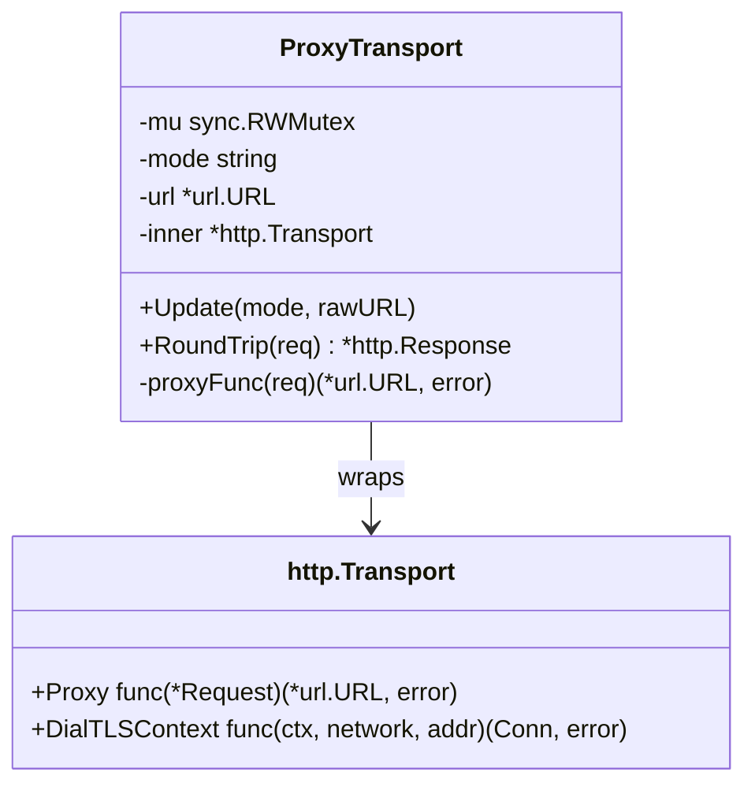
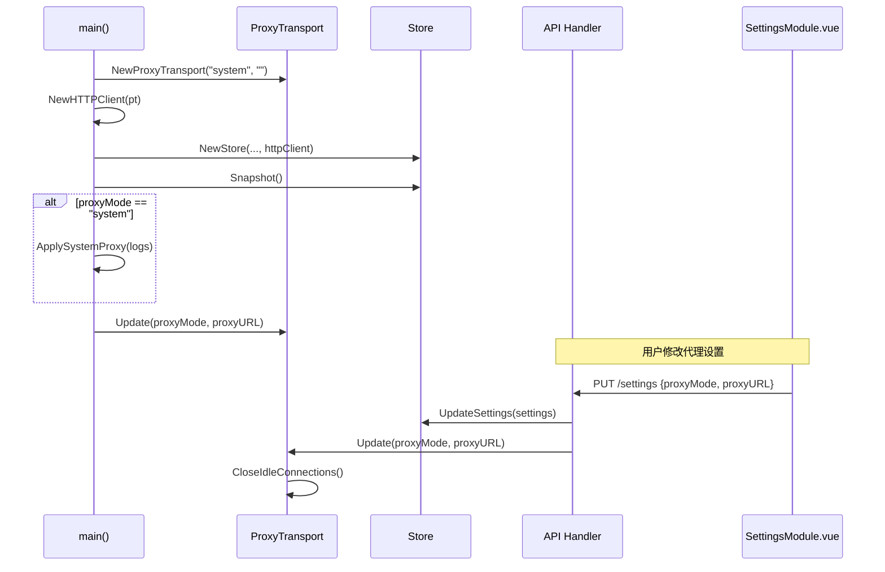

平台层（`internal/platform`）是 InvestGo 后端与操作系统之间的薄胶合层，封装了两类平台相关能力：一是网络代理的自动检测、注入与运行时动态切换，确保应用在受限网络环境中仍能稳定访问外部行情数据源；二是主窗口的平台级行为配置，使应用在 macOS 上呈现符合系统审美的原生视觉体验。该层不对业务状态做任何持久化，也不包含市场数据逻辑，仅向上层提供即拿即用的平台原语。

Sources: [proxy.go](internal/platform/proxy.go#L1-L97), [proxy_transport.go](internal/platform/proxy_transport.go#L1-L158), [window.go](internal/platform/window.go#L1-L30)

## 职责边界与模块划分

平台层由三个职责清晰的源文件组成，各自解决单一维度的平台适配问题。

| 源文件 | 核心职责 | 关键导出 |
|--------|---------|---------|
| `proxy.go` | macOS 系统代理读取与环境变量注入 | `ApplySystemProxy` |
| `proxy_transport.go` | 可动态重载的 HTTP 传输层与 TLS 指纹伪装 | `ProxyTransport`、`NewHTTPClient` |
| `window.go` | 主窗口选项的跨平台基线与 macOS 视觉定制 | `BuildMainWindowOptions` |

Sources: [proxy.go](internal/platform/proxy.go#L1-L3), [proxy_transport.go](internal/platform/proxy_transport.go#L1-L3), [window.go](internal/platform/window.go#L1-L4)

## 代理配置架构：从环境变量到动态 Transport

InvestGo 需要同时支持"直连"、"跟随系统代理"和"自定义代理"三种网络策略。若直接使用标准库 `http.ProxyFromEnvironment`，虽然能够读取环境变量，但无法在运行时响应用户在设置界面中的切换操作。因此平台层引入了 `ProxyTransport`，它在标准 `http.Transport` 之上增加了一层受读写锁保护的动态代理解析函数。

`ProxyTransport` 内部持有 `sync.RWMutex` 保护的 `mode` 与 `url` 字段，以及一个已注入自定义 `Proxy` 回调的 `*http.Transport`。当 `mode` 为 `system` 时，回调委托给 `http.ProxyFromEnvironment`，依赖进程级环境变量（如 `HTTPS_PROXY`）；当 `mode` 为 `custom` 时，直接返回解析后的自定义代理地址；当 `mode` 为 `none` 时，返回 `nil` 以禁用代理。所有行情数据 Provider、汇率服务及热点服务共享同一个 `ProxyTransport` 实例，因此任何一次配置变更都能全局生效。

Sources: [proxy_transport.go](internal/platform/proxy_transport.go#L22-L28), [proxy_transport.go](internal/platform/proxy_transport.go#L131-L149)

下图为 `ProxyTransport` 的核心结构与交互关系：

Sources: [proxy_transport.go](internal/platform/proxy_transport.go#L22-L65)

### TLS 指纹伪装与 utls

部分行情服务器会对入站连接的 TLS ClientHello 进行 JA3/JA4 指纹检测，若识别出 Go 语言默认 TLS 库的固定签名，可能直接返回连接重置或 EOF。为规避此类检测，`ProxyTransport` 的 `DialTLSContext` 使用 `github.com/refraction-networking/utls` 库，以 `HelloChrome_Auto` 规格执行 TLS 握手，使连接指纹与真实 Chrome 浏览器无法区分。

这里存在一个关键的协议协商细节：utls 的 `HelloChrome_Auto` 默认在 ALPN 扩展中声明支持 `h2`，但 Go 的 `http.Transport` 一旦配置了自定义 `DialTLSContext`，其内部的 HTTP/2 协商路径会被绕过，传输层只能解析 HTTP/1.x。如果服务器通过 ALPN 选择了 HTTP/2，客户端收到 HTTP/2 帧后将报 "malformed HTTP response" 错误。因此 `chromeTLSDialer` 在构建 ClientHello 规范后，会主动遍历扩展列表，找到 `ALPNExtension` 并将其协议列表重写为仅包含 `http/1.1`，从而强制双方降级到 HTTP/1.1。对于 InvestGo 所对接的上游行情 API 而言，HTTP/1.1 已完全满足需求。

Sources: [proxy_transport.go](internal/platform/proxy_transport.go#L67-L111)

## macOS 系统代理检测

当用户选择"跟随系统代理"时，InvestGo 需要在启动阶段将 macOS 系统偏好设置中的代理配置同步到当前进程的环境变量中。`ApplySystemProxy` 函数通过调用 `scutil --proxy` 读取网络服务代理字典，并执行以下注入逻辑：

1. **环境变量存在则跳过**：若进程已存在 `HTTPS_PROXY`、`HTTP_PROXY`、`https_proxy` 或 `http_proxy` 任一变量，函数立即返回，避免覆盖用户通过启动脚本手动指定的代理。
2. **HTTPS 优先于 HTTP**：`scutil` 输出通常同时包含 `HTTPSProxy` 与 `HTTPProxy`。函数优先检测并应用 HTTPS 代理；若未启用，再回退到 HTTP 代理。
3. **端口默认值**：若系统设置未指定端口，HTTPS 默认回退到 `443`，HTTP 默认回退到 `8080`。
4. **例外列表转 NO_PROXY**：`scutil --proxy` 可能包含 `ExceptionsList` 数组（例如绕过公司内网域名）。函数将其解析为逗号分隔的字符串，写入 `NO_PROXY` 环境变量。

`parseScutilProxy` 负责将 `scutil --proxy` 的文本输出解析为键值映射与例外列表。该解析器采用状态机方式逐行扫描：当遇到 `ExceptionsList : <array>` 时进入数组解析状态，直到遇到闭合花括号 `}` 为止；其余行按 `key : value` 格式提取。

Sources: [proxy.go](internal/platform/proxy.go#L18-L63), [proxy.go](internal/platform/proxy.go#L66-L97)

## 窗口管理与平台视觉配置

InvestGo 基于 Wails v3 构建桌面端，平台层通过 `BuildMainWindowOptions` 为不同平台提供统一的窗口基线选项，同时针对 macOS 进行视觉定制。函数返回的 `application.WebviewWindowOptions` 定义了主窗口的基础尺寸（1200×828）、最小尺寸限制、初始路由及背景色。

在 macOS 平台上，选项额外配置了 `MacBackdropTranslucent` 半透明背景，使窗口能够与系统主题产生自然的景深融合。函数还接收 `useNativeTitleBar` 参数：当用户在前端设置中关闭原生标题栏时，将 `Mac.TitleBar` 设为 `MacTitleBarHiddenInsetUnified`，为应用留出自定义标题控件的空间；反之则保留系统默认标题栏行为。

Sources: [window.go](internal/platform/window.go#L6-L29)

## 运行时集成：启动流程与动态更新

平台层的组件并非孤立存在，而是深度嵌入应用的生命周期。下图展示了从进程启动到代理生效的完整时序：

启动阶段的依赖关系决定了初始化顺序：由于 `Store` 的构造函数需要 `http.Client` 来加载汇率等远程配置，而 `ProxyTransport` 又必须在 `Store` 就绪后才能根据持久化设置进行校准，因此 `main` 函数首先以默认 `"system"` 模式创建 `ProxyTransport` 和 `httpClient`，待 `Store` 加载完成后再调用 `proxyTransport.Update` 同步真实配置。当用户在前端设置界面切换代理模式或地址时，`PUT /settings` 请求由 `handleUpdateSettings` 处理，它在持久化新设置后同样调用 `Update` 并触发 `CloseIdleConnections`，确保旧连接被立即清理，后续请求使用新的代理策略。

Sources: [main.go](main.go#L55-L89), [main.go](main.go#L125-L126), [handler.go](internal/api/handler.go#L173-L188)

## 与前后端模块的协作关系

平台层虽自身不实现业务功能，却是连接系统能力与业务逻辑的枢纽。若希望进一步了解它在全局中的位置，建议按以下路径延伸阅读：

- **[应用启动流程与初始化](6-ying-yong-qi-dong-liu-cheng-yu-chu-shi-hua)** — 了解 `main.go` 中平台层组件的完整初始化序列与依赖注入关系。
- **[HTTP API 层设计与国际化错误处理](14-http-api-ceng-she-ji-yu-guo-ji-hua-cuo-wu-chu-li)** — 了解 `handleUpdateSettings` 如何接收前端设置并触发代理 Transport 的重新配置。
- **[模块化视图：Watchlist、Holdings、Overview、Hot、Alerts、Settings](21-mo-kuai-hua-shi-tu-watchlist-holdings-overview-hot-alerts-settings)** — 了解前端 Settings 模块中代理模式下拉框与自定义地址输入框的实现细节。