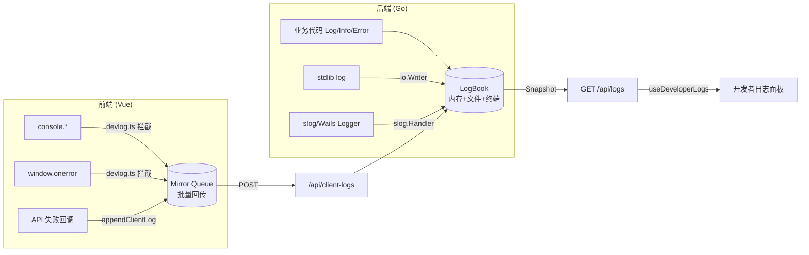

InvestGo 的日志系统并非简单的文本打印，而是一个围绕 `LogBook` 构建的**统一聚合层**。它的核心目标是：将后端服务日志、前端运行日志、标准库日志、`slog` 结构化日志以及终端输出纳入同一条时间线，使开发者在「设置 → 开发者」面板中能够按 reverse-chronological 顺序查看完整的应用运行轨迹，同时支持一键复制、持久化文件落盘与敏感信息脱敏。本文将从架构设计、三通道写入、多接口桥接、前端拦截与归并、以及安全策略五个维度进行剖析。

## 整体架构：三端写入、一端呈现

日志系统的数据流可以概括为「多源生产、单向汇聚、统一消费」。后端通过 `LogBook` 同时维护内存环形缓冲、本地文件与可选的终端输出；前端通过 `devlog.ts` 拦截浏览器运行时的 `console`、未捕获异常与未处理的 Promise 拒绝，并以批量方式回传后端；最终前端通过 `useDeveloperLogs` 组合式函数轮询后端快照，与本地客户端日志按时间戳合并后渲染。



Sources: [logger.go](internal/logger/logger.go#L40-L49), [devlog.ts](frontend/src/devlog.ts#L1-L15), [useDeveloperLogs.ts](frontend/src/composables/useDeveloperLogs.ts#L1-L23)

---

## 后端 LogBook：内存、文件与终端的三通道聚合

`LogBook` 是后端日志的核心载体，其内部通过一把读写锁保护三条并发安全的输出通道。

**内存环形缓冲** 采用固定容量（默认 200，主程序初始化为 400）。当写入量达到上限时，使用 `copy` 滑动窗口丢弃最旧记录，避免无界增长导致 OOM。对外查询时，`Entries(limit)` 按 reverse-chronological 顺序返回切片，便于前端直接渲染而无需再次排序。

**文件输出** 通过 `ConfigureFile(path)` 惰性初始化，自动创建父目录并以 `os.O_APPEND|os.O_CREATE|os.O_WRONLY` 打开。`Close()` 与 `Clear()` 均支持安全重入：`Clear()` 会同时清空内存切片并在文件已启用时执行 `Truncate(0)`，使「一键清空调试日志」功能在两端生效。

**终端输出** 仅在开发模式下启用。`main.go` 通过 `-dev` 参数或编译变量触发 `EnableConsole(os.Stderr)`，此时 `LogBook` 会在每次写入时同步向 `stderr` 输出一份 RFC3339 格式的文本，方便桌面应用脱离前端 DevTools 进行命令行调试。

Sources: [logger.go](internal/logger/logger.go#L40-L101), [logger.go](internal/logger/logger.go#L112-L155), [main.go](main.go#L39-L48)

---

## 多接口适配：从标准库 log 到 slog

为了在不改变现有代码习惯的前提下接入 `LogBook`，后端实现了两种桥接器。

第一种是 **`io.Writer` 桥接**。`LogBook.Writer(source, scope, level)` 返回一个实现了 `io.Writer` 的 `logBookWriter`。`main.go` 在初始化阶段通过 `log.SetOutput(logs.Writer("backend", "stdlib", logger.DeveloperLogError))` 将 Go 标准库的 `log` 包全局输出重定向到 `LogBook`。`Write` 方法以换行符为界拆分多行内容，每行独立成一条日志记录，因此第三方库通过 `log.Printf` 打印的信息同样能被捕获。

第二种是 **`slog.Handler` 桥接**。`NewSlogLogger(source, level)` 返回 `*slog.Logger`，其内部 `logBookHandler` 将 `slog.Record` 转换为 `DeveloperLogEntry`。属性处理逻辑将 `slog.KindGroup` 展平为点分键路径（如 `req.method=GET`），使纯文本日志仍保持可读性。该桥接器被直接注入到 Wails v3 框架：`application.Options{Logger: logs.NewSlogLogger("system", slog.LevelInfo)}`，从而把 Wails 内部的运行日志也纳入同一存储。

Sources: [logger.go](internal/logger/logger.go#L244-L288), [logger.go](internal/logger/logger.go#L254-L335), [main.go](main.go#L106-L116)

---

## 前端日志捕获：devlog.ts 的运行时拦截

前端日志系统不依赖后端主动推送，而是在 `App.vue` 的 `onMounted` 中调用 `installClientLogCapture()` 完成一次性劫持。

劫持范围包括三类事件：

1. **`console` 方法重写**：`console.debug/info/log/warn/error` 被替换为包装函数，先调用 `pushClientLog` 将参数序列化后写入本地状态，再委托原始方法执行，保证 DevTools Console 不受影响。
2. **全局异常监听**：`window.addEventListener("error")` 捕获同步异常；`unhandledrejection` 捕获未处理的 Promise 拒绝。两者均提取 `message` 与 `stack`，以 `error` 级别入库。
3. **API 错误注入**：`api.ts` 的请求包装器在 `catch` 块中将失败的 HTTP 方法、路径与错误信息通过 `appendClientLog` 写入日志，使网络异常与界面异常处于同一时间轴。

前端同样维护容量上限为 200 的内存数组，新记录使用 `unshift` 插入头部，超出时从尾部截断。

Sources: [devlog.ts](frontend/src/devlog.ts#L17-L65), [api.ts](frontend/src/api.ts#L1-L87), [App.vue](frontend/src/App.vue#L207-L211)

---

## 前后端日志归并：useDeveloperLogs 的合并策略

前端不会直接读取本地文件，而是通过 `GET /api/logs?limit=160` 定期拉取后端内存中的最新记录。`App.vue` 在开发者模式启用时启动 4 秒间隔的轮询器，以 `silent = true` 调用，避免弹窗干扰正常界面。

`useDeveloperLogs` 提供了一个 `computed` 属性 `developerLogs`，其合并算法如下：

1. 将 `backendLogs`（后端快照，最多 160 条）与 `clientLogs`（前端本地缓冲，最多 200 条）展开为同一数组。
2. 按 `timestamp` 降序排列。
3. 截取前 `MAX_COMBINED_LOGS = 250` 条作为最终展示列表。

该设计保证：即使前端轮询稍有延迟，本地捕获的 `console` 与异常日志仍能立即出现在列表顶部；当后端日志到达后，时间戳会自然将二者融合成正确的先后顺序。

Sources: [useDeveloperLogs.ts](frontend/src/composables/useDeveloperLogs.ts#L20-L23), [App.vue](frontend/src/App.vue#L200-L204)

---

## API 路由与数据契约

日志相关的 HTTP 接口注册在 `buildMux()` 中，由 `Handler` 统一暴露：

| 方法 | 路径 | 职责 | 关键实现 |
|------|------|------|----------|
| `GET` | `/logs` | 返回后端日志快照 | `Snapshot(limit)`，含 `logFilePath` |
| `DELETE` | `/logs` | 清空后端内存与文件 | `Clear()` |
| `POST` | `/client-logs` | 接收前端回传的日志条目 | 校验并写入 `LogBook.Log` |

`clientLogRequest` 与前端 `DeveloperLogEntry` 共享字段语义：`source` 区分 `backend/frontend/system`，`scope` 表示子模块（如 `proxy`、`api`、`storage`），`level` 限定为 `debug/info/warn/error`。后端在入库前通过 `sanitiseDeveloperLogLevel` 将未知级别降级为 `info`，防止非法枚举破坏文件格式。

Sources: [http.go](internal/api/http.go#L58-L65), [handler.go](internal/api/handler.go#L60-L101)

---

## 敏感信息脱敏：前后端双端 redaction

由于日志中可能包含第三方 API Key（如 Alpha Vantage、Twelve Data）或代理凭据，InvestGo 在日志落盘的前置阶段执行双端脱敏。

**前端脱敏** 位于 `devlog.ts` 的 `redactSensitiveText`，使用正则表达式覆盖三种常见形态：对象属性赋值（`alphaVantageApiKey: xxx`）、URL Query 参数（`?apikey=xxx`）以及键值对（`key=xxx`）。脱敏在 `formatValue` 阶段触发，因此通过 `console.log` 打印的配置对象或错误对象中的密钥都会被星号替换。

**后端脱敏** 位于 `store/mutation.go` 的 `redactSensitiveLogText`，由 `Store` 的 `logInfo/logWarn/logError` 统一调用。后端使用预编译的 `regexp.Regexp` 切片，对包含 `alphaVantageApiKey`、`twelveDataApiKey` 以及通用 `apikey`/`api_key`/`key` 模式的文本进行等号或冒号分割替换。

双端策略的互补意义在于：前端拦截了用户可能在浏览器 DevTools 中打印的敏感内容；后端兜底了服务层网络请求 URL 或响应体中意外暴露的凭证。

Sources: [devlog.ts](frontend/src/devlog.ts#L139-L150), [mutation.go](internal/core/store/mutation.go#L14-L17), [mutation.go](internal/core/store/mutation.go#L338-L375)

---

## 初始化与依赖注入

`LogBook` 在应用启动链中处于较早位置。`main.go` 的执行顺序如下：

1. 创建 `logger.NewLogBook(400)`。
2. 若检测到 `-dev` 参数，启用 `os.Stderr` 终端输出。
3. 重定向 `log.SetOutput` 到 `LogBook` 的 `io.Writer`。
4. 配置持久化文件路径（`$HOME/Library/Application Support/investgo/logs/app.log` 或 `./data/logs/app.log`）。
5. 将 `logs` 注入 `Store`、`HotService`、`Wails application.Options` 与 `PanicHandler`。
6. `OnShutdown` 回调中通过 `logs.Info/Error` 记录保存状态的结果。

这种单例透传模式确保所有核心服务共享同一 `LogBook` 实例，避免多份内存缓冲导致日志碎片化。

Sources: [main.go](main.go#L38-L123)

---

## 日志面板交互：复制与清空

`useDeveloperLogs` 还封装了用户操作逻辑。**复制** 功能将合并后的日志列表渲染为纯文本格式：

```
[timestamp] LEVEL source/scope message
```

该格式便于直接粘贴到 Issue 或终端。复制失败时，错误本身也会被追加到客户端日志，形成自指记录。**清空** 功能同步调用 `DELETE /api/logs` 与 `clearClientLogs()`，确保两端状态一致。

Sources: [useDeveloperLogs.ts](frontend/src/composables/useDeveloperLogs.ts#L45-L72)

---

## 总结

InvestGo 的日志系统通过 `LogBook` 统一了「结构化写入、多接口兼容、持久化与内存缓冲共存」三大需求；通过 `devlog.ts` 的前端拦截与批量回传，消除了桌面应用前后端日志割裂的问题；最终借助 `useDeveloperLogs` 的归并与轮询，在设置页提供了一条完整的、可搜索、可复制、可清空的调试时间线。对于需要排查行情源异常、网络代理问题或状态持久化故障的开发者而言，这一机制提供了单点入口的可观测性。

如需进一步了解后端状态管理的持久化机制，可继续阅读 [Store：核心状态管理与持久化](7-store-he-xin-zhuang-tai-guan-li-yu-chi-jiu-hua)；若关注前端 API 请求的错误处理与超时设计，请参考 [API 客户端封装：超时、取消与错误日志](19-api-ke-hu-duan-feng-zhuang-chao-shi-qu-xiao-yu-cuo-wu-ri-zhi)。