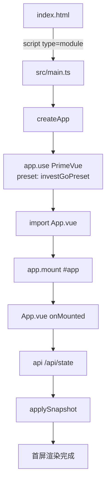
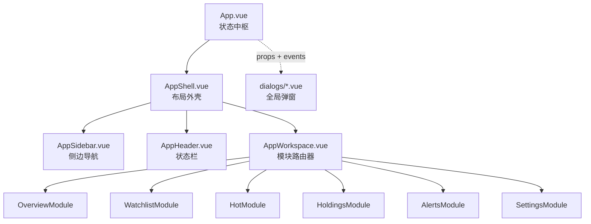
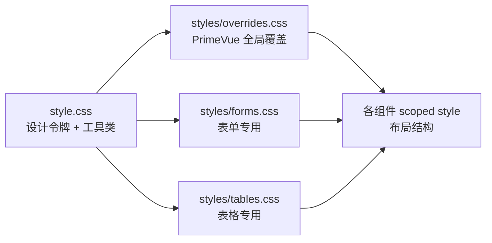

InvestGo 的前端基于 Vue 3 组合式 API 构建，并深度集成了 PrimeVue 4 组件库与 Aura 主题体系。整个前端并非传统的多页面应用，而是一个由 Vite 驱动的单页桌面级应用，通过 Wails 框架嵌入 Go 后端，但在浏览器开发模式下仍可独立运行。本文将从入口启动、组件架构、主题集成与样式分层四个维度，系统性地拆解前端应用的组织方式。

## 应用入口与启动流程

应用的物理入口是 `frontend/index.html`，其中仅声明了一个挂载点 `

` 并引入 `src/main.ts`。`main.ts` 采用标准的 Vue 3 应用实例化模式：调用 `createApp` 创建应用根实例，通过 `app.use(PrimeVue, { theme: { preset: investGoPreset, options: { darkModeSelector: ".app-dark" } } })` 注册 PrimeVue 插件并注入自定义预设，最后挂载到 DOM。这种设计将第三方组件库的初始化与业务根组件的渲染彻底解耦，使得 `main.ts` 只承担“环境装配”职责，而 `App.vue` 专注于业务状态管理。

从启动到首屏渲染的完整链路可概括为：HTML 入口加载 → Vite 模块解析 → Vue 应用实例化 → PrimeVue 主题注入 → `App.vue` 挂载并触发 `onMounted` 生命周期向后端请求初始状态快照。这整条链路的时序关系如下所示：

`vite.config.ts` 将整个构建的根目录指向 `frontend`，输出目录为 `frontend/dist`，开发服务器监听 `5173` 端口。由于 `root` 被显式配置为 `frontend`，所有模块路径解析均以 `frontend` 为基准，这与常规 Vite 项目将配置放在项目根目录的做法略有不同，需要特别注意相对路径的基准点。

Sources: [index.html](frontend/index.html#L1-L12), [main.ts](frontend/src/main.ts#L1-L24), [vite.config.ts](vite.config.ts#L1-L18)

## 组件层级与状态流向

`App.vue` 是整个前端的状态中枢（State Hub）。它通过 `ref` 和 `reactive` 维护全局状态——包括 `items`（自选股列表）、`settings`（持久化设置）、`alerts`（预警规则）、`activeModule`（当前激活模块）等——并通过 props 与事件将这些状态向下分发到子组件。这种“集中存储、单向向下、事件向上”的模式，在没有引入 Pinia 或 Vuex 的情况下，利用 Vue 3 的原生响应式系统实现了一个轻量级的中心化状态管理。

在视图层，组件呈三级树状结构。第一级是 `App.vue`，它内部渲染 `AppShell`；第二级 `AppShell` 负责桌面级外壳布局，将屏幕划分为 `sidebar-column`（侧边栏）与 `main-column`（主内容区），并通过 CSS Grid 控制两栏比例；第三级由 `AppSidebar`（侧边导航与列表）、`AppHeader`（顶部状态栏）和 `AppWorkspace`（工作区模块容器）组成。其中 `AppWorkspace` 本质上是一个条件路由器，它根据 `activeModule` 的值，用 `v-if` / `v-else-if` 链式渲染 `OverviewModule`、`WatchlistModule`、`HotModule`、`HoldingsModule`、`AlertsModule` 或 `SettingsModule`。这种设计避免了前端路由库的引入，模块切换完全由单一状态变量驱动。

`App.vue` 还托管了四个全局对话框组件：`ItemDialog`、`AlertDialog`、`ConfirmDialog` 和 `DCADetailDialog`。这些对话框不隶属于任何模块，而是作为通用交互层直接挂载在根组件模板中，通过组合式函数（如 `useItemDialog`、`useAlertDialog`）暴露的响应式引用控制显隐。这种“全局弹窗、局部触发”的架构，确保了任何深层子组件都能通过组合式函数唤起对话框，而无需逐层传递事件。

Sources: [App.vue](frontend/src/App.vue#L1-L60), [AppShell.vue](frontend/src/AppShell.vue#L1-L28), [AppWorkspace.vue](frontend/src/components/AppWorkspace.vue#L1-L78)

## PrimeVue 4 主题集成与动态配色

InvestGo 使用 PrimeVue 4 与 `@primeuix/themes` 主题体系。与早期版本通过 CSS 文件换肤不同，PrimeVue 4 引入了基于 JavaScript 预设（Preset）的主题配置机制。`theme.ts` 以 Aura 主题为基础，通过 `definePreset` 创建 `investGoPreset`，并覆盖了 `semantic.primary` 调色板以及 `button.root` 的间距与尺寸令牌。这使得组件库的视觉基调与 InvestGo 自身的品牌色保持一致。

更关键的是运行时动态主题切换。应用支持七种配色主题（blue、graphite、forest、sunset、rose、violet、amber），每种主题对应一个种子色值。当用户在设置中切换主题时，`applyPrimeVueColorTheme` 函数调用 `updatePreset` 动态更新 PrimeVue 的 `semantic.primary` 令牌，所有依赖 primary 色的组件（按钮、选中态、进度条等）会立即响应变化，无需重新加载页面。同时，`App.vue` 中的 watcher 会将 `data-color-theme` 属性写入 `document.documentElement`，触发 `style.css` 中对应的 CSS 变量覆盖，从而保证自定义样式与 PrimeVue 组件样式同步变色。

| 主题标识 | 浅色模式种子色 | 深色模式映射色 | 适用场景 |
|---------|--------------|--------------|---------|
| blue | `#355f96` | `#8db5ea` | 默认商务蓝 |
| graphite | `#627588` | `#aebdd0` | 中性灰调 |
| forest | `#2f7d69` | `#82ccb5` | 自然绿调 |
| sunset | `#c36f37` | `#f0b27c` | 暖橙活力 |
| rose | `#b84c6e` | `#f0a0be` | 柔和玫红 |
| violet | `#6b4fc8` | `#b8a0f0` | 优雅紫调 |
| amber | `#a87928` | `#f0c96a` | 古典琥珀 |

`main.ts` 在注册 PrimeVue 时指定了 `darkModeSelector: ".app-dark"`，这意味着 PrimeVue 内部会监听包含 `app-dark` 类的祖先元素，自动切换组件的暗色样式令牌。`App.vue` 在主题模式变化时，通过 `applyResolvedTheme` 向 `<html>` 元素动态添加或移除 `app-dark` 类，并同步设置 `data-theme` 属性，从而将操作系统偏好、用户手动设置与 PrimeVue 的暗色机制三者打通。

Sources: [theme.ts](frontend/src/theme.ts#L1-L44), [main.ts](frontend/src/main.ts#L12-L22), [App.vue](frontend/src/App.vue#L116-L142)

## 样式分层与 CSS 变量体系

前端样式被刻意拆分为四个层级，以兼顾 PrimeVue 组件覆盖、自定义设计令牌与模块级样式需求。

**第一层**是 `style.css`，它定义了全套 CSS 自定义属性（Design Tokens），包括背景色（`--app-bg`、`--panel-bg`）、文字色（`--ink`、`--muted`）、强调色（`--accent` 系列）、图表色板（`--chart-1` 到 `--chart-8`）以及字体栈（`--font-ui`、`--font-display`）。这些变量同时支持 `prefers-color-scheme` 媒体查询与显式 `data-theme` 属性覆盖，优先级顺序为：显式 `data-theme` > 系统暗色偏好 > 默认浅色。此外，`style.css` 还包含大量基于这些变量的通用工具类（如 `.panel-header`、`.toolbar-row`、`.module-content`），供各模块复用。

**第二层**是 `styles/overrides.css`，专门负责覆盖 PrimeVue 组件的默认样式。它不使用 `:deep()` 或 `::v-deep`，而是直接通过 PrimeVue 暴露的全局 CSS 类名（如 `.p-dialog`、`.p-select`、`.p-inputtext`）进行覆盖。覆盖范围包括：对话框的圆角与毛玻璃背景、表单输入框的聚焦光环、下拉面板的高亮色、标签的字体大小等。这种“全局类名覆盖”策略的好处是，任何 PrimeVue 组件实例都会自动生效，无需在每个组件中重复写 scoped 覆盖。

**第三层**是 `styles/forms.css` 与 `styles/tables.css`，分别处理表单布局与表格数据的特定样式，是对前两层的补充。

**第四层**是各 `.vue` 单文件组件内的 `<style scoped>`，只负责该组件特有的布局结构（如 `AppShell.vue` 的 Grid 布局、`AppSidebar.vue` 的侧边栏拖动条）。

一个值得注意的细节是涨跌色的国际化处理。`style.css` 定义了默认的 CN 配色（红涨绿跌），并通过 `data-price-color-scheme="intl"` 提供绿涨红跌的国际配色。该属性与 `data-theme` 联动，在暗色模式下也会自动映射到对应的暗色调，确保无论用户选择何种主题模式与价格配色方案，视觉表现始终一致。

Sources: [style.css](frontend/src/style.css#L1-L73), [styles/overrides.css](frontend/src/styles/overrides.css#L1-L66), [AppShell.vue](frontend/src/AppShell.vue#L73-L196)

## 模块路由与视图组织

InvestGo 的前端没有使用 `vue-router`，而是将模块切换视为应用内部的状态转换。`AppWorkspace.vue` 作为视图路由器，接收 `activeModule` prop，通过六个互斥的 `v-if` 分支渲染对应模块。每个模块都是独立的 Vue 单文件组件，位于 `components/modules/` 目录下。这种“状态驱动条件渲染”模式对于桌面级单页工具来说足够轻量，避免了路由守卫、滚动行为等不必要的复杂度。

六个模块的职责划分如下：

| 模块 | 组件文件 | 核心职责 |
|-----|---------|---------|
| 概览 | `OverviewModule.vue` | 投资组合总览、Breakdown 分布、Trend 趋势 |
| 行情 | `WatchlistModule.vue` | 单只标的 K 线图表、历史数据区间切换 |
| 持仓 | `HoldingsModule.vue` | 自选股列表、搜索过滤、增删改查、DCA 详情 |
| 热门 | `HotModule.vue` | 市场热门榜单、市场分组切换、一键关注 |
| 预警 | `AlertsModule.vue` | 预警规则列表、条件配置、触发状态 |
| 设置 | `SettingsModule.vue` | 通用/显示/地区/网络/开发者/关于六类设置 |

`App.vue` 通过 watcher 监听 `activeModule` 的变化，在切换到 `watchlist` 时仅刷新当前选中标的，在切换到 `overview` 时批量刷新全部行情，从而实现模块级的懒加载与数据按需获取。这种路由级别的数据策略，避免了不必要的后端请求。

Sources: [AppWorkspace.vue](frontend/src/components/AppWorkspace.vue#L78-L152), [constants.ts](frontend/src/constants.ts#L8-L16), [App.vue](frontend/src/App.vue#L144-L164)

## 依赖与构建概览

前端的运行时依赖非常精简，核心仅包含 Vue 3、PrimeVue 4、Chart.js 与 PrimeIcons。TypeScript 类型检查通过 `vue-tsc --noEmit` 在构建前执行，确保模板与脚本之间的类型安全。

| 依赖 | 版本 | 用途 |
|-----|------|------|
| vue | ^3.5.32 | 框架核心 |
| primevue | ^4.5.4 | UI 组件库 |
| @primeuix/themes | ^2.0.3 | Aura 主题与预设 API |
| primeicons | ^7.0.0 | 图标字体 |
| chart.js | ^4.5.1 | K 线与趋势图表 |
| vite | ^8.0.7 | 构建工具 |
| @vitejs/plugin-vue | ^6.0.5 | Vue SFC 编译支持 |

构建命令在根目录的 `package.json` 中定义：`npm run dev` 启动开发服务器，`npm run build` 执行生产构建，`npm run typecheck` 运行类型检查。由于 `vite.config.ts` 将 `root` 设为 `frontend`，构建产物会输出到 `frontend/dist`，随后由 Wails 的 Go 嵌入机制打包为桌面应用。

Sources: [package.json](package.json#L1-L20), [vite.config.ts](vite.config.ts#L1-L18)

## 继续阅读

理解前端应用结构后，建议按以下顺序深入相关主题：

- 若关注 Wails 桥接与浏览器开发兼容，可阅读 [Wails 运行时桥接与浏览器开发兼容](18-wails-yun-xing-shi-qiao-jie-yu-liu-lan-qi-kai-fa-jian-rong)。
- 若关注 API 调用与错误处理机制，可阅读 [API 客户端封装：超时、取消与错误日志](19-api-ke-hu-duan-feng-zhuang-chao-shi-qu-xiao-yu-cuo-wu-ri-zhi)。
- 若关注组合式函数的设计模式，可阅读 [组合式函数（Composables）设计模式](20-zu-he-shi-han-shu-composables-she-ji-mo-shi)。
- 若关注主题系统的完整实现，包括暗色模式、字体预设与价格配色，可阅读 [主题系统：暗色模式、配色方案与字体预设](23-zhu-ti-xi-tong-an-se-mo-shi-pei-se-fang-an-yu-zi-ti-yu-she)。