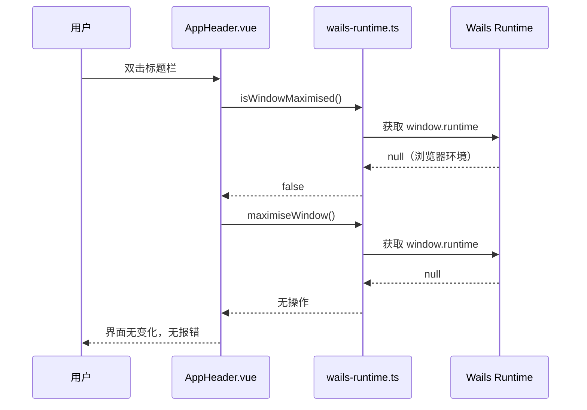

InvestGo 将 Wails v3 定位为「Go 后端与 Vue 前端的轻量桌面容器」，而非传统意义上通过 JS Bindings 进行密集通信的框架。项目的前后端业务交互完全基于标准 HTTP `/api/*` 接口，只有窗口拖拽、最大化等原生桌面行为才需要接触 Wails 运行时。这种设计使得前端代码能够在普通浏览器与 Vite 开发服务器中独立运行，而无需依赖 Wails 注入的运行时环境。本章将解析运行时桥接层的实现、自定义标题栏与窗口控制的交互细节，以及浏览器开发模式下的兼容策略。

## 架构定位：HTTP API 优先于 JS Bindings

在典型的 Wails 应用中，前端通过 `window.go` 对象直接调用 Go 暴露的方法，这种方式虽然延迟低，却将前端与 Wails 运行时深度耦合。InvestGo 选择了另一条路径：后端在 `main.go` 中注册一个标准的 `http.ServeMux`，将 `/api/*` 路由统一代理给 `internal/api` 处理，前端则通过标准的 `fetch()` 发起请求。这意味着前端除了窗口控制外，所有业务逻辑——包括行情刷新、设置保存、历史数据查询——都不依赖任何 Wails 特有的全局对象。Wails 在此架构中主要承担三项职责：提供系统 WebView 窗口、嵌入前端构建产物、以及代理少量原生窗口事件。

这种架构带来了显著的开发体验优势：运行 `npm run dev` 启动 Vite 开发服务器时，前端可以在完全没有 Wails runtime 的环境中加载和渲染。虽然此时 `/api/*` 请求需要后端服务配合才能返回真实数据，但 UI 结构、组件交互、主题切换等纯前端行为都可以独立调试。对于需要真实数据的场景，开发者只需额外启动 Go 后端，并确保两者在同一来源下即可。

Sources: [main.go](main.go#L98-L100), [README.zh-CN.md](README.zh-CN.md#L7-L8)

## 运行时桥接层的设计

项目中唯一与 Wails 运行时打交道的文件是 `frontend/src/wails-runtime.ts`。它对外暴露四个与窗口行为相关的函数，并在内部通过可空访问模式（null-safe access）屏蔽运行时缺失带来的异常。

### 类型定义与可空访问

桥接层首先为 Wails v3 注入的两个全局对象声明了最小化的 TypeScript 类型：`WailsWindowRuntime` 封装了窗口最大化相关方法，`WailsBridge` 则提供了向原生端发送消息的能力。`getWindowRuntime()` 与 `getWailsBridge()` 两个辅助函数通过类型断言从 `window` 对象上提取这些 API，若当前环境为浏览器而非 Wails 容器，则返回 `null`。所有对外函数均基于这一「可空运行时」进行防御式调用：查询类方法（如 `isWindowMaximised`）返回安全默认值 `false`，操作类方法（如 `maximiseWindow`、`startWindowDrag`）则使用可选链直接忽略空值，不会在控制台抛出未定义错误。

这种设计保证了在 Vite 开发服务器或任何外部浏览器中，调用这些函数不会中断应用流程。例如当用户在浏览器中双击自定义标题栏时，`isWindowMaximised()` 返回 `false`，随后 `maximiseWindow()` 成为无操作，界面保持原状，而不会影响其他业务逻辑。

Sources: [wails-runtime.ts](frontend/src/wails-runtime.ts#L1-L43)

### 桥接函数对照

下表列出了桥接层暴露的全部函数及其在桌面环境与浏览器环境中的行为差异。

| 函数 | 桌面环境（Wails） | 浏览器环境（Vite Dev） | 用途 |
|------|------------------|----------------------|------|
| `isWindowMaximised()` | 调用原生 API 返回实际最大化状态 | 返回 `false` | 判断窗口是否已最大化 |
| `maximiseWindow()` | 调用 `WindowMaximise()` 放大窗口 | 无操作 | 将窗口最大化到当前工作区 |
| `restoreWindow()` | 调用 `WindowUnmaximise()` 恢复尺寸 | 无操作 | 从最大化状态还原 |
| `startWindowDrag()` | 通过 `_wails.invoke("wails:drag")` 触发拖拽 | 无操作 | 启动原生窗口拖动 |

Sources: [wails-runtime.ts](frontend/src/wails-runtime.ts#L19-L42)

## 自定义标题栏与窗口交互

InvestGo 在 macOS 上默认使用隐藏式统一标题栏（`MacTitleBarHiddenInsetUnified`），这意味着系统原生标题栏被完全移除，窗口的拖拽、最大化、双击等行为需要前端自行实现。`AppHeader.vue` 组件正是这一交互的核心载体，它通过 `wails-runtime.ts` 提供的桥接函数，在纯 DOM 事件层面重建了原生窗口的操作体验。

### 窗口配置与平台抽象

后端的 `internal/platform/window.go` 负责构建主窗口选项。`BuildMainWindowOptions` 函数根据用户设置中的 `useNativeTitleBar` 标志决定是否隐藏系统标题栏。当选择隐藏时，窗口会采用毛玻璃背景（`MacBackdropTranslucent`）并移除标题栏，为前端的自定义区域留出空间；若用户偏好原生标题栏，则不额外修改 Mac 窗口样式。这一配置在 `main.go` 的应用初始化阶段被读取，并作为 `windowOptions` 传入 Wails 窗口创建流程。

Sources: [window.go](internal/platform/window.go#L6-L28), [main.go](main.go#L125-L126)

### 拖拽区域的实现细节

`AppHeader.vue` 将整个标题栏区域注册为可拖拽区域，但为了不与区域内的按钮、链接、输入框等可交互元素冲突，它实现了一套精细的拖拽识别逻辑。`isInteractiveTarget` 函数会检查事件目标是否位于 `button`、`a`、`input` 等元素内部，若点击的是这些元素，则完全跳过拖拽逻辑。只有在非交互区域按下鼠标时，`handleBarMouseDown` 才会记录起始坐标；随后当鼠标移动超过 4 像素阈值时，`handleBarMouseMove` 调用 `startWindowDrag()` 触发原生窗口拖动，并设置一个 800 毫秒的定时器用于重置拖拽状态。这种「阈值+定时器」的双重机制避免了误触，同时保证拖拽结束后状态能够被及时清理。

### 双击最大化与还原

由于隐藏了原生标题栏，系统默认的双击标题栏最大化行为也随之失效。`AppHeader.vue` 通过 `@dblclick` 事件监听器重新实现了这一行为：`handleBarDoubleClick` 首先排除正在拖拽或点击交互元素的情况，然后调用 `isWindowMaximised()` 判断当前状态。若窗口已最大化，则调用 `restoreWindow()` 还原；否则调用 `maximiseWindow()` 放大。在浏览器环境中，这两个调用均安全降级为无操作，因此不会引发异常。

Sources: [AppHeader.vue](frontend/src/components/AppHeader.vue#L1-L100)

## 浏览器开发模式的兼容策略

当开发者执行 `npm run dev` 时，Vite 在 5173 端口启动开发服务器，此时页面运行在普通 Chromium 浏览器标签中，`window.runtime` 与 `window._wails` 均不存在。InvestGo 的兼容策略从两个层面确保前端在此模式下依然可用：桥接层的可空安全，以及业务层对标准 Web API 的 exclusive 依赖。

### 前端与后端的通信边界

所有业务数据交换都通过 `frontend/src/api.ts` 中的 `api()` 函数完成，该函数是对标准 `fetch()` 的封装，支持超时控制、请求取消和统一错误处理。由于请求路径使用相对路径（如 `/api/state`、`/api/refresh`），在 Wails 桌面环境中，这些请求由 Wails 内置的 HTTP 处理程序响应；在浏览器开发模式中，如果开发者额外启动了 Go 后端并配置好同源或代理，同样的路径也能被后端正确处理。前端代码本身不需要感知当前运行在哪种容器中——它始终只面对一个普通的 HTTP API。

Sources: [api.ts](frontend/src/api.ts#L30-L86), [App.vue](frontend/src/App.vue#L242-L243)

### 无运行时状态下的行为降级

以下 Mermaid 序列图展示了在浏览器开发模式下，用户尝试与自定义标题栏交互时的完整行为流。可以看到，由于运行时桥接层拦截了空值，所有调用都在前端层面静默结束，不会向后端或原生层传播错误。

这种降级策略确保开发者可以在浏览器中自由调试布局、主题、组件状态，而不必每次都打包完整的桌面应用。需要真实后端数据时，只需启动 Go 服务；若仅需前端视觉与交互验证，单独的 Vite 服务器已足够。

Sources: [README.zh-CN.md](README.zh-CN.md#L62-L68)

## 跨环境特性矩阵

为了更直观地展示桌面环境与浏览器开发环境的差异，下表汇总了主要前端能力在不同运行时的可用性。

| 能力 | Wails 桌面应用 | Vite 浏览器开发 | 依赖文件 |
|------|---------------|----------------|---------|
| 行情数据获取 | 可用，通过 `/api/*` | 可用，需启动 Go 后端 | [api.ts](frontend/src/api.ts) |
| 设置保存与读取 | 可用 | 可用，需启动 Go 后端 | [App.vue](frontend/src/App.vue#L389) |
| 历史 K 线加载 | 可用 | 可用，需启动 Go 后端 | [useHistorySeries.ts](frontend/src/composables/useHistorySeries.ts) |
| 窗口最大化/还原 | 可用 | 无操作（安全降级） | [wails-runtime.ts](frontend/src/wails-runtime.ts#L30-L36) |
| 窗口拖拽 | 可用 | 无操作（安全降级） | [wails-runtime.ts](frontend/src/wails-runtime.ts#L40-L42) |
| 双击标题栏最大化 | 可用 | 无操作（安全降级） | [AppHeader.vue](frontend/src/components/AppHeader.vue#L87-L99) |
| 主题切换 | 可用 | 可用（纯前端逻辑） | [App.vue](frontend/src/App.vue#L230-L233) |
| 多语言切换 | 可用 | 可用（纯前端逻辑） | [i18n.ts](frontend/src/i18n.ts) |

## 维护建议与注意事项

若未来需要扩展更多原生桌面能力——例如系统托盘、全局快捷键或窗口置顶——应当遵循同样的模式：将所有 Wails 特定调用收敛到 `wails-runtime.ts` 中，并为每个函数提供浏览器环境下的安全降级路径。切忌在组件或组合式函数中直接访问 `window.runtime`，否则会破坏浏览器开发兼容性。

此外，Wails v3 目前处于 alpha 阶段，`window.runtime` 与 `window._wails` 的 API 可能在后续版本中调整。由于桥接层已经对这两个对象进行了最小化类型封装，未来若官方 API 发生变化，只需修改 `wails-runtime.ts` 中的类型定义和辅助函数，而无需触碰 `AppHeader.vue` 等业务组件。

如需深入了解应用启动时如何将 HTTP handler 接入 Wails 窗口，请参阅 [应用启动流程与初始化](6-ying-yong-qi-dong-liu-cheng-yu-chu-shi-hua)；关于 `api.ts` 的超时、取消与错误日志机制，请参阅 [API 客户端封装：超时、取消与错误日志](19-api-ke-hu-duan-feng-zhuang-chao-shi-qu-xiao-yu-cuo-wu-ri-zhi)；平台层窗口选项与代理检测的更多细节，可参阅 [平台层：系统代理检测与窗口管理](15-ping-tai-ceng-xi-tong-dai-li-jian-ce-yu-chuang-kou-guan-li)。