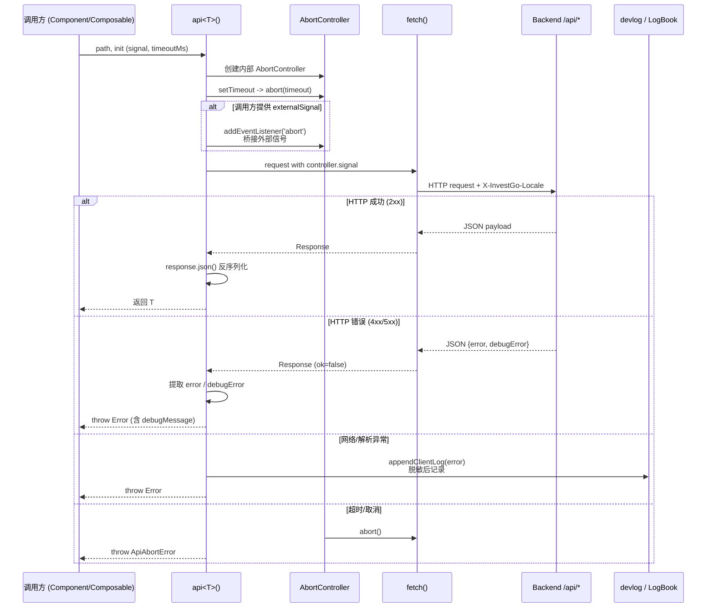

前端所有与后端 `/api/*` 的通信都收敛在单个 `api.ts` 模块中。它并不是对 `fetch` 的简单别名，而是在其之上封装了**可配置超时**、**请求取消**与**统一错误日志**三大能力。任何 Vue 组件或组合式函数都不直接调用 `fetch`，而是通过 `api<T>()` 发起类型安全的请求；该模块同时与 `devlog.ts` 中的前端日志系统打通，确保网络异常既能被用户在开发者面板中查看，也能最终同步到后端 LogBook 持久化。Sources: [api.ts](frontend/src/api.ts#L31-L86), [devlog.ts](frontend/src/devlog.ts#L67-L85)

设计这套封装的核心动机有三点。第一，Wails 桌面应用的前端既可能在浏览器开发服务器中运行，也可能嵌入在 Wails 运行时中，因此需要一个与运行环境无关的 HTTP 客户端。第二，行情数据请求（如历史 K 线、资产概览）可能耗时较长，且用户在等待过程中会频繁切换标的或区间，必须支持可靠的请求取消与竞态丢弃。第三，后端返回的错误信息已经过国际化处理，前端需要把调试级细节与用户级文案分离，同时将故障痕迹写入开发者日志以便排查。`api.ts` 通过单一函数即满足了这三类需求，避免了各组件重复实现超时计时器和异常分支。Sources: [api.ts](frontend/src/api.ts#L15-L30), [wails-runtime.ts](frontend/src/wails-runtime.ts#L19-L27)

## 请求生命周期与模块交互

下图展示了从调用方发起请求到结果返回（或异常抛出）的完整数据流，其中内部 `AbortController` 同时承载超时与外部信号桥接职责，错误则在脱敏后进入前端日志队列并镜像至后端。

超时与取消的实现基于**双重 AbortController** 策略。`api` 函数内部创建一个独立的 `AbortController`，并用 `window.setTimeout` 在默认 15 秒（可通过 `timeoutMs` 覆盖）后触发 `abort(new ApiAbortError("timeout"))`。如果调用方传入了外部的 `signal`（例如组件卸载或切换标的时创建的 `AbortController`），该信号会通过事件监听桥接到内部控制器：外部取消或内部超时都能中断同一个底层 `fetch`，但任意一方触发时不会破坏另一方的清理逻辑。为了区分“超时”与“手动取消”，模块导出了 `ApiAbortError`，其 `reason` 字段只能是 `"timeout"` 或 `"aborted"`，消息文案则通过 `translate("api.timeout")` 与 `translate("api.aborted")` 自动适配当前语言。值得注意的是，`fetch` 原生抛出的 `DOMException`（`name === "AbortError"`）在 `catch` 块中会被重新归类为 `ApiAbortError`，从而恢复丢失的语义信息。Sources: [api.ts](frontend/src/api.ts#L16-L24), [api.ts](frontend/src/api.ts#L32-L47), [api.ts](frontend/src/api.ts#L69-L76), [i18n.ts](frontend/src/i18n.ts#L527-L531)

## 错误处理与后端载荷契约

在错误处理方面，`api` 把后端响应分为三类。对于 HTTP 成功（`response.ok`），直接返回解析后的 JSON。对于 HTTP 失败，它会检查响应体是否符合 `ApiErrorPayload` 结构：后端通过 `writeError` 写入的 `error` 字段是面向用户的本地化消息，`debugError` 字段则保留原始调试信息。`api` 将两者分别映射为抛出异常的 `message` 与 `debugMessage`，供上层决定向用户展示什么。对于网络异常或解析失败，`catch` 块会调用 `appendClientLog` 将请求方法、路径和脱敏后的错误详情写入前端日志。`ApiAbortError` 则不会被记录，因为超时和手动取消属于预期内的流程中断，不应污染日志。Sources: [api.ts](frontend/src/api.ts#L56-L65), [api.ts](frontend/src/api.ts#L69-L81), [http.go](internal/api/http.go#L125-L138)

## 安全：日志脱敏与前后端双向同步

错误日志的安全性与双向同步由 `devlog.ts` 完成。`api` 捕获到的异常在记录前会经过 `redactSensitiveText` 处理，该函数通过正则匹配，将 `alphaVantageApiKey`、`twelveDataApiKey` 等配置字段以及 URL 查询参数中的 `apikey`、`api_key`、`key` 值替换为 `***`，防止第三方 API 密钥在日志中泄露。写入的日志首先进入内存中的 `clientLogs` 响应式数组（上限 200 条），供开发者模式面板实时查看；随后由 `mirrorClientLog` 缓冲 1 秒，批量通过 `fetch("/api/client-logs", { keepalive: true })` 发往后端。后端 `handleClientLogs` 将其写入 `LogBook`，实现前端异常在本地日志文件中的持久化。这意味着用户在设置页看到的“前端日志”与后端磁盘日志是同一来源的双向镜像。Sources: [devlog.ts](frontend/src/devlog.ts#L139-L150), [devlog.ts](frontend/src/devlog.ts#L67-L85), [devlog.ts](frontend/src/devlog.ts#L95-L118), [handler.go](internal/api/handler.go#L87-L101)

## 调用方实践模式

在业务代码中，调用方通常遵循**“一请求一控制器”**的范式来避免竞态。以 `useHistorySeries` 为例：每次加载历史数据时创建新的 `AbortController`，并将其信号传给 `api`；若用户在数据返回前切换了区间或标的，前一次请求会被显式 `abort(new ApiAbortError("aborted"))`，返回后通过 `if (inflightController !== controller)` 丢弃陈旧结果。`OverviewModule` 与 `HotModule` 也采用了相同的 `inflightController` 模式，仅在超时阈值上有所区别（历史数据 12 秒、概览 20 秒）。当 `catch` 块检测到 `ApiAbortError` 时，通常直接静默返回，不更新错误状态，从而避免界面闪烁。Sources: [useHistorySeries.ts](frontend/src/composables/useHistorySeries.ts#L22-L32), [useHistorySeries.ts](frontend/src/composables/useHistorySeries.ts#L58-L84), [OverviewModule.vue](frontend/src/components/modules/OverviewModule.vue#L335-L366), [HotModule.vue](frontend/src/components/modules/HotModule.vue#L44)

## 类型与参数速查

| 导出项 | 类型签名 | 说明 |
|---|---|---|
| `api<T>` | `(path: string, init?: ApiRequestInit) => Promise<T>` | 统一请求封装，默认超时 15 秒 |
| `ApiRequestInit` | `RequestInit & { timeoutMs?: number }` | 扩展原生 `RequestInit`，增加可配置超时 |
| `ApiAbortError` | `class extends Error { readonly reason: "timeout" \| "aborted" }` | 用于区分超时与手动取消的可识别错误 |
| `defaultTimeoutMs` | `number` | 默认超时毫秒数（15000），可在每次调用中覆盖 |

## 小结与延伸阅读

`api.ts` 通过不到 90 行代码，将分散的 HTTP 细节收敛为类型安全、可观测、可取消的单一抽象。它的设计刻意保持轻量：不引入第三方 HTTP 库，完全依赖原生 `fetch` 与 `AbortController`，与 Wails 和浏览器双运行环境兼容。如果你正在开发新的组合式函数或模块组件，应当始终复用 `api<T>()`，并为长耗时请求设置合理的 `timeoutMs`，同时在 `catch` 中对 `ApiAbortError` 做静默处理。

**建议阅读顺序**：
- 上一页：[Wails 运行时桥接与浏览器开发兼容](18-wails-yun-xing-shi-qiao-jie-yu-liu-lan-qi-kai-fa-jian-rong)
- 下一页：[组合式函数（Composables）设计模式](20-zu-he-shi-han-shu-composables-she-ji-mo-shi) — 其中展示了大量基于 `api` 与 `AbortController` 的实际调用范式
- 相关后端页面：[HTTP API 层设计与国际化错误处理](14-http-api-ceng-she-ji-yu-guo-ji-hua-cuo-wu-chu-li) — 了解后端 `writeError` 与 `requestLocale` 的实现细节
- 相关页面：[日志系统：LogBook 与前后端统一日志](16-ri-zhi-xi-tong-logbook-yu-qian-hou-duan-tong-ri-zhi) — 深入了解前后端日志的双向同步机制