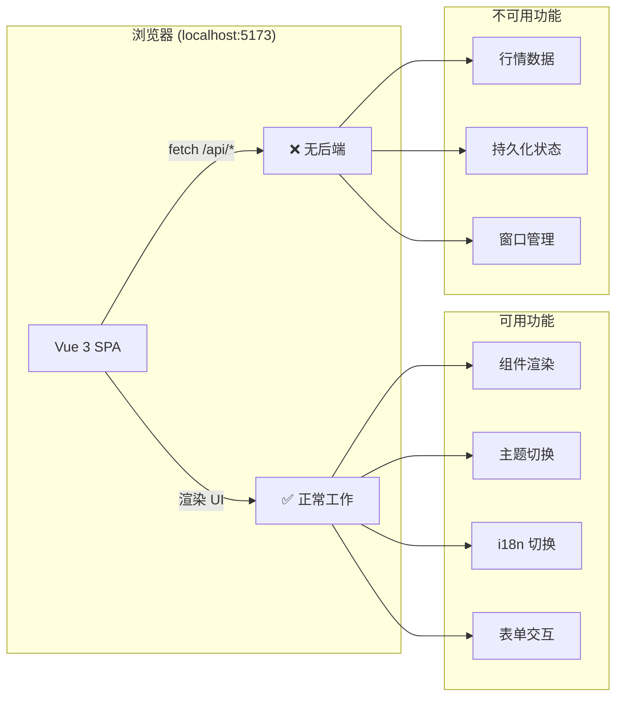
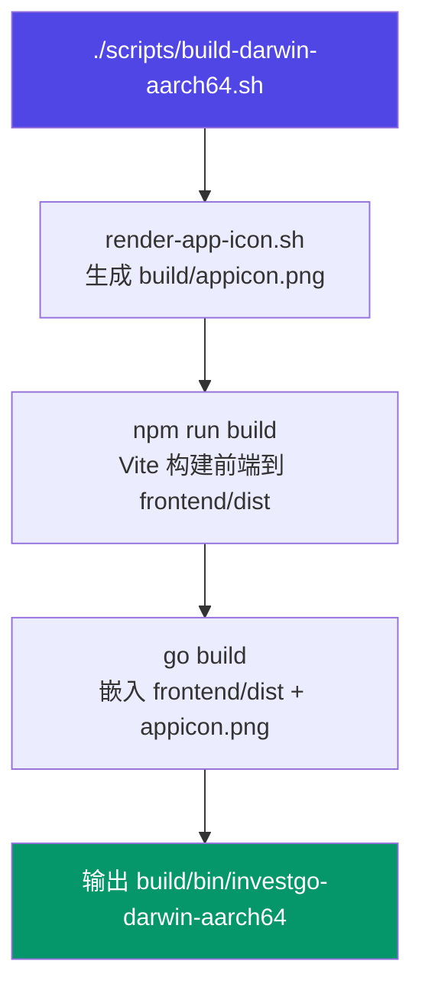

InvestGo 是一款基于 **Wails v3** 构建的桌面投资跟踪应用——Go 后端负责行情数据采集、状态持久化和业务逻辑，Vue 3 前端负责界面渲染，两者通过本地 HTTP API 通信。本文将引导你在 **5 分钟内**跑通开发环境，涵盖依赖安装、前端开发服务器、桌面应用构建三个阶段。

Sources: [README.zh-CN.md](README.zh-CN.md#L1-L144), [main.go](main.go#L1-L40)

## 前置条件

在开始之前，请确认你的开发机器满足以下最低要求：

| 依赖                    | 最低版本 | 用途                             | 验证命令                     |
| ----------------------- | -------- | -------------------------------- | ---------------------------- |
| **Node.js**             | 20+      | 前端构建工具链、包管理           | `node -v`                    |
| **Go**                  | 1.24+    | 后端编译与运行                   | `go version`                 |
| **pnpm**（推荐）或 npm  | 任意     | 前端依赖安装                     | `pnpm -v`                    |
| **Swift** 命令行工具    | 系统自带 | 应用图标渲染脚本                 | `swift --version`            |
| **Apple Silicon macOS** | 13+      | 当前桌面构建与打包脚本的目标平台 | `uname -m`（应输出 `arm64`） |

> **说明**：InvestGo 当前仅提供 macOS（Apple Silicon）的构建和打包脚本。前端开发服务器模式不依赖 Wails 运行时，可以在任何安装了 Node.js 的平台上运行，但后端 API 功能（行情刷新、持久化等）仅在与 Go 后端一同运行时可用。

Sources: [README.zh-CN.md](README.zh-CN.md#L91-L95), [scripts/build-darwin-aarch64.sh](scripts/build-darwin-aarch64.sh#L1-L15)

## 项目结构速览

快速上手之前，先了解仓库的核心目录划分，这有助于你理解后续的构建命令在做什么：

```
investgo/                        # 仓库根目录（Go module 根）
├── main.go                      # 应用入口：初始化 Store、注册 HTTP 路由、创建 Wails 窗口
├── go.mod / go.sum              # Go 依赖声明
├── package.json                 # 前端脚本（dev / build / typecheck）
├── vite.config.ts               # Vite 配置（root: frontend/，端口 5173）
├── frontend/                    # Vue 3 前端
│   ├── index.html               # SPA 入口 HTML
│   └── src/
│       ├── main.ts              # Vue 应用挂载 + PrimeVue 初始化
│       ├── App.vue              # 根组件：状态管理、模块路由、设置联动
│       ├── api.ts               # 统一 fetch 封装（超时、取消、错误日志）
│       ├── wails-runtime.ts     # Wails 运行时桥接（窗口拖拽/最大化等）
│       ├── components/          # UI 组件（Shell、Sidebar、模块视图、对话框）
│       ├── composables/         # 组合式函数（历史数据、日志、布局等）
│       └── ...
├── internal/                    # Go 后端（不可被外部导入）
│   ├── api/                     # HTTP API 层（/api/* 路由处理）
│   ├── core/                    # 核心业务逻辑
│   │   ├── model.go             # 数据模型定义
│   │   ├── store/               # 状态管理、持久化、行情刷新
│   │   ├── marketdata/          # Provider 注册表与历史路由
│   │   ├── provider/            # 具体行情源实现（东方财富、Yahoo 等）
│   │   └── hot/                 # 热门榜单服务
│   ├── platform/                # 平台层（代理检测、窗口选项）
│   └── logger/                  # 日志系统
└── scripts/                     # 构建与打包脚本（macOS）
    ├── build-darwin-aarch64.sh
    └── package-darwin-aarch64.sh
```

关键设计点：**前端通过标准 `fetch()` 调用 `/api/*` 路由**，而不是 Wails JS bindings。这意味着前端可以在纯浏览器中独立运行（Vite 开发服务器），也可以嵌入 Wails 桌面容器运行。

Sources: [main.go](main.go#L59-L64), [vite.config.ts](vite.config.ts#L1-L18), [frontend/src/api.ts](frontend/src/api.ts#L36-L87), [frontend/src/wails-runtime.ts](frontend/src/wails-runtime.ts#L1-L43), [internal/api/http.go](internal/api/http.go#L72-L98)

## 第一步：安装依赖

克隆仓库后，在项目根目录执行：

```bash
# 安装前端依赖（Vue、PrimeVue、Chart.js、Vite 等）
npm install
```

Go 依赖无需手动安装——`go build` 命令会在首次编译时自动下载 [go.mod](go.mod) 中声明的模块（主要是 `wails/v3`、`utls`、`golang.org/x/text`）。

Sources: [go.mod](go.mod#L1-L10), [package.json](package.json#L1-L21)

## 第二步：运行前端开发服务器

这是最快的验证方式——**无需 Go 环境**，只需 Node.js：

```bash
npm run dev
```

Vite 会在 **5173 端口** 启动开发服务器，终端输出类似：

```
  VITE v8.x.x  ready in xxx ms

  ➜  Local:   http://localhost:5173/
  ➜  Network: http://192.168.x.x:5173/
```

浏览器打开 `http://localhost:5173/` 即可看到 InvestGo 界面。

> **重要**：此模式下没有 Wails 运行时，所有 `window.runtime` 和 `window._wails` 调用都会被安全降级（返回 `null`）。这意味着窗口拖拽、最大化等原生功能不可用，但 UI 渲染和组件逻辑不受影响。相关代码位于 [wails-runtime.ts](frontend/src/wails-runtime.ts)，所有调用都做了 null-safe 包装。

Sources: [vite.config.ts](vite.config.ts#L9-L12), [frontend/src/wails-runtime.ts](frontend/src/wails-runtime.ts#L14-L24), [package.json](package.json#L5-L7)

### 前端开发模式的工作原理



前端开发模式适用于 **UI 调试、样式调整、组件开发** 等场景。如果需要完整的后端功能（行情刷新、持仓管理等），请直接进入第四步构建桌面应用。

Sources: [frontend/src/wails-runtime.ts](frontend/src/wails-runtime.ts#L26-L43), [frontend/src/main.ts](frontend/src/main.ts#L1-L24)

## 第三步：执行检查

在开发过程中，建议定期运行以下检查命令确保代码质量：

```bash
# 前端 TypeScript 类型检查
npm run typecheck

# 后端 Go 测试
env GOCACHE=/tmp/go-build-cache go test ./...
```

| 检查项   | 命令                          | 说明                                             |
| -------- | ----------------------------- | ------------------------------------------------ |
| 前端类型 | `npm run typecheck`           | 使用 `vue-tsc --noEmit` 校验 TypeScript 类型     |
| 后端测试 | `go test ./...`               | 运行 `internal/**` 下的所有 Go 测试              |
| 后端缓存 | `GOCACHE=/tmp/go-build-cache` | 可选，将构建缓存重定向到临时目录避免污染默认缓存 |

当前项目**没有前端单元测试框架**，前端验证完全依赖类型检查和手动测试。后端测试集中在 Store 层（缓存、enrichment、overview 计算、配置清理等）。

Sources: [package.json](package.json#L8-L9), [README.zh-CN.md](README.zh-CN.md#L97-L99), [internal/core/store/cache_test.go](internal/core/store/cache_test.go#L1-L1)

## 第四步：构建桌面应用

当你需要完整的 Go + Vue 联合体验时，执行桌面应用构建：

```bash
# 标准构建（输出到 build/bin/investgo-darwin-aarch64）
./scripts/build-darwin-aarch64.sh

# 指定版本号
VERSION=1.0.0 ./scripts/build-darwin-aarch64.sh

# 开发构建（启用终端日志 + F12 DevTools）
./scripts/build-darwin-aarch64.sh --dev
```

### 构建流程详解



构建脚本内部执行三个阶段：

1. **图标渲染**：调用 `scripts/render-app-icon.sh`，使用 Swift 将 SVG 源文件渲染为 1024×1024 PNG 应用图标
2. **前端构建**：执行 `npm run build`，Vite 将 `frontend/src` 编译输出到 `frontend/dist`
3. **Go 编译**：通过 `go build` 编译二进制文件，利用 `//go:embed` 指令将 `frontend/dist` 和 `build/appicon.png` 嵌入最终产物

Sources: [scripts/build-darwin-aarch64.sh](scripts/build-darwin-aarch64.sh#L49-L75), [main.go](main.go#L19-L25)

### 构建模式对比

| 特性         | 标准构建                     | 开发构建（`--dev`）                |
| ------------ | ---------------------------- | ---------------------------------- |
| 版本号显示   | `VERSION` 环境变量值或 `dev` | 同左                               |
| 终端日志输出 | ❌ 关闭                      | ✅ 通过 `-ldflags` 启用            |
| F12 DevTools | ❌ 不可用                    | ✅ 需同时启用 `developerMode` 设置 |
| Go 构建标签  | `production`                 | `production devtools`              |
| 二进制体积   | 更小（`-s -w` 裁剪调试信息） | 稍大                               |

> **关于 `--dev` 和 DevTools**：开发构建通过链接器标志 `-X main.defaultTerminalLogging=1 -X main.defaultDevToolsBuild=1` 在编译时注入开关值。运行时按 F12 时，应用会检查两个条件：**①** 二进制是否以 `--dev` 构建；**②** 设置中是否启用了 `developerMode`。两者同时满足才会打开 Web Inspector。

Sources: [scripts/build-darwin-aarch64.sh](scripts/build-darwin-aarch64.sh#L55-L70), [main.go](main.go#L155-L175)

### 可用环境变量

构建脚本支持通过环境变量自定义编译行为：

| 变量                      | 默认值                              | 说明                                 |
| ------------------------- | ----------------------------------- | ------------------------------------ |
| `VERSION` / `APP_VERSION` | `dev`                               | 应用版本号，注入到 `main.appVersion` |
| `OUTPUT_FILE`             | `build/bin/investgo-darwin-aarch64` | 输出二进制路径                       |
| `MACOS_MIN_VERSION`       | `13.0`                              | 最低 macOS 部署版本                  |
| `GOCACHE`                 | `/tmp/go-build-cache`               | Go 构建缓存目录                      |
| `CGO_CFLAGS`              | `-mmacosx-version-min=13.0`         | C 编译器标志                         |
| `CGO_LDFLAGS`             | `-mmacosx-version-min=13.0`         | C 链接器标志                         |

Sources: [scripts/build-darwin-aarch64.sh](scripts/build-darwin-aarch64.sh#L25-L31)

## 第五步：打包分发（可选）

如果你需要生成 `.app` 和 `.dmg` 安装镜像：

```bash
# 打包为 .app 和 .dmg
./scripts/package-darwin-aarch64.sh

# 指定版本号
VERSION=1.0.0 ./scripts/package-darwin-aarch64.sh

# 开发构建打包（含 DevTools 支持）
VERSION=1.0.0 ./scripts/package-darwin-aarch64.sh --dev
```

打包产物：

| 文件     | 路径                                              | 说明         |
| -------- | ------------------------------------------------- | ------------ |
| **.app** | `build/macos/InvestGo.app`                        | macOS 应用包 |
| **.dmg** | `build/bin/investgo-<version>-darwin-aarch64.dmg` | 分发镜像     |

打包脚本内部会自动调用构建脚本，无需手动先 build 再 package。它还会使用 `sips` 和 `iconutil` 生成 `.icns` 图标集，并通过模板渲染 `Info.plist`。

Sources: [scripts/package-darwin-aarch64.sh](scripts/package-darwin-aarch64.sh#L1-L35)

## 验证清单

构建完成后，按以下清单逐项验证开发环境是否就绪：

- [ ] `npm run dev` 能在浏览器正常打开界面
- [ ] `npm run typecheck` 通过，无 TypeScript 错误
- [ ] `go test ./...` 通过，无测试失败
- [ ] `./scripts/build-darwin-aarch64.sh --dev` 生成 `build/bin/investgo-darwin-aarch64`
- [ ] 双击运行二进制文件，应用窗口正常显示
- [ ] 在设置中启用 `developerMode`，按 F12 能打开 DevTools

## 下一步

快速开始到这里就结束了。根据你的关注点，推荐以下阅读路径：

**理解整体架构**：

- [项目概览](1-xiang-mu-gai-lan) — 了解 InvestGo 的功能定位与设计哲学
- [技术栈与依赖总览](3-ji-zhu-zhan-yu-yi-lai-zong-lan) — 前后端依赖的详细解读

**深入开发流程**：

- [开发环境搭建与调试模式](4-kai-fa-huan-jing-da-jian-yu-diao-shi-mo-shi) — 前后端联调、代理配置、开发日志等进阶技巧
- [构建与打包发布（macOS）](5-gou-jian-yu-da-bao-fa-bu-macos) — 完整构建流水线、代码签名与公证

**理解核心架构**：

- [应用启动流程与初始化](6-ying-yong-qi-dong-liu-cheng-yu-chu-shi-hua) — `main.go` 启动链路的逐行解析
- [Store：核心状态管理与持久化](7-store-he-xin-zhuang-tai-guan-li-yu-chi-jiu-hua) — 数据模型的读写、刷新与 JSON 存储
