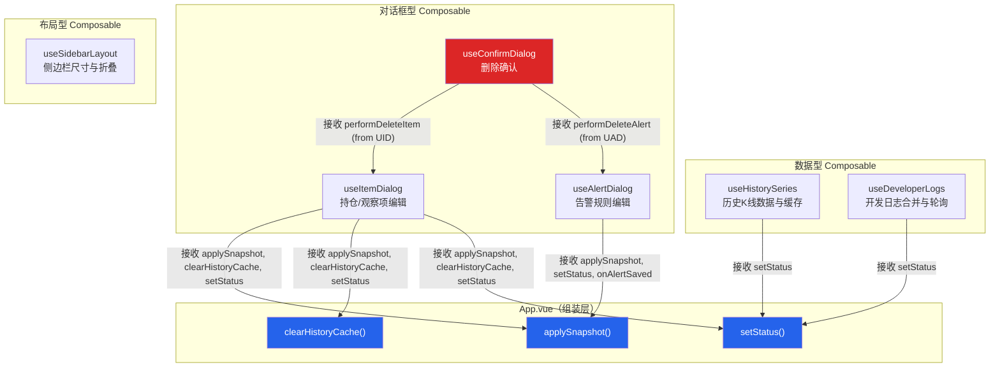
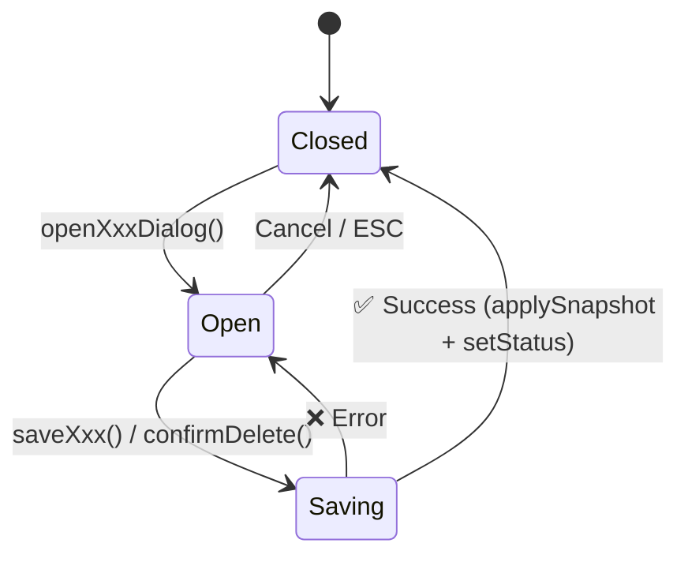

InvestGo 前端采用 **Composable 函数**作为核心的状态封装与逻辑复用单元，将原本集中在一个巨型 `App.vue` 中的数百行交互逻辑，拆解为六个职责单一、可独立测试的模块。这些 composable 并非孤立的工具函数——它们通过**回调注入（Callback Injection）**建立起清晰的依赖拓扑，最终由 `App.vue` 作为"组装层"完成接线。本文将系统性地分析每个 composable 的设计意图、状态所有权、生命周期管理，以及它们如何通过组合而非继承来构建复杂交互。

Sources: [useAlertDialog.ts](frontend/src/composables/useAlertDialog.ts#L1-L88), [App.vue](frontend/src/App.vue#L1-L463)

## 架构总览：Composable 依赖拓扑

整个 composable 层并非平铺的函数集合，而是呈现出有向的依赖关系。`App.vue` 作为唯一的组装入口，按照特定顺序实例化各个 composable，并通过回调函数将它们串联起来。



上图的关键洞察是 **composable 之间的通信方向**：`useConfirmDialog` 不直接依赖 `useItemDialog` 或 `useAlertDialog` 的内部状态，而是通过 `App.vue` 将两者的删除函数注入进来。这确保了每个 composable 只关心自己的职责边界。

Sources: [App.vue](frontend/src/App.vue#L412-L431)

## 分类体系：三种职责范式

六个 composable 按照职责可以归纳为三种范式。理解这种分类有助于在扩展新功能时选择正确的抽象模式。

| 范式 | Composable | 核心职责 | 状态特征 | 生命周期钩子 |
|------|-----------|---------|---------|------------|
| **对话框状态机** | `useItemDialog`, `useAlertDialog`, `useConfirmDialog` | 管理对话框可见性、表单数据、保存/删除流程 | `ref<boolean>` 控制可见性 + `reactive<Form>` 管理表单 | 无（由外部控制生命周期） |
| **异步数据加载** | `useHistorySeries`, `useDeveloperLogs` | 从后端获取数据、本地缓存、轮询刷新 | `ref<Data>` + `computed` 合并视图 + `Map` 缓存 | `watch` 响应式触发 + `onBeforeUnmount` 清理 |
| **纯 UI 布局** | `useSidebarLayout` | 管理侧边栏宽度、折叠状态、拖拽调整 | `ref<number>` 宽度 + `ref<boolean>` 折叠 + 局部闭包变量 | `onBeforeUnmount` 移除事件监听 |

Sources: [useItemDialog.ts](frontend/src/composables/useItemDialog.ts#L1-L183), [useHistorySeries.ts](frontend/src/composables/useHistorySeries.ts#L1-L164), [useSidebarLayout.ts](frontend/src/composables/useSidebarLayout.ts#L1-L60)

## 核心设计模式深度解析

### 模式一：回调注入（Callback Injection）

这是整个 composable 层最重要的设计模式。每个 composable 的构造函数不直接引用 `App.vue` 的响应式状态，而是通过参数接收必要的回调函数：

```typescript
// useAlertDialog 接收三个回调，而非直接操作 App.vue 的 ref
export function useAlertDialog(
    applySnapshot: (snapshot: StateSnapshot) => void,
    setStatus: StatusReporter,
    onAlertSaved: () => void,
)
```

这种依赖反转带来了三个关键收益：

1. **可测试性**：在单元测试中，只需传入 mock 函数即可验证 composable 的行为，无需挂载整个 Vue 应用。
2. **无循环依赖**：composable 之间通过 `App.vue` 桥接，永远不会产生循环 import。`useConfirmDialog` 接收的 `performDeleteItem` 和 `performDeleteAlert` 分别来自 `useItemDialog` 和 `useAlertDialog`，但三者彼此无 import 关系。
3. **单一边界**：每个 composable 只通过回调与外界通信，状态变更的入口和出口完全可追踪。

`StatusReporter` 类型 `(message: string, tone: StatusTone) => void` 在四个 composable 中被重复声明为局部类型别名，这是一种刻意的去中心化——避免为了共享一个简单函数签名而引入额外的公共类型文件。

Sources: [useAlertDialog.ts](frontend/src/composables/useAlertDialog.ts#L7-L13), [useConfirmDialog.ts](frontend/src/composables/useConfirmDialog.ts#L4-L7), [App.vue](frontend/src/App.vue#L423-L431)

### 模式二：对话框状态机

三个对话框 composable（`useItemDialog`、`useAlertDialog`、`useConfirmDialog`）遵循统一的状态机模型：



以 `useItemDialog` 为例，其状态机包含以下要素：

- **可见性控制**：`itemDialogVisible: ref(false)` — 控制对话框的 `v-if` 指令。
- **表单状态**：`itemForm: reactive<ItemFormModel>(emptyItemForm())` — 使用 `reactive` 而非 `ref`，因为表单字段需要直接通过 `Object.assign` 整体替换。
- **保存守卫**：`savingItem: ref(false)` — 防止重复提交，同时驱动对话框内的 loading 状态。
- **模式标识**：`itemDialogWatchOnly: ref(false)` — 区分"纯观察"和"建仓"两种表单模式，影响 `saveItem()` 内部的字段清理逻辑。

`openItemDialog` 函数通过 `Object.assign(itemForm, ...)` 而非重新赋值来更新表单，这确保了模板中绑定的 `itemForm` 引用保持稳定，避免 Vue 的响应式追踪断裂。

Sources: [useItemDialog.ts](frontend/src/composables/useItemDialog.ts#L20-L32), [useItemDialog.ts](frontend/src/composables/useItemDialog.ts#L51-L87)

### 模式三：Composable 链式组合

`useConfirmDialog` 是 composable 之间协作的典范。它本身不执行删除操作，而是通过构造函数接收两个删除函数：

```typescript
export function useConfirmDialog(
    onDeleteItem: (id: string) => Promise<void>,   // 来自 useItemDialog.performDeleteItem
    onDeleteAlert: (id: string) => Promise<void>,   // 来自 useAlertDialog.performDeleteAlert
)
```

在 `App.vue` 中，这个链条的组装过程清晰可见：

```typescript
// 1. 先实例化 useItemDialog 和 useAlertDialog
const { performDeleteItem: performDeleteItemInner, ... } = useItemDialog(...);
const { performDeleteAlert: performDeleteAlertInner, ... } = useAlertDialog(...);

// 2. 将两者的删除函数注入 useConfirmDialog
const { requestDeleteItem, requestDeleteAlert, confirmDelete } =
    useConfirmDialog(performDeleteItemInner, performDeleteAlertInner);
```

`pendingDelete` 使用普通对象（非响应式）来暂存待删除目标，因为它的读写完全在同步函数中完成，不需要 Vue 的追踪。这是性能优化的一个细节——只在模板需要渲染时才使用 `ref`。

Sources: [useConfirmDialog.ts](frontend/src/composables/useConfirmDialog.ts#L13-L56), [App.vue](frontend/src/App.vue#L412-L431)

### 模式四：声明式数据加载与缓存（useHistorySeries）

`useHistorySeries` 是六个 composable 中最复杂的一个，它同时管理着**响应式数据流**、**内存缓存**、**请求取消**和**生命周期清理**四个维度。

**缓存策略**采用 `Map<string, CachedHistorySeries>` 实现，键格式为 `${itemId}:${interval}`，最多保留 60 条记录。缓存的过期时间优先使用后端返回的 `cacheExpiresAt`，回退到 5 分钟本地默认值。当缓存超过上限时，采用 FIFO 淘汰策略（`Map` 保持插入顺序）。

**请求取消**通过 `AbortController` 实现。每次发起新请求前，先调用 `cancelInflightHistory()` 中断上一次请求。响应到达时检查 `inflightController === controller`，丢弃因竞态条件导致的过期响应。

**静默刷新**（`silent = true`）是一个关键的 UX 决策：在轮询或切换 interval 时，如果已有数据展示，错误不会清空当前图表，而是保持上一次成功加载的内容。只有用户主动操作（非 silent）才会显示错误并清空图表。

**声明式触发**通过 `watch` 实现而非命令式调用：

```typescript
watch(
    () => [activeModule.value, selectedItem.value?.id ?? "", historyInterval.value] as const,
    () => {
        if (activeModule.value !== "watchlist" || !selectedItem.value) {
            cancelInflightHistory(true);
            return;
        }
        void loadHistory(true);
    },
    { immediate: true },
);
```

这个 watcher 将三个数据源的变化统一收敛为一个加载动作，当用户离开 watchlist 模块时自动取消请求，避免后台资源浪费。

Sources: [useHistorySeries.ts](frontend/src/composables/useHistorySeries.ts#L9-L153)

### 模式五：跨源数据合并（useDeveloperLogs）

`useDeveloperLogs` 解决了一个独特的状态合并问题：将**后端日志**和**前端日志**统一为按时间倒序排列的单列表。它没有将两套日志分别存储在组件中，而是使用 `computed` 属性进行实时合并：

```typescript
const developerLogs = computed<DeveloperLogEntry[]>(() =>
    [...backendLogs.value, ...clientLogs.value]
        .sort((left, right) =>
            new Date(right.timestamp).getTime() - new Date(left.timestamp).getTime()
        )
        .slice(0, MAX_COMBINED_LOGS),  // 250 条上限
);
```

前端日志来源于 [`devlog.ts`](frontend/src/devlog.ts) 中维护的全局 `clientLogs` ref（上限 200 条），后端日志通过轮询 `/api/logs?limit=160` 获取。250 的合并上限为两个源同时满载时留出了舒适的余量。

轮询的启停由 `App.vue` 中的 watcher 控制，仅在**设置页面的开发者标签页可见且开发者模式开启**时才启动 4 秒间隔的轮询，离开时立即清除定时器。这种条件驱动的轮询策略确保了后台不会产生不必要的网络请求。

Sources: [useDeveloperLogs.ts](frontend/src/composables/useDeveloperLogs.ts#L15-L82), [devlog.ts](frontend/src/devlog.ts#L1-L150), [App.vue](frontend/src/App.vue#L185-L205)

### 模式六：DOM 事件委托与清理（useSidebarLayout）

`useSidebarLayout` 是唯一的纯 UI composable，它演示了如何在 composable 中安全地管理 DOM 事件：

```typescript
let sidebarResizeActive = false;  // 非响应式闭包变量

function startSidebarResize(): void {
    sidebarHidden.value = false;
    sidebarResizeActive = true;
    document.body.style.cursor = "col-resize";
    document.body.style.userSelect = "none";
    window.addEventListener("mousemove", handleSidebarResize);
    window.addEventListener("mouseup", stopSidebarResize);
}
```

`sidebarResizeActive` 是一个普通的闭包变量而非 `ref`，因为它仅在 `mousemove` 和 `mouseup` 回调中被检查，不涉及模板渲染。宽度值通过 `clampSidebarWidth` 约束在 220–380px 范围内，并在 `onBeforeUnmount` 中确保事件监听器被移除。

`appShellRef` 被暴露出来供模板通过 `ref="appShellRef"` 绑定，用于在拖拽计算中获取容器的左侧偏移量，从而正确地将鼠标位置转换为侧边栏宽度。

Sources: [useSidebarLayout.ts](frontend/src/composables/useSidebarLayout.ts#L3-L59)

## 组装层解析：App.vue 的编排逻辑

`App.vue` 承担的角色是 **Composable 编排器（Orchestrator）**——它不包含业务逻辑本身，而是负责：

1. **按依赖顺序实例化** composable（先 `useHistorySeries`，再 `useItemDialog` 和 `useAlertDialog`，最后 `useConfirmDialog`）。
2. **传递共享回调**（`applySnapshot`、`setStatus`、`clearHistoryCache`）到所有需要的 composable。
3. **桥接跨 composable 调用**，例如 `quickAddHotItem` 包装了 `useItemDialog` 的同名函数，额外注入了 `trackedHotKeys` 判断。
4. **将 composable 返回值通过 props/events 传递给子组件**，模板区域可以看到 `historySeries`、`developerLogs`、`itemForm` 等状态如何流向 `AppWorkspace` 和各个 `Dialog` 组件。

Sources: [App.vue](frontend/src/App.vue#L166-L174), [App.vue](frontend/src/App.vue#L464-L568)

## 设计原则总结

| 原则 | 实现方式 | 收益 |
|------|---------|------|
| **依赖反转** | composable 通过回调参数与外界通信 | 可独立测试，无循环依赖 |
| **单一职责** | 每个 composable 只管一个对话框/一类数据/一个布局元素 | 代码行数可控（60–184行），修改影响范围小 |
| **最小响应式** | 仅在模板需要渲染时使用 `ref`，内部状态用闭包变量 | 减少 Vue 响应式追踪开销 |
| **声明式触发** | 使用 `watch` 驱动数据加载，而非在事件处理中命令式调用 | 自动响应依赖变化，减少遗漏调用的风险 |
| **资源确定性清理** | 所有 `AbortController` 和 DOM 事件在 `onBeforeUnmount` 中释放 | 无内存泄漏，无悬空请求 |

Sources: [useAlertDialog.ts](frontend/src/composables/useAlertDialog.ts#L1-L88), [useConfirmDialog.ts](frontend/src/composables/useConfirmDialog.ts#L1-L68), [useDeveloperLogs.ts](frontend/src/composables/useDeveloperLogs.ts#L1-L82), [useHistorySeries.ts](frontend/src/composables/useHistorySeries.ts#L1-L164), [useItemDialog.ts](frontend/src/composables/useItemDialog.ts#L1-L183), [useSidebarLayout.ts](frontend/src/composables/useSidebarLayout.ts#L1-L60)

## 延伸阅读

- 要了解 composable 返回的状态如何驱动具体的视图渲染，参见 [模块化视图：Watchlist、Holdings、Overview、Hot、Alerts、Settings](21-mo-kuai-hua-shi-tu-watchlist-holdings-overview-hot-alerts-settings)。
- composable 层依赖的表单映射与序列化逻辑在 [API 客户端封装：超时、取消与错误日志](19-api-ke-hu-duan-feng-zhuang-chao-shi-qu-xiao-yu-cuo-wu-ri-zhi) 中有详细分析。
- 前端类型系统中 `ItemFormModel`、`AlertFormModel`、`HistorySeries` 等接口的定义参见 [前端类型定义与后端类型对齐（TypeScript）](25-qian-duan-lei-xing-ding-yi-yu-hou-duan-lei-xing-dui-qi-typescript)。