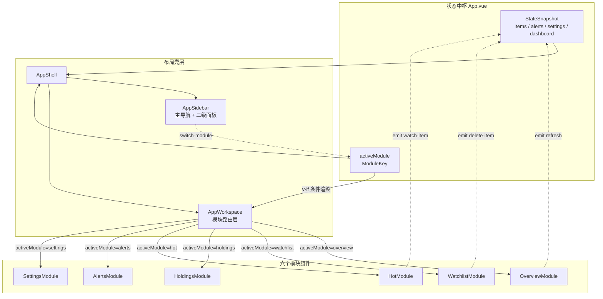

InvestGo 前端采用**模块化视图架构**，将应用的核心功能拆分为六个独立的 Module 组件，通过一个统一的 `AppWorkspace` 路由层按 `activeModule` 状态进行条件渲染。这种设计让每个模块拥有独立的 props 接口、事件契约和数据加载逻辑，同时保持全局状态（`StateSnapshot`）在 `App.vue` 中集中管理。六个模块各司其职：Overview 展示投资组合总览，Watchlist 提供实时行情与 K 线分析，Holdings 聚焦持仓明细，Hot 呈现热门排行榜，Alerts 管理价格预警规则，Settings 负责应用配置。整个模块系统由侧边栏导航驱动，用户通过 `AppSidebar` 的主导航按钮或 `ModuleTabs` 切换模块。

Sources: [App.vue](frontend/src/App.vue#L1-L67), [AppWorkspace.vue](frontend/src/components/AppWorkspace.vue#L1-L77), [types.ts](frontend/src/types.ts#L1-L11)

## 架构总览：模块调度与数据流

模块化视图的核心调度链路为：`App.vue`（状态中枢）→ `AppShell`（布局壳层）→ `AppSidebar`（导航 + 二级面板）→ `AppWorkspace`（模块路由）→ 具体模块组件。`App.vue` 持有全部响应式状态（`items`、`alerts`、`settings`、`dashboard` 等），通过 props 向下分发，子模块通过 emit 事件向上通知用户操作，由 `App.vue` 统一处理后端 API 调用和状态更新。这种**单一状态树 + 事件上浮**的模式确保了数据流的单向性和可预测性。

`AppWorkspace` 作为模块路由器，通过 `v-if` / `v-else-if` 链实现**排他性渲染**——同一时刻只有一个模块组件挂载在 DOM 中。这意味着模块切换会触发组件的完整卸载和重建，Hot 模块利用 `onActivated` / `onDeactivated` 配合 `keep-alive` 的模式进行优化，但当前实现采用直接挂载/卸载策略。

Sources: [AppWorkspace.vue](frontend/src/components/AppWorkspace.vue#L78-L152), [App.vue](frontend/src/App.vue#L454-L461), [AppShell.vue](frontend/src/components/AppShell.vue#L29-L71)

## 模块注册表与类型系统

模块的身份由 `ModuleKey` 联合类型定义，共有六个合法值。`getModuleTabs()` 函数返回侧边栏和标签栏所需的五个主模块（Settings 不在标签栏中，而是通过侧边栏底部的齿轮按钮单独触发），每个条目包含 `key`、`label`（国际化文本）和 `icon`（PrimeVue 图标类名）。

| ModuleKey | 组件 | 图标 | 导航入口 | 核心数据来源 |
|---|---|---|---|---|
| `overview` | `OverviewModule.vue` | `pi pi-home` | 侧边栏 / 标签栏 | `/api/overview` |
| `watchlist` | `WatchlistModule.vue` | `pi pi-chart-line` | 侧边栏 / 标签栏 | `/api/history` + 父级 items |
| `holdings` | `HoldingsModule.vue` | `pi pi-wallet` | 侧边栏 / 标签栏 | 父级 filteredItems |
| `hot` | `HotModule.vue` | `pi pi-bolt` | 侧边栏 / 标签栏 | `/api/hot` |
| `alerts` | `AlertsModule.vue` | `pi pi-bell` | 侧边栏 / 标签栏 | 父级 alerts + items |
| `settings` | `SettingsModule.vue` | `pi pi-cog` | 侧边栏底部按钮 | `/api/settings` (PUT) |

Sources: [types.ts](frontend/src/types.ts#L4), [constants.ts](frontend/src/constants.ts#L8-L16), [AppSidebar.vue](frontend/src/components/AppSidebar.vue#L46-L84)

## 模块切换的副作用与刷新策略

`App.vue` 通过 `watch(activeModule)` 注册了模块切换时的**定向刷新副作用**：进入 Watchlist 模块时仅刷新当前选中标的的行情（`refreshSelectedItem`），避免对整个列表发起批量请求；进入 Overview 模块时则刷新全部行情（`refreshQuotes`），因为概览页需要聚合整个组合的最新数据。此外，进入 Settings 模块时会将持久化设置复制到 `settingsDraft` 响应式对象中，确保设置面板的编辑不影响已生效的全局状态——这是一个典型的 **Draft Pattern**（草稿模式）。

Sources: [App.vue](frontend/src/App.vue#L144-L164), [App.vue](frontend/src/App.vue#L386-L410)

## Overview：投资组合概览与图表分析

**OverviewModule** 是应用的默认首页，展示投资组合的全局视图。它接收父级传入的 `DashboardSummary`（总成本、总市值、总盈亏等），并自主发起 `/api/overview` 请求获取 `OverviewAnalytics` 数据，包含持仓分布（breakdown）和组合趋势（trend）两个核心分析维度。该模块是少数拥有**独立数据加载能力**的模块之一，其 `loadOverview()` 函数通过 `AbortController` 管理请求生命周期，支持竞态取消。

模块的视觉输出包含三个区域：顶部 `SummaryStrip`（摘要卡片条）、左侧 Breakdown 环形图（Chart.js doughnut，展示各标的市值占比）、右侧 Trend 趋势折线图（含组合总市值线和各标的独立趋势线）。图表配色采用 8 色感知均匀调色板，独立于 UI 主题色，确保多资产图表的可读性。调色板通过 CSS 变量 `--chart-1` 至 `--chart-8` 注入，模块内提供 light/dark 两组 fallback 硬编码值。

当 `dashboard.totalCost` 和 `dashboard.totalValue` 均为 0 时（即无持仓数据），模块直接展示空状态提示，跳过 API 请求。

Sources: [OverviewModule.vue](frontend/src/components/modules/OverviewModule.vue#L1-L93), [OverviewModule.vue](frontend/src/components/modules/OverviewModule.vue#L307-L366), [types.ts](frontend/src/types.ts#L153-L201)

## Watchlist：实时行情与 K 线分析

**WatchlistModule** 是功能最密集的模块，提供选中标的的完整行情分析面板。它接收父级传入的 `selectedItem`（当前选中的 WatchlistItem）和 `HistorySeries`（K 线数据），通过 computed 属性 `marketSnapshot` 将来自实时报价和历史快照的数据进行**优先级合并**——当 `historySeries.snapshot` 存在时优先使用快照中的 `livePrice`、`effectiveChange` 等字段，否则 fallback 到 item 基础数据。

模块布局分为上下两个区域：上方是 `PriceChart` 组件（K 线图），下方是双栏 `market-inspector`（市场检查器），左栏显示标的名称、实时价格、涨跌额/率、数据源和同步时间，右栏展示持仓卡片（市值、盈亏、成本价、数量）和三张指标卡片（昨收/开盘、区间高低、振幅）。用户可通过 interval pill 按钮切换 K 线周期（1h / 1d / 1w / 1mo / 1y / 3y / all）。

K 线数据的加载由父级的 `useHistorySeries` composable 管理。该 composable 实现了一个**两层缓存策略**：前端内存缓存（LRU，最大 60 条）基于 `itemId:interval` 键存储，优先命中；未命中时向后端 `/api/history` 发起请求，后端再根据缓存策略决定是否使用 Provider 缓存。所有请求均通过 `AbortController` 实现竞态取消——当用户快速切换标的或周期时，旧请求自动中止。

Sources: [WatchlistModule.vue](frontend/src/components/modules/WatchlistModule.vue#L1-L134), [useHistorySeries.ts](frontend/src/composables/useHistorySeries.ts#L1-L164), [types.ts](frontend/src/types.ts#L203-L243)

## Holdings：持仓明细与 DCA 管理

**HoldingsModule** 是一个**纯展示型模块**，不发起任何独立的 API 请求，完全依赖父级传入的 `filteredItems`。它通过 `computed` 属性 `holdingsItems` 对已过滤的 items 进行二次过滤，仅保留 `position.hasPosition === true` 的标的（即已建仓的标的），将 Watchlist 中的"纯观察"标的排除在外。

模块采用表格布局，每行展示一个持仓标的的：名称/市场/标签、当前价格、日内涨跌、持仓盈亏（绝对值 + 百分比）、日内波幅区间、DCA 定投记录入口（显示定投次数或空状态占位符），以及操作按钮列（置顶、编辑、删除）。DCA 按钮点击后触发 `show-dca` 事件，由父级打开 `DCADetailDialog` 对话框。

模块支持通过 `searchProxy` 进行本地搜索过滤，搜索框的输入通过 `update:search` 事件冒泡到父级的 `search` 状态，再通过 `filteredItems`（由 `App.vue` 的 `filteredItems` computed 基于 `search` 关键词在 symbol、name、market、thesis、tags 字段中全文搜索）回流到模块。

Sources: [HoldingsModule.vue](frontend/src/components/modules/HoldingsModule.vue#L1-L155), [App.vue](frontend/src/App.vue#L72-L85)

## Hot：热门排行榜与无限滚动

**HotModule** 是数据自管理程度最高的模块，拥有完整的**本地状态机**：`items`（当前页数据）、`page`（页码）、`total`（总数）、`hasMore`（是否还有更多）、`loading` / `loadingMore`（加载状态）、`error`（错误信息）、`cached`（是否命中缓存）。它通过 `/api/hot` 端点获取热门榜单数据，支持按市场分组（CN / HK / US）和细分类目（如 cn-a、cn-etf、hk、us-sp500 等）进行筛选。

模块实现了**三项核心交互模式**：

1. **分页与无限滚动**：通过 `IntersectionObserver` 监听底部哨兵元素（`sentinelRef`），当用户滚动到列表底部时自动触发 `loadMore()` 加载下一页，每页 20 条。`rootMargin: 120px` 提前 120px 触发预加载。
2. **防抖搜索**：搜索关键词通过 280ms 的 debounce 延迟激活为 `activeKeyword`，关键词变更触发 `resetAndLoad()` 重置列表并从第一页重新加载。
3. **客户端排序**：用户可点击表头对 currentPrice、changePercent、marketCap、volume 四列进行二次排序。排序基于前端 `computed` 实现，不改变后端分页逻辑。

模块的生命周期管理包括：`onMounted` / `onActivated` 时初始化数据和 Observer，`onBeforeUnmount` / `onDeactivated` 时清理 Observer、清除 debounce 定时器并中止进行中的请求。`marketGroup` 或 `category` 的变更会自动重置分页并重新加载。通过 `trackedKeys` prop 接收已关注的标的列表，在表格中显示不同的操作按钮：已关注的显示"取消关注"，未关注的显示"关注"和"建仓"按钮。

Sources: [HotModule.vue](frontend/src/components/modules/HotModule.vue#L1-L172), [HotModule.vue](frontend/src/components/modules/HotModule.vue#L217-L334), [constants.ts](frontend/src/constants.ts#L136-L161)

## Alerts：价格预警规则管理

**AlertsModule** 是最轻量的功能模块，采用**卡片网格布局**（`alert-grid`，两列自适应）展示所有预警规则。每张卡片包含：预警名称、关联标的名称、状态标签（`monitoring` / `triggered` / `disabled`）、条件标签（高于/低于阈值）、最近触发时间、最后更新时间，以及编辑和删除按钮。

模块通过 `itemMap` computed 将 `items` 数组转化为 `Map<id, WatchlistItem>` 查找表，用于从 `alert.itemId` 反查标的名称和币种。当关联标的已被删除时，显示国际化占位文本 `alerts.deletedItem`。新增预警按钮在 `items` 为空时禁用（`disabled`），确保预警规则始终关联有效的标的。

预警规则的实际 CRUD 操作由 `App.vue` 中的 `useAlertDialog` 和 `useConfirmDialog` composables 管理。AlertsModule 仅负责展示和事件冒泡（`add-alert`、`edit-alert`、`delete-alert`），不持有表单状态。

Sources: [AlertsModule.vue](frontend/src/components/modules/AlertsModule.vue#L1-L149), [types.ts](frontend/src/types.ts#L100-L110)

## Settings：配置面板与草稿模式

**SettingsModule** 是最复杂的配置模块，拥有**六个子标签页**：General（行情源选择 + API Key + 缓存 TTL + 运行状态）、Display（主题模式、配色方案、字体预设、金额显示、币种显示、涨跌配色、仪表盘币种、原生标题栏）、Region（语言区域）、Network（代理模式）、Developer（开发者模式 + 日志查看器）、About（应用信息 + 免责声明）。

Settings 模块的核心设计模式是 **Draft Pattern**（草稿模式）。当用户进入 Settings 时，`App.vue` 的 watcher 将持久化设置 `settings` 复制到 `settingsDraft` 响应式对象中；用户在设置面板中的所有修改仅影响 `settingsDraft`，不会实时生效。只有点击"保存"按钮后，`saveSettings()` 才将草稿序列化为 JSON 并通过 `PUT /api/settings` 提交到后端，后端返回刷新后的 `StateSnapshot` 更新全局状态。同时，设置面板中涉及外观的修改（主题、配色、字体等）会**实时预览**——`App.vue` 的 watcher 检测到 `activeModule === 'settings'` 时，从 `settingsDraft` 而非 `settings` 读取外观配置应用到 DOM，退出设置时自动回退到已保存值。

行情源选择器（`cnQuoteSources` / `hkQuoteSources` / `usQuoteSources`）从父级传入的 `quoteSources` 数组中按 `supportedMarkets` 前缀过滤，每个行情源只显示给对应市场的用户。当用户选择第三方 API 行情源（如 alpha-vantage、twelve-data、finnhub、polygon）时，对应 API Key 输入框动态出现。Developer 子标签在 `developerMode` 启用时才展示日志查看器，日志列表由父级 `useDeveloperLogs` composable 管理，支持刷新、复制和清空操作。

Sources: [SettingsModule.vue](frontend/src/components/modules/SettingsModule.vue#L1-L78), [SettingsModule.vue](frontend/src/components/modules/SettingsModule.vue#L200-L397), [App.vue](frontend/src/App.vue#L102-L150), [constants.ts](frontend/src/constants.ts#L18-L27)

## 侧边栏与模块的协同关系

`AppSidebar` 不仅是主导航容器，还根据当前活跃模块展示**上下文相关的二级面板**：在 Watchlist 模式下显示标的列表（持仓标的优先排列，附带钱包图标标识），在 Hot 模式下显示市场分组选择器（CN / HK / US），其他模块下二级面板为空。侧边栏底部的齿轮按钮始终可见，点击后将 `activeModule` 切换为 `settings`。

侧边栏支持**可调宽度**（通过 `useSidebarLayout` composable 实现拖拽调整 `sidebarWidth` CSS 变量），以及折叠/展开切换。当视口宽度低于 1180px 时，侧边栏自动隐藏，主内容区占满全宽。

Sources: [AppSidebar.vue](frontend/src/components/AppSidebar.vue#L45-L84), [AppShell.vue](frontend/src/components/AppShell.vue#L73-L100), [useSidebarLayout.ts](frontend/src/composables/useSidebarLayout.ts)

## 模块间数据流与事件汇总

六个模块的事件通过 `AppWorkspace` 统一转发到 `App.vue`。下表总结了各模块发出的核心事件及其触发场景：

| 模块 | 事件名 | 载荷类型 | 触发场景 |
|---|---|---|---|
| Overview | `refresh` | 无 | 点击刷新按钮 |
| Watchlist | `refresh` | 无 | 点击刷新按钮 |
| Watchlist | `select-interval` | `HistoryInterval` | 切换 K 线周期 |
| Watchlist | `delete-item` | `string` (item ID) | 取消关注标的 |
| Holdings | `add-item` | 无 | 点击新增持仓按钮 |
| Holdings | `edit-item` | `WatchlistItem` | 点击编辑按钮 |
| Holdings | `delete-item` | `string` | 点击删除按钮 |
| Holdings | `toggle-pin` | `WatchlistItem` | 点击置顶/取消置顶 |
| Holdings | `show-dca` | `WatchlistItem` | 点击 DCA 按钮 |
| Hot | `watch-item` | `HotItem` | 关注热门标的 |
| Hot | `unwatch-item` | `HotItem` | 取消关注 |
| Hot | `open-position` | `HotItem` | 为热门标的建仓 |
| Alerts | `add-alert` | 无 | 点击新增预警 |
| Alerts | `edit-alert` | `AlertRule` | 点击编辑预警 |
| Alerts | `delete-alert` | `string` | 点击删除预警 |
| Settings | `save` | 无 | 保存设置 |
| Settings | `cancel` | 无 | 取消编辑 |

Sources: [AppWorkspace.vue](frontend/src/components/AppWorkspace.vue#L52-L75), [App.vue](frontend/src/App.vue#L464-L527)

## 相关阅读

- **状态来源**：模块视图的所有 props 数据均来自后端 `StateSnapshot`，详见 [Store：核心状态管理与持久化](7-store-he-xin-zhuang-tai-guan-li-yu-chi-jiu-hua)
- **组合式函数**：Watchlist 模块的 K 线加载逻辑由 composable 封装，详见 [组合式函数（Composables）设计模式](20-zu-he-shi-han-shu-composables-she-ji-mo-shi)
- **类型系统**：所有模块的 props 和 emit 类型定义，详见 [前端类型定义与后端类型对齐（TypeScript）](25-qian-duan-lei-xing-ding-yi-yu-hou-duan-lei-xing-dui-qi-typescript)
- **后端数据**：Overview 的分析数据由后端计算，详见 [投资组合概览分析：Breakdown 与 Trend 计算](13-tou-zi-zu-he-gai-lan-fen-xi-breakdown-yu-trend-ji-suan)
- **热门榜单**：Hot 模块的数据获取策略，详见 [热门榜单服务：缓存、搜索与排序](11-re-men-bang-dan-fu-wu-huan-cun-sou-suo-yu-pai-xu)
- **主题与国际化**：Settings 模块中的外观配置，详见 [主题系统：暗色模式、配色方案与字体预设](23-zhu-ti-xi-tong-an-se-mo-shi-pei-se-fang-an-yu-zi-ti-yu-she) 和 [国际化（i18n）与双语文案管理](22-guo-ji-hua-i18n-yu-shuang-yu-wen-an-guan-li)