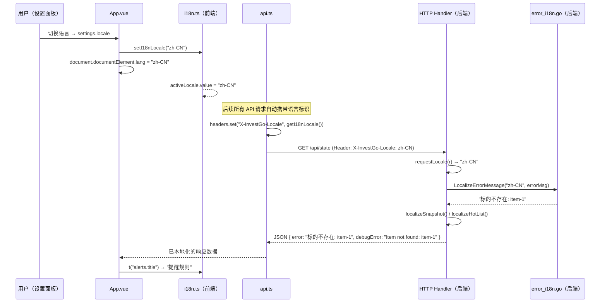

InvestGo 采用**前后端协同、无第三方依赖**的国际化方案：前端通过自建的翻译树（Translation Tree）与响应式 locale 状态覆盖全部 UI 文案，后端则基于精确匹配 + 前缀递归策略实现错误消息和行情源名称的实时本地化。两端通过 `X-InvestGo-Locale` HTTP Header 保持语言同步，用户切换语言后，UI 文案、API 错误消息、行情源描述和 Provider 名称全部即时刷新，无需重启应用。

Sources: [i18n.ts](frontend/src/i18n.ts#L1-L1110), [error_i18n.go](internal/api/i18n/error_i18n.go#L1-L217), [http.go](internal/api/http.go#L26-L293), [api.ts](frontend/src/api.ts#L1-L87)

## 整体架构：前后端协同的 i18n 数据流

系统的国际化不是简单的"前端翻译字典"，而是一个前后端协作的双向管道。后端在 API 层通过 `requestLocale()` 读取请求的语言标识，在序列化响应前将错误消息、行情源名称和行情源描述全部替换为目标语言版本。前端则维护一个完整的翻译树覆盖所有 UI 文案，并通过 `X-InvestGo-Locale` Header 将当前语言告知后端。



### 关键设计决策

| 设计点 | 选择 | 理由 |
|---|---|---|
| 前端 i18n 方案 | 自建，无 vue-i18n 依赖 | 桌面应用无需 SEO、无需 lazy-load locale；自建方案减少依赖体积，代码量可控 |
| 翻译数据存储 | 单文件 `i18n.ts` 内嵌 | 总计 ~1100 行双语数据，无需异步加载 JSON，启动即用 |
| 后端错误本地化 | API 层即时翻译 | 后端内部始终使用英文 canonical 错误，仅在序列化响应时翻译，确保日志与调试一致性 |
| 语言传递方式 | 自定义 HTTP Header `X-InvestGo-Locale` | 比 Cookie 更显式，比 URL 参数更无侵入性，前端每次请求自动附带 |
| Fallback 策略 | `当前 locale → zh-CN → key 原文` | zh-CN 作为开发母语是默认兜底，key 即路径（如 `alerts.title`）保证视觉可读 |

Sources: [i18n.ts](frontend/src/i18n.ts#L1055-L1110), [http.go](internal/api/http.go#L26-L29), [api.ts](frontend/src/api.ts#L37-L38), [App.vue](frontend/src/App.vue#L102-L114)

## 前端翻译系统

### 翻译树结构

翻译树以嵌套对象形式定义，采用**点号路径（dot-path）**寻址。顶层 key 是模块或功能域的名称（`common`、`app`、`settings`、`watchlist`、`hot` 等），子级 key 对应具体文案。树中任意深度都可以是 `string | TranslationTree` 的递归结构：

```
messages["zh-CN"]
├── common               # 通用操作词（添加、保存、取消...）
├── app                  # 应用级状态消息（加载、同步、保存结果...）
├── modules              # 侧栏模块名称
├── sidebar              # 侧栏标签
├── overview             # 资产概览模块
├── summary              # 顶部摘要条
├── settings             # 设置面板（标签、选项、预览、关于、免责声明）
│   ├── tabs             # 设置页签名称
│   ├── sections         # 设置分区名称
│   ├── labels           # 表单字段标签
│   ├── options          # 各字段的选项翻译
│   ├── themePreview     # 主题预览文案
│   ├── developer        # 开发者日志文案
│   └── about            # 关于页文案与免责声明
├── options              # 全局选项翻译（市场、时间范围、配色...）
├── holdings             # 持仓模块
├── alerts               # 提醒模块
├── hot                  # 热门榜单模块
├── watchlist            # 观察列表模块
├── chart                # 图表组件
├── dialogs              # 对话框（确认、标的编辑、提醒编辑、DCA 明细）
├── developerLogs        # 开发者日志操作
├── history              # 历史走势
└── api                  # API 客户端错误文案
```

`en-US` 与 `zh-CN` 共享完全相同的 key 结构。当前端调用 `t("overview.charts.category.title")` 时，引擎会沿路径逐级解析：`messages["zh-CN"] → overview → charts → category → title → "持仓分布"`。

Sources: [i18n.ts](frontend/src/i18n.ts#L6-L8), [i18n.ts](frontend/src/i18n.ts#L10-L532), [i18n.ts](frontend/src/i18n.ts#L533-L1052)

### 插值机制

文案中的 `{key}` 占位符通过正则替换实现参数化。这是整个 i18n 系统唯一的动态文案能力——所有带变量的文本都通过这一机制实现：

```typescript
// 使用示例（组件内）
t("summary.itemsSub", { count: 12 })       // "12 个标的"
t("app.quotesSyncedFxFailed", { error })   // "行情已同步，但汇率获取失败：timeout"
t("hot.loadedSummary", { count: 50, total: 200 })  // "当前已加载 50 / 200"
```

插值函数 `interpolate()` 使用 `/\{(\w+)\}/g` 正则，逐个匹配占位符并从 `params` 对象中取值。若参数缺失则保留原始 `{key}` 形式，避免显示空白。

Sources: [i18n.ts](frontend/src/i18n.ts#L1080-L1086)

### 公共 API 与响应式

前端 i18n 模块导出两个级别的接口——**直接函数**用于非组件上下文（composables、工具函数），**组合式函数** `useI18n()` 用于 Vue 组件：

| 导出 | 类型 | 使用场景 | 说明 |
|---|---|---|---|
| `translate(key, params?)` | 普通函数 | composables、工具函数 | 非响应式，读取当前 locale |
| `useI18n()` | Composable | Vue 组件 `<script setup>` | 返回响应式 `locale` ref、`isEnglish` computed 和 `t` 函数 |
| `setI18nLocale(locale)` | 普通函数 | App.vue 初始化 | 设置全局 locale 触发 UI 刷新 |
| `getI18nLocale()` | 普通函数 | api.ts 请求拦截器 | 读取当前 locale 用于 Header |

`activeLocale` 是一个 Vue `ref`，当 `setI18nLocale()` 被调用时更新。由于 `translate()` 每次调用都读取 `activeLocale.value`，而 Vue 模板中的 `t()` 调用在渲染函数中被追踪，因此 locale 变更会触发使用 `t()` 的组件自动重新渲染。

Sources: [i18n.ts](frontend/src/i18n.ts#L1055-L1110)

### Locale 解析与 Fallback 链

locale 设置支持三种值（由 `AppSettings.locale` 类型定义）：`"system"`、`"zh-CN"`、`"en-US"`。解析链如下：

```typescript
// settings 中 locale = "system" 时回退到浏览器语言
function resolveLocaleSetting(locale): SupportedLocale {
    if (locale === "system") return normalizeLocale(navigator.language || "zh-CN");
    return normalizeLocale(locale);
}

// 任何 zh 开头（zh、zh-CN、zh-TW、zh-Hans 等）统一映射为 zh-CN
function normalizeLocale(locale): SupportedLocale {
    return locale.toLowerCase().startsWith("zh") ? "zh-CN" : "en-US";
}
```

翻译查找的 Fallback 链为 `当前 locale → zh-CN → key 原文`，这意味着即使 en-US 翻译缺失，也会回退到中文，最终回退到 dot-path key（如 `"watchlist.title"`）作为可读兜底。

Sources: [i18n.ts](frontend/src/i18n.ts#L1055-L1101), [types.ts](frontend/src/types.ts#L123)

### 语言切换触发点

语言切换发生在两个时机：

1. **快照加载**（`applySnapshot`）：从后端获取初始设置后调用 `setI18nLocale(settings.value.locale)`，确保首次加载即使用正确语言。[App.vue](frontend/src/App.vue#L262)
2. **设置 watch**：`App.vue` 深度监听 `settings` ref，当 `settings.locale` 变更时立即调用 `setI18nLocale()` 并同步更新 `document.documentElement.lang` 属性，确保无障碍工具（屏幕阅读器）也能感知语言切换。[App.vue](frontend/src/App.vue#L102-L114)

两个触发点共同保证了无论语言来自初始加载还是用户手动切换，前端 UI 和 HTML lang 属性始终保持同步。

Sources: [App.vue](frontend/src/App.vue#L102-L114), [App.vue](frontend/src/App.vue#L257-L262)

## 后端错误消息本地化

### 设计理念：Canonical English + 翻译层

后端内部所有错误均以**英文 canonical 消息**产生（如 `"Item not found: item-1"`），这些消息在日志和调试场景中保持原样。仅在 HTTP API 的 `writeError()` 函数中，通过 `LocalizeErrorMessage()` 将英文消息翻译为用户语言后放入 `error` 字段，原始英文则保留在 `debugError` 字段中：

```json
// 当 locale = "zh-CN" 时的 API 错误响应
{
    "error": "标的不存在: item-1",
    "debugError": "Item not found: item-1"
}
```

这种设计确保前端可以直接将 `error` 字段展示给用户，同时开发者可通过 `debugError` 看到原始英文用于排查问题。当翻译后消息与原始消息相同时（如英文 locale），`debugError` 字段不会出现在响应中，减少传输体积。

Sources: [http.go](internal/api/http.go#L125-L138)

### 三层匹配策略

`localizeSingleError()` 函数按优先级依次尝试三种匹配方式：

**1. 精确匹配（`localizedExactMessages`）**

对于完全固定的错误消息，使用 map 直接查找。共定义了约 50 条精确映射，涵盖请求验证、参数校验、配置合法性检查等场景。例如 `"Symbol is required"` → `"股票代码不能为空"`、`"Theme mode must be one of: system / light / dark"` → `"外观模式仅支持 system / light / dark"`。

Sources: [error_i18n.go](internal/api/i18n/error_i18n.go#L8-L54)

**2. 正则模式匹配（预编译 `regexp.Regexp`）**

针对带有动态参数且结构复杂的错误消息，使用正则提取参数后重组。目前处理 4 种模式：

| 正则模式 | 示例输入 | 中文输出 |
|---|---|---|
| `Did not receive EastMoney quote for (.+) \((.+)\)` | `Did not receive EastMoney quote for 000001 (SZ)` | `未收到 000001 的东方财富行情 (SZ)` |
| `EastMoney history failed to resolve item (.+?): (.+)` | `...resolve item 000001.SZ: Invalid symbol` | `东方财富历史行情: 无法解析标的 000001.SZ: <递归翻译>` |
| `EastMoney history failed to resolve secid: (.+)` | `...resolve secid: bad-id` | `东方财富历史行情: 无法解析 secid: bad-id` |
| `(EastMoney\|Yahoo Finance): (.+)` | `EastMoney: timeout` | `东方财富: <递归翻译>` |

Sources: [error_i18n.go](internal/api/i18n/error_i18n.go#L119-L202)

**3. 前缀匹配（`localizedPrefixMessages`）**

对于 `固定前缀 + 动态后缀` 结构的消息（如 `"Yahoo quote request failed: timeout"`），使用前缀数组逐一匹配。这是最常见的匹配方式，定义了约 50 条前缀规则。关键特性是 **递归翻译标志**：当前缀条目的 `recursive` 字段为 `true` 时，截取后的 suffix 会被递归传入 `localizeSingleError()` 再次翻译，实现嵌套错误的完整本地化：

```
输入: "EastMoney history failed to resolve item 000001.SZ: Unrecognized symbol: INVALID"
1. 正则匹配 → suffix "Unrecognized symbol: INVALID" 递归翻译
2. 递归 → 前缀匹配 "Unrecognized symbol: " → suffix "INVALID"（非递归）
3. 最终: "东方财富历史行情: 无法解析标的 000001.SZ: 无法识别股票代码: INVALID"
```

Sources: [error_i18n.go](internal/api/i18n/error_i18n.go#L56-L117), [error_i18n.go](internal/api/i18n/error_i18n.go#L204-L216)

### 多错误合并与分隔符规范化

单条 API 错误消息可能包含多个子错误，以分号（`;` 或 `；`）分隔。`LocalizeErrorMessage()` 先通过 `splitProblemMessages()` 将消息拆分为独立子错误，逐个翻译后用中文分号（`；`）重新连接。对于英文 locale，仅做分隔符规范化（统一为 `"; "`），不执行翻译。这一机制通过测试用例验证：

```go
// TestLocalizeErrorMessageChinese
输入: "Item not found: item-1; EastMoney quote request failed: status 503"
输出: "标的不存在: item-1；东方财富行情请求失败: 状态码 503"
```

Sources: [error_i18n.go](internal/api/i18n/error_i18n.go#L136-L177), [error_i18n_test.go](internal/api/i18n/error_i18n_test.go#L1-L34)

## 行情源名称与描述本地化

后端不仅在错误消息层面做本地化，还对 API 响应中的**行情源名称和描述**进行语言适配。这一过程发生在 `localizeSnapshot()`、`localizeHistorySeries()` 和 `localizeHotList()` 三个函数中，在 JSON 序列化之前执行：

| 原始名称 | zh-CN 翻译 | 翻译场景 |
|---|---|---|
| EastMoney | 东方财富 | 摘要文本、图表来源、热门列表 |
| Yahoo Finance | 雅虎财经 | 同上 |
| Sina Finance | 新浪财经 | 摘要文本 |
| Xueqiu | 雪球 | 摘要文本 |
| Tencent Finance | 腾讯财经 | 摘要文本 |
| Alpha Vantage / Twelve Data / Finnhub / Polygon | 保持原名 | 国际服务名不需翻译 |

`localizeQuoteSourceDescription()` 为每个行情源提供中文功能描述（如 `"覆盖 A 股、港股和美股，字段最完整，适合作为默认综合行情源。"`），这些描述在设置面板的行情源选择器中展示。`localizeQuoteSourceSummary()` 则对摘要字符串中的所有行情源名称做批量替换，确保运行时状态文本中的 Provider 名称也被翻译。

Sources: [http.go](internal/api/http.go#L190-L282)

## 前端 API 客户端的 Header 传播

前端 `api.ts` 在每次请求中自动注入语言 Header，确保后端始终能获取当前 locale：

```typescript
headers.set("X-InvestGo-Locale", getI18nLocale());
```

后端 `requestLocale()` 函数按以下优先级解析语言标识：
1. `X-InvestGo-Locale` Header（前端主动设置）
2. `Accept-Language` Header（浏览器默认行为，fallback）
3. 默认值 `"en-US"`

这意味着即使在没有前端控制的环境中（如直接用 curl 调用 API），只要设置 `Accept-Language: zh-CN`，也能获得中文错误消息。

Sources: [api.ts](frontend/src/api.ts#L37-L38), [http.go](internal/api/http.go#L176-L188)

## 组件中的使用模式

### 在 Vue 组件中使用

所有需要文案的组件统一通过 `useI18n()` 组合式函数获取 `t` 函数。这是一个零参数的 composable，不需要在 `provide/inject` 层传递 locale——因为 `activeLocale` 是模块级 `ref`，所有 `t()` 调用共享同一个状态源：

```vue
<script setup>
import { useI18n } from "../../i18n";
const { t } = useI18n();
</script>
<template>
    <h2>{{ t("hot.title") }}</h2>
    <span>{{ t("hot.searchResults", { count: filtered.length, total: all.length }) }}</span>
</template>
```

整个项目中，约 16 个组件直接使用 `useI18n()`，涵盖所有模块视图（`HotModule`、`WatchlistModule`、`HoldingsModule`、`OverviewModule`、`AlertsModule`、`SettingsModule`）、所有对话框（`ItemDialog`、`AlertDialog`、`DCADetailDialog`、`ConfirmDialog`）以及布局组件（`AppShell`、`AppHeader`、`AppSidebar`、`SummaryStrip`、`PriceChart`）。

Sources: [i18n.ts](frontend/src/i18n.ts#L1103-L1109)

### 在 Composables 中使用

组合式函数由于不在 Vue 组件上下文中，直接使用 `translate()` 普通函数。这种"两种导出方式"的设计是有意为之：`useI18n()` 提供响应式绑定用于模板，`translate()` 提供纯函数调用用于逻辑层。项目中 4 个 composable 使用此模式：`useDeveloperLogs`、`useConfirmDialog`、`useHistorySeries`、`useItemDialog`。

Sources: [useDeveloperLogs.ts](frontend/src/composables/useDeveloperLogs.ts#L5), [useConfirmDialog.ts](frontend/src/composables/useConfirmDialog.ts#L2), [useHistorySeries.ts](frontend/src/composables/useHistorySeries.ts#L4), [useItemDialog.ts](frontend/src/composables/useItemDialog.ts#L10)

## 延伸阅读

- **[HTTP API 层设计与国际化错误处理](14-http-api-ceng-she-ji-yu-guo-ji-hua-cuo-wu-chu-li)**：后端 API 层如何组织路由、中间件和错误响应，i18n 是其中一环
- **[Vue 3 应用结构与 PrimeVue 集成](17-vue-3-ying-yong-jie-gou-yu-primevue-ji-cheng)**：前端组件如何组织，`useI18n()` 如何与组件生命周期配合
- **[组合式函数（Composables）设计模式](20-zu-he-shi-han-shu-composables-she-ji-mo-shi)**：`translate()` vs `useI18n()` 在 composable 设计中的取舍
- **[前端类型定义与后端类型对齐（TypeScript）](25-qian-duan-lei-xing-ding-yi-yu-hou-duan-lei-xing-dui-qi-typescript)**：`AppSettings.locale` 类型如何与后端配置字段对齐