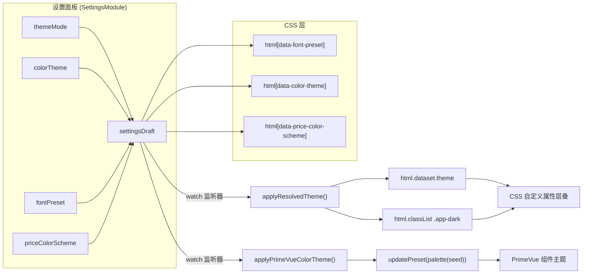

InvestGo 的主题系统采用**双层架构**：底层通过 CSS 自定义属性（Custom Properties）驱动应用自身的视觉表现，上层借助 PrimeVue Aura 主题预设 + `@primeuix/themes` 的 `palette()` 函数动态生成组件库配色。两层通过共享的 seed 色值保持一致，确保按钮、输入框等 PrimeVue 组件与应用面板、图表等自定义元素在视觉上无缝融合。整个系统由 `<html>` 元素的 `data-*` 属性控制切换，无需页面刷新即可实时生效。

Sources: [theme.ts](frontend/src/theme.ts#L1-L44), [style.css](frontend/src/style.css#L1-L39), [main.ts](frontend/src/main.ts#L1-L24)

## 架构总览

主题切换的数据流可以用下面的关系图来理解。用户在设置面板修改外观偏好 → `settingsDraft` 响应式对象变化 → App.vue 中的 `watch` 监听器同步更新 DOM 属性和 PrimeVue preset → CSS 自定义属性层叠生效：



核心设计决策是将所有外观状态映射到 `<html>` 元素的 **data 属性** 而非 CSS class，这样做的好处是：每个维度（模式 / 配色 / 字体 / 涨跌色）独立控制，选择器可精确组合，例如 `html[data-theme="dark"][data-color-theme="rose"]` 可以同时限定暗色模式 + 玫瑰色主题。

Sources: [App.vue](frontend/src/App.vue#L116-L142), [App.vue](frontend/src/App.vue#L223-L234), [theme.ts](frontend/src/theme.ts#L37-L43)

## 暗色模式：三级切换与系统跟随

### ThemeMode 类型与默认值

`ThemeMode` 定义了三种模式：`"system"`（跟随操作系统）、`"light"`（强制亮色）、`"dark"`（强制暗色），默认值为 `"system"`。

| 模式值 | 行为 | DOM 表现 |
|--------|------|----------|
| `"system"` | 监听 `prefers-color-scheme` 媒体查询，自动跟随 OS 切换 | `data-theme="light"` 或 `data-theme="dark"`（由运行时解析） |
| `"light"` | 始终亮色，忽略 OS 偏好 | `data-theme="light"` + 不添加 `.app-dark` |
| `"dark"` | 始终暗色，忽略 OS 偏好 | `data-theme="dark"` + 添加 `.app-dark` |

Sources: [types.ts](frontend/src/types.ts#L10), [forms.ts](frontend/src/forms.ts#L9)

### 解析逻辑：resolvedTheme()

当 `themeMode` 为 `"system"` 时，`resolvedTheme()` 函数通过 `window.matchMedia("(prefers-color-scheme: dark)")` 判定当前 OS 偏好并返回 `"light"` 或 `"dark"`。若用户显式选择了 `"light"` 或 `"dark"`，则直接返回该值，不做任何媒体查询。

```typescript
function resolvedTheme(themeMode: AppSettings["themeMode"]): "light" | "dark" {
    if (themeMode === "light" || themeMode === "dark") {
        return themeMode;
    }
    return matchMediaList.matches ? "dark" : "light";
}
```

Sources: [App.vue](frontend/src/App.vue#L223-L228)

### DOM 应用与系统主题同步

`applyResolvedTheme()` 执行两个关键操作：设置 `document.documentElement.dataset.theme`（驱动 CSS 自定义属性层叠），以及切换 `.app-dark` class（驱动 PrimeVue 暗色模式选择器，配置于 `main.ts` 中的 `darkModeSelector: ".app-dark"`）。

应用启动时通过 `matchMedia("prefers-color-scheme: dark").addEventListener("change", syncThemeMode)` 注册了系统主题变更监听器。当 OS 在亮色与暗色之间切换时，`syncThemeMode()` 自动重新调用 `applyResolvedTheme()`，确保桌面端窗口外观始终与系统同步——这仅在 `themeMode === "system"` 时生效，因为 `resolvedTheme()` 在显式模式下直接返回固定值。

Sources: [App.vue](frontend/src/App.vue#L207-L234), [main.ts](frontend/src/main.ts#L14-L21)

### CSS 层叠策略

[style.css](frontend/src/style.css) 采用了**三层 CSS 规则**实现暗色模式，优先级从低到高：

1. **`:root` 默认声明**（L1-L39）：定义亮色模式的全套变量
2. **`@media (prefers-color-scheme: dark)` 媒体查询**（L41-L73）：在 OS 为暗色时覆盖变量
3. **`html[data-theme="dark"]` 显式属性选择器**（L76-L107）：强制暗色，优先级高于媒体查询
4. **`html[data-theme="light"]` 显式属性选择器**（L110-L142）：强制亮色，覆盖媒体查询的暗色结果

这种设计保证了：当 `themeMode` 为 `"system"` 且无显式 `data-theme` 属性时，媒体查询自然生效；当用户手动选择后，显式选择器以更高优先级覆盖媒体查询。配色主题在暗色模式下的变体也遵循同样的双重策略——既有 `@media (prefers-color-scheme: dark)` 下的规则，也有 `html[data-theme="dark"]` 下的显式规则。

Sources: [style.css](frontend/src/style.css#L1-L142), [style.css](frontend/src/style.css#L278-L306)

## 配色方案：七种主题色与 PrimeVue 联动

### 色彩种子与调色板生成

系统为每种配色方案定义了一个 **seed 色值**，同时用于两个层面：

| 配色方案 | Seed 色值 | 用途 |
|----------|-----------|------|
| `blue` | `#355f96` | 默认主题，冷色调蓝 |
| `graphite` | `#627588` | 石墨灰，沉稳中性 |
| `forest` | `#2f7d69` | 森林绿，自然沉稳 |
| `sunset` | `#c36f37` | 日落橙，温暖活力 |
| `rose` | `#b84c6e` | 玫瑰粉，柔和中性 |
| `violet` | `#6b4fc8` | 紫罗兰，优雅深邃 |
| `amber` | `#a87928` | 琥珀金，经典沉稳 |

在 PrimeVue 层面，`theme.ts` 导出的 `investGoPreset` 以 Aura 为基础预设，通过 `palette(themeSeeds.blue)` 生成默认的 primary 调色板。当用户切换配色时，`applyPrimeVueColorTheme()` 调用 `updatePreset()` 动态替换整个 primary 调色板——`palette()` 函数会从 seed 色值自动派生出 50-950 共 11 个色阶，供 PrimeVue 组件的 hover、focus、selected 等状态使用。

Sources: [theme.ts](frontend/src/theme.ts#L1-L43), [constants.ts](frontend/src/constants.ts#L89-L98)

### CSS 自定义属性映射

每种配色方案通过 `html[data-color-theme="<name>"]` 选择器覆盖三个核心 CSS 变量：

- **`--accent`**：主强调色，用于按钮、选中态、焦点环等
- **`--accent-strong`**：强强调色，用于高对比文字（如标签页选中态）
- **`--accent-soft`**：柔和强调色（带透明度），用于背景、hover 态
- **`--selection-bg`**：文本选中背景色

暗色模式下，每种配色方案还有一组对应的明亮化变体（例如 `blue` 在暗色模式下 `--accent` 从 `#355f96` 变为 `#8db5ea`），通过 `html[data-theme="dark"][data-color-theme="<name>"]` 选择器叠加。这确保了暗色背景下强调色仍然有足够的对比度和辨识度。

Sources: [style.css](frontend/src/style.css#L144-L242)

### 设置面板色板选择器

设置面板的配色选择并非下拉菜单，而是**圆形色板按钮组**。每个按钮通过 `--swatch-color` CSS 变量（值为该配色的 light-mode seed 色）设置背景色，选中态通过 `border-color: var(--ink)` 和放大缩放效果（`transform: scale(1.1)`）给予视觉反馈。色板定义位于 `COLOR_THEME_SWATCHES` 常量中，与 `theme.ts` 中的 `themeSeeds` 保持一致。

Sources: [SettingsModule.vue](frontend/src/components/modules/SettingsModule.vue#L209-L221), [SettingsModule.vue](frontend/src/components/modules/SettingsModule.vue#L520-L548), [constants.ts](frontend/src/constants.ts#L89-L98)

### 主题预览面板

设置面板底部内嵌了一个实时预览区域 `.settings-theme-preview`，展示当前配色下的三个关键色彩——强调色、涨色、跌色——以及三种 PrimeVue 按钮样式（实心、描边、文字）。预览区域通过 `color-mix()` CSS 函数将 `--accent-soft` 与面板背景混合，营造微妙的渐变效果。由于外观 watcher 在设置面板打开时绑定到 `settingsDraft`，用户修改配色后预览区会立即更新。

Sources: [SettingsModule.vue](frontend/src/components/modules/SettingsModule.vue#L244-L259), [SettingsModule.vue](frontend/src/components/modules/SettingsModule.vue#L549-L615)

## 字体预设：三套排版方案

`fontPreset` 设置项提供三种字体方案，通过 `html[data-font-preset="<name>"]` 选择器覆盖两个 CSS 变量：`--font-ui`（界面字体）和 `--font-display`（标题/展示字体）。

| 预设名 | `--font-ui` | `--font-display` | 风格定位 |
|--------|------------|-----------------|---------|
| `system` | SF Pro Text, PingFang SC | Avenir Next, PingFang SC | macOS 原生系统字体栈，默认选项 |
| `compact` | IBM Plex Sans, PingFang SC | IBM Plex Sans, PingFang SC | 等宽视觉风格，UI 与标题统一 |
| `reading` | Source Han Serif SC, Noto Serif CJK SC, Songti SC | Iowan Old Style, Source Han Serif SC | 衬线字体，长文阅读友好 |

三套方案都包含 PingFang SC 或思源宋体等中文 fallback 字体，确保中英文混排时不会出现字体断层。`reading` 方案的设计意图是为偏好传统印刷质感的用户提供一种区别于系统无衬线字体的选择。

Sources: [style.css](frontend/src/style.css#L251-L264), [types.ts](frontend/src/types.ts#L119)

## 涨跌配色方案：CN 与国际标准

InvestGo 支持两种涨跌配色方案，满足不同市场用户的视觉习惯：

| 方案 | `--rise`（涨）亮色 | `--fall`（跌）亮色 | `--rise`（涨）暗色 | `--fall`（跌）暗色 | 适用市场 |
|------|-------------------|-------------------|-------------------|-------------------|---------|
| `cn` | `#d14343`（红） | `#198754`（绿） | `#fb7185`（粉红） | `#34d399`（翠绿） | A 股、港股 |
| `intl` | `#198754`（绿） | `#d14343`（红） | `#34d399`（翠绿） | `#fb7185`（粉红） | 美股、国际市场 |

CN 方案遵循**红涨绿跌**的中国/东亚惯例，intl 方案遵循**绿涨红跌**的国际惯例。CSS 层通过 `html[data-price-color-scheme="intl"]` 选择器反转 `--rise` 和 `--fall` 的赋值，暗色模式同样有对应的覆盖规则。这些变量被 `.tone-rise`、`.tone-fall` 等语义 class 引用，确保表格、图表 tooltip、指标卡片中的涨跌色统一可控。

Sources: [style.css](frontend/src/style.css#L266-L276), [style.css](frontend/src/style.css#L466-L481)

## 设置预览机制：Draft 与 Live 切换

一个关键的交互设计是**设置草稿**（`settingsDraft`）机制。当用户进入设置面板时，`activeModule` watcher 将当前持久化的 `settings` 复制到 `settingsDraft`。外观 watcher 根据当前是否在设置面板内决定绑定哪个数据源：

```typescript
const appearance =
    activeModule.value === "settings" ? settingsDraft : settings.value;
```

这意味着用户在设置面板中修改配色、字体、暗色模式时，`settingsDraft` 的变化会立即反映到界面上（实时预览），但持久化的 `settings` 不受影响。当用户取消设置时，`activeModule` 切回 `"overview"`，watcher 重新绑定 `settings`，界面自动恢复到保存前的状态。只有点击"保存"后，`saveSettings()` 才将 `settingsDraft` 提交到后端并通过 `applySnapshot()` 更新 `settings`。

Sources: [App.vue](frontend/src/App.vue#L116-L150), [App.vue](frontend/src/App.vue#L386-L399)

## CSS 变量全景与设计语义

以下表格汇总了主题系统中所有核心 CSS 自定义变量的语义和用途：

| 变量名 | 语义 | 使用场景 |
|--------|------|---------|
| `--app-bg` / `--app-bg-bottom` | 应用背景渐变 | `body` 的 `linear-gradient` |
| `--chrome-bg` | 窗口级背景 | 标题栏、状态栏 |
| `--panel-bg` / `--panel-strong` / `--panel-soft` | 面板背景层级 | 卡片、对话框、侧栏 |
| `--control-bg` / `--control-bg-hover` / `--control-overlay` | 控件背景 | 输入框、下拉框、弹出层 |
| `--border` / `--border-strong` | 边框强度 | 卡片边框、表格分隔线、对话框边框 |
| `--shadow` / `--shadow-soft` | 阴影层次 | 对话框投影、表格行内嵌阴影 |
| `--ink` / `--muted` | 文字色层级 | 主文字 / 次要说明文字 |
| `--accent` / `--accent-strong` / `--accent-soft` | 强调色三档 | 选中态、焦点环、按钮背景 |
| `--rise` / `--fall` / `--warn` | 语义色 | 涨跌标记、警告提示 |
| `--selection-bg` | 文本选中背景 | 用户选择文本时的底色 |
| `--chart-1` ~ `--chart-8` | 图表色板 | 概览页饼图等多色序列 |
| `--font-ui` / `--font-display` | 字体栈 | 界面文字 / 标题展示 |
| `--radius-shell` / `--radius-panel` / `--radius-control` / `--radius-micro` | 圆角层级 | 窗口级 / 面板 / 控件 / 微元素 |

这套变量体系的设计哲学是**语义命名 + 亮暗双值**：每个变量名描述的是"用途"而非"外观"，亮色和暗色模式分别提供不同的色值，切换时只需改变变量赋值，无需修改任何引用方的 CSS。

Sources: [style.css](frontend/src/style.css#L1-L39), [overrides.css](frontend/src/styles/overrides.css#L1-L125)

## PrimeVue 组件主题定制

除了配色方案，`investGoPreset` 还对 PrimeVue **Button** 组件进行了尺寸微调——减小了默认内边距（`paddingX: 0.875rem`），设置了小号按钮的字号和图标宽度，使按钮更紧凑以适配桌面端密度较高的信息布局。这些组件级覆盖通过 `definePreset(Aura, { components: { ... } })` 合并到 Aura 基础预设上，不影响其他 PrimeVue 组件。

[overrides.css](frontend/src/styles/overrides.css) 则进一步将所有 PrimeVue 表单控件（Select、InputNumber、InputText、Textarea）的圆角统一为 `var(--radius-control)`，背景色和边框色也映射到应用级的 `--control-bg` 和 `--border-strong`，焦点环则使用 `color-mix()` 混合 `--accent` 与 `--border-strong`——这使得 PrimeVue 原生组件在视觉上与自定义主题完全融合。

Sources: [theme.ts](frontend/src/theme.ts#L16-L35), [overrides.css](frontend/src/styles/overrides.css#L1-L65)

## 延伸阅读

- [Vue 3 应用结构与 PrimeVue 集成](17-vue-3-ying-yong-jie-gou-yu-primevue-ji-cheng)——PrimeVue 在应用初始化阶段的完整配置
- [组合式函数（Composables）设计模式](20-zu-he-shi-han-shu-composables-she-ji-mo-shi)——响应式状态管理模式的通用范式
- [模块化视图：Watchlist、Holdings、Overview、Hot、Alerts、Settings](21-mo-kuai-hua-shi-tu-watchlist-holdings-overview-hot-alerts-settings)——Settings 模块的完整视图结构
- [前端类型定义与后端类型对齐（TypeScript）](25-qian-duan-lei-xing-ding-yi-yu-hou-duan-lei-xing-dui-qi-typescript)——`AppSettings` 类型中主题字段的完整定义