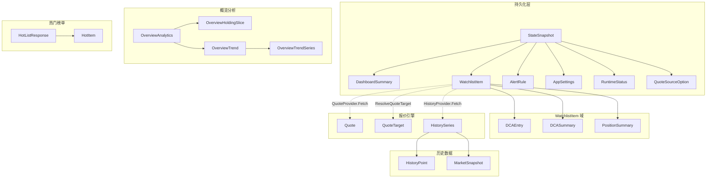

`model.go` 是 investGo 后端的**类型宪法**——它定义了贯穿整个应用的所有核心结构体、枚举常量与接口契约。这个文件不长（388 行），但每一条类型声明都直接影响 Store 持久化、API 序列化、Provider 路由和前端渲染四个层次的数据流转。理解这些模型之间的关系，是理解整个系统行为的基础。

Sources: [model.go](internal/core/model.go#L1-L388)

## 类型全景与关系图谱

下面的 Mermaid 图展示了 `model.go` 中所有核心类型之间的组合与依赖关系。箭头从「包含方」指向「被包含方」，实线表示结构体字段组合，虚线表示接口实现关系。



Sources: [model.go](internal/core/model.go#L1-L388)

## WatchlistItem：统一的追踪条目

**`WatchlistItem`** 是整个系统最核心的结构体，它同时承载「观察列表」和「持仓」两种语义。前端通过 `Quantity` 是否为零、`DCAEntries` 是否为空来判断一个条目属于哪种视图——这种**单一类型双态设计**避免了维护两套平行的数据结构。

| 字段分组 | 字段 | 类型 | 说明 |
|---------|------|------|------|
| **身份标识** | `ID` | `string` | 系统生成的唯一 ID（`item-` 前缀 + 12 位 hex） |
| | `Symbol` | `string` | 用户输入的原始代码，如 `09988.HK`、`VOO` |
| | `Name` | `string` | 证券名称，优先从行情源获取，回退到 Symbol |
| | `Market` | `string` | 规范化市场标识，如 `CN-A`、`HK-MAIN`、`US-ETF` |
| | `Currency` | `string` | 交易币种，如 `CNY`、`HKD`、`USD` |
| **持仓数据** | `Quantity` | `float64` | 持有份额，0 表示仅观察 |
| | `CostPrice` | `float64` | 用户记录的成本价 |
| | `AcquiredAt` | `*time.Time` | 建仓时间（可空） |
| **实时行情** | `CurrentPrice` | `float64` | 最新价，由 Provider 刷新 |
| | `PreviousClose` / `OpenPrice` / `DayHigh` / `DayLow` | `float64` | 日内价格区间 |
| | `Change` / `ChangePercent` | `float64` | 涨跌额 / 涨跌幅 |
| | `QuoteSource` | `string` | 行情来源标识 |
| | `QuoteUpdatedAt` | `*time.Time` | 最近一次行情更新时间 |
| **用户标注** | `PinnedAt` | `*time.Time` | 置顶时间，非空则排序优先 |
| | `Thesis` | `string` | 投资笔记 |
| | `Tags` | `[]string` | 自定义标签集 |
| **DCA 定投** | `DCAEntries` | `[]DCAEntry` | 定投记录列表 |
| | `DCASummary` | `*DCASummary` | 服务端计算的 DCA 聚合指标 |
| **持仓摘要** | `Position` | `*PositionSummary` | 服务端计算的持仓指标 |
| **元数据** | `UpdatedAt` | `time.Time` | 最后修改时间 |

`WatchlistItem` 还附带四个**计算方法**（非持久化，纯逻辑）：`CostBasis()` 返回 `Quantity × CostPrice`，`MarketValue()` 返回 `Quantity × CurrentPrice`，`UnrealisedPnL()` 返回二者之差，`UnrealisedPnLPct()` 返回百分比形式。这些方法在 [enrichment.go](internal/core/store/enrichment.go) 中被 `buildPositionSummary` 调用，计算结果注入到 `Position` 字段后传给前端。

Sources: [model.go](internal/core/model.go#L50-L101), [enrichment.go](internal/core/store/enrichment.go#L74-L83)

## DCA 定投子系统

**DCA（Dollar-Cost Averaging，定投）** 子系统由三层结构体组成，形成从原始记录到聚合摘要的数据管线。

**`DCAEntry`** 代表单次买入记录，核心字段包括 `Amount`（投入金额）、`Shares`（买入份额）、`Price`（手动输入单价，可选）、`Fee`（手续费）。其中 `EffectivePrice` 是服务端计算的**有效单价**：如果用户填写了 `Price` 且 `Shares > 0`，直接使用；否则通过 `(Amount - Fee) / Shares` 反推。这个计算逻辑在 `normalizeDCAEntries` 和 `decorateDCAEntries` 中执行。

Sources: [model.go](internal/core/model.go#L17-L26), [validation.go](internal/core/store/validation.go#L51-L86), [enrichment.go](internal/core/store/enrichment.go#L7-L33)

**`DCASummary`** 是所有有效 DCA 条目的聚合视图，由 `buildDCASummary` 在每次生成快照时实时计算。关键字段的计算方式如下：

| 字段 | 计算公式 |
|------|---------|
| `Count` | 有效条目数（`Amount > 0 && Shares > 0`） |
| `AverageCost` | `Σ(EffectivePrice × Shares) / Σ(Shares)` |
| `CurrentValue` | `TotalShares × CurrentPrice` |
| `PnL` | `CurrentValue - Σ(EffectivePrice × Shares)` |
| `PnLPct` | `PnL / Σ(EffectivePrice × Shares) × 100` |
| `HasCurrentPrice` | `CurrentPrice > 0` |

Sources: [model.go](internal/core/model.go#L29-L39), [enrichment.go](internal/core/store/enrichment.go#L36-L71)

## PositionSummary 与持仓指标

**`PositionSummary`** 是 `WatchlistItem` 的服务端派生字段，在快照生成时通过 `buildPositionSummary` 注入。它桥接了「简单持仓」（Quantity × CostPrice）和「DCA 定投」两种成本核算方式——但注意，它始终基于 `WatchlistItem` 自身的 `CostBasis()` / `MarketValue()` 计算，DCA 条目的成本通过上游的 `normalizeDCAEntries` 回写到 `item.CostPrice`。

`HasPosition` 字段是前端的**路由信号**：当它为 `true` 时，该条目在 Holdings 视图中展示完整持仓卡片；为 `false` 时，仅在 Watchlist 视图中以观察条目形式出现。

Sources: [model.go](internal/core/model.go#L42-L48), [enrichment.go](internal/core/store/enrichment.go#L74-L83)

## AlertRule：价格预警规则

**`AlertRule`** 定义了基于价格的预警触发规则，通过 `AlertCondition` 枚举（`"above"` 或 `"below"`）和 `Threshold` 阈值组成条件表达式。每条规则通过 `ItemID` 关联到特定的 `WatchlistItem`。

预警触发评估在 `evaluateAlertsLocked` 中执行，逻辑极其简洁：对于 `AlertAbove`，当 `CurrentPrice >= Threshold` 时触发；对于 `AlertBelow`，当 `CurrentPrice <= Threshold` 时触发。触发后设置 `Triggered = true` 并记录 `LastTriggeredAt`。这个评估在**每次行情刷新后自动执行**——不是定时任务，而是事件驱动。

Sources: [model.go](internal/core/model.go#L8-L14), [model.go](internal/core/model.go#L103-L114), [state.go](internal/core/store/state.go#L132-L165)

## AppSettings：全量应用配置

**`AppSettings`** 是一个扁平化的配置结构体，所有字段都通过 JSON 序列化持久化到磁盘。按照功能域可分为以下几组：

| 功能域 | 字段 | 合法值 / 默认值 |
|--------|------|----------------|
| **行情源选择** | `CNQuoteSource` / `HKQuoteSource` / `USQuoteSource` | 默认 `sina` / `xueqiu` / `yahoo` |
| **热门缓存** | `HotCacheTTLSeconds` | ≥ 10 秒，默认 60 |
| **外观** | `ThemeMode` | `system` / `light` / `dark` |
| | `ColorTheme` | `blue` / `graphite` / `forest` / `sunset` / `rose` / `violet` / `amber` |
| | `FontPreset` | `system` / `compact` / `reading` |
| **显示偏好** | `AmountDisplay` | `full` / `compact` |
| | `CurrencyDisplay` | `symbol` / `code` |
| | `PriceColorScheme` | `cn`（红涨绿跌）/ `intl`（绿涨红跌） |
| | `DashboardCurrency` | `CNY` / `HKD` / `USD` |
| **语言与区域** | `Locale` | `system` / `zh-CN` / `en-US` |
| **网络代理** | `ProxyMode` | `none` / `system` / `custom` |
| | `ProxyURL` | `custom` 模式下必填合法 URL |
| **API 密钥** | `AlphaVantageAPIKey` / `TwelveDataAPIKey` / `FinnhubAPIKey` / `PolygonAPIKey` | 选用对应行情源时必填 |
| **实验性** | `DeveloperMode` / `UseNativeTitleBar` | 布尔开关 |

配置更新的核心设计是**合并补丁模式**：`sanitiseSettings` 接收用户输入和当前配置，仅覆盖非空字段，然后对合并结果执行全量校验。这意味着前端可以只发送需要变更的字段，而不必传输整个设置对象。

Sources: [model.go](internal/core/model.go#L117-L138), [settings_sanitize.go](internal/core/store/settings_sanitize.go#L12-L183)

## DashboardSummary：仪表盘聚合

**`DashboardSummary`** 是 Store 在快照生成阶段计算的投资组合全局摘要。它的数据来源横跨所有 `WatchlistItem` 和 `AlertRule`，并通过 [汇率服务](12-hui-lv-fu-wu-frankfurter-api-yu-duo-bi-chong-zhe-suan) 折算到统一的 `DisplayCurrency`。

关键的计算逻辑在 `buildDashboard` 函数中：遍历所有条目，将每条的 `CostBasis` 和 `MarketValue` 按汇率折算后累加，得到 `TotalCost` 和 `TotalValue`；`WinCount` / `LossCount` 仅统计 `Quantity > 0 && CostPrice > 0` 的持仓条目；`TriggeredAlerts` 统计所有已触发的预警规则数。

Sources: [model.go](internal/core/model.go#L141-L151), [snapshot.go](internal/core/store/snapshot.go#L78-L123)

## OverviewAnalytics：投资组合分析

Overview 模块的类型层次形成一棵三层的树：`OverviewAnalytics` 包含 `Breakdown`（饼图数据）和 `Trend`（堆叠面积图数据），`Trend` 又包含多条 `Series`。

**`OverviewHoldingSlice`** 代表饼图中的单个扇区——一个持仓品种在组合中的权重和市值。`Value` 是折算到 `DisplayCurrency` 后的市值，`Weight` 是占组合总市值的百分比。

**`OverviewTrendSeries`** 代表堆叠面积图中的单条时间序列，`Values` 数组的长度与 `OverviewTrend.Dates` 数组对齐。`FirstBuyDate` 标识该品种首次买入的时间点，在此之前 `Values` 中的对应位置为 0。

Sources: [model.go](internal/core/model.go#L153-L193)

## 热门榜单类型族

热门榜单的枚举和结构体设计遵循**分类 → 排序 → 分页响应**的三段式模式：

**`HotCategory`** 定义了 8 个榜单分类，覆盖 A 股、港股、美股的主板和 ETF 市场。**`HotSort`** 定义了 5 种排序维度（成交量、涨幅、跌幅、市值、价格）。**`HotItem`** 是榜单中单条股票的完整数据，字段与 `Quote` 结构体高度同构（都包含 `Symbol`、`CurrentPrice`、`Change` 等行情字段），但 `HotItem` 专门服务于热门榜单场景，额外包含 `Volume` 和 `MarketCap`。

**`HotListResponse`** 是标准的分页响应封装，包含 `Page`/`PageSize`/`Total`/`HasMore` 四个分页元数据字段，以及 `Cached`/`CacheExpiresAt` 缓存状态标记。

Sources: [model.go](internal/core/model.go#L196-L247)

## 历史数据与 K 线

**`HistoryInterval`** 枚举定义了 7 个时间窗口（从 `1h` 到 `all`），每个窗口对应不同的 K 线粒度。**`HistoryPoint`** 是标准 OHLCV 数据点（开、高、低、收、量），时间戳精确到秒。

**`HistorySeries`** 是一次历史数据请求的完整响应，不仅包含 `Points` 数组，还预计算了 `StartPrice`/`EndPrice`/`High`/`Low`/`Change`/`ChangePercent` 六个聚合指标。`Source` 字段标识实际提供数据的 Provider（经过 [HistoryRouter 降级链](10-historyrouter-li-shi-shu-ju-jiang-ji-lian-yu-shi-chang-gan-zhi-lu-you)后可能与用户选择的源不同）。

**`MarketSnapshot`** 是一个可选的附加层，挂在 `HistorySeries` 上。它由 `buildMarketSnapshot` 函数计算，将**实时行情**与**历史序列起点**进行交叉对比，产出一组「叠加了持仓视角」的市场指标，包括振幅百分比（`AmplitudePct`）、持仓盈亏（`PositionPnL`/`PositionPnLPct`）等。当 K 线图需要同时展示持仓成本线时，这些字段直接提供计算结果。

Sources: [model.go](internal/core/model.go#L249-L294), [enrichment.go](internal/core/store/enrichment.go#L94-L163)

## Quote 与 Provider 接口契约

**`Quote`** 是 Provider 层的内部数据结构，承载从外部 API 获取的实时行情。它**没有** JSON tag——这意味着它不直接序列化给前端，而是通过 `applyQuoteToItem` 函数逐字段写入 `WatchlistItem`，再由后者序列化输出。这种设计将 Provider 的数据格式与 API 响应格式解耦。

**`QuoteProvider`** 接口定义了所有实时行情源必须实现的统一契约：

```go
type QuoteProvider interface {
    Fetch(ctx context.Context, items []WatchlistItem) (map[string]Quote, error)
    Name() string
}
```

`Fetch` 接收一批 `WatchlistItem`，返回以 `QuoteTarget.Key` 为键的 Quote 映射。批量化的签名允许 Provider 在单次网络请求中获取多个证券的行情。

**`HistoryProvider`** 接口类似，但针对历史数据场景：

```go
type HistoryProvider interface {
    Fetch(ctx context.Context, item WatchlistItem, interval HistoryInterval) (HistorySeries, error)
    Name() string
}
```

**`QuoteTarget`** 是行情解析管线的核心中间产物——它是 `WatchlistItem` 经过 [行情解析器](9-xing-qing-jie-xi-qi-duo-shi-chang-dai-ma-gui-fan-hua) 规范化后的**标准市场身份**。`Key` 字段（如 `600519.SH`、`09988.HK`、`VOO`）是 Provider 层查找行情数据的统一键。

Sources: [model.go](internal/core/model.go#L320-L374), [helper.go](internal/core/store/helper.go#L14-L27)

## StateSnapshot：前后端状态契约

**`StateSnapshot`** 是前后端之间的**完整状态传输单元**——每次 API 调用返回的都是这个结构体的 JSON 序列化。它将持久化状态（`Items`、`Alerts`、`Settings`）与运行时状态（`Runtime`、`Dashboard`）合并为一个原子快照。

Sources: [model.go](internal/core/model.go#L309-L318)

快照的构建流程体现了**读写分离**的设计思想：`snapshotLocked` 首先克隆持久化状态的条目列表，然后对条目执行排序（置顶优先 → 更新时间降序）和**派生字段注入**（`decorateItemDerived`），最后调用 `buildDashboard` 计算仪表盘数据。整个过程持有写锁，确保快照的一致性。为了性能，快照结果按 `state.UpdatedAt` 时间戳缓存，只有状态变更后才重新构建。

Sources: [snapshot.go](internal/core/store/snapshot.go#L20-L75)

## JSON 序列化设计模式

`model.go` 中的序列化设计遵循几个一致性模式：

**`omitempty` 策略**：时间指针字段（`AcquiredAt`、`QuoteUpdatedAt`、`PinnedAt`、`CacheExpiresAt` 等）统一使用 `omitempty`，零值时不序列化，减少网络传输量。而 `float64` 字段不使用 `omitempty`——因为 `0` 是有意义的业务值（如 `CostPrice = 0` 表示未设成本价），前端需要区分「未设置」和「为零」。

**指针语义**：`*time.Time` 指针类型用于表达「尚未发生」的业务语义——`QuoteUpdatedAt` 为 nil 表示从未收到过行情，`PinnedAt` 为 nil 表示未置顶，`LastTriggeredAt` 为 nil 表示预警从未触发过。

**无 JSON tag 的内部类型**：`Quote` 和 `QuoteTarget` 不带 JSON tag，明确标识它们是后端内部数据，不直接暴露给前端。

Sources: [model.go](internal/core/model.go#L1-L388)

## 默认值常量

`model.go` 底部定义了三个市场默认行情源常量，它们作为配置缺失时的回退值：

| 常量 | 值 | 含义 |
|------|----|------|
| `DefaultCNQuoteSourceID` | `"sina"` | A 股默认使用新浪行情 |
| `DefaultHKQuoteSourceID` | `"xueqiu"` | 港股默认使用雪球行情 |
| `DefaultUSQuoteSourceID` | `"yahoo"` | 美股默认使用 Yahoo Finance |

这些常量在 Store 初始化（`seedState`）和配置规范化（`normaliseLocked`）两个入口处被引用，确保系统在任何状态下都有有效的行情源配置。

Sources: [model.go](internal/core/model.go#L323-L327), [seed.go](internal/core/store/seed.go#L67-L69)

## 延伸阅读

- **前端如何消费这些类型**：参见 [前端类型定义与后端类型对齐（TypeScript）](25-qian-duan-lei-xing-ding-yi-yu-hou-duan-lei-xing-dui-qi-typescript)
- **类型如何被持久化和恢复**：参见 [Store：核心状态管理与持久化](7-store-he-xin-zhuang-tai-guan-li-yu-chi-jiu-hua)
- **QuoteTarget 的规范化解析过程**：参见 [行情解析器：多市场代码规范化](9-xing-qing-jie-xi-qi-duo-shi-chang-dai-ma-gui-fan-hua)
- **派生字段的实际计算代码**：参见 [投资组合概览分析：Breakdown 与 Trend 计算](13-tou-zi-zu-he-gai-lan-fen-xi-breakdown-yu-trend-ji-suan)