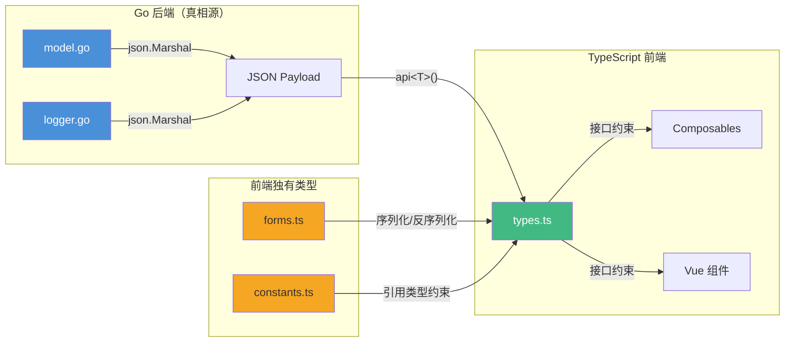
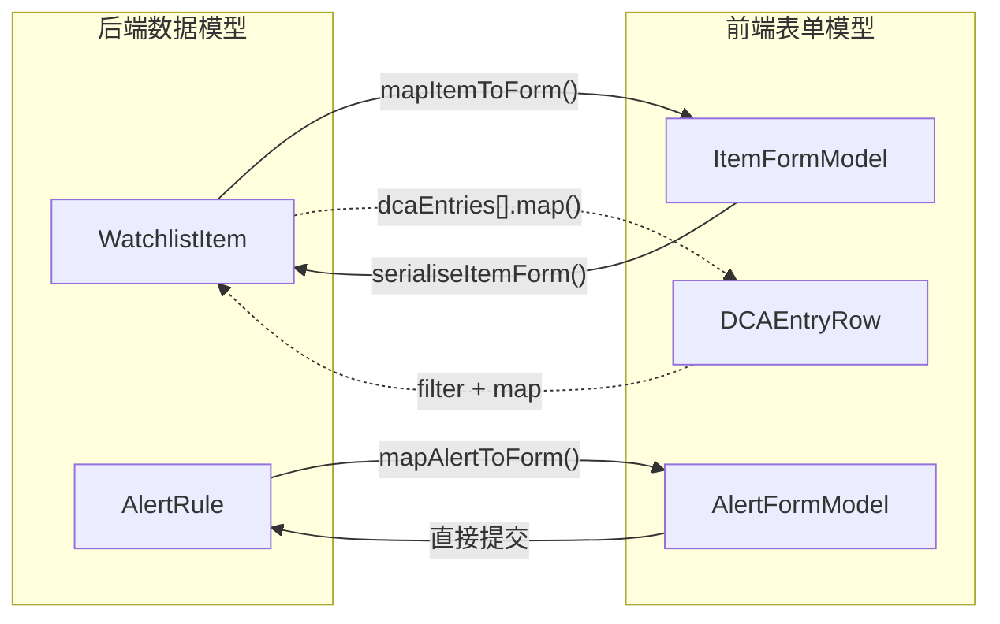

InvestGo 采用 **Wails 桌面应用架构**，后端以 Go 提供数据服务、前端以 Vue 3 + TypeScript 消费 JSON API。两端之间的契约通过**结构体字段名与 JSON tag 的一一映射**来保证一致性——Go 的 `json:"fieldName"` 标签决定了 JSON 键名，TypeScript 接口以同名属性接收。本文档解析前端 `[types.ts](frontend/src/types.ts)` 中每一个类型如何与后端 `[model.go](internal/core/model.go)` 和 `[logger.go](internal/logger/logger.go)` 中的 Go 结构体精确对齐，并阐述前端独有的衍生类型与表单模型的转换机制。

Sources: [types.ts](frontend/src/types.ts#L1-L362), [model.go](internal/core/model.go#L1-L388), [logger.go](internal/logger/logger.go#L16-L38)

---

## 类型对齐总览：架构关系图

InvestGo 的类型系统遵循一个清晰的设计原则：**后端是唯一的真相源**，前端通过 JSON 序列化获得数据，再通过接口定义来约束消费方式。Go 的 `encoding/json` 包驱动 JSON 键名，TypeScript 通过同名属性对齐。



Sources: [types.ts](frontend/src/types.ts#L1-L11), [model.go](internal/core/model.go#L1-L6), [api.ts](frontend/src/api.ts#L31-L86)

---

## 跨语言类型映射规则

前后端类型对齐依赖一套稳定的转换规则。理解这些规则是阅读两端代码的基础：

| Go 类型 | JSON 表现 | TypeScript 对应 | 示例字段 |
|---------|-----------|-----------------|----------|
| `string` | `"value"` | `string` | `Symbol → symbol` |
| `float64` | `1234.56` | `number` | `CurrentPrice → currentPrice` |
| `int` | `42` | `number` | `Count → count` |
| `bool` | `true` / `false` | `boolean` | `Enabled → enabled` |
| `time.Time` | `"2024-01-15T00:00:00Z"` | `string`（ISO 8601） | `UpdatedAt → updatedAt` |
| `*time.Time`（指针） | `"2024-..."` 或 `null`（`omitempty`） | `string`（可选 `?`） | `AcquiredAt → acquiredAt?` |
| `[]string` | `["a","b"]` | `string[]` | `Tags → tags` |
| `[]T`（切片） | `[{...}]` | `T[]` | `Points → points` |
| `*T`（结构体指针） | `{...}` 或 `null`（`omitempty`） | `T`（可选 `?`） | `Position → position?` |
| `string` 枚举类型 | `"above"` | `"above" \| "below"` | `AlertCondition` |

**核心规则**：Go 的 `omitempty` JSON tag 决定了 JSON 输出中该字段是否可能缺失，TypeScript 使用 `?:` 可选属性语法来接收这种不确定性。Go 的指针类型 `*time.Time` 与 `omitempty` 联合使用，正好映射到 TypeScript 的 `field?: string`。

Sources: [model.go](internal/core/model.go#L17-L78), [types.ts](frontend/src/types.ts#L42-L98)

---

## 核心数据模型对齐

### WatchlistItem：统一追踪模型

`WatchlistItem` 是 InvestGo 最核心的数据结构，同时承载"观察"和"持仓"两种语义。Go 后端使用单一结构体，通过 `Quantity` 和 `DCAEntries` 的有无来区分状态；前端通过同一个 TypeScript 接口接收完整数据。

```mermaid
classDiagram
    class Go_WatchlistItem {
        +string ID
        +string Symbol
        +string Name
        +string Market
        +string Currency
        +float64 Quantity
        +float64 CostPrice
        +*time.Time AcquiredAt
        +float64 CurrentPrice
        +float64 PreviousClose
        +float64 OpenPrice
        +float64 DayHigh
        +float64 DayLow
        +float64 Change
        +float64 ChangePercent
        +string QuoteSource
        +*time.Time QuoteUpdatedAt
        +*time.Time PinnedAt
        +string Thesis
        +[]string Tags
        +[]DCAEntry DCAEntries
        +*DCASummary DCASummary
        +*PositionSummary Position
        +time.Time UpdatedAt
    }

    class TS_WatchlistItem {
        +string id
        +string symbol
        +string name
        +string market
        +string currency
        +number quantity
        +number costPrice
        +string acquiredAt?
        +number currentPrice
        +number previousClose
        +number openPrice
        +number dayHigh
        +number dayLow
        +number change
        +number changePercent
        +string quoteSource
        +string quoteUpdatedAt?
        +string pinnedAt?
        +string thesis
        +string[] tags
        +DCAEntry[] dcaEntries?
        +DCASummary dcaSummary?
        +PositionSummary position?
        +string updatedAt
    }

    Go_WatchlistItem -->|json.Marshal → JSON → 接口约束| TS_WatchlistItem
```

**关键对齐点**：

- **时间字段**：Go 的 `time.Time` 序列化为 ISO 8601 字符串，前端用 `string` 接收。Go 的 `*time.Time`（指针+`omitempty`）映射到前端的 `field?: string` 可选属性。具体而言，`acquiredAt`、`quoteUpdatedAt`、`pinnedAt` 三个字段在 Go 中均声明为 `*time.Time` 并标记 `omitempty`，在前端对应为 `string | undefined`。
- **嵌套对象**：Go 的 `*DCASummary` 和 `*PositionSummary` 使用指针+`omitempty`，前端以 `dcaSummary?: DCASummary` 和 `position?: PositionSummary` 对齐。当用户仅"观察"而无持仓时，后端返回的 JSON 中这两个字段将不存在。
- **只读 vs 读写**：`currentPrice`、`previousClose`、`openPrice` 等实时行情字段由后端 Provider 填充，前端只读消费。前端提交数据时，`serialiseItemForm` 函数通过 `Omit<WatchlistItem, ...>` 类型工具显式排除这些字段。

Sources: [model.go](internal/core/model.go#L53-L78), [types.ts](frontend/src/types.ts#L73-L98)

### DCAEntry 与 DCASummary：定投记录

**DCAEntry** 描述单次定投记录。Go 后端的 `Price` 和 `Fee` 字段使用 `float64` + `omitempty`（零值不输出），前端用 `price?: number` 对齐。前端额外声明了 `effectivePrice?: number` 对应 Go 的 `EffectivePrice float64 \`json:"effectivePrice,omitempty"\``。

**DCASummary** 是后端从 DCA 记录中聚合计算的只读摘要。前端完全以同结构接收，不参与计算逻辑。

| 字段 | Go 类型 | TS 类型 | 可选性对齐 |
|------|---------|---------|-----------|
| `count` | `int` | `number` | 均必需 |
| `totalAmount` | `float64` | `number` | 均必需 |
| `averageCost` | `float64` | `number` | 均必需 |
| `hasCurrentPrice` | `bool` | `boolean` | 均必需 |

Sources: [model.go](internal/core/model.go#L17-L39), [types.ts](frontend/src/types.ts#L42-L63)

### AlertRule：价格预警

Go 后端使用自定义类型 `AlertCondition string` 配合常量 `"above"` / `"below"`，前端通过字面量联合类型 `type AlertCondition = "above" | "below"` 实现同样的值约束。这种模式避免了 TypeScript 中枚举（`enum`）的反序列化问题——JSON 中的字符串值可以直接赋给联合类型。

`LastTriggeredAt` 字段在 Go 中为 `*time.Time` + `omitempty`，前端为 `lastTriggeredAt?: string`，遵循标准的指针-可选映射。

Sources: [model.go](internal/core/model.go#L103-L114), [types.ts](frontend/src/types.ts#L3-L4), [types.ts](frontend/src/types.ts#L100-L110)

---

## 设置与状态模型对齐

### AppSettings：应用设置

`AppSettings` 是一个完全平坦的结构体（无嵌套对象），Go 使用 `string` 类型接收枚举值（如 `ThemeMode`、`ColorTheme`），前端在 `types.ts` 中定义了对应的字面量联合类型来约束合法值：

| Go 字段 | Go 类型 | TS 字段 | TS 类型（字面量联合） |
|---------|---------|---------|----------------------|
| `ThemeMode` | `string` | `themeMode` | `"system" \| "light" \| "dark"` |
| `ColorTheme` | `string` | `colorTheme` | `"blue" \| "graphite" \| ... \| "amber"` |
| `FontPreset` | `string` | `fontPreset` | `"system" \| "compact" \| "reading"` |
| `AmountDisplay` | `string` | `amountDisplay` | `"full" \| "compact"` |
| `PriceColorScheme` | `string` | `priceColorScheme` | `"cn" \| "intl"` |
| `ProxyMode` | `string` | `proxyMode` | `"none" \| "system" \| "custom"` |

Go 后端不做枚举校验，将合法值校验的职责交给了前端。前端的 `[constants.ts](frontend/src/constants.ts)` 导出一系列 `getOptionXxx()` 函数，返回的 `OptionItem<T>` 数组既是 UI 下拉选项的数据源，也是对 `AppSettings` 各字段合法值的运行时约束。后端只需要正确序列化/反序列化 `string` 即可。

前端在 `[forms.ts](frontend/src/forms.ts)` 中维护了一份 `defaultSettings` 常量，配合 `normaliseSettings()` 函数确保缺失字段被前端默认值填充——这是前后端松耦合的关键防线。

Sources: [model.go](internal/core/model.go#L117-L138), [types.ts](frontend/src/types.ts#L112-L133), [constants.ts](frontend/src/constants.ts#L1-L187), [forms.ts](frontend/src/forms.ts#L4-L51)

### StateSnapshot：全局状态快照

`StateSnapshot` 是前端从 `GET /api/state` 获取的完整应用状态。前端接口定义与 Go 结构体完全一一对应：

```
Go StateSnapshot              →  TS StateSnapshot
  Dashboard  DashboardSummary    dashboard: DashboardSummary
  Items      []WatchlistItem     items: WatchlistItem[]
  Alerts     []AlertRule         alerts: AlertRule[]
  Settings   AppSettings         settings: AppSettings
  Runtime    RuntimeStatus       runtime: RuntimeStatus
  QuoteSources []QuoteSourceOption quoteSources: QuoteSourceOption[]
  StoragePath string             storagePath: string
  GeneratedAt time.Time          generatedAt: string
```

后端通过 `localizeSnapshot()` 函数在序列化前对错误信息和行情源名称进行国际化处理，前端接收到的 `quoteSource` 和 `lastQuoteError` 可能已经是翻译后的文本。这意味着前端类型中的 `quoteSource: string` 和 `lastQuoteError?: string` 实际携带的是本地化后的展示文本，而非原始标识符。

Sources: [model.go](internal/core/model.go#L309-L318), [types.ts](frontend/src/types.ts#L245-L254), [http.go](internal/api/http.go#L190-L199)

---

## 行情数据类型对齐

### HistorySeries 与 MarketSnapshot

`HistorySeries` 是 K 线图表的数据载体。Go 结构体中嵌套了 `*MarketSnapshot` 指针字段（`omitempty`），前端以 `snapshot?: { ... }` 匿名对象类型对齐。Go 的独立 `MarketSnapshot` 结构体在前端被**内联展开**为 `HistorySeries` 接口的嵌套属性，而非独立接口：

```typescript
// 前端：snapshot 作为内联匿名类型
export interface HistorySeries {
    // ... 其他字段
    snapshot?: {
        livePrice: number;
        effectiveChange: number;
        // ... 共 12 个字段，与 Go MarketSnapshot 一一对应
    };
}
```

这种内联展开的选择不影响类型安全——字段名和类型仍然完全对齐 Go 的 `MarketSnapshot` 结构体 JSON tag。

`HistoryInterval` 在 Go 中定义为 `string` 类型的具名类型，配合七个常量；前端以字面量联合类型 `"1h" | "1d" | "1w" | "1mo" | "1y" | "3y" | "all"` 精确匹配。两端的有效值集合完全一致。

Sources: [model.go](internal/core/model.go#L260-L294), [types.ts](frontend/src/types.ts#L2), [types.ts](frontend/src/types.ts#L203-L243), [model.go](internal/core/model.go#L377-L387)

### HotItem 与 HotListResponse：热门榜单

热门榜单的 `HotCategory` 和 `HotSort` 在 Go 中同样使用 `string` 具名类型加常量定义，前端以字面量联合类型对齐。`HotListResponse` 包含分页信息（`page`、`pageSize`、`total`、`hasMore`），Go 的 `int` 类型全部映射为 TypeScript 的 `number`。

| Go 字段 | Go 类型 | TS 对齐 | 说明 |
|---------|---------|---------|------|
| `Category` | `HotCategory` | `category: HotCategory` | 联合类型精确匹配 |
| `Items` | `[]HotItem` | `items: HotItem[]` | 切片→数组 |
| `HasMore` | `bool` | `hasMore: boolean` | 布尔直映射 |
| `CacheExpiresAt` | `*time.Time` | `cacheExpiresAt?: string` | 指针+omitempty→可选 |

Sources: [model.go](internal/core/model.go#L196-L247), [types.ts](frontend/src/types.ts#L26-L40), [types.ts](frontend/src/types.ts#L336-L361)

---

## 日志系统类型对齐

`DeveloperLogEntry` 和 `DeveloperLogSnapshot` 定义在 Go 的 `[logger.go](internal/logger/logger.go)` 中，与前端 `[types.ts](frontend/src/types.ts)` 中的同名接口对齐。值得注意的是，`DeveloperLogLevel` 和 `DeveloperLogSource` 在两端有不同的实现方式：

| 类型 | Go 实现 | TypeScript 实现 |
|------|---------|-----------------|
| `DeveloperLogLevel` | `string` 具名类型 + 4 个常量 | `"debug" \| "info" \| "warn" \| "error"` |
| `DeveloperLogSource` | 无对应类型（使用 `string`） | `"backend" \| "frontend" \| "system"` |

`DeveloperLogSource` 的联合类型仅存在于前端——Go 后端不做来源枚举约束，仅做字符串传递。后端的 `LogBook.Log()` 方法接受任意 `string` 作为 `source` 参数，仅在前端做 `defaultString` 清洗后传入 `"backend"` 作为默认值。

Sources: [logger.go](internal/logger/logger.go#L16-L38), [types.ts](frontend/src/types.ts#L8-L9), [types.ts](frontend/src/types.ts#L256-L269)

---

## 前端独有类型：表单模型与 UI 辅助类型

前端 `[types.ts](frontend/src/types.ts)` 中有一批**仅存在于前端**的类型，它们不与后端直接对齐，而是服务于 UI 交互和表单逻辑。

### 表单模型：双向转换桥梁

`ItemFormModel` 和 `AlertFormModel` 是表单编辑的中间态，与后端的 `WatchlistItem` 和 `AlertRule` 存在结构性差异：



**关键转换差异**：

| 维度 | WatchlistItem（后端） | ItemFormModel（前端表单） |
|------|---------------------|--------------------------|
| 标签 | `tags: string[]` | `tagsText: string`（逗号分隔） |
| DCA 条目 | `dcaEntries: DCAEntry[]` | `dcaEntries: DCAEntryRow[]` |
| 金额/数量 | `amount: number`（必需） | `amount: number \| null`（允许为空） |
| DCA ID | 后端分配 UUID | 前端 `tmp-xxx` 前缀标识新建 |
| 只读字段 | 包含 `currentPrice` 等 | `currentPrice` 仅用于显示 |
| 日期格式 | ISO 8601 完整时间戳 | `YYYY-MM-DD`（HTML date input 格式） |

`DCAEntryRow` 是 `DCAEntry` 的表单友好版本：数值字段使用 `number | null`（而非 `number`）以区分"未填写"和"填了零"。序列化时通过 `e.amount ?? 0` 将 `null` 回退为零值。新建条目的临时 ID（`tmp-` 前缀）在 `serialiseItemForm` 中被清除为空字符串，由后端重新分配。

Sources: [types.ts](frontend/src/types.ts#L302-L334), [forms.ts](frontend/src/forms.ts#L54-L211)

### UI 辅助类型

以下类型完全服务于前端 UI 逻辑，在后端无对应结构：

| 类型 | 用途 | 定义位置 |
|------|------|----------|
| `OptionItem<T>` | 下拉选择器通用选项 | [types.ts](frontend/src/types.ts#L271-L274) |
| `ModuleTab` | 侧栏导航标签配置 | [types.ts](frontend/src/types.ts#L276-L280) |
| `SettingsTab` | 设置页面标签配置 | [types.ts](frontend/src/types.ts#L282-L285) |
| `SummaryCard` / `MarketMetricCard` | 概览页卡片数据 | [types.ts](frontend/src/types.ts#L287-L300) |
| `ModuleKey` / `SettingsTabKey` | 导航标识符枚举 | [types.ts](frontend/src/types.ts#L4-L5) |
| `StatusTone` / `CardTone` | UI 状态色调 | [types.ts](frontend/src/types.ts#L6-L7) |

这些类型在 `[constants.ts](frontend/src/constants.ts)` 中被大量引用，通过泛型 `OptionItem<T>` 将枚举约束注入到选择器组件中，实现了类型安全的 UI 配置。

Sources: [types.ts](frontend/src/types.ts#L4-L7), [types.ts](frontend/src/types.ts#L271-L300), [constants.ts](frontend/src/constants.ts#L1-L2)

---

## MarketType 与市场路由类型

`MarketType` 是 InvestGo 市场路由系统的核心枚举类型。前端定义了 10 种市场细分类型，而用户在表单中仅可选择 6 种（`CN-A`、`CN-ETF`、`HK-MAIN`、`HK-ETF`、`US-STOCK`、`US-ETF`），其余子市场（`CN-GEM`、`CN-STAR`、`CN-BJ`、`HK-GEM`）由后端通过代码前缀自动推断。

```typescript
// 前端：完整的 10 种市场类型
export type MarketType =
    | "CN-A" | "CN-GEM" | "CN-STAR" | "CN-ETF" | "CN-BJ"
    | "HK-MAIN" | "HK-GEM" | "HK-ETF"
    | "US-STOCK" | "US-ETF";

// constants.ts 中仅暴露 6 种给用户表单
export function getMarketOptions(): OptionItem<MarketType>[] {
    return [
        { label: "...", value: "CN-A" },
        { label: "...", value: "CN-ETF" },
        { label: "...", value: "HK-MAIN" },
        { label: "...", value: "HK-ETF" },
        { label: "...", value: "US-STOCK" },
        { label: "...", value: "US-ETF" },
    ];
}
```

这种设计使得前端类型系统具备**完整的类型覆盖**（`QuoteSourceOption.supportedMarkets` 需要全部 10 种值来匹配），同时保持用户界面的简洁性。

Sources: [types.ts](frontend/src/types.ts#L14-L24), [constants.ts](frontend/src/constants.ts#L41-L53)

---

## 类型安全的 API 消费模式

前端通过泛型函数 `api<T>()` 实现类型安全的 API 消费。调用方在泛型参数中指定期望的返回类型，运行时无需额外的类型断言：

```typescript
// api.ts 中的泛型签名
async function api<T>(path: string, init?: ApiRequestInit): Promise<T>

// 消费示例（概念性展示）
const snapshot = await api<StateSnapshot>("/api/state");
// snapshot 的类型自动推导为 StateSnapshot
```

`api<T>()` 函数通过 `Content-Type` 头和 `X-InvestGo-Locale` 头与后端建立通信契约。后端的 `writeJSON()` 使用 `json.Encoder` 序列化 Go 结构体，前端的 `response.json()` 反序列化为 `T`。整个数据流中，**JSON tag 是唯一的共享契约**。

Sources: [api.ts](frontend/src/api.ts#L31-L86), [http.go](internal/api/http.go#L120-L123)

---

## 对齐维护策略总结

InvestGo 没有使用代码生成工具（如 `protoc`、`openapi-generator`），而是依赖**手工维护 + JSON tag 命名约定**来保证前后端类型对齐。这种模式的优势是简洁和灵活性，代价是需要开发者在修改一端类型时同步更新另一端。

| 维护关注点 | 具体策略 |
|-----------|----------|
| 字段名一致性 | Go `json:"camelCase"` tag 与 TS 属性名完全相同 |
| 可选性对齐 | Go `*T` + `omitempty` ↔ TS `field?: T` |
| 枚举值同步 | Go 常量 ↔ TS 字面量联合类型 |
| 默认值一致性 | `forms.ts` 的 `defaultSettings` 与 Go 默认值保持同步 |
| 前端校验 | `constants.ts` 的选项数组作为运行时枚举约束 |
| 时间格式 | 统一使用 ISO 8601，前端在表单层做 `YYYY-MM-DD` 转换 |

Sources: [forms.ts](frontend/src/forms.ts#L4-L25), [constants.ts](frontend/src/constants.ts#L1-L187), [types.ts](frontend/src/types.ts#L1-L11)

---

## 延伸阅读

- 了解后端 Go 结构体的完整定义和业务方法，参见 [后端核心数据模型（Go）](24-hou-duan-he-xin-shu-ju-mo-xing-go)
- 了解前端如何通过 Composables 消费这些类型并驱动视图，参见 [组合式函数（Composables）设计模式](20-zu-he-shi-han-shu-composables-she-ji-mo-shi)
- 了解类型检查与测试如何验证这种对齐关系的可靠性，参见 [前端类型检查与后端测试](31-qian-duan-lei-xing-jian-cha-yu-hou-duan-ce-shi)
- 了解 API 层如何传输这些类型数据，参见 [HTTP API 层设计与国际化错误处理](14-http-api-ceng-she-ji-yu-guo-ji-hua-cuo-wu-chu-li)