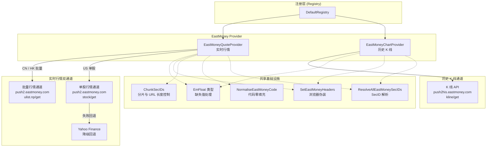
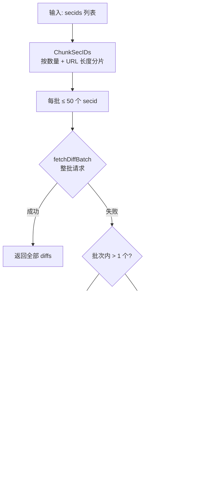

EastMoney（东方财富）是 investgo 中覆盖面最广、字段最完整的行情数据源，同时提供**实时报价**和**历史 K 线**两种能力。在 `DefaultRegistry` 中，EastMoney 以 ID `"eastmoney"` 注册，覆盖 A 股、港股、美股三大市场共计九个子市场，是系统默认首选的数据源（`DefaultQuoteSourceID = "eastmoney"`）。本文将深入分析其两个核心 Provider——`EastMoneyQuoteProvider` 与 `EastMoneyChartProvider` 的架构设计、市场路由策略、数据转换层以及容错机制。

Sources: [model.go](internal/core/model.go#L320-L326), [registry.go](internal/core/marketdata/registry.go#L192-L203)

## 架构总览

EastMoney Provider 的实现横跨三个文件，各司其职：`eastmoney.go` 包含两个 Provider 的全部业务逻辑；`helpers.go` 提供跨 Provider 共享的通用工具函数；`endpoint.go` 集中管理所有 API 端点 URL。这种分层将**协议细节**（URL、请求头、字段映射）、**数据转换**（缩放、解析、归一化）和**业务策略**（批量分片、自适应降级、市场路由）清晰隔离。



Sources: [eastmoney.go](internal/core/provider/eastmoney.go#L1-L19), [helpers.go](internal/core/provider/helpers.go#L1-L18), [endpoint.go](internal/core/endpoint/endpoint.go#L5-L12)

## 实时行情：EastMoneyQuoteProvider

### 市场路由与双通道策略

`EastMoneyQuoteProvider.Fetch` 方法根据 `QuoteTarget.Market` 字段将请求分流至两条完全不同的 API 通道：

- **CN / HK 市场**：走**批量行情通道**（`EastMoneyQuoteAPI`），通过 `secids` 参数在单次请求中查询多只证券，以 50 个 secid 为一批次（`eastMoneyBatchSize = 50`）。
- **US 市场**：走**单股行情通道**（`EastMoneyStockAPI`），逐个 secid 请求；若全部 secid 失败，则将缺失的 US 标的**自动降级至 Yahoo Finance** 获取行情。

这种双通道设计源于东方财富 API 本身的差异：批量接口对海外市场的字段支持有限且不稳定，单股接口虽然可靠但无法批量；因此 CN/HK 走批量效率最优，US 走单股并搭配 Yahoo 兜底，确保行情可用性。

Sources: [eastmoney.go](internal/core/provider/eastmoney.go#L85-L229)

### SecID 解析：统一市场标识映射

东方财富 API 不接受标准的股票代码，而是要求 **secid**（格式为 `{marketID}.{code}`）。`ResolveAllEastMoneySecIDs` 函数完成了从 `QuoteTarget` 到 secid 的映射：

| 市场 | 标准 Symbol 格式 | secid 格式 | marketID |
|---|---|---|---|
| CN-A / CN-GEM / CN-STAR / CN-ETF | `600519.SH` / `000858.SZ` | `1.600519` / `0.000858` | 1=上交所, 0=深交所 |
| HK-MAIN / HK-GEM / HK-ETF | `00700.HK` | `116.00700` | 116 |
| US-STOCK / US-ETF | `AAPL` / `BRK-B` | `105.AAPL` `106.AAPL` `107.AAPL` | 105=NASDAQ, 106=NYSE, 107=NYSE Arca |
| CN-BJ | `430047.BJ` | **不支持** | — |

**关键设计**：US 市场返回 **三个** secid（NASDAQ、NYSE、NYSE Arca），因为同一 ticker 可能在任一交易所上市。Provider 会逐一尝试每个 secid，取首个成功结果，覆盖了跨交易所的同名证券场景。北京交易所（CN-BJ）目前明确不支持，直接返回错误。

Sources: [eastmoney.go](internal/core/provider/eastmoney.go#L404-L438)

### 批量行情的自适应分片与降级

批量行情请求使用 `fetchDiffBatchAdaptive` 实现了一种**二分自适应重试**策略：

1. 先尝试整批请求（最多 50 个 secid）。
2. 若整批失败且批次内多于 1 个 secid，则将批次**对半拆分**，对两半分别递归调用 `fetchDiffBatchAdaptive`。
3. 若某一半失败、另一半成功，返回成功的那一半数据（而非整体失败）。
4. 仅当两半都失败时才报告错误。

同时，`ChunkSecIDs` 在分片时同时考虑 **数量上限**（`batchSize`）和 **URL 编码后的总长度上限**（`maxChars`），因为 `url.Values.Encode()` 会将逗号编码为 `%2C`，可能导致 URL 过长。这确保了即使 watchlist 包含数百只证券，请求也不会因 URL 长度越界被服务器拒绝。



Sources: [eastmoney.go](internal/core/provider/eastmoney.go#L309-L347), [helpers.go](internal/core/provider/helpers.go#L314-L345)

### US 市场行情与 Yahoo 降级

US 市场行情走独立的 `fetchUSQuote` 路径。由于同一 ticker 在三个交易所各有一个 secid，该方法会逐一尝试每个 secid（`fetchUSQuoteBySecID`），首次成功即返回。若三个 secid 全部失败，`Fetch` 主流程会将该标的加入 `missingUSItems` 列表，随后**委托给 `YahooQuoteProvider`** 获取行情。这一设计确保了即使在东方财富 US 数据异常的情况下，用户仍然能看到 US 行情数据。

Sources: [eastmoney.go](internal/core/provider/eastmoney.go#L231-L229)

### 数据转换层：EmFloat 与价格缩放

东方财富 API 的数值字段有两个特殊之处，需要专门处理：

**EmFloat 自定义类型**：API 对缺失字段返回 `"-"` 字符串而非数字。`EmFloat` 实现了自定义 `UnmarshalJSON`，将解析失败的情况静默转为 `0`，避免了 `json.Unmarshal` 报错。

**价格缩放**：单股行情接口（`fetchUSQuoteBySecID`）返回的价格和涨跌幅是**原始整数值**，需要除以特定因子才能得到真实数值：
- `scaleEastMoneyPrice`：`value / 1000`（应用于当前价、开盘价、最高价、最低价、昨收、涨跌额）
- `scaleEastMoneyPercent`：`value / 100`（应用于涨跌幅百分比）

而**批量行情接口**通过 `fltt=2` 参数已经让服务端返回了浮点数值，因此批量路径不需要缩放——这也是两个通道使用不同响应结构体（`eastMoneyStockQuote` vs `EastMoneyQuoteDataDiff`）的根本原因。

Sources: [helpers.go](internal/core/provider/helpers.go#L177-L188), [eastmoney.go](internal/core/provider/eastmoney.go#L301-L307)

## 历史 K 线：EastMoneyChartProvider

### K 线参数映射

`EastMoneyChartProvider` 将七种标准化 `HistoryInterval` 映射为东方财富 K 线 API 的请求参数组合（`eastMoneyHistorySpec`）：

| HistoryInterval | klt（K 线周期） | 起始日期偏移 | lmt（上限） | 额外处理 |
|---|---|---|---|---|
| `1h` | 60（60 分钟） | -5 天 | 50 | `intraday=true`, `trimWindow=1h` |
| `1d` | 60（60 分钟） | -5 天 | 50 | `intraday=true`, `trimWindow=24h` |
| `1w` | 101（日 K） | -14 天 | 10 | — |
| `1mo` | 101（日 K） | -2 个月 | 35 | — |
| `1y` | 101（日 K） | -13 个月 | 270 | — |
| `3y` | 102（周 K） | -37 个月 | 160 | — |
| `all` | 103（月 K） | `0`（最早） | 999 | — |

值得注意的是 `1h` 和 `1d` 两个短周期实际使用的是 **60 分钟 K 线**（`klt=60`），再通过 `trimWindow` 截取最后 1 小时或 24 小时的数据点。这种策略复用了分钟级 K 线数据源，避免了引入更细粒度（如 5 分钟、15 分钟）的 API 参数。K 线 API 使用 `fqt=1` 参数请求**前复权**数据。

Sources: [eastmoney.go](internal/core/provider/eastmoney.go#L596-L618)

### K 线数据解析

东方财富 K 线 API 的 `klines` 字段返回一个**字符串数组**，每条记录是以逗号分隔的 7 个字段：`日期,开,收,高,低,成交量,成交额`。`parseEastMoneyKlines` 函数逐行解析：

1. 根据 `intraday` 标志选择时间格式（`time.DateTime` 或 `time.DateOnly`）。
2. 使用 `chinaLocation`（UTC+8 固定时区）解析时间戳——因为东方财富 API 返回的是中国本地时间。
3. 跳过 `closePrice <= 0` 的无效数据点（停牌期间可能返回零价格）。
4. 解析完成后，若 spec 指定了 `trimWindow`，调用 `TrimHistoryPoints` 从最新数据点反向截取指定时间窗口内的数据。

解析后通过 `ApplyHistorySummary` 计算汇总指标：起始价、终止价、区间最高/最低、涨跌额、涨跌幅百分比。

Sources: [eastmoney.go](internal/core/provider/eastmoney.go#L620-L659), [helpers.go](internal/core/provider/helpers.go#L206-L229)

### 多 SecID 重试策略

与实时行情中的 US 市场类似，`EastMoneyChartProvider.Fetch` 对 `ResolveAllEastMoneySecIDs` 返回的所有 secid **逐一尝试**，取首个成功结果。对于 US 股票，这意味着依次尝试 NASDAQ（105）、NYSE（106）、NYSE Arca（107）三个交易所的 secid，只要任一交易所返回有效 K 线数据即视为成功。仅当所有 secid 均失败时，才合并所有错误信息返回。

Sources: [eastmoney.go](internal/core/provider/eastmoney.go#L486-L512)

## 请求伪装与网络层

### 浏览器请求头

`SetEastMoneyHeaders` 为所有东方财富 API 请求注入完整的浏览器模拟请求头：User-Agent（Chrome 131）、Accept、Accept-Language（zh-CN）、Connection（keep-alive）、Cache-Control（no-cache）以及 Referer（`https://quote.eastmoney.com/`）。代码注释明确指出：**不设置这些请求头，东方财富服务器会直接关闭连接（EOF）**。这是一个典型的反爬虫对策，所有东方财富相关请求（Quote、Chart、Hot、Suggest）统一通过此函数设置请求头。

Sources: [helpers.go](internal/core/provider/helpers.go#L192-L201), [endpoint.go](internal/core/endpoint/endpoint.go#L11)

### API 端点清单

| 端点常量 | URL | 用途 |
|---|---|---|
| `EastMoneyQuoteAPI` | `push2.eastmoney.com/api/qt/ulist.np/get` | 批量实时行情（CN/HK） |
| `EastMoneyStockAPI` | `push2.eastmoney.com/api/qt/stock/get` | 单股实时行情（US） |
| `EastMoneyHistoryAPI` | `push2his.eastmoney.com/api/qt/stock/kline/get` | 历史 K 线 |
| `EastMoneyHotAPI` | `push2.eastmoney.com/api/qt/clist/get` | 热门榜单（CN-A、HK） |
| `EastMoneySuggestAPI` | `searchapi.eastmoney.com/api/suggest/get` | 搜索建议 |
| `EastMoneyWebReferer` | `https://quote.eastmoney.com/` | Referer 头 |

Sources: [endpoint.go](internal/core/endpoint/endpoint.go#L5-L12)

### 代码零填充：NormaliseEastMoneyCode

东方财富 API 返回的股票代码可能省略前导零（如港股 `700` 而非 `00700`）。`NormaliseEastMoneyCode` 根据 `marketID` 补齐：港股（116、128）补至 5 位，A 股（0、1）补至 6 位。这在 secid 反向映射回标准代码时至关重要——`fetchDiffs` 在构建 secid 时调用此函数确保与 `indexBySecID` 映射表中的键完全匹配。

Sources: [eastmoney.go](internal/core/provider/eastmoney.go#L661-L676)

## 注册与路由集成

### Registry 注册

在 `DefaultRegistry` 中，EastMoney 是**首个注册**的数据源，同时绑定了 `QuoteProvider` 和 `HistoryProvider` 两种能力，覆盖九个子市场：

```go
r.Register(&DataSource{
    id:      "eastmoney",
    name:    "EastMoney",
    desc:    "Best overall coverage for China, Hong Kong, and US markets...",
    markets: []string{"CN-A","CN-GEM","CN-STAR","CN-ETF","HK-MAIN","HK-GEM","HK-ETF","US-STOCK","US-ETF"},
    quote:   provider.NewEastMoneyQuoteProvider(client),
    history: provider.NewEastMoneyChartProvider(client),
})
```

`DefaultQuoteSourceID` 常量值为 `"eastmoney"`，意味着在用户未做任何设置变更时，系统默认使用东方财富作为行情源。

Sources: [registry.go](internal/core/marketdata/registry.go#L192-L203), [model.go](internal/core/model.go#L320-L321)

### HistoryRouter 降级链

`HistoryRouter` 根据市场类型构建降级链。CN 和 HK 市场的默认链为 `["yahoo", "eastmoney"]`（Yahoo 优先，EastMoney 兜底）；US 市场的默认链为 `["yahoo", "finnhub", "polygon", "alpha-vantage", "twelve-data", "eastmoney"]`（EastMoney 排在最后）。当用户配置的行情源也具备历史能力时（如选择 EastMoney 做行情），该源会被提升至降级链首位。

Sources: [history_router.go](internal/core/marketdata/history_router.go#L140-L147)

## 热门榜单与搜索集成

EastMoney Provider 的基础设施不仅服务于实时行情和历史 K 线，还被热门榜单服务（`HotService`）复用：

- **`listEastMoney`**：通过 `EastMoneyHotAPI`（clist 接口）获取 A 股和港股的涨幅/跌幅/市值/成交量排行榜。
- **`fetchEastMoneySuggest`**：通过 `EastMoneySuggestAPI` 实现关键词搜索（按名称或代码模糊匹配）。
- 两者共享 `SetEastMoneyHeaders`、`EmFloat`、`NormaliseEastMoneyCode` 等基础设施，避免重复实现。

Sources: [eastmoney.go](internal/core/hot/eastmoney.go#L82-L162), [eastmoney.go](internal/core/hot/eastmoney.go#L225-L266)

## 设计模式总结

| 设计模式 | 应用位置 | 目的 |
|---|---|---|
| **双通道分流** | `Fetch` → batch / single-stock | 根据市场特性选择最优 API |
| **自适应二分重试** | `fetchDiffBatchAdaptive` | 批量请求失败时精确隔离问题 secid |
| **多 SecID 枚举** | US 市场 secid 解析 | 覆盖同一 ticker 在多交易所上市的情况 |
| **跨 Provider 降级** | US 行情 → Yahoo 回退 | 单数据源不可用时保障可用性 |
| **自定义 JSON 类型** | `EmFloat` | 容忍 API 返回非数值字段 |
| **集中式端点管理** | `endpoint` 包 | 统一维护所有 API URL，避免散落硬编码 |
| **浏览器伪装** | `SetEastMoneyHeaders` | 绕过反爬虫检测 |

Sources: [eastmoney.go](internal/core/provider/eastmoney.go#L1-L676), [helpers.go](internal/core/provider/helpers.go#L1-L200)

---

**延伸阅读**：EastMoney 在 HistoryRouter 中的降级位置以及整体路由机制，详见 [HistoryRouter：历史数据降级链与市场感知路由](10-historyrouter-li-shi-shu-ju-jiang-ji-lian-yu-shi-chang-gan-zhi-lu-you)；其注册与路由机制的全貌参见 [市场数据 Provider 注册表与路由机制](8-shi-chang-shu-ju-provider-zhu-ce-biao-yu-lu-you-ji-zhi)；作为对比，Yahoo Finance Provider 的实现参见 [Yahoo Finance Provider：行情、历史与搜索](27-yahoo-finance-provider-xing-qing-li-shi-yu-sou-suo)；其他国内行情源（新浪、雪球、腾讯）的差异化设计参见 [国内行情源（新浪、雪球、腾讯）](29-guo-nei-xing-qing-yuan-xin-lang-xue-qiu-teng-xun)。