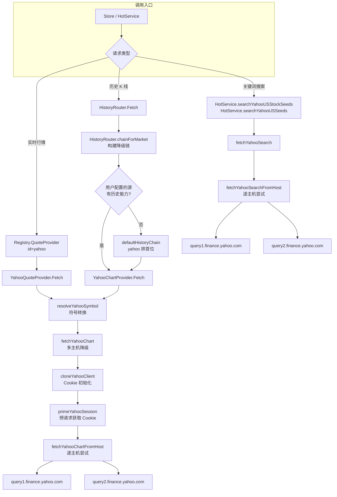

Yahoo Finance 是 investgo 中覆盖**港美市场**的核心数据源，作为系统默认的 US 行情源（`DefaultUSQuoteSourceID = "yahoo"`）与历史数据降级链的首选节点，它在三个维度上为应用提供能力：**实时行情报价**（`YahooQuoteProvider`）、**历史 K 线数据**（`YahooChartProvider`）以及**美股/ETF 关键词搜索**（Hot 模块中的 `fetchYahooSearch`）。本文将从 HTTP 基础设施层、行情提供者、历史数据提供者、搜索集成和符号映射五个层面，逐层拆解其实现架构与设计决策。

Sources: [yahoo.go](internal/core/provider/yahoo.go#L1-L20), [model.go](internal/core/model.go#L320-L327)

## 架构总览

Yahoo Finance Provider 在系统中不是孤立存在的一个文件——它横跨了 `provider`、`hot`、`marketdata`、`endpoint` 四个包，通过 `Registry` 注册表统一管理生命周期，通过 `HistoryRouter` 实现历史数据的市场感知降级路由。下面的架构图展示了数据从用户请求到 Yahoo API 的完整调用链：



Sources: [registry.go](internal/core/marketdata/registry.go#L205-L216), [history_router.go](internal/core/marketdata/history_router.go#L133-L147)

## HTTP 基础设施层：会话管理与浏览器伪装

Yahoo Finance API 并非公开的官方接口，它要求请求方携带有效的 Cookie 和浏览器特征头部才能正常响应。为此，provider 层构建了一套专门的 HTTP 基础设施来模拟浏览器行为。

### Cookie Jar 与客户端克隆

系统通过 `sync.Once` 实现全局唯一的 `yahooCookieJar`，确保所有 Yahoo 请求共享同一份 Cookie 状态。每次发起请求时，`cloneYahooClient` 会克隆传入的 `http.Client`，注入共享 Cookie Jar（如果尚未设置）并确保超时时间为 10 秒。这种「克隆注入」模式既避免修改调用方的原始 Client，又保证了 Yahoo 会话的 Cookie 在多次请求间持续有效。

Sources: [yahoo.go](internal/core/provider/yahoo.go#L53-L75)

### Session Priming 机制

在发送业务请求之前，`primeYahooSession` 会先访问 `https://finance.yahoo.com` 首页，这次请求的目的是让 Cookie Jar 自动收集 Yahoo 设置的会话 Cookie（如 `A1`、`A3` 等）。函数刻意忽略返回的 body 和错误——即使 priming 失败，后续请求仍会继续尝试，只是可能面临更高的限流风险。这是一个**优雅降级**的设计选择。

Sources: [yahoo.go](internal/core/provider/yahoo.go#L92-L113)

### 浏览器伪装头部

`setYahooBrowserHeaders` 为每个请求设置了完整的浏览器特征头部，包括 Safari User-Agent、`Origin`/`Referer` 指向 Yahoo Finance 自身、以及 `Sec-Fetch-*` 系列头部。这些头部不是装饰性的——Yahoo 的 CDN 会检查 `Origin` 是否匹配其域名，缺少这些头部会导致请求被直接拒绝或返回 401。

| 头部字段 | 值 | 作用 |
|---|---|---|
| `User-Agent` | Safari 17.0 on macOS | 模拟真实浏览器 |
| `Origin` | `https://finance.yahoo.com` | CORS 来源验证 |
| `Referer` | `https://finance.yahoo.com/` | 来源页标记 |
| `Sec-Fetch-Site` | `same-site` | Fetch 元数据 |
| `Sec-Fetch-Mode` | `cors` | 跨域模式标记 |
| `Cache-Control` | `no-cache` | 禁用缓存 |
| `Host` | 动态设置为当前请求主机 | 路由匹配 |

Sources: [yahoo.go](internal/core/provider/yahoo.go#L77-L90), [endpoint.go](internal/core/endpoint/endpoint.go#L31-L49)

### 多主机降级策略

Yahoo 的查询 API 部署在 `query1.finance.yahoo.com` 和 `query2.finance.yahoo.com` 两个主机上。`fetchYahooChart` 和 `fetchYahooSearch` 都实现了**逐主机尝试 + 首个成功即返回**的降级策略：遍历 `YahooChartHosts` / `YahooSearchHosts` 数组，将每台主机的错误信息收集到 `problems` 切片，最终用 `errs.JoinProblems` 合并为可读的多行错误。这种设计确保了单主机宕机或限流时，系统仍能透明地切换到备用节点。

Sources: [yahoo.go](internal/core/provider/yahoo.go#L116-L134), [hot/yahoo.go](internal/core/hot/yahoo.go#L100-L123), [errs.go](internal/common/errs/errs.go#L10-L31)

## 实时行情提供者：YahooQuoteProvider

`YahooQuoteProvider` 实现了 `core.QuoteProvider` 接口，负责为 Watchlist 中的标的获取实时行情。它的核心策略是**复用 Chart API 作为行情快照源**——通过请求最近 5 天的日线数据，取最后一天的价格点作为当前行情。

### Fetch 流程

```
Fetch(items) → 遍历每个 item → resolveYahooSymbol() → fetchChartSnapshot() → BuildQuote()
```

具体步骤如下：

1. **符号解析**：对每个 `WatchlistItem`，先通过 `CollectQuoteTargets` 解析为标准的 `QuoteTarget`，再通过 `resolveYahooSymbol` 转换为 Yahoo 格式的交易代码
2. **Chart 快照请求**：调用 `fetchChartChartSnapshot`，请求 `range=5d&interval=1d` 的 Chart 数据
3. **行情构建**：从返回的 K 线点中取最后一个有效点作为当日行情，取倒数第二个点的 `Close` 作为 `previousClose`（如果存在）；`meta.regularMarketPrice` 优先于最后一个 K 线的 Close 作为当前价
4. **名称解析**：按优先级 `meta.LongName → meta.ShortName → item.Name → meta.Symbol → item.Symbol` 选取显示名称

Sources: [yahoo.go](internal/core/provider/yahoo.go#L194-L289)

### 关键设计：为何用 Chart API 而非 Quote API

Yahoo Finance 有多个 API 端点（`v8/finance/chart`、`v7/finance/quote`、`v6/finance/quote`），其中 Quote API 在近年来已被逐步限制访问。Chart API 是目前最稳定的端点，它返回的 `meta` 节点包含 `regularMarketPrice`，而 `indicators.quote` 节点提供完整的 OHLCV 数据。通过 `range=5d` 请求，系统可以同时获得当前价格和前日收盘价，一个请求完成两个指标的获取。

Sources: [yahoo.go](internal/core/provider/yahoo.go#L245-L289)

## 历史数据提供者：YahooChartProvider

`YahooChartProvider` 同样基于 Yahoo Chart API，但根据用户选择的时间区间动态调整请求参数，并对返回数据进行时间窗口裁剪。

### 时间区间映射

`historyQuerySpecFor` 将系统定义的 7 种 `HistoryInterval` 映射为 Yahoo API 的 `range` 和 `interval` 参数，同时设定 `trimWindow` 用于裁剪超出时间范围的数据点：

| HistoryInterval | Yahoo range | Yahoo interval | trimWindow | 说明 |
|---|---|---|---|---|
| `1h` | `1d` | `1m` | 1 小时 | 分钟级数据，裁剪到最近 1 小时 |
| `1d` | `1d` | `1m` | 24 小时 | 分钟级数据，裁剪到最近 24 小时 |
| `1w` | `5d` | `5m` | 7 天 | 5 分钟数据，裁剪到最近 7 天 |
| `1mo` | `1mo` | `1d` | 30 天 | 日线数据，裁剪到最近 30 天 |
| `1y` | `1y` | `1d` | 365 天 | 日线数据 |
| `3y` | `5y` | `1wk` | 3 年 | 周线数据，请求 5 年但裁剪到 3 年 |
| `all` | `max` | `1mo` | 0（不裁剪） | 月线数据，完整历史 |

注意 `3y` 的设计：Yahoo API 没有 `3y` 范围，因此请求 `5y` 的周线数据后通过 `TrimHistoryPoints` 裁剪到最近 3 年。这种「多取再裁」的策略确保了所有时间区间都有对应的 API 参数组合。

Sources: [yahoo.go](internal/core/provider/yahoo.go#L295-L416)

### 数据解析与清洗

`buildHistoryPoints` 从 Yahoo 返回的原始数据（`[]int64` 时间戳 + `[]*float64` OHLCV 数组）中构建统一的 `[]core.HistoryPoint`。它处理了几个关键的数据质量问题：

- **长度对齐**：以 `timestamps` 长度为基准，与 OHLCV 各数组长度的最小值作为遍历上限，防止数组越界
- **空指针安全**：`derefFloat` 将 `nil` 的 `*float64` 安全地转换为 `0`
- **无效数据过滤**：`Close <= 0` 的数据点直接跳过
- **Volume 缺失容错**：Volume 数组可能不存在或长度不足，通过长度检查安全处理

解析完成后，`ApplyHistorySummary` 计算整个系列的摘要指标（起始价、终止价、区间最高/最低、涨跌额和涨跌幅），供前端图表和统计面板直接使用。

Sources: [yahoo.go](internal/core/provider/yahoo.go#L418-L469), [helpers.go](internal/core/provider/helpers.go#L205-L229)

### 历史降级链中的角色

在 `HistoryRouter` 中，Yahoo Finance 是**所有市场**历史降级链的首选节点：

- **US 市场**：`["yahoo", "finnhub", "polygon", "alpha-vantage", "twelve-data", "eastmoney"]`
- **CN/HK 市场**：`["yahoo", "eastmoney"]`

这意味着即使用户配置的行情源是 Sina 或 Xueqiu（两者没有历史 API），历史请求也会自动降级到 Yahoo。Yahoo 在链中的首位置保证了在绝大多数场景下，历史数据都能第一时间获得响应。

Sources: [history_router.go](internal/core/marketdata/history_router.go#L133-L147)

## 搜索集成：Hot 模块中的 Yahoo Search API

Yahoo Finance 的搜索 API（`/v1/finance/search`）在系统中被 Hot 模块用于**美股和 US ETF 的关键词搜索**。这不是一个独立的 Provider，而是嵌入在 `HotService` 中的辅助能力。

### 搜索调用场景

搜索在两个场景中被触发：

1. **US 股票搜索**（`searchYahooUSStockSeeds`）：先从本地种子池按关键词过滤，再调用 Yahoo Search 扩展覆盖范围（例如按公司名称匹配本地池中没有的标的），两者合并去重后获取行情
2. **US ETF 搜索**（`searchYahooUSSeeds`）：先从预定义的 ETF 成分池过滤，再调用 Yahoo Search 获取更多 ETF 匹配，合并去重后获取行情

Sources: [hot/yahoo.go](internal/core/hot/yahoo.go#L31-L98), [hot/service.go](internal/core/hot/service.go#L103-L123)

### 搜索结果过滤

Yahoo Search API 返回的结果需要经过严格过滤才能转化为有效的 `hotSeed`：

- **股票过滤**（`searchYahooUSStockSeeds`）：只接受 `quoteType == "EQUITY"` 或空类型的结果，排除 ETF、指数、期货等其他类型
- **ETF 过滤**（`searchYahooUSSeeds`）：通过 `isYahooETFQuote` 检查 `quoteType == "ETF"` 或 `typeDisp` 包含 "ETF"
- **交易所过滤**（`isLikelyUSExchange`）：检查 `exchange` 或 `exchDisp` 是否包含 `NASDAQ`、`NYSE`、`ARCA`、`ARCX`、`BATS`、`PCX` 等已知美国交易所标识。空值默认放行（保守策略）
- **去重**：使用 `seen` map 按 symbol 去重，避免同一标的被多次添加

Sources: [hot/yahoo.go](internal/core/hot/yahoo.go#L171-L191)

### Hot 池并发获取

当用户选择 Yahoo 作为 Hot 模块的行情源时，`fetchPoolQuotesYahoo` 会为池中的每个标的**逐个发起 Yahoo Chart 请求**（因为 Yahoo Chart API 不支持批量查询），并通过信号量 `yahooHotConcurrency = 5` 控制最大并发数。获取到的 `Quote` 被映射回 `HotItem`，但 Volume 和 MarketCap 字段被硬编码为 0，因为 Chart API 的快照模式不提供这两个聚合字段。

Sources: [hot/pool.go](internal/core/hot/pool.go#L311-L376), [hot/pool.go](internal/core/hot/pool.go#L557-L603)

## 符号映射：resolveYahooSymbol

Yahoo Finance 使用与 investgo 内部不同的交易代码格式。`resolveYahooSymbol` 负责将系统内部的规范化代码转换为 Yahoo 格式，这是所有 Yahoo Provider 调用的前置步骤：

| 市场（Market） | 内部格式示例 | Yahoo 格式 | 转换规则 |
|---|---|---|---|
| `CN-A` / `CN-GEM` / `CN-STAR` / `CN-ETF` (上海) | `600000.SH` | `600000.SS` | `.SH` → `.SS` |
| `CN-*` (深圳) | `000001.SZ` | `000001.SZ` | 不变 |
| `HK-MAIN` / `HK-GEM` / `HK-ETF` | `00700.HK` | `0700.HK` | 左侧补零至 4 位 + `.HK` |
| `US-STOCK` / `US-ETF` | `AAPL` | `AAPL` | 不变 |

港股的映射逻辑值得注意：它先去除 `.HK` 后缀和左侧的零（`TrimLeft("0")`），然后将数字补零到至少 4 位。例如 `09988.HK` → 去零得 `9988` → 补零得 `9988`（已是 4 位）→ `9988.HK`。而 `00700.HK` → `700` → `0700` → `0700.HK`。这个去零再补零的过程确保了无论用户输入几位数字的港股代码，最终都能匹配 Yahoo 的 4 位数字格式。

不支持的 market（如 `CN-BJ` 北交所）会返回明确的错误信息，上游调用者将其作为 problem 跳过该标的。

Sources: [yahoo.go](internal/core/provider/yahoo.go#L366-L394)

## 注册与路由配置

Yahoo Finance 在 `Registry` 中注册为 `id="yahoo"` 的数据源，同时提供 `QuoteProvider` 和 `HistoryProvider` 两种能力，覆盖全部 9 个市场：

```go
// 注册配置
id:      "yahoo"
name:    "Yahoo Finance"
desc:    "Stable coverage for Hong Kong and US markets..."
markets: ["CN-A","CN-GEM","CN-STAR","CN-ETF","HK-MAIN","HK-GEM","HK-ETF","US-STOCK","US-ETF"]
quote:   YahooQuoteProvider    ✓
history: YahooChartProvider    ✓
```

系统中与 Yahoo 相关的默认配置决策：

- **US 行情源默认值**：`DefaultUSQuoteSourceID = "yahoo"` — 系统首次启动时，US 市场的行情数据默认由 Yahoo 提供
- **历史降级链首节点**：无论 CN、HK 还是 US 市场，Yahoo 始终是 `defaultHistoryChain` 的第一个元素
- **热门搜索扩展**：US 股票和 US ETF 的关键词搜索依赖 Yahoo Search API 扩展本地种子池的覆盖范围

Sources: [registry.go](internal/core/marketdata/registry.go#L205-L216), [model.go](internal/core/model.go#L320-L327)

## 端点配置集中管理

所有 Yahoo Finance 相关的 URL 常量集中在 `endpoint` 包中，确保 URL 的一致性和可维护性：

| 常量 | 值 | 用途 |
|---|---|---|
| `YahooFinanceDomain` | `finance.yahoo.com` | Cookie 域 |
| `YahooFinanceOrigin` | `https://finance.yahoo.com` | Origin 头 / Session priming |
| `YahooFinanceReferer` | `https://finance.yahoo.com/` | Referer 头 |
| `YahooChartPathPrefix` | `/v8/finance/chart/` | 行情与历史 K 线 |
| `YahooSearchPath` | `/v1/finance/search` | 关键词搜索 |
| `YahooChartHosts` | `query1` + `query2` | Chart API 多主机降级 |
| `YahooSearchHosts` | `query1` + `query2` | Search API 多主机降级 |

Sources: [endpoint.go](internal/core/endpoint/endpoint.go#L31-L49)

## 延伸阅读

- 了解 Yahoo 在历史降级链中的完整位置：[HistoryRouter：历史数据降级链与市场感知路由](10-historyrouter-li-shi-shu-ju-jiang-ji-lian-yu-shi-chang-gan-zhi-lu-you)
- 了解 Provider 注册表的整体架构：[市场数据 Provider 注册表与路由机制](8-shi-chang-shu-ju-provider-zhu-ce-biao-yu-lu-you-ji-zhi)
- 了解热门搜索中 Yahoo 的使用上下文：[热门榜单服务：缓存、搜索与排序](11-re-men-bang-dan-fu-wu-huan-cun-sou-suo-yu-pai-xu)
- 对比国内行情源实现：[国内行情源（新浪、雪球、腾讯）](29-guo-nei-xing-qing-yuan-xin-lang-xue-qiu-teng-xun)
- 对比其他第三方 API：[第三方 API 数据源集成](28-di-san-fang-api-shu-ju-yuan-ji-cheng-alpha-vantage-finnhub-polygon-twelve-data)