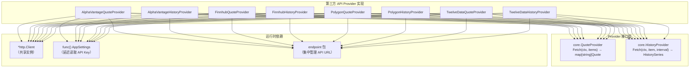

investgo 集成了四个主流第三方美股数据 API——**Alpha Vantage**、**Finnhub**、**Polygon.io** 和 **Twelve Data**——为用户提供免自建爬虫的行情与历史 K 线获取方案。四个 Provider 均遵循同一架构范式：**仅支持 `US-STOCK` / `US-ETF` 市场**、**必须配置 API Key**、**同时实现 `QuoteProvider` 和 `HistoryProvider` 接口**，并通过统一的 Registry 注册机制和 HistoryRouter 降级链参与市场数据路由。本文从架构总览、Provider 个体差异、注册与路由机制、API Key 管理四个维度进行深度解析。

Sources: [alphavantage.go](internal/core/provider/alphavantage.go#L1-L19), [finnhub.go](internal/core/provider/finnhub.go#L1-L18), [polygon.go](internal/core/provider/polygon.go#L1-L18), [twelvedata.go](internal/core/provider/twelvedata.go#L1-L18)

## 架构总览：统一的第三方 Provider 范式

四个第三方数据源共享完全一致的代码结构——每个源拆分为两个独立结构体（`XxxQuoteProvider` 和 `XxxHistoryProvider`），分别实现 `core.QuoteProvider` 和 `core.HistoryProvider` 接口。构造函数签名统一接受 `*http.Client` 和 `func() core.AppSettings` 延迟设置函数，后者确保每次 Fetch 调用时都能读取最新的 API Key 配置，而无需在设置变更时重建 Provider 实例。



**关键设计决策**：所有 Provider 接受 `func() core.AppSettings` 而非直接持有 `AppSettings` 值，是因为应用设置会随用户操作实时变更（如切换 API Key），而 Provider 在启动时创建一次、全局共享。函数式注入让 Provider 始终读取最新配置，无需重建实例，也无需引入可变状态的并发保护。

Sources: [alphavantage.go](internal/core/provider/alphavantage.go#L21-L46), [finnhub.go](internal/core/provider/finnhub.go#L20-L57), [polygon.go](internal/core/provider/polygon.go#L20-L80), [twelvedata.go](internal/core/provider/twelvedata.go#L20-L73), [model.go](internal/core/model.go#L348-L374)

## 四源横向对比

| 维度 | Alpha Vantage | Finnhub | Polygon.io | Twelve Data |
|------|--------------|---------|------------|-------------|
| **Registry ID** | `alpha-vantage` | `finnhub` | `polygon` | `twelve-data` |
| **支持市场** | US-STOCK, US-ETF | US-STOCK, US-ETF | US-STOCK, US-ETF | US-STOCK, US-ETF |
| **行情 API** | `GLOBAL_QUOTE` | `/quote` | `/v2/snapshot/.../tickers` | `/quote` |
| **历史 API** | `TIME_SERIES_*` | `/stock/candle` | `/v2/aggs/ticker/.../range/...` | `/time_series` |
| **行情数据格式** | `map[string]string`（全字符串） | 原生 `float64` / `int64` | 嵌套结构体（`lastTrade`/`day`/`min`） | 字符串数值字段 |
| **历史数据格式** | `map[string]map[string]string` | 并行数组（`c[]/h[]/l[]/o[]/t[]/v[]`） | 结构体数组 `results[]` | 字符串字段数组 `values[]` |
| **货币信息** | 不返回，使用 fallback | 不返回，使用 fallback | 不返回，使用 fallback | **返回 `meta.currency`** |
| **API Key 传递方式** | Query: `apikey=` | Query: `token=` | Query: `apiKey=` | Query: `apikey=` |
| **限流提示字段** | `Note` / `Information` | — | Status: `DELAYED` | `Status: "error"` / `Code ≠ 0` |
| **时间戳类型** | 字符串 `"2024-01-15"` | Unix 秒 `int64` | 毫秒/微秒/纳秒自适应 | 字符串 `"2024-01-15"` |
| **HTTP 超时** | 10s | 10s | 10s | 10s |

Sources: [endpoint.go](internal/core/endpoint/endpoint.go#L24-L30), [alphavantage.go](internal/core/provider/alphavantage.go#L31-L36), [finnhub.go](internal/core/provider/finnhub.go#L30-L47), [polygon.go](internal/core/provider/polygon.go#L30-L70), [twelvedata.go](internal/core/provider/twelvedata.go#L30-L63)

## Provider 个体实现详解

### Alpha Vantage：字符串化响应与多函数映射

Alpha Vantage 的 API 响应以纯字符串键值对形式返回行情数据（如 `"05. price": "150.25"`），因此解析层依赖 `ParseFloat` 辅助函数进行安全转换。历史数据请求根据 `HistoryInterval` 选择不同的 API 函数——`1h/1d` 使用 `TIME_SERIES_INTRADAY`、`1w~1y` 使用 `TIME_SERIES_DAILY`、`3y` 使用 `TIME_SERIES_WEEKLY`、`all` 使用 `TIME_SERIES_MONTHLY`——并通过 `seriesKey` 定位响应中对应的 JSON 子对象。

Alpha Vantage 的错误处理覆盖了三个特殊字段：`Error Message`（无效符号）、`Information`（API 调用限制提示）、`Note`（频率限制警告）。这三个字段在行情和历史响应中均可能出现，代码统一通过 `decodeRawString` 辅助函数从 `json.RawMessage` 中提取。历史数据解析后需手动排序（`sort.Slice`），因为 API 返回的 map 迭代顺序不确定。

Sources: [alphavantage.go](internal/core/provider/alphavantage.go#L133-L278)

### Finnhub：原生数值与并行数组

Finnhub 的行情响应直接返回 `float64` 数值（`c`/`h`/`l`/`o`/`pc`）和 Unix 秒级时间戳 `t`，无需字符串解析，是四个源中解析路径最短的。历史数据（Candle API）采用**并行数组**格式——`Close[]`、`High[]`、`Low[]`、`Open[]`、`Time[]`、`Volume[]` 各自独立、下标对齐——解析时需先用 `MinInt` 计算所有数组长度的最小值作为安全上界，防止数组长度不一致导致越界。

Finnhub 的分辨率映射（`finnhubResolution`）将内部 `HistoryInterval` 转换为 Finnhub 的 `resolution` 参数：`1h → "5"`（5 分钟 K 线）、`1d → "15"`、`1w~1y → "D"`、`3y → "W"`、`all → "M"`。历史请求的 `from/to` 时间窗口通过 Unix 时间戳传递，`all` 区间回溯 20 年。

Sources: [finnhub.go](internal/core/provider/finnhub.go#L30-L266)

### Polygon.io：嵌套快照与毫秒级时间戳

Polygon 的行情 API（Snapshot）返回深度嵌套的结构体——`ticker.lastTrade.price` 为最新成交价、`ticker.day.*` 为当日 OHLCV、`ticker.min.*` 为当分钟 OHLCV、`ticker.prevDay.close` 为前收盘。解析逻辑采用了**多级降级策略**：当前价优先取 `lastTrade.price`，若为零则回退到 `day.close`；开盘/最高/最低优先取 `day.*`，若为零则回退到 `min.*`。这种防御性编程确保即使部分字段缺失也能产出有效报价。

Polygon 的历史 API（Aggregates）将时间区间参数编码到 URL 路径中（`/range/{multiplier}/{resolution}/{from}/{to}`），而非查询参数。`polygonRangeConfig` 映射区间配置（如 `1h → "5"/"minute"`、`1d → "15"/"minute"`），`polygonHistoryWindow` 计算起止日期。时间戳解析通过 `polygonTimestamp` 函数自动识别精度：纳秒级（`>10^15`）→ `time.Unix(0, value)`，毫秒级（`>10^12`）→ `time.UnixMilli`，秒级 → `time.Unix`。Polygon 还接受 `Status: "DELAYED"` 作为有效响应（表示延迟数据），仅拒绝非 OK/DELAYED 状态。

Sources: [polygon.go](internal/core/provider/polygon.go#L30-L335)

### Twelve Data：字符串数值与显式货币返回

Twelve Data 的行情 API 返回字符串格式的数值字段（`open`/`high`/`low`/`close`/`previous_close`/`change`/`percent_change`），需通过 `ParseFloat` 转换，但**额外返回 `name` 和 `currency` 字段**——这是四个源中唯一在行情响应中提供货币信息的。代码优先使用 API 返回的名称和货币，fallback 到 `WatchlistItem` 中保存的值。

历史 API 的区间映射（`twelveDataInterval`）与输出量控制（`twelveDataOutputSize`）是分离的：同一区间可能有不同的 `outputsize`（如 `1h → "24"`、`1d → "120"`、`1y → "260"`），精确控制返回数据量以适配不同时间跨度的展示需求。错误判断使用组合条件 `Status == "error" || Code != 0`，兼容两种错误表达方式。

Sources: [twelvedata.go](internal/core/provider/twelvedata.go#L30-L290)

## 注册与路由机制

四个第三方 Provider 在 `DefaultRegistry` 中以固定顺序注册，ID 分别为 `alpha-vantage`、`twelve-data`、`finnhub`、`polygon`。每个源声明仅覆盖 `US-STOCK` 和 `US-ETF` 两个市场，同时提供 Quote 和 History 能力：

```go
r.Register(&DataSource{
    id:      "alpha-vantage",
    name:    "Alpha Vantage",
    desc:    "API-based US stock and ETF source with both live quote and history support.",
    markets: []string{"US-STOCK", "US-ETF"},
    quote:   provider.NewAlphaVantageQuoteProvider(client, settings),
    history: provider.NewAlphaVantageHistoryProvider(client, settings),
})
```

HistoryRouter 为美股市场构建的默认降级链为 `["yahoo", "finnhub", "polygon", "alpha-vantage", "twelve-data", "eastmoney"]`。**Yahoo Finance 排在首位**是因为它不需要 API Key 即可工作，保证开箱即用；第三方 API 源紧随其后作为备选，最终 EastMoney 兜底。当用户在设置中选择了某个第三方源作为美股行情源时，如果该源同时拥有 History 能力（四个第三方源均有），它会被提升到降级链首位，确保行情与历史数据来自同一 Provider。

Sources: [registry.go](internal/core/marketdata/registry.go#L257-L294), [history_router.go](internal/core/marketdata/history_router.go#L133-L147)

## 行情 Fetch 流程：市场过滤与逐条请求

四个第三方 Provider 的 `Fetch` 方法遵循相同的执行流程：

1. **API Key 校验**：从 `settings()` 读取对应 Key，为空则立即返回错误
2. **目标收集**：调用 `CollectQuoteTargets` 将 `WatchlistItem` 转换为 `QuoteTarget`
3. **市场过滤**：遍历每个 item，解析 `QuoteTarget` 后检查 `Market` 是否为 `US-STOCK` 或 `US-ETF`，不支持的市场直接跳过并记录 problem
4. **逐条请求**：对每个合法 item 发起独立 HTTP 请求（无批量 API），成功则构建 Quote 写入结果 map，失败则记录 problem
5. **错误聚合**：使用 `errs.JoinProblems` 将所有非致命错误合并返回

**注意**：四个第三方源均为逐条请求模式（per-item HTTP call），与 EastMoney/Yahoo 等支持批量查询的源不同。这意味着在大量美股标的场景下，第三方源的请求延迟会随标的数量线性增长，受限于各 API 的速率配额。

Sources: [alphavantage.go](internal/core/provider/alphavantage.go#L50-L84), [finnhub.go](internal/core/provider/finnhub.go#L61-L95), [polygon.go](internal/core/provider/polygon.go#L84-L118), [twelvedata.go](internal/core/provider/twelvedata.go#L77-L111)

## 历史区间映射对比

四个 Provider 将统一的 `HistoryInterval` 枚举映射到各自 API 的原生区间参数，映射策略差异显著：

| HistoryInterval | Alpha Vantage | Finnhub | Polygon | Twelve Data |
|----------------|--------------|---------|---------|-------------|
| `1h` | INTRADAY/60min | resolution=`5` | 5/minute | interval=`5min`, outputsize=24 |
| `1d` | INTRADAY/60min | resolution=`15` | 15/minute | interval=`15min`, outputsize=120 |
| `1w` | DAILY | resolution=`D` | 1/day | interval=`1day`, outputsize=10 |
| `1mo` | DAILY | resolution=`D` | 1/day | interval=`1day`, outputsize=40 |
| `1y` | DAILY | resolution=`D` | 1/day | interval=`1day`, outputsize=260 |
| `3y` | WEEKLY | resolution=`W` | 1/week | interval=`1week`, outputsize=170 |
| `all` | MONTHLY | resolution=`M` | 1/month | interval=`1month`, outputsize=120 |

Alpha Vantage 通过选择不同的 `TIME_SERIES_*` 函数名来切换粒度；Finnhub 用字符串 resolution 编码；Polygon 将粒度编码到 URL 路径的 `multiplier/resolution` 段；Twelve Data 独有的 `outputsize` 参数精确控制返回条数。所有 Provider 的历史数据均经过 `TrimHistoryPoints` 按时间窗口裁剪，确保不会返回超出区间范围的冗余数据点。

Sources: [alphavantage.go](internal/core/provider/alphavantage.go#L196-L214), [finnhub.go](internal/core/provider/finnhub.go#L252-L265), [polygon.go](internal/core/provider/polygon.go#L301-L323), [twelvedata.go](internal/core/provider/twelvedata.go#L257-L289), [helpers.go](internal/core/provider/helpers.go#L258-L298)

## API Key 管理与安全

四个 API Key 存储在 `AppSettings` 结构体中，字段名分别为 `AlphaVantageAPIKey`、`FinnhubAPIKey`、`PolygonAPIKey`、`TwelveDataAPIKey`，随应用状态持久化。前端设置界面根据用户选择的美股行情源（`usQuoteSource`）动态显示对应的 Key 输入框——只有当 `usQuoteSource` 的值匹配某个第三方源 ID 时，对应的 `<InputText type="password">` 才会渲染，并附带 API Key 说明提示。

安全层面，前端 `devlog.ts` 中的日志脱敏逻辑使用正则替换将所有 API Key 值替换为 `***`，确保开发日志不会泄露敏感配置。后端 Provider 在每次 Fetch 时通过 `strings.TrimSpace` 清理 Key 前后空白，空 Key 直接返回描述性错误而非发起注定失败的 HTTP 请求。

Sources: [model.go](internal/core/model.go#L117-L138), [SettingsModule.vue](frontend/src/components/modules/SettingsModule.vue#L126-L152), [devlog.ts](frontend/src/devlog.ts#L141), [forms.ts](frontend/src/forms.ts#L18-L46)

## 共享辅助函数层

四个第三方 Provider 共享 `helpers.go` 中定义的辅助函数，避免重复实现通用逻辑：

- **`BuildQuote`**：从原始价格字段计算 `Change` / `ChangePercent` 并构建标准 `Quote` 结构体，所有 Provider 的行情解析最终都收敛到此函数
- **`ParseFloat`**：安全字符串→浮点转换，处理引号、逗号、分号、空值（`"-"`），返回零值而非错误
- **`ParseUSAPITimestamp`**：解析美国 API 常见的时间戳格式（`time.DateTime` 和 `time.DateOnly`），Alpha Vantage 和 Twelve Data 共用
- **`FirstNonEmpty` / `FirstNonEmptyFloat`**：多值回退选择器，用于名称/货币/价格的降级选取
- **`ApplyHistorySummary`**：从历史点列计算 `StartPrice`、`EndPrice`、`High`、`Low`、`Change`、`ChangePercent` 摘要指标
- **`TrimHistoryPoints`**：按时间窗口裁剪历史数据点，保留最近 N 时长的数据
- **`HistoryTrimWindow`**：将 `HistoryInterval` 映射为 `time.Duration` 窗口（`1h → 1h`、`1d → 24h`、`1w → 7d` 等）

Sources: [helpers.go](internal/core/provider/helpers.go#L37-L298)

## 端点集中管理

所有 API 基础 URL 集中定义在 `endpoint` 包中，通过 `URLWithQuery` 统一拼接查询参数，避免在各 Provider 中硬编码或重复构建 URL 逻辑：

| 常量 | 值 | 使用者 |
|------|------|--------|
| `AlphaVantageAPI` | `https://www.alphavantage.co/query` | AlphaVantage 行情 + 历史 |
| `FinnhubQuoteAPI` | `https://finnhub.io/api/v1/quote` | Finnhub 行情 |
| `FinnhubCandleAPI` | `https://finnhub.io/api/v1/stock/candle` | Finnhub 历史 |
| `PolygonSnapshotAPI` | `https://api.polygon.io/v2/snapshot/locale/us/markets/stocks/tickers` | Polygon 行情 |
| `PolygonAggsAPI` | `https://api.polygon.io/v2/aggs/ticker` | Polygon 历史 |
| `TwelveDataQuoteAPI` | `https://api.twelvedata.com/quote` | Twelve Data 行情 |
| `TwelveDataTimeSeriesAPI` | `https://api.twelvedata.com/time_series` | Twelve Data 历史 |

Sources: [endpoint.go](internal/core/endpoint/endpoint.go#L1-L58)

## 延伸阅读

- 第三方 API 源作为整体路由链的一部分参与市场数据调度，完整的路由机制参见 [市场数据 Provider 注册表与路由机制](8-shi-chang-shu-ju-provider-zhu-ce-biao-yu-lu-you-ji-zhi)
- 历史数据的降级链构建与市场感知路由逻辑参见 [HistoryRouter：历史数据降级链与市场感知路由](10-historyrouter-li-shi-shu-ju-jiang-ji-lian-yu-shi-chang-gan-zhi-lu-you)
- 与之互补的国内免费行情源参见 [国内行情源（新浪、雪球、腾讯）](29-guo-nei-xing-qing-yuan-xin-lang-xue-qiu-teng-xun)
- 无需 API Key 的美股行情源参见 [Yahoo Finance Provider：行情、历史与搜索](27-yahoo-finance-provider-xing-qing-li-shi-yu-sou-suo)