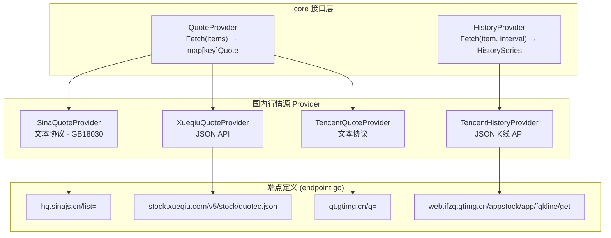
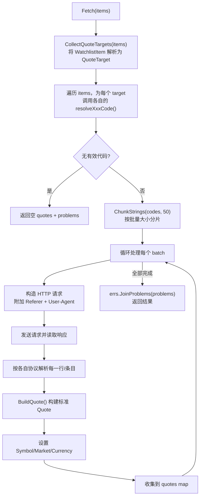

本文深入解析 InvestGo 项目中三个国内金融数据源的架构设计、代码映射协议与市场覆盖差异。这三个 Provider 均通过非官方 Web 接口获取行情数据，各自采用截然不同的数据序列化格式——新浪与腾讯使用文本协议解析，雪球使用标准 JSON。理解它们的实现差异对于排查行情数据问题、扩展新市场支持或选择最佳默认数据源至关重要。

Sources: [model.go](internal/core/model.go#L320-L327), [registry.go](internal/core/marketdata/registry.go#L218-L255)

## 架构总览：三个 Provider 的统一接口与差异化实现

三个 Provider 均实现 `core.QuoteProvider` 接口，在 Registry 中以统一方式注册。区别在于：新浪和雪球仅提供实时行情（Quote-only），而腾讯额外实现了 `core.HistoryProvider` 接口，可提供前复权（QFQ）日K、周K、月K历史数据。

Registry 注册时，每个 Provider 被包装为 `DataSource`，声明其支持的市场列表和功能能力：

Sources: [model.go](internal/core/model.go#L348-L374), [registry.go](internal/core/marketdata/registry.go#L218-L255)

## 默认路由与市场覆盖

系统为三个主要市场区域设定了默认行情源。新浪作为 A 股默认源、雪球作为港股默认源，而美股默认使用 Yahoo Finance（不属于本文范围）。下表总结了三个国内源的注册信息与默认分配：

| 属性 | 新浪 Sina | 雪球 Xueqiu | 腾讯 Tencent |
|------|-----------|-------------|-------------|
| **Registry ID** | `sina` | `xueqiu` | `tencent` |
| **Provider 名称** | Sina Finance | Xueqiu | Tencent Finance |
| **默认市场分配** | CN（A 股） | HK（港股） | — |
| **HTTP 超时** | 8 秒 | 8 秒 | 10 秒 |
| **批量大小** | 50 | 50 | 50 |
| **实时行情** | ✅ | ✅ | ✅ |
| **历史 K 线** | ❌ | ❌ | ✅ (日K/周K/月K) |
| **响应编码** | GB18030 | UTF-8 JSON | UTF-8 文本 / JSON |
| **协议格式** | `var hq_str_*=` 逗号分隔 | JSON 对象数组 | `v_*=` 波浪号分隔 |

三个 Provider 均声明支持完整的市场列表：`CN-A`、`CN-GEM`、`CN-STAR`、`CN-ETF`、`HK-MAIN`、`HK-GEM`、`HK-ETF`、`US-STOCK`、`US-ETF`。但在实际代码映射中，雪球**不支持的北交所（BJ）**市场——这在后文的符号映射章节详述。

Sources: [model.go](internal/core/model.go#L320-L327), [registry.go](internal/core/marketdata/registry.go#L218-L255), [sina.go](internal/core/provider/sina.go#L19-L28), [xueqiu.go](internal/core/provider/xueqiu.go#L40-L47), [tencent.go](internal/core/provider/tencent.go#L86-L100)

## Fetch 流程：统一的批处理与错误收集模式

三个 Provider 的 `Fetch` 方法遵循完全相同的执行骨架，差异仅在于符号映射规则和响应解析逻辑：

**错误收集机制**是该流程的关键设计。每个环节（符号解析失败、网络请求失败、单条数据解析失败）产生的错误以字符串形式追加到 `problems` 切片中，最终通过 `errs.JoinProblems` 合并返回。这种设计保证了单个标的失败不会阻断整个批量请求——其余有效标的行情仍能正常返回。

Sources: [sina.go](internal/core/provider/sina.go#L34-L104), [xueqiu.go](internal/core/provider/xueqiu.go#L53-L159), [tencent.go](internal/core/provider/tencent.go#L104-L171), [helpers.go](internal/core/provider/helpers.go#L20-L35)

## 符号映射：QuoteTarget 到数据源本地代码的转换

`core.ResolveQuoteTarget` 首先将用户输入的原始符号（如 `600519`、`AAPL`、`00700.HK`）规范化为统一的 `QuoteTarget`，其 `Key` 字段采用 `{代码}.{交易所}` 格式（如 `600519.SH`）。随后，每个 Provider 将此标准格式转换为各自 API 所需的本地代码格式：

| 标准格式 (QuoteTarget.Key) | 新浪 Sina | 雪球 Xueqiu | 腾讯 Tencent |
|---------------------------|-----------|-------------|-------------|
| `600519.SH`（沪市 A 股） | `sh600519` | `SH600519` | `sh600519` |
| `000001.SZ`（深市 A 股） | `sz000001` | `SZ000001` | `sz000001` |
| `430047.BJ`（北交所） | `bj430047` | ❌ 不支持 | ❌ 不支持 |
| `00700.HK`（港股） | `rt_hk00700` | `HK00700` | `hk00700` |
| `AAPL`（美股） | `gb_aapl` | `AAPL` | `usAAPL.OQ` |

值得注意的细节差异：

- **新浪港股**使用 `rt_hk` 前缀（real-time Hong Kong），且港股代码需补齐至 5 位。
- **腾讯美股**使用 `us` 前缀，并在符号后将连字符替换为点号、附加交易所后缀（`.OQ` 或 `.N`）。在历史数据场景中，腾讯会同时尝试 `.OQ`（NYSE Arca）和 `.N`（NYSE）两个候选代码，返回第一个成功的结果。
- **雪球**的符号映射最为简洁——A 股直接使用大写交易所前缀（`SH`/`SZ`），港股使用 `HK` 前缀，美股直接使用原始符号。

Sources: [sina.go](internal/core/provider/sina.go#L106-L121), [xueqiu.go](internal/core/provider/xueqiu.go#L169-L184), [tencent.go](internal/core/provider/tencent.go#L326-L363)

## 新浪 Finance：文本协议与多市场字段布局

新浪行情 API（`hq.sinajs.cn/list=`）返回的是一种类似 JavaScript 变量赋值的文本协议。每个标的占一行，格式为 `var hq_str_{code}="{fields}";`，字段之间以逗号分隔。由于响应使用 **GB18030 编码**（中文股票名称），系统通过 `FetchTextWithHeaders` 的 `decodeGB18030` 参数触发自动转码。

不同市场类型具有**完全不同的字段布局**，这是新浪解析器最复杂的部分：

**A 股 / 创业板 / 科创板 / ETF（`sh`/`sz`/`bj` 前缀）**

| 字段索引 | 0 | 1 | 2 | 3 | 4 | 5 | 8 |
|---------|---|---|---|---|---|---|---|
| 含义 | 名称 | 开盘价 | 昨收 | 当前价 | 最高 | 最低 | 成交量 |

前 6 个字段是紧凑排列的核心价格字段，成交量在第 8 位。币种默认 CNY。

**港股（`rt_hk` 前缀）**

| 字段索引 | 1 | 2 | 3 | 4 | 5 | 6 | 12 | 17-18 |
|---------|---|---|---|---|---|---|----|-------|
| 含义 | 名称 | 开盘价 | 昨收 | 最高 | 最低 | 当前价 | 成交量 | 更新时间 |

港股布局中字段 0 未知（跳过），名称移到第 1 位，当前价在第 6 位而非第 3 位。更新时间由字段 17（日期）和 18（时间）拼接解析。币种默认 HKD。

**美股（`gb_` 前缀）**

| 字段索引 | 0 | 1 | 2 | 4 | 5 | 6 | 7 | 10 | 12 |
|---------|---|---|---|---|---|---|---|----|----|
| 含义 | 名称 | 当前价 | 涨跌幅% | 涨跌额 | 开盘价 | 最高 | 最低 | 成交量 | 市值 |

美股布局最为特殊：字段 3 是日期时间字符串（不用于价格），昨收价通过 `当前价 - 涨跌额` 反推计算。额外提供市值字段（第 12 位）。币种默认 USD。

`ParseSinaQuoteLine` 函数负责从原始文本行中提取代码和字段数组：先验证 `var hq_str_` 前缀，定位等号位置，再去除尾部分号和引号，最后以逗号分隔得到字段切片。

Sources: [sina.go](internal/core/provider/sina.go#L34-L121), [sina.go](internal/core/provider/sina.go#L123-L205), [helpers.go](internal/core/provider/helpers.go#L121-L162), [endpoint.go](internal/core/endpoint/endpoint.go#L13-L16)

## 雪球 Xueqiu：标准 JSON API 与字段安全

雪球是三个 Provider 中唯一使用标准 JSON 响应格式的数据源。其行情 API（`stock.xueqiu.com/v5/stock/realtime/quotec.json`）返回结构化的 JSON 对象，通过 `xueqiuQuoteResponse` 结构体直接反序列化。

雪球的请求需要设置三个关键 HTTP 头：`User-Agent`、`Referer`（`https://xueqiu.com/`）和 `Origin`（`https://xueqiu.com`），其中 Origin 头是雪球 API 的**跨域验证必需项**，缺少会导致请求被拒绝。

响应结构中的关键字段均使用 `*float64` 指针类型，这保证了当某个字段缺失时不会误用零值——通过 `derefFloat64` 辅助函数安全解引用。同时，响应包含 `error_code` 和 `error_description` 字段用于业务层面的错误报告（非零 `error_code` 表示雪球服务端错误）。

雪球的符号传递方式也较为独特——多个标的通过 `symbol` 查询参数以逗号分隔传递，而非拼接到 URL 路径中。这使得 URL 构建使用标准的 `url.Values.Encode()` 方法。

Sources: [xueqiu.go](internal/core/provider/xueqiu.go#L23-L38), [xueqiu.go](internal/core/provider/xueqiu.go#L82-L159), [xueqiu.go](internal/core/provider/xueqiu.go#L162-L184), [endpoint.go](internal/core/endpoint/endpoint.go#L20-L23)

## 腾讯 Finance：双协议设计（行情文本 + 历史 JSON）

腾讯 Provider 是三个国内源中最复杂的一个，因为它同时实现了行情和历史两个 Provider，且两种接口使用了**完全不同的数据格式**。

### 实时行情：波浪号分隔文本协议

腾讯行情 API（`qt.gtimg.cn/q=`）返回类似新浪的文本协议，但以 `v_` 为前缀、波浪号 `~` 为字段分隔符。每个标的占一行，格式为 `v_{code}="{fields}";`。

`parseTencentQuoteLine` 函数执行与新浪类似的文本行解析，但分隔符为 `~`。腾讯行情响应的字段数量远多于新浪——`buildTencentQuote` 要求至少 **38 个字段**，其中关键字段分布在较分散的索引位置：

| 字段索引 | 1 | 3 | 4 | 5 | 30 | 31 | 32 | 33 | 34 | 35 | 36 | 44 |
|---------|---|---|---|---|----|----|----|----|----|----|----|----|
| 含义 | 名称 | 当前价 | 昨收 | 开盘 | 更新时间 | 涨跌额 | 涨跌幅% | 最高 | 最低 | 币种 | 成交量 | 市值 |

两个特殊换算规则体现了腾讯数据的本地化特征：A 股成交量（字段 36）以"手"为单位（每手 100 股），代码中乘以 100 转换为股数；市值（字段 44）以"亿"为单位，代码中乘以 1e8 还原为原始单位。

### 历史 K 线：JSON API 与前复权

`TencentHistoryProvider.Fetch` 是一个多候选代码的降级尝试过程。对于美股，它会依次尝试 `us{symbol}.OQ` 和 `us{symbol}.N` 两个代码，返回第一个成功结果。

历史 K 线 API（`web.ifzq.gtimg.cn/appstock/app/fqkline/get`）返回标准 JSON，其核心数据结构 `tencentKlineRow` 实现了自定义的 `UnmarshalJSON` 方法来处理腾讯的特殊数组格式——每条 K 线记录是一个 JSON 数组 `[date, open, close, high, low, volume, ...]`，其中价格元素可能是字符串（`"16.88"`）或裸数字（`16.88`）。`tencentParseRawFloat` 函数通过 `json.Number` 统一处理这两种情况。

历史接口的参数映射规则：

| 前端 Interval | period | begin | end | count | qfq |
|---------------|--------|-------|-----|-------|-----|
| `1w` / `1mo` / `1y` | `day` | 1年前 | 今天 | 500 | `qfq` |
| `3y` / `all` | `week` | 5年前 | 今天 | 500 | `qfq` |

腾讯历史 API 的响应中包含多套 K 线数据（`day`、`week`、`month`、`qfqday`），`selectTencentHistoryRows` 根据请求参数选择对应的集合——当请求日线 + 前复权时优先使用 `qfqday`，否则按 period 选择 `day`/`week`/`month`。股票名称从响应的 `qt` 字段中提取。

Sources: [tencent.go](internal/core/provider/tencent.go#L27-L84), [tencent.go](internal/core/provider/tencent.go#L102-L200), [tencent.go](internal/core/provider/tencent.go#L268-L419), [tencent.go](internal/core/provider/tencent.go#L365-L389)

## 共享基础设施：Helpers 层

三个 Provider 共用 [helpers.go](internal/core/provider/helpers.go) 中的一组工具函数，它们构成了 Provider 层的公共基础设施：

- **`CollectQuoteTargets`**：将 `[]WatchlistItem` 统一解析为 `map[string]QuoteTarget`，收集所有解析失败项。
- **`BuildQuote`**：从核心价格字段（名称、当前价、昨收、开盘、最高、最低、时间、来源）构建标准 `core.Quote`，自动计算涨跌额和涨跌幅。
- **`ChunkStrings`**：通用字符串切片分片器，三个 Provider 均使用它将代码列表按 50 个一批分割。
- **`FetchTextWithHeaders`**：带自定义请求头的 GET 方法，核心特性是可选的 GB18030 解码（新浪行情唯一启用此参数）。
- **`DecodeGB18030Body`**：使用 `golang.org/x/text/encoding/simplifiedchinese` 进行编码转换，并处理 BOM 头。
- **`ParseFloat`** / **`ParseTimestamp`** / **`PartsAt`**：安全解析工具，处理缺失值、异常格式和越界访问。

Sources: [helpers.go](internal/core/provider/helpers.go#L20-L162), [helpers.go](internal/core/provider/helpers.go#L203-L256)

## 历史数据路由与腾讯的角色

在 [HistoryRouter](internal/core/marketdata/history_router.go) 的降级链设计中，三个国内源的地位并不平等。由于新浪和雪球没有注册历史 Provider，它们在历史路由链中被**自动跳过**：

| 市场组 | 默认历史降级链 | 腾讯的角色 |
|--------|---------------|-----------|
| CN（A 股 / 创业板 / 科创板 / ETF） | `yahoo → eastmoney` | 链外（仅当用户手动选择 `tencent` 作为行情源时生效） |
| HK（港股主板 / 创业板 / ETF） | `yahoo → eastmoney` | 链外（同上） |
| US（美股 / ETF） | `yahoo → finnhub → polygon → alpha-vantage → twelve-data → eastmoney` | 链外（同上） |

这意味着腾讯历史能力是一个**隐藏的备选通道**：只有当用户在设置中将行情源切换为 `tencent` 时，HistoryRouter 才会将腾讯作为历史数据的第一优先源。默认配置下，历史数据始终通过 Yahoo Finance 或 EastMoney 获取。

Sources: [history_router.go](internal/core/marketdata/history_router.go#L82-L161), [model.go](internal/core/model.go#L323-L327)

## 反爬虫策略：请求头伪装

三个 Provider 均需设置浏览器模拟请求头来绕过数据源的反爬虫检测，但各自要求不同：

| Provider | 必需请求头 | 备注 |
|----------|-----------|------|
| **新浪** | `Referer: https://finance.sina.com.cn/` + User-Agent | 缺少 Referer 会返回空数据 |
| **雪球** | `Referer: https://xueqiu.com/` + `Origin: https://xueqiu.com` + User-Agent | Origin 头是 CORS 校验必需 |
| **腾讯** | `Referer: https://gu.qq.com/` + User-Agent | 行情与历史接口均需设置 |

三个 Provider 使用完全相同的 User-Agent 字符串：`Mozilla/5.0 (Macintosh; Intel Mac OS X 10_15_7) AppleWebKit/537.36 (KHTML, like Gecko) Chrome/131.0.0.0 Safari/537.36`。

Sources: [sina.go](internal/core/provider/sina.go#L63-L66), [xueqiu.go](internal/core/provider/xueqiu.go#L90-L91), [tencent.go](internal/core/provider/tencent.go#L133-L136), [tencent.go](internal/core/provider/tencent.go#L218-L219), [endpoint.go](internal/core/endpoint/endpoint.go#L13-L24)

## 延伸阅读

- **Provider 注册与路由机制**的完整上下文见 [市场数据 Provider 注册表与路由机制](8-shi-chang-shu-ju-provider-zhu-ce-biao-yu-lu-you-ji-zhi)。
- **符号规范化**的完整规则见 [行情解析器：多市场代码规范化](9-xing-qing-jie-xi-qi-duo-shi-chang-dai-ma-gui-fan-hua)。
- **历史降级链**的完整设计见 [HistoryRouter：历史数据降级链与市场感知路由](10-historyrouter-li-shi-shu-ju-jiang-ji-lian-yu-shi-chang-gan-zhi-lu-you)。
- 另一个重要的国内数据源见 [EastMoney Provider：实时行情与历史 K 线](26-eastmoney-provider-shi-shi-xing-qing-yu-li-shi-k-xian)。