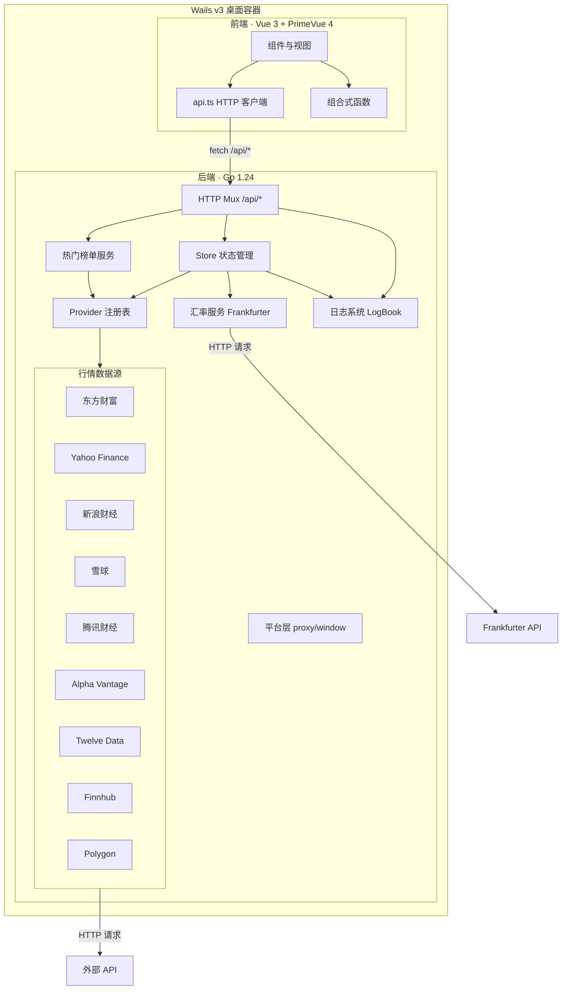

本文梳理 InvestGo 项目的完整技术栈与依赖关系，帮助开发者快速建立对项目"由哪些技术组成、它们各负责什么"的全局认知。内容涵盖后端、前端、行情数据源、构建工具链四个维度，不涉及具体实现细节——那些将在后续深度解析页面中展开。

## 整体架构一览

InvestGo 的核心设计思路是：**Go 后端通过标准 HTTP API 为前端提供数据，Wails v3 仅作为轻量桌面容器**。前端不依赖 Wails JS bindings，而是通过 `fetch()` 调用 `/api/*` 端点，这使得前端可以在纯浏览器（Vite dev server）中独立运行，大幅降低开发调试门槛。

下面的 Mermaid 图展示了运行时的分层结构与数据流向。在阅读此图之前，你需要理解三个关键概念：**Wails 容器**负责将前端构建产物嵌入桌面二进制并提供原生窗口；**HTTP API 层**是前后端通信的唯一通道；**Provider 注册表**是所有行情数据源的中央管理器。



Sources: [main.go](main.go#L21-L22), [README.zh-CN.md](README.zh-CN.md#L6-L8)

## 后端技术栈

后端使用 Go 1.24 编写，以 Wails v3 alpha.54 作为桌面运行时。应用不依赖任何 Web 框架——HTTP 层直接使用标准库 `net/http.ServeMux`，状态持久化使用本地 JSON 文件，不引入数据库。

Sources: [go.mod](go.mod#L1-L9), [main.go](main.go#L96-L101)

### 核心后端依赖

| 依赖包                                  | 版本     | 用途                                                    |
| --------------------------------------- | -------- | ------------------------------------------------------- |
| `github.com/wailsapp/wails/v3`          | alpha.54 | 桌面应用框架：原生窗口、资源嵌入、生命周期管理          |
| `golang.org/x/text`                     | v0.33.0  | Unicode 文本处理，用于行情数据解析中的编码处理          |
| `github.com/refraction-networking/utls` | v1.8.2   | TLS 指纹模拟，帮助 HTTP 请求通过部分 API 网关的反爬策略 |
| `github.com/samber/lo`                  | v1.52.0  | Go 泛型工具函数库，简化切片/映射操作                    |
| `github.com/bep/debounce`               | v1.2.1   | 防抖函数，用于 UI 交互中的高频操作节流                  |

Sources: [go.mod](go.mod#L5-L52)

值得特别说明的是，后端的内部包结构遵循了 Go 标准的 `internal/` 约定，按职责清晰分层：

| 内部包                     | 职责                                                     |
| -------------------------- | -------------------------------------------------------- |
| `internal/api`             | HTTP 路由与处理器、请求/响应序列化、国际化错误消息       |
| `internal/core/store`      | 核心状态管理：JSON 持久化、行情刷新、组合概览、提醒计算  |
| `internal/core/marketdata` | Provider 注册表与历史数据路由器                          |
| `internal/core/provider`   | 各行情数据源的具体实现（9 个 Provider）                  |
| `internal/core/hot`        | 热门榜单服务：缓存、搜索、排序、并发抓取                 |
| `internal/core/fx`         | 汇率服务（Frankfurter API）与多币种折算                  |
| `internal/core/endpoint`   | 外部 API 端点定义                                        |
| `internal/platform`        | 平台差异隔离：系统代理检测、窗口配置                     |
| `internal/logger`          | LogBook 日志系统：内存环形缓冲 + 文件输出 + 前端日志桥接 |
| `internal/common/cache`    | 通用 TTL 缓存                                            |
| `internal/common/errs`     | 通用错误类型                                             |

Sources: [main.go](main.go#L13-L19), [internal/core/store/store.go](internal/core/store/store.go#L17-L48)

## 前端技术栈

前端采用 Vue 3（Composition API）+ TypeScript，UI 组件库为 PrimeVue 4，图表使用 Chart.js 4，构建工具为 Vite 8。整个前端位于 `frontend/` 目录，是标准的 Vite 单页应用项目。

Sources: [package.json](package.json#L1-L20), [frontend/src/main.ts](frontend/src/main.ts#L1-L24)

### 前端依赖详解

| 依赖                 | 版本    | 类型   | 用途                                                        |
| -------------------- | ------- | ------ | ----------------------------------------------------------- |
| `vue`                | ^3.5.32 | 运行时 | 响应式 UI 框架，使用 `<script setup>` + Composition API     |
| `primevue`           | ^4.5.4  | 运行时 | UI 组件库：按钮、对话框、表格、输入框、菜单等               |
| `@primeuix/themes`   | ^2.0.3  | 运行时 | PrimeVue 主题引擎，支持 `definePreset`、`palette`、动态配色 |
| `primeicons`         | ^7.0.0  | 运行时 | 图标字体库，为 PrimeVue 组件和侧栏导航提供图标              |
| `chart.js`           | ^4.5.1  | 运行时 | 图表渲染库，用于持仓分布环形图、趋势面积图、价格 K 线图     |
| `vite`               | ^8.0.7  | 开发   | 构建工具与开发服务器                                        |
| `@vitejs/plugin-vue` | ^6.0.5  | 开发   | Vite 的 Vue 单文件组件编译插件                              |
| `typescript`         | ^6.0.2  | 开发   | 类型检查                                                    |
| `vue-tsc`            | ^3.2.6  | 开发   | Vue 模板类型检查工具                                        |

Sources: [package.json](package.json#L7-L19)

### TypeScript 配置要点

项目面向 ES2022 标准，使用 Bundler 模式解析模块，开启了 `strict` 严格模式。类型系统覆盖所有 `.ts`、`.tsx`、`.vue` 文件：

| 配置项             | 值                        | 说明                    |
| ------------------ | ------------------------- | ----------------------- |
| `target`           | ES2022                    | 编译目标为现代浏览器    |
| `module`           | ESNext                    | 使用最新 ES 模块语法    |
| `moduleResolution` | Bundler                   | 由 Vite 处理模块解析    |
| `strict`           | true                      | 启用全部严格类型检查    |
| `lib`              | ES2022, DOM, DOM.Iterable | 包含浏览器 API 类型定义 |

Sources: [tsconfig.json](tsconfig.json#L1-L18)

### 前端代码组织

前端的代码结构遵循 Vue 3 Composition API 的推荐实践，按功能角色划分文件和目录：

```
frontend/src/
├── main.ts              # 应用入口：创建 Vue 实例、挂载 PrimeVue
├── App.vue              # 根组件：全局状态管理、设置同步、模块路由
├── api.ts               # HTTP 客户端封装：超时、取消、错误日志
├── wails-runtime.ts     # Wails 运行时桥接：窗口操作的安全包装
├── types.ts             # TypeScript 类型定义（与后端模型对齐）
├── i18n.ts              # 国际化：中英双语文案管理
├── theme.ts             # PrimeVue 主题配置：配色方案、动态切换
├── format.ts            # 格式化工具：金额、百分比、日期
├── forms.ts             # 表单默认值与校验
├── constants.ts         # 常量定义
├── devlog.ts            # 前端开发日志捕获
├── components/          # UI 组件
│   ├── AppShell.vue     # 应用壳：布局管理
│   ├── AppHeader.vue    # 顶部栏：搜索、状态
│   ├── AppSidebar.vue   # 侧栏：标的选择
│   ├── AppWorkspace.vue # 工作区：模块容器
│   ├── ModuleTabs.vue   # 模块标签页切换
│   ├── PriceChart.vue   # Chart.js 图表组件
│   ├── SummaryStrip.vue # 摘要卡片条
│   ├── dialogs/         # 对话框组件（添加/编辑标的、提醒、确认）
│   └── modules/         # 功能模块视图（6 个）
├── composables/         # 组合式函数（Vue 3 可复用逻辑）
│   ├── useHistorySeries.ts      # 历史数据加载与缓存
│   ├── useItemDialog.ts         # 标的编辑对话框状态
│   ├── useAlertDialog.ts        # 提醒对话框状态
│   ├── useConfirmDialog.ts      # 确认对话框状态
│   ├── useDeveloperLogs.ts      # 开发日志轮询
│   └── useSidebarLayout.ts      # 侧栏布局计算
└── styles/              # 全局样式
    ├── forms.css        # 表单样式
    ├── tables.css       # 表格样式
    └── overrides.css    # PrimeVue 样式覆盖
```

Sources: [frontend/src/main.ts](frontend/src/main.ts#L1-L24), [frontend/src/wails-runtime.ts](frontend/src/wails-runtime.ts#L1-L43), [frontend/src/theme.ts](frontend/src/theme.ts#L1-L44)

## 行情数据源总览

InvestGo 内建了 9 个行情数据源 Provider，通过统一的 `QuoteProvider` 和 `HistoryProvider` 接口注册到 `Registry`，再由 Store 和 HistoryRouter 按市场类型自动路由。用户可在设置界面中按市场（A 股、港股、美股）独立选择行情源。

| 数据源               | 实时行情 | 历史 K 线 | 支持市场         | API Key |
| -------------------- | :------: | :-------: | ---------------- | :-----: |
| 东方财富 (EastMoney) |    ✅    |    ✅     | A 股、港股、美股 | 不需要  |
| Yahoo Finance        |    ✅    |    ✅     | A 股、港股、美股 | 不需要  |
| 新浪财经 (Sina)      |    ✅    |     —     | A 股、港股、美股 | 不需要  |
| 雪球 (Xueqiu)        |    ✅    |     —     | A 股、港股、美股 | 不需要  |
| 腾讯财经 (Tencent)   |    ✅    |    ✅     | A 股、港股、美股 | 不需要  |
| Alpha Vantage        |    ✅    |    ✅     | 美股             |  需要   |
| Twelve Data          |    ✅    |    ✅     | 美股             |  需要   |
| Finnhub              |    ✅    |    ✅     | 美股             |  需要   |
| Polygon              |    ✅    |    ✅     | 美股             |  需要   |

Sources: [internal/core/marketdata/registry.go](internal/core/marketdata/registry.go#L185-L294)

其中，汇率数据由独立的 Frankfurter API 服务获取，用于将不同币种的持仓折算为用户选择的展示货币（如人民币、美元、港币）。

Sources: [internal/core/store/store.go](internal/core/store/store.go#L71)

## 构建与开发工具链

| 工具                        | 用途                                                                       |
| --------------------------- | -------------------------------------------------------------------------- |
| **Vite 8**                  | 前端开发服务器 + 生产构建                                                  |
| **Go 编译器 (1.24+)**       | 后端编译与 `-ldflags` 版本注入                                             |
| **Wails v3 CLI**            | 桌面应用构建集成（资源嵌入、平台绑定）                                     |
| **Shell 脚本**              | macOS 构建与打包（`build-darwin-aarch64.sh`、`package-darwin-aarch64.sh`） |
| **Swift / sips / iconutil** | 应用图标渲染与 `.icns` 转换                                                |
| **hdiutil / ditto**         | macOS `.dmg` 磁盘镜像打包                                                  |

前端开发服务器运行在 **5173 端口**，此模式下没有 Wails 运行时——`wails-runtime.ts` 中的所有调用都会安全降级为空操作。这确保了浏览器开发与桌面运行的一致性。

Sources: [vite.config.ts](vite.config.ts#L1-L18), [README.zh-CN.md](README.zh-CN.md#L64-L69), [frontend/src/wails-runtime.ts](frontend/src/wails-runtime.ts#L19-L27)

## 下一步阅读

理解了技术栈全貌后，你可以按照以下顺序深入了解各个部分：

1. **搭建本地环境**：[开发环境搭建与调试模式](4-kai-fa-huan-jing-da-jian-yu-diao-shi-mo-shi) — 一步步跑起前端开发服务器和桌面应用
2. **理解启动流程**：[应用启动流程与初始化](6-ying-yong-qi-dong-liu-cheng-yu-chu-shi-hua) — 从 `main()` 到窗口出现的完整链路
3. **掌握核心状态**：[Store：核心状态管理与持久化](7-store-he-xin-zhuang-tai-guan-li-yu-chi-jiu-hua) — 理解前后端数据流的核心枢纽
4. **了解行情路由**：[市场数据 Provider 注册表与路由机制](8-shi-chang-shu-ju-provider-zhu-ce-biao-yu-lu-you-ji-zhi) — 9 个 Provider 如何被选择和调用
