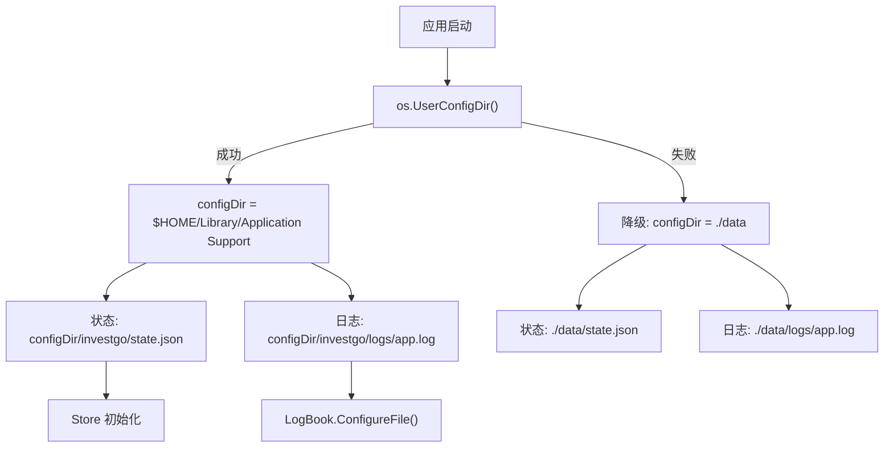
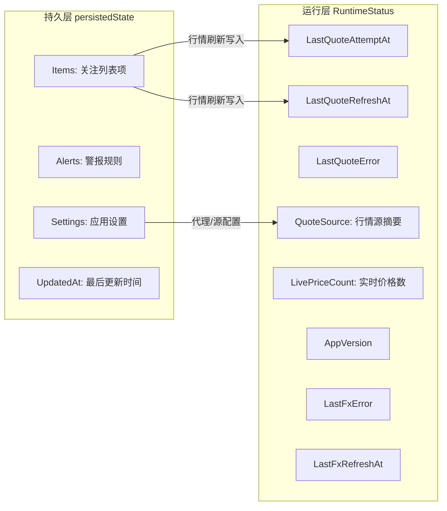
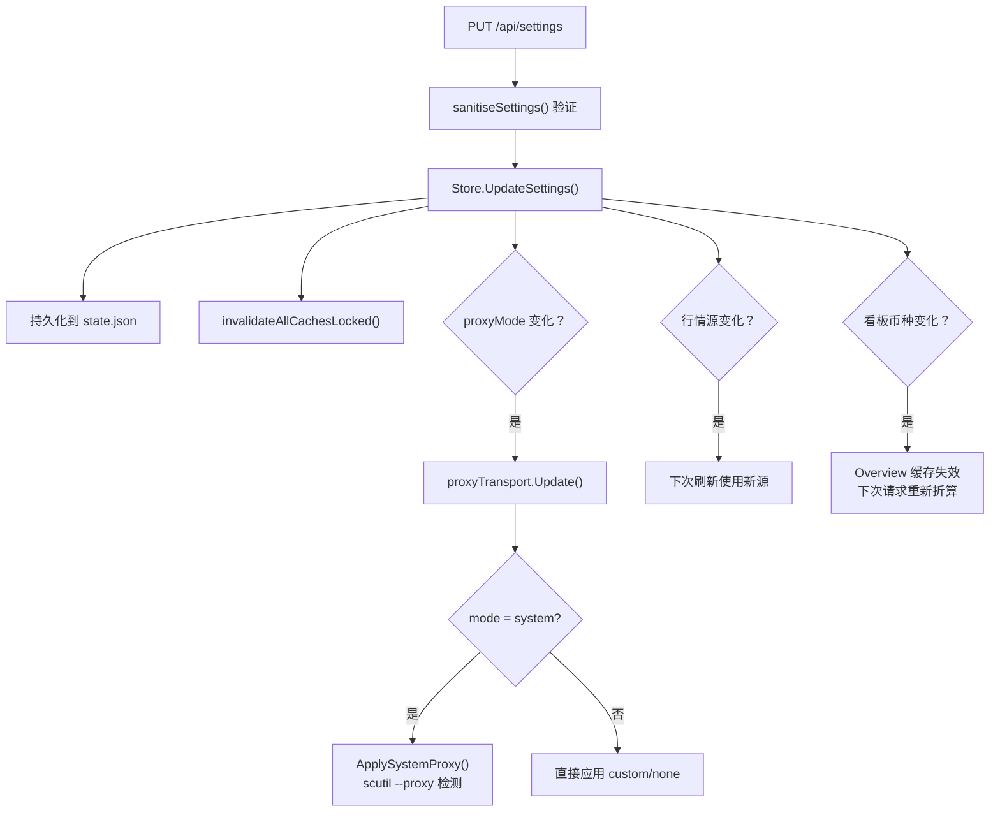

InvestGo 作为桌面应用，需要在本地磁盘持久化用户数据（关注列表、持仓、警报规则、设置项），同时在运行时维护一组动态状态（行情刷新时间、汇率状态、代理配置等）。本文将从**文件存储路径**、**运行时配置机制**、**设置项全解**和**构建时注入变量**四个维度，系统梳理状态存储与运行时配置的完整图景。

## 存储路径体系

### 路径解析策略

InvestGo 的核心状态文件与日志文件路径，均通过 `os.UserConfigDir()` 动态解析。该函数在不同操作系统上返回的基准目录如下：

| 操作系统 | `os.UserConfigDir()` 返回值 | 状态文件完整路径 | 日志文件完整路径 |
|---------|---------------------------|----------------|----------------|
| **macOS** | `$HOME/Library/Application Support` | `~/Library/Application Support/investgo/state.json` | `~/Library/Application Support/investgo/logs/app.log` |
| **Windows** | `%AppData%` | `%AppData%\investgo\state.json` | `%AppData%\investgo\logs\app.log` |
| **Linux** | `$XDG_CONFIG_HOME` 或 `$HOME/.config` | `$XDG_CONFIG_HOME/investgo/state.json` | `$XDG_CONFIG_HOME/investgo/logs/app.log` |

当 `os.UserConfigDir()` 调用失败时（极罕见），两条路径均降级为当前工作目录下的 `./data/` 子目录，确保应用不会因路径问题而无法启动。

Sources: [main.go](main.go#L151-L168)

### 路径解析流程

两个路径在 `main()` 中以不同的函数分别计算：`defaultStatePath()` 负责状态文件路径，`defaultLogPath()` 负责日志文件路径。状态路径传入 `store.NewStore()`，日志路径传入 `logs.ConfigureFile()`，两条管线完全独立但遵循相同的目录解析逻辑。

Sources: [main.go](main.go#L38-L48), [main.go](main.go#L61-L72)

### 文件存储与原子写入

状态持久化由 `JSONRepository` 抽象层负责，它实现了 `Repository` 接口，提供三个核心方法：

| 方法 | 职责 | 关键行为 |
|------|------|---------|
| `Load(target)` | 从磁盘加载状态到 `target` | 文件不存在时返回 `(false, nil)`，自动创建父目录 |
| `Save(source)` | 将 `source` 持久化到磁盘 | **原子写入**：先写 `.tmp` 临时文件，再 `os.Rename` 替换原文件 |
| `Path()` | 返回当前存储路径 | 用于 `StateSnapshot.StoragePath` 暴露给前端 |

原子写入机制（`.tmp` + `os.Rename`）是关键的可靠性设计：即使写入过程中应用崩溃或断电，也不会损坏已有的 `state.json`，因为 `os.Rename` 在 POSIX 文件系统上是原子操作。JSON 输出使用 `json.MarshalIndent` 格式化，便于调试时人工阅读。

Sources: [repository.go](internal/core/store/repository.go#L11-L76)

## 运行时配置体系

### 双层状态架构

InvestGo 的运行时状态采用**持久层 + 运行层**双层架构，两者在 `Store` 结构体中并存：

**持久层** (`persistedState`) 的所有字段都会被序列化到 `state.json`，是跨会话保持的核心数据。**运行层** (`RuntimeStatus`) 仅在内存中维护，记录上一次行情刷新时间、错误状态、汇率状态等瞬时信息，应用重启后重置。这两层通过 `StateSnapshot` 合并输出给前端——`StateSnapshot` 同时包含 `Settings`（来自持久层）和 `Runtime`（来自运行层），前端无需关心数据来源的差异。

Sources: [state.go](internal/core/store/state.go#L12-L17), [model.go](internal/core/model.go#L296-L318)

### 首次启动与种子数据

当 `JSONRepository.Load()` 发现 `state.json` 不存在时（返回 `found=false, err=nil`），Store 会调用 `seedState()` 生成一份示范状态并立即持久化。种子数据包含两个预设关注项（阿里巴巴港股 09988.HK 和 VOO 美股 ETF）及两条示例警报规则，让新用户首次打开应用时就能看到完整的界面布局和数据结构。

种子数据的设置项使用系统默认值：行情源分别为 `sina`（CN）、`xueqiu`（HK）、`yahoo`（US），主题跟随系统，代理模式为 `system`，看板币种为 `CNY`。

Sources: [state.go](internal/core/store/state.go#L20-L32), [seed.go](internal/core/store/seed.go#L10-L93)

### 状态规范化（normaliseLocked）

每次从磁盘加载状态后，Store 都会执行 `normaliseLocked()` 对数据进行规范化修复。这确保了历史版本升级时的向后兼容性。规范化逻辑涵盖三个层次：

| 规范化类别 | 处理内容 | 默认值 |
|-----------|---------|--------|
| **空值防御** | `Items` / `Alerts` 为 nil 时初始化为空切片 | `[]` |
| **设置项默认** | 各种设置字段为空/零值时回填默认值 | 详见下方设置项表 |
| **历史数据修复** | 旧版 Items 缺少 ID/Name/UpdatedAt 时自动补全 | 自动生成 ID，Name 取 Symbol，UpdatedAt 取当前时间 |

Sources: [state.go](internal/core/store/state.go#L45-L121)

## 设置项全解

`AppSettings` 是持久化设置的完整结构体，包含 18 个字段，分为 5 个功能域。所有设置通过 `PUT /api/settings` 接口更新，由 `sanitiseSettings()` 函数统一验证和规范化。

### 功能域与字段明细

| 功能域 | 字段 | 类型 | 合法值 | 默认值 | 说明 |
|-------|------|------|--------|--------|------|
| **行情源** | `cnQuoteSource` | string | 注册表中有效的 CN 源 ID | `"sina"` | A 股行情数据源 |
| | `hkQuoteSource` | string | 注册表中有效的 HK 源 ID | `"xueqiu"` | 港股行情数据源 |
| | `usQuoteSource` | string | 注册表中有效的 US 源 ID | `"yahoo"` | 美股行情数据源 |
| | `hotCacheTTLSeconds` | int | ≥ 10 | `60` | 热门榜单/行情刷新缓存 TTL（秒） |
| **显示** | `themeMode` | string | `system` / `light` / `dark` | `"system"` | 主题模式 |
| | `colorTheme` | string | `blue` / `graphite` / `forest` / `sunset` / `rose` / `violet` / `amber` | `"blue"` | 配色方案 |
| | `fontPreset` | string | `system` / `reading` / `compact` | `"system"` | 字体预设 |
| | `amountDisplay` | string | `full` / `compact` | `"full"` | 金额显示模式 |
| | `currencyDisplay` | string | `symbol` / `code` | `"symbol"` | 币种显示方式 |
| | `priceColorScheme` | string | `cn` / `intl` | `"cn"` | 涨跌配色（中国红涨/国际绿涨） |
| **区域** | `locale` | string | `system` / `zh-CN` / `en-US` | `"system"` | 界面语言 |
| | `dashboardCurrency` | string | `CNY` / `HKD` / `USD` | `"CNY"` | 看板汇总币种 |
| **网络** | `proxyMode` | string | `none` / `system` / `custom` | `"system"` | 代理模式 |
| | `proxyURL` | string | 有效 HTTP(S) URL | `""` | 自定义代理地址（仅 `custom` 模式） |
| **API 密钥** | `alphaVantageApiKey` | string | 任意非空字符串 | `""` | Alpha Vantage API 密钥 |
| | `twelveDataApiKey` | string | 任意非空字符串 | `""` | Twelve Data API 密钥 |
| | `finnhubApiKey` | string | 任意非空字符串 | `""` | Finnhub API 密钥 |
| | `polygonApiKey` | string | 任意非空字符串 | `""` | Polygon API 密钥 |
| **开发** | `developerMode` | bool | `true` / `false` | `false` | 开发者模式（启用 F12 调试面板） |
| | `useNativeTitleBar` | bool | `true` / `false` | `false` | 使用系统原生标题栏 |

Sources: [model.go](internal/core/model.go#L117-L138), [settings_sanitize.go](internal/core/store/settings_sanitize.go#L12-L183)

### 设置验证规则

`sanitiseSettings()` 的验证逻辑遵循**合并优先**原则：先以当前设置为基础，逐字段用输入值覆盖非空字段，最后统一验证。关键验证规则包括：

- **行情源校验**：每个市场的行情源 ID 必须在 `quoteProviders` 注册表中存在，且该源必须支持对应市场。若无效则回退到默认源。
- **API 密钥联动**：若 `usQuoteSource` 设置为某个需要密钥的源（如 `alpha-vantage`），则对应密钥字段不能为空，否则返回验证错误。
- **代理模式联动**：`custom` 模式下 `proxyURL` 必须为合法的 HTTP(S) URL（包含 scheme 和 host）。
- **缓存 TTL 下限**：`hotCacheTTLSeconds` 不能低于 10 秒，防止过于激进的刷新频率。

Sources: [settings_sanitize.go](internal/core/store/settings_sanitize.go#L71-L105)

### 设置更新的运行时联动

设置更新并非简单的字段替换——多个设置项会在运行时触发级联行为：

代理配置的联动尤为关键：当用户将代理模式切换为 `system` 时，`platform.ApplySystemProxy()` 会调用 macOS 的 `scutil --proxy` 命令检测系统代理设置，并将其注入到进程环境变量（`HTTPS_PROXY` / `HTTP_PROXY` / `NO_PROXY`），使得 Go 标准库的 `http.ProxyFromEnvironment` 自动生效。设置更新后，`proxyTransport.Update()` 会被立即调用，确保所有后续 HTTP 请求都使用新的代理配置。

Sources: [mutation.go](internal/core/store/mutation.go#L244-L278), [handler.go](internal/api/handler.go#L174-L191), [proxy.go](internal/platform/proxy.go#L18-L63)

## 构建时注入变量

InvestGo 的部分运行时行为通过 **Go ldflags** 在构建时注入，而非从配置文件读取。这些变量定义在 `main.go` 的包级别，由构建脚本在 `go build` 命令中通过 `-X` 标志设置。

| 变量 | 默认值 | 注入方式 | 运行时作用 |
|------|--------|---------|-----------|
| `appVersion` | `"dev"` | `-X main.appVersion=$APP_VERSION` | 显示在 `RuntimeStatus.AppVersion`，前端关于页面和标题栏使用 |
| `defaultTerminalLogging` | `"0"` | `-X main.defaultTerminalLogging=1` | 为 `"1"` 时自动启用终端日志输出（无需 `-dev` 参数） |
| `defaultDevToolsBuild` | `"0"` | `-X main.defaultDevToolsBuild=1` | 为 `"1"` 时允许 F12 打开 Web Inspector |

构建脚本的 `--dev` 选项会同时注入 `defaultTerminalLogging=1` 和 `defaultDevToolsBuild=1`，并添加 `devtools` 构建标签。生产构建仅注入版本号。

Sources: [main.go](main.go#L24-L26), [main.go](main.go#L170-L188), [build-darwin-aarch64.sh](scripts/build-darwin-aarch64.sh#L65-L72)

### 终端日志的条件启用

`terminalLoggingEnabled()` 的判断逻辑是：若 `defaultTerminalLogging` 已在构建时设置为 `"1"`，则直接启用；否则检查命令行参数中是否包含 `-dev` 或 `--dev` 标志。这意味着开发者既可以通过构建时注入实现永久启用，也可以通过运行时参数按需启用，两种方式灵活组合。

Sources: [main.go](main.go#L171-L183)

### 应用关闭时的状态保存

在 Wails 框架的 `OnShutdown` 回调中，Store 会执行一次最终的 `Save()` 操作，确保所有运行时的状态变更（包括最后一次行情刷新的价格）都被持久化。如果保存失败，错误会被记录到日志系统，但不会阻止应用退出。

Sources: [main.go](main.go#L117-L122)

## 缓存策略与 TTL 配置

Store 内部维护四层内存缓存，每层使用 `TTLCache` 实现，缓存失效策略与 `HotCacheTTLSeconds` 设置紧密关联：

| 缓存层 | 键类型 | 最大容量 | TTL 来源 | 失效触发 |
|--------|--------|---------|---------|---------|
| `refreshCache` | `"all"` | 32 | `HotCacheTTLSeconds` | 价格刷新、结构变更 |
| `itemRefreshCache` | `itemID` | 32 | `HotCacheTTLSeconds` | 价格刷新、结构变更 |
| `historyCache` | `itemID:interval` | 512 | 按时间区间分级 | 仅结构变更 |
| `overviewCache` | `displayCurrency` | 16 | `HotCacheTTLSeconds` | 价格刷新、结构变更 |
| `snapshotCache` | (原子指针) | 1 | `state.UpdatedAt` 戳 | 任何状态变更 |

历史数据缓存（`historyCache`）使用独立于 `HotCacheTTLSeconds` 的分级 TTL 策略，因为历史 K 线数据的变化频率远低于实时行情：

| 历史区间 | 缓存 TTL |
|---------|---------|
| 1h | 5 分钟 |
| 1d | 10 分钟 |
| 1w / 1mo | 30 分钟 |
| 1y / 3y / all | 4 小时 |

缓存失效分为两种模式：**全量失效** (`invalidateAllCachesLocked`) 在结构性变更（添加/删除/更新 Item、修改设置）时触发，清空所有缓存层；**价格失效** (`invalidatePriceCachesLocked`) 在行情刷新时触发，仅清空与当前价格相关的缓存层，保留历史数据缓存。

Sources: [cache.go](internal/core/store/cache.go#L20-L90), [cache.go](internal/core/store/cache.go#L55-L66)

## 前端可见的存储信息

`StateSnapshot` 中的 `StoragePath` 字段会将当前状态文件的实际磁盘路径暴露给前端，前端可在「设置 → 开发者」面板中查看此路径，方便高级用户直接定位和备份 `state.json`。同时，`RuntimeStatus` 中的 `LastQuoteError`、`LastFxError` 等字段也是前端状态栏的重要信息来源，帮助用户理解应用当前的运行状况。

Sources: [snapshot.go](internal/core/store/snapshot.go#L61-L74), [model.go](internal/core/model.go#L308-L318)

---

了解状态存储路径与运行时配置后，下一步可以深入 [前端类型检查与后端测试](31-qian-duan-lei-xing-jian-cha-yu-hou-duan-ce-shi) 了解如何验证这些配置和状态管理的正确性，或回看 [Store：核心状态管理与持久化](7-store-he-xin-zhuang-tai-guan-li-yu-chi-jiu-hua) 了解 Store 的整体设计思路。