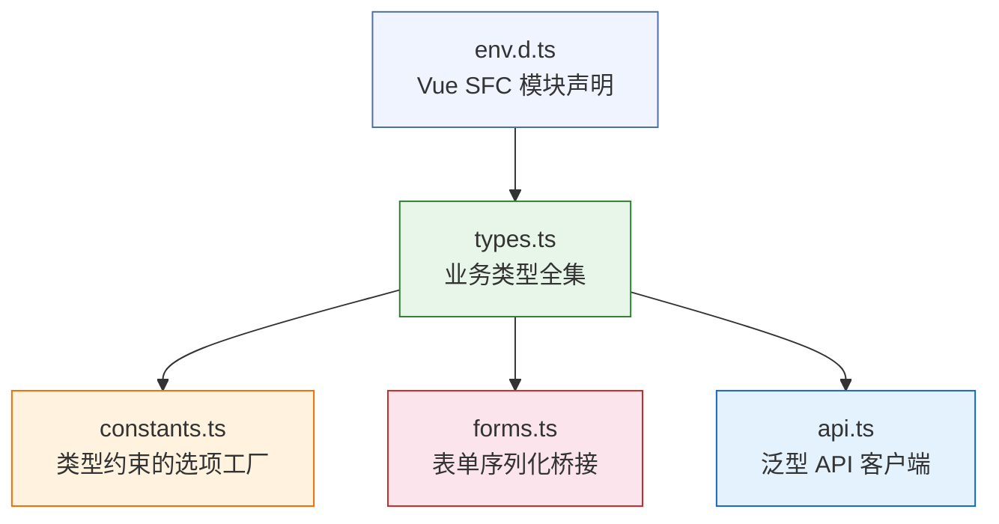
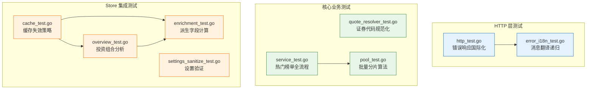
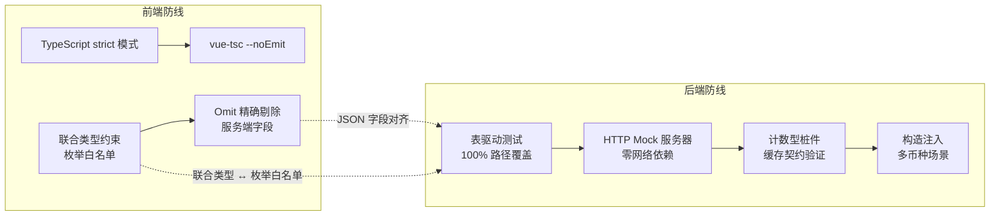

InvestGo 项目采用**前后端分层质量保障策略**：前端通过 TypeScript 严格模式 + `vue-tsc` 实现编译期类型安全，后端通过 Go 标准 `testing` 包 + 表驱动测试 + HTTP Mock 服务器确保业务逻辑正确性。本文将深入解析两套机制的设计理念、实现模式与覆盖范围。

## 类型检查：编译期防线

### TypeScript 严格模式配置

项目在 [tsconfig.json](tsconfig.json#L1-L19) 中启用了 `strict: true`，这意味着所有严格子选项（`strictNullChecks`、`noImplicitAny`、`strictFunctionTypes` 等）全部生效。编译目标设定为 `ES2022`，模块解析策略为 `Bundler`，与 Vite 构建管线紧密配合。类型检查的入口是 [package.json](package.json#L7) 中定义的 `typecheck` 脚本：

```json
"typecheck": "vue-tsc --noEmit"
```

`--noEmit` 标志确保 `vue-tsc` 仅执行类型检查而不产出文件，将类型验证与构建流程解耦。开发者可以在不触发完整构建的情况下快速发现类型错误。

Sources: [tsconfig.json](tsconfig.json#L1-L19), [package.json](package.json#L5-L8)

### 类型系统的三层架构

前端类型体系分布在三个核心文件中，形成**声明 → 补充 → 运用**的层次结构：



**第一层：环境声明**。[env.d.ts](frontend/src/env.d.ts#L1-L8) 通过 `declare module "*.vue"` 为所有 Vue 单文件组件提供类型占位。这是 Vue 3 + TypeScript 项目中必要的编译桥接，确保 `import App from "./App.vue"` 这类语句不会触发隐式 `any` 错误。

**第二层：业务类型全集**。[types.ts](frontend/src/types.ts#L1-L362) 定义了 362 行类型声明，覆盖 20+ 个 `interface` 和 15+ 个 `type` 别名。这些类型与后端 Go 结构体通过 JSON 字段名精确对齐——例如前端 `WatchlistItem` 的每个字段名都与 [model.go](internal/core/model.go#L40-L66) 中 Go 结构体的 `json` tag 完全对应。

**第三层：类型约束运用**。[constants.ts](frontend/src/constants.ts#L1-L188) 中的工厂函数（如 `getMarketOptions()`、`getColorThemeOptions()`）将 `types.ts` 中的联合类型展开为运行时选项列表，在 UI 下拉框和后端验证之间形成双重约束。[forms.ts](frontend/src/forms.ts#L1-L237) 中的 `serialiseItemForm()` 函数则通过 `Omit<WatchlistItem, ...>` 精确剔除前端不应提交的服务器计算字段（如 `currentPrice`、`quoteSource`、`position`），从类型层面杜绝数据越权。

Sources: [frontend/src/env.d.ts](frontend/src/env.d.ts#L1-L8), [frontend/src/types.ts](frontend/src/types.ts#L1-L362), [frontend/src/constants.ts](frontend/src/constants.ts#L1-L188), [frontend/src/forms.ts](frontend/src/forms.ts#L1-L237), [internal/core/model.go](internal/core/model.go#L40-L66)

### 泛型 API 客户端的类型安全

[api.ts](frontend/src/api.ts#L39-L87) 中的 `api<T>()` 函数是类型安全与运行时安全的交汇点。其签名 `async function api<T>(path: string, init?: ApiRequestInit): Promise<T>` 让每个 API 调用点的返回值自动获得精确类型推导。例如调用 `api<StateSnapshot>("/api/state")` 时，TypeScript 编译器会验证后续代码只访问 `StateSnapshot` 中存在的字段。

在错误处理层面，`ApiAbortError` 类和 `isApiErrorPayload()` 类型守卫构建了完整的**可辨识联合**（Discriminated Union）：调用者通过 `error instanceof ApiAbortError` 区分超时与手动取消，通过 `isApiErrorPayload(payload)` 区分业务错误和传输错误。这些类型级别的分支确保了 `catch` 块中的每个路径都有类型保障。

Sources: [frontend/src/api.ts](frontend/src/api.ts#L1-L87)

### 后端验证与前端的协同

后端的 `sanitiseSettings()` 函数（[settings_sanitize.go](internal/core/store/settings_sanitize.go#L1-L234)）对每个设置字段执行 `strings.TrimSpace` + `strings.ToLower` + 枚举值白名单三重校验。前端 `AppSettings` 接口中的联合类型（如 `ThemeMode = "system" | "light" | "dark"`）提前约束了用户输入范围，而 `normaliseSettings()` 函数（[forms.ts](frontend/src/forms.ts#L20-L49)）用空值合并运算符 `??` 保证所有字段都有合法默认值。两端形成**前端宽松兜底 + 后端严格验证**的防御纵深。

Sources: [internal/core/store/settings_sanitize.go](internal/core/store/settings_sanitize.go#L1-L234), [frontend/src/forms.ts](frontend/src/forms.ts#L20-L49)

---

## 后端测试：九大测试模块全景

### 测试分布总览

项目后端共有 **9 个测试文件**，合计 **1,247 行**测试代码，分布在 4 个包中：

| 测试文件 | 包 | 行数 | 核心测试模式 | 被测业务域 |
|---|---|---|---|---|
| [quote_resolver_test.go](internal/core/quote_resolver_test.go) | `core` | 110 | 表驱动测试 | 证券代码规范化 |
| [service_test.go](internal/core/hot/service_test.go) | `hot` | 400 | HTTP Mock 服务器 | 热门榜单缓存/覆盖/分页 |
| [pool_test.go](internal/core/hot/pool_test.go) | `hot` | 39 | 纯函数单测 | 批量请求分片 |
| [enrichment_test.go](internal/core/store/enrichment_test.go) | `store` | 66 | 结构体验证 | DCA/持仓派生字段 |
| [overview_test.go](internal/core/store/overview_test.go) | `store` | 263 | 构造注入 | 投资组合分析 |
| [cache_test.go](internal/core/store/cache_test.go) | `store` | 201 | 计数型桩件 | Store 缓存失效 |
| [settings_sanitize_test.go](internal/core/store/settings_sanitize_test.go) | `store` | 83 | 表驱动测试 | 设置清洗与 API Key 校验 |
| [http_test.go](internal/api/http_test.go) | `api` | 53 | HTTP Recorder | 错误响应国际化 |
| [error_i18n_test.go](internal/api/i18n/error_i18n_test.go) | `i18n` | 33 | 纯函数单测 | 错误消息翻译递归 |

Sources: [internal/core/quote_resolver_test.go](internal/core/quote_resolver_test.go#L1-L110), [internal/core/hot/service_test.go](internal/core/hot/service_test.go#L1-L401), [internal/core/hot/pool_test.go](internal/core/hot/pool_test.go#L1-L39), [internal/core/store/enrichment_test.go](internal/core/store/enrichment_test.go#L1-L67), [internal/core/store/overview_test.go](internal/core/store/overview_test.go#L1-L264), [internal/core/store/cache_test.go](internal/core/store/cache_test.go#L1-L202), [internal/core/store/settings_sanitize_test.go](internal/core/store/settings_sanitize_test.go#L1-L84), [internal/api/http_test.go](internal/api/http_test.go#L1-L54), [internal/api/i18n/error_i18n_test.go](internal/api/i18n/error_i18n_test.go#L1-L34)

### 测试架构关系图



---

## 核心测试模式深度解析

### 模式一：表驱动测试（Table-Driven Tests）

**行情解析器测试** [quote_resolver_test.go](internal/core/quote_resolver_test.go#L4-L110) 是 Go 社区推荐的表驱动测试的典范实现。测试用例通过匿名结构体切片定义，每个用例包含 `name`、输入参数（`symbol`、`market`、`currency`）、期望输出（`want QuoteTarget`）和期望错误（`wantErr string`）。测试覆盖了前缀规则（`hk700` → `00700.HK`）、后缀规则（`600519.sh` → `600519.SH`）、显式市场保留（`sz159941` with `market: "CN-ETF"` 保持 ETF 市场）、北京交易所（`bj430047`）、纯数字推断（`00700` → 港股）、Google Finance 前缀（`gb_brk.b` → `BRK-B`）、空字符串校验、以及非法字符拒绝共 8 条路径。

这种模式的优势在于**添加新用例零成本**——只需在切片中追加一行结构体字面量，无需修改任何测试逻辑。

Sources: [internal/core/quote_resolver_test.go](internal/core/quote_resolver_test.go#L4-L110)

**设置清洗测试** [settings_sanitize_test.go](internal/core/store/settings_sanitize_test.go#L1-L84) 同样采用表驱动模式，聚焦于 API Key 缺失场景：当用户选择 `finnhub` 或 `polygon` 作为 US 行情源但未提供对应 API Key 时，`sanitiseSettings()` 必须返回精准的错误消息。测试同时验证了 `quoteSourceSupportsMarketForSettings()` 的市场兼容性检查——Alpha Vantage、Finnhub、Polygon、Twelve Data 必须支持 `US-STOCK` 但不应支持 `CN-A`。

Sources: [internal/core/store/settings_sanitize_test.go](internal/core/store/settings_sanitize_test.go#L1-L84)

### 模式二：HTTP Mock 服务器（httptest.Server）

**热门榜单服务测试** [service_test.go](internal/core/hot/service_test.go#L1-L401) 是项目中最大最复杂的测试文件（400 行），全面使用 `net/http/httptest.NewServer` 模拟上游 API 行为。关键技术手段包括：

**自定义 Transport 重写 URL**。`rewriteTransport`（第 22-30 行）将所有出站请求重定向到本地测试服务器，同时保持原始请求路径和查询参数不变。这使得被测代码中的 URL 可以是生产地址，而实际请求会透明地打到本地 Mock：

```go
type rewriteTransport struct {
    base *url.URL
    rt   http.RoundTripper
}
func (t rewriteTransport) RoundTrip(request *http.Request) (*http.Response, error) {
    cloned := request.Clone(request.Context())
    cloned.URL.Scheme = t.base.Scheme
    cloned.URL.Host = t.base.Host
    return t.rt.RoundTrip(cloned)
}
```

**原子计数器验证缓存行为**。`TestHotServiceListUsesCacheUntilForcedRefresh` 通过 `atomic.Int32` 精确跟踪上游请求次数：首次调用触发 1 次上游请求，第二次从缓存返回（仍为 1 次），强制刷新后增加到 2 次。三个断言覆盖了**冷启动 → 缓存命中 → 缓存穿透**的完整生命周期。

**覆盖模式（Overlay）验证**。`TestListConfiguredCategory_UsesOverlayWithoutEastMoneyForTencentHK` 和对应的 Sina 变体模拟了双路请求场景：先用雪球 API 获取成分股列表，再用用户配置的行情源（Tencent/Sina）获取实时报价。测试通过路径匹配断言确保两条请求各自走到正确的上游端点。

Sources: [internal/core/hot/service_test.go](internal/core/hot/service_test.go#L22-L30), [internal/core/hot/service_test.go](internal/core/hot/service_test.go#L36-L99)

### 模式三：计数型测试桩件（Counting Stubs）

[cache_test.go](internal/core/store/cache_test.go#L153-L202) 定义了两个轻量级桩件类型——`countingHistoryProvider` 和 `countingQuoteProvider`。这些桩件的核心设计是**仅计数，不模拟**：它们返回固定数据，但通过 `calls` 字段记录被调用次数。这种极简设计使测试可以精确验证"缓存命中时不调用上游"这一关键契约。

`newTestStore()` 辅助函数（第 156-164 行）在临时目录中创建完整的 `Store` 实例，注入可选的 Quote/History 桩件，实现**接近生产环境的集成测试**，同时完全消除网络依赖。三个测试用例分别覆盖了：

- **历史数据缓存**：`TestStoreItemHistoryCachesAndForceRefresh` 验证同一 interval 的重复请求只触发一次上游调用，`BypassCache=true` 强制穿透。
- **Overview 分析缓存**：`TestStoreOverviewAnalyticsCachesUntilStateChanges` 验证 `holdingsUpdatedAt` 变化使 Overview 缓存失效，但底层历史缓存仍然有效——体现了**分层缓存独立性**。
- **行情刷新缓存**：`TestStoreRefreshCachesUntilForced` 验证常规刷新使用缓存的 Quote 数据，强制刷新绕过缓存。

Sources: [internal/core/store/cache_test.go](internal/core/store/cache_test.go#L1-L202)

### 模式四：构造注入（Constructor Injection）

**投资组合分析测试** [overview_test.go](internal/core/store/overview_test.go#L1-L264) 是最精密的测试套件。`newOverviewCalculator()` 函数接受三个参数：汇率服务、显示货币、历史数据加载函数。测试通过闭包注入预设的历史数据，完全控制了外部依赖：

```go
calculator := newOverviewCalculator(fx, "CNY", func(_ context.Context, item core.WatchlistItem, _ core.HistoryInterval) (core.HistorySeries, error) {
    return historyBySymbol[item.Symbol], nil
})
```

四个测试用例分别验证了：

| 测试函数 | 验证场景 |
|---|---|
| `TestOverviewCalculatorBuild` | DCA 持仓的多币种折算与按市值降序排列 |
| `TestOverviewCalculatorBuild_WithNonDCAHolding` | 非 DCA 持仓（有 `AcquiredAt`）和纯观察项（无日期）的混合处理 |
| `TestOverviewCalculatorBuild_SkipsWatchOnlyItemsForHistory` | `Quantity == 0` 的纯观察项不触发历史请求 |

特别值得注意的是多币种折算的验证逻辑：腾讯持仓（HKD）以 0.9 汇率折算为 CNY 得到 360，苹果持仓（USD）以 7 汇率折算得到 700，且 breakdown 按折算后价值降序排列（Apple 700 > Tencent 360）。这直接证明了汇率服务在分析计算链中的正确集成。

Sources: [internal/core/store/overview_test.go](internal/core/store/overview_test.go#L1-L264)

### 模式五：纯函数单元测试

**派生字段测试** [enrichment_test.go](internal/core/store/enrichment_test.go#L1-L67) 验证了 `decorateItemDerived()` 的两个关键派生计算：DCA 摘要（`DCASummary`）和持仓概要（`PositionSummary`）。测试构造了一个包含 2 条 DCA 记录的持仓项，断言 `EffectivePrice` 的计算公式（`(Amount - Fee) / Shares`）、市值（`Quantity × CurrentPrice = 250`）和记录数（`Count = 2`）。

`TestBuildMarketSnapshot` 进一步验证了 `MarketSnapshot` 的振幅计算：在 `PreviousClose = 100`、`RangeHigh = 112`、`RangeLow = 98` 的条件下，`AmplitudePct = (112 - 98) / 100 × 100 = 14`。这些纯函数测试确保了金融计算的数值精度。

**批量分片测试** [pool_test.go](internal/core/hot/pool_test.go#L1-L39) 验证了 `chunkSecIDs()` 函数对超长请求列表的分片逻辑：16 个 secid 被正确切分为多个 chunk，每个 chunk 的编码后长度不超过 `eastMoneyHotMaxSecIDChars` 上限。这直接保障了东方财富 API 请求不会因 URL 过长被截断。

Sources: [internal/core/store/enrichment_test.go](internal/core/store/enrichment_test.go#L1-L67), [internal/core/hot/pool_test.go](internal/core/hot/pool_test.go#L1-L39)

### 模式六：HTTP 层国际化测试

[http_test.go](internal/api/http_test.go#L1-L54) 通过 `httptest.NewRecorder()` 和 `httptest.NewRequest()` 在内存中完成完整的 HTTP 请求-响应周期。两个测试用例验证了 `writeError()` 的核心行为：

- **中文请求**：当 `Accept-Language` 为 `zh-CN` 时，返回 `{"error": "标的不存在: item-1", "debugError": "Item not found: item-1"}`，`debugError` 保留英文原文供开发者诊断。
- **英文请求**：当 `Accept-Language` 为 `en-US` 时，返回 `{"error": "Item not found: item-1"}`，不包含冗余的 `debugError` 字段。

[error_i18n_test.go](internal/api/i18n/error_i18n_test.go#L1-L34) 进一步验证了 `LocalizeErrorMessage()` 的递归翻译能力——一条包含多个子错误的消息（如 `"Item not found: item-1; EastMoney quote request failed: status 503"`）会被完整翻译为 `"标的不存在: item-1；东方财富行情请求失败: 状态码 503"`，同时保持分号风格的本地化（英文 `;` → 中文 `；`）。

Sources: [internal/api/http_test.go](internal/api/http_test.go#L1-L54), [internal/api/i18n/error_i18n_test.go](internal/api/i18n/error_i18n_test.go#L1-L34)

---

## 运行指南

| 操作 | 命令 | 说明 |
|---|---|---|
| 前端类型检查 | `pnpm typecheck` 或 `npm run typecheck` | 执行 `vue-tsc --noEmit`，检查所有 `.ts`/`.vue` 文件 |
| 后端全量测试 | `go test ./...` | 运行所有 9 个测试文件 |
| 单包测试 | `go test ./internal/core/store/...` | 仅运行 store 包的 4 个测试文件 |
| 带覆盖率报告 | `go test -cover ./...` | 输出每个包的语句覆盖率百分比 |
| 详细输出 | `go test -v ./internal/core/...` | 打印每个子测试的 PASS/FAIL 状态 |

前端类型检查不依赖后端服务，可在任何安装了 `vue-tsc` 的环境中独立运行。后端测试通过 `httptest.Server` 和桩件消除所有外部依赖，同样可以离线执行。

Sources: [package.json](package.json#L5-L8), [tsconfig.json](tsconfig.json#L1-L19)

---

## 质量保障策略总结



前端类型系统与后端测试体系共同构成了 InvestGo 的**双重质量防线**。前端通过编译期类型检查在开发阶段拦截错误（如传递了错误的枚举值、遗漏了必填字段），后端通过运行时测试在 CI 阶段验证业务逻辑正确性（如缓存失效策略、多币种折算精度、HTTP 错误国际化）。两道防线通过 **JSON 字段名对齐**这一隐性契约紧密耦合——任何一端的接口变更都应同步更新另一端。

Sources: [frontend/src/types.ts](frontend/src/types.ts#L1-L362), [internal/core/model.go](internal/core/model.go#L1-L388)

---

## 延伸阅读

- 了解前端类型与后端模型的精确对应关系，参见 [前端类型定义与后端类型对齐（TypeScript）](25-qian-duan-lei-xing-ding-yi-yu-hou-duan-lei-xing-dui-qi-typescript)
- 理解后端核心数据模型的结构设计，参见 [后端核心数据模型（Go）](24-hou-duan-he-xin-shu-ju-mo-xing-go)
- 了解被测的行情解析逻辑，参见 [行情解析器：多市场代码规范化](9-xing-qing-jie-xi-qi-duo-shi-chang-dai-ma-gui-fan-hua)
- 了解缓存策略在完整架构中的位置，参见 [Store：核心状态管理与持久化](7-store-he-xin-zhuang-tai-guan-li-yu-chi-jiu-hua)
- 了解 HTTP 错误处理的完整流程，参见 [HTTP API 层设计与国际化错误处理](14-http-api-ceng-she-ji-yu-guo-ji-hua-cuo-wu-chu-li)