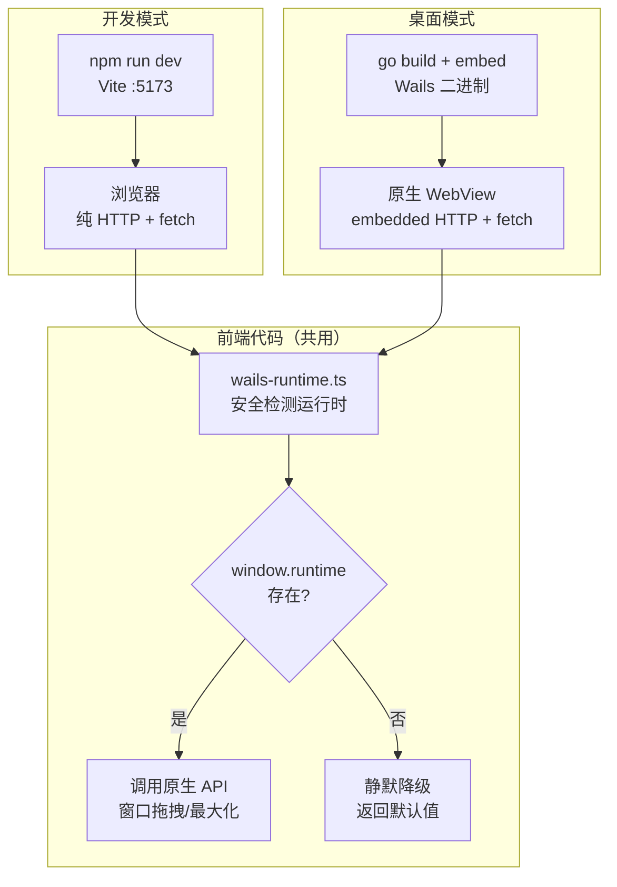
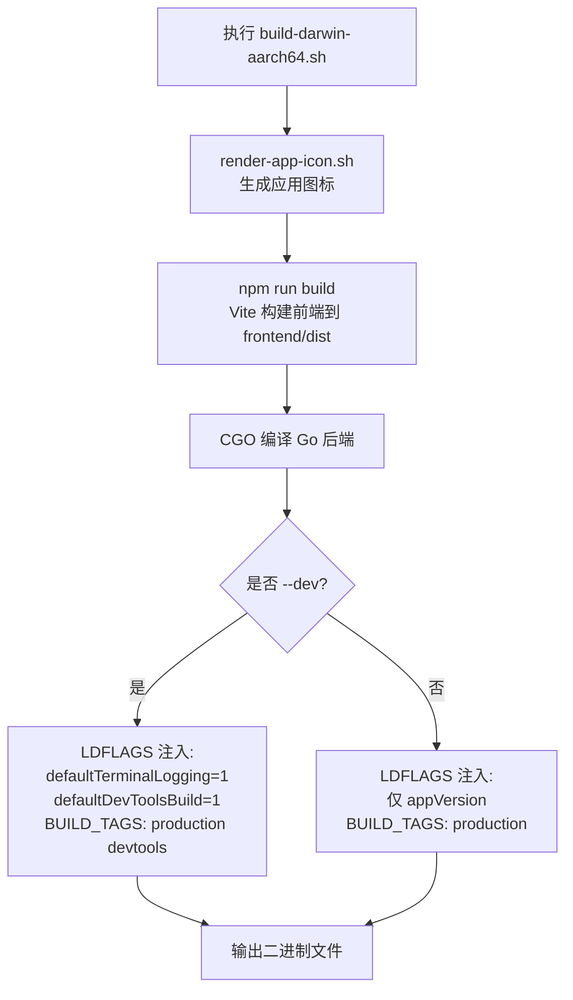
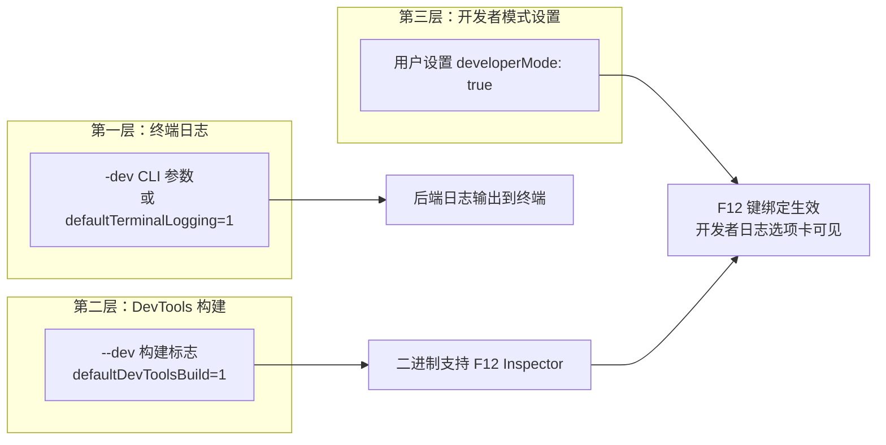
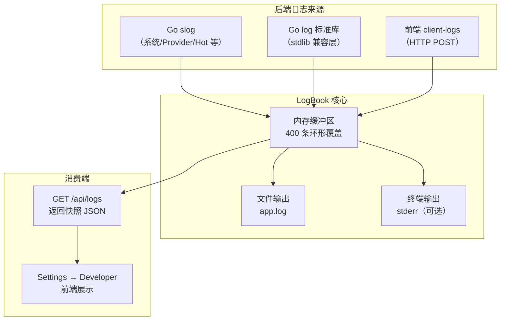

本文档系统阐述 InvestGo 项目的开发环境搭建流程与调试模式设计。内容涵盖前置依赖、纯前端浏览器开发模式、全栈 Wails 桌面应用调试、开发者日志系统，以及构建标签与链接器标志的控制机制。掌握这些内容后，你将能够在两种开发模式之间自由切换，并利用内置的 LogBook 系统进行高效的问题定位。

Sources: [main.go](main.go#L1-L189), [vite.config.ts](vite.config.ts#L1-L18), [package.json](package.json#L1-L21)

## 前置依赖

InvestGo 的技术栈决定了开发环境需要以下工具链。下表汇总了各依赖的作用与版本要求。

| 依赖                         | 版本要求                                 | 用途                                                    |
| ---------------------------- | ---------------------------------------- | ------------------------------------------------------- |
| **Go**                       | ≥ 1.24（[go.mod](go.mod#L3) 指定）       | 后端编译，包含 `embed`、`os.UserConfigDir` 等标准库特性 |
| **Node.js / pnpm**           | Node ≥ 18（ES2022 + Vite 8 要求）        | 前端构建工具链                                          |
| **Wails v3**                 | `v3.0.0-alpha.54`（[go.mod](go.mod#L7)） | 桌面应用框架，管理 WebView 窗口与原生桥接               |
| **Xcode Command Line Tools** | macOS 专用                               | 提供 CGO 编译链与 `sips`、`iconutil` 等打包工具         |
| **C 编译器 (CGO)**           | `CGO_ENABLED=1`                          | Wails v3 WebView 绑定需要 CGO 支持                      |

**安装验证**：确认 Go 和 Node 可用后，执行 `go version` 与 `node --version` 核实版本。Wails 的依赖通过 `go mod download` 自动拉取，无需单独安装 CLI 工具。项目根目录下存在 `pnpm-lock.yaml` 和 `package-lock.json`，推荐使用 pnpm 安装前端依赖（`pnpm install`），但 `npm install` 同样兼容。

Sources: [go.mod](go.mod#L1-L53), [package.json](package.json#L1-L21)

## 双模式开发架构

InvestGo 的前端被设计为**双模式兼容**——既能在浏览器中通过 Vite 开发服务器独立运行，也能嵌入 Wails 桌面应用以原生 WebView 加载。这一设计的关键在于前端代码对 Wails 运行时的**安全降级**处理。



**核心设计决策**：前端通过 `fetch()` 与后端通信，而非 Wails 的 `Invoke` 绑定。这意味着在浏览器开发模式下，只要有一个后端进程提供 `/api/*` 端点（或前端 Mock 数据），前端就能独立运行。Wails 运行时仅用于**窗口管理**（最大化、还原、拖拽），通过 `wails-runtime.ts` 中的空值守卫实现可选依赖。

Sources: [frontend/src/wails-runtime.ts](frontend/src/wails-runtime.ts#L1-L43), [frontend/src/api.ts](frontend/src/api.ts#L1-L87)

## 纯前端浏览器开发模式

这是最快上手的方式——不需要编译 Go 后端，仅启动 Vite 开发服务器即可在浏览器中调试 UI 和前端逻辑。

### 启动步骤

1. **安装前端依赖**：在项目根目录执行 `pnpm install`（或 `npm install`）
2. **启动 Vite 开发服务器**：执行 `npm run dev`（对应 `package.json` 中定义的 `vite` 命令）
3. **打开浏览器**：访问 `http://localhost:5173`

Vite 配置中 `server.host: true` 允许局域网访问，`server.port: 5173` 为默认端口。[vite.config.ts](vite.config.ts#L7-L9) 中 `root: "frontend"` 确保 Vite 以 `frontend/` 目录作为开发根目录，因此 `index.html` 中的 `<script src="/src/main.ts">` 路径能正确解析。

### 浏览器模式下的行为差异

| 功能                             | 浏览器模式                       | 桌面模式                 |
| -------------------------------- | -------------------------------- | ------------------------ |
| API 请求 (`/api/*`)              | `fetch` 失败（无后端）→ 错误提示 | `fetch` 成功 → 正常数据  |
| 窗口拖拽 (`startWindowDrag`)     | 静默忽略（`_wails` 不存在）      | 触发原生拖拽             |
| 窗口最大化 (`isWindowMaximised`) | 返回 `false`                     | 返回实际窗口状态         |
| DevTools (F12)                   | 浏览器内置开发者工具             | 需要 `devtools` 构建标签 |
| 前端热更新 (HMR)                 | ✅ Vite 原生支持                 | ❌ 需要重启应用          |

Sources: [vite.config.ts](vite.config.ts#L1-L18), [frontend/src/wails-runtime.ts](frontend/src/wails-runtime.ts#L11-L17), [frontend/index.html](frontend/index.html#L1-L13)

### TypeScript 配置要点

项目的 TypeScript 配置面向现代浏览器环境，关键设置如下：

- **`target: "ES2022"`** — 启用顶层 `await`、类字段等现代语法
- **`moduleResolution: "Bundler"`** — 与 Vite 的模块解析策略对齐
- **`strict: true`** — 启用全量严格检查
- **`include` 路径** — 明确包含 `frontend/src/**/*.ts`、`frontend/src/**/*.vue` 和根目录的 `vite.config.ts`

`env.d.ts` 声明了 `.vue` 模块类型和 Vite 客户端类型引用，确保 TypeScript 编译器不会对 Vue 单文件组件和 `import.meta.env` 报错。

Sources: [tsconfig.json](tsconfig.json#L1-L18), [frontend/src/env.d.ts](frontend/src/env.d.ts#L1-L8)

## 全栈桌面调试模式

全栈模式编译 Go 后端并嵌入前端构建产物，生成可独立运行的桌面应用。此模式用于调试前后端交互、原生窗口行为和系统代理等平台功能。

### 使用构建脚本（推荐）

项目提供了 `scripts/build-darwin-aarch64.sh`，自动完成前端构建和 Go 编译：

```bash
# 标准构建（不含 DevTools 支持）
./scripts/build-darwin-aarch64.sh

# 指定版本号
VERSION=0.1.0 ./scripts/build-darwin-aarch64.sh

# 开发构建（启用终端日志 + F12 DevTools）
VERSION=0.1.0 ./scripts/build-darwin-aarch64.sh --dev
```

### 构建流程详解



构建脚本内部执行以下关键步骤：

1. **前端构建**：调用 `npm run build`，Vite 将前端打包到 `frontend/dist/`（对应 [vite.config.ts](vite.config.ts#L11-L14) 中的 `outDir: "dist"` 配置）
2. **Go 编译**：通过 `//go:embed frontend/dist` 指令将前端资源嵌入二进制文件（[main.go](main.go#L29-L31)）
3. **链接器标志注入**：使用 `-ldflags` 在编译期设置包级变量值

Sources: [scripts/build-darwin-aarch64.sh](scripts/build-darwin-aarch64.sh#L1-L75), [main.go](main.go#L24-L31)

## 构建标签与链接器标志

InvestGo 使用 Go 的**链接器字符串注入**（`-X` flag）和**构建标签**（build tags）两套机制控制调试行为。这两套机制是独立的，需要区分理解。

### 链接器标志（-ldflags）

| 变量                          | 默认值  | `--dev` 时值         | 作用                                    |
| ----------------------------- | ------- | -------------------- | --------------------------------------- |
| `main.appVersion`             | `"dev"` | 用户指定的 `VERSION` | 显示在 UI 运行时信息中                  |
| `main.defaultTerminalLogging` | `"0"`   | `"1"`                | 控制后端日志是否输出到终端 stderr       |
| `main.defaultDevToolsBuild`   | `"0"`   | `"1"`                | 控制是否允许 F12 打开 WebView Inspector |

这些变量在 `main.go` 中声明并通过 `terminalLoggingEnabled()` 和 `devToolsBuildEnabled()` 函数读取。值得注意的是，终端日志也可以通过命令行参数 `-dev` 或 `--dev` 启用，这为已编译的二进制文件提供了一种轻量调试手段。

Sources: [main.go](main.go#L24-L26), [main.go](main.go#L170-L188), [scripts/build-darwin-aarch64.sh](scripts/build-darwin-aarch64.sh#L65-L72)

### 构建标签（Build Tags）

| 标签         | 作用                                                  |
| ------------ | ----------------------------------------------------- |
| `production` | 始终启用，标记生产构建路径                            |
| `devtools`   | 仅 `--dev` 时追加，启用 WebView DevTools 相关代码路径 |

`devtools` 标签与 `defaultDevToolsBuild` 变量配合使用——构建标签决定编译时是否包含 DevTools 相关代码，而 `defaultDevToolsBuild` 变量在运行时决定 F12 是否实际触发 Inspector 打开。

Sources: [scripts/build-darwin-aarch64.sh](scripts/build-darwin-aarch64.sh#L66-L72)

## 调试模式体系：三层门控

InvestGo 的调试功能采用**三层门控**设计，每层解锁更深入的调试能力。理解这三层的关系是高效调试的基础。



### 第一层：终端日志

启用方式：运行时传递 `-dev` 参数，或构建时注入 `defaultTerminalLogging=1`。启用后 `LogBook` 将所有日志条目同时输出到 `os.Stderr`，格式为：

```
2025-01-15T10:30:00+08:00 [INFO] backend/app starting InvestGo
2025-01-15T10:30:00+08:00 [INFO] backend/proxy proxy mode: system
```

在 `main.go` 中，`terminalLoggingEnabled()` 判断是否启用，随后调用 `logs.EnableConsole(os.Stderr)` 注册终端输出目标。`LogBook` 的 `Log()` 方法在写入内存缓冲区和文件的同时，也会向 `console` writer 输出。

Sources: [main.go](main.go#L39-L44), [main.go](main.go#L170-L183), [internal/logger/logger.go](internal/logger/logger.go#L157-L222)

### 第二层：DevTools 构建（WebView Inspector）

启用方式：构建时使用 `--dev` 标志。DevTools 构建允许用户在运行时按 **F12** 打开 WebView Inspector（等同于浏览器的开发者工具），用于检查 DOM、调试 JavaScript、分析网络请求。

`main.go` 中 F12 键绑定的逻辑展示了双重检查：

```
1. 检查用户设置中的 developerMode 是否为 true
2. 检查 defaultDevToolsBuild 是否为 "1"（即是否以 --dev 构建）
```

两个条件**同时满足**时才会调用 `window.OpenDevTools()`。这意味着即使以 `--dev` 构建，如果用户未在设置中开启开发者模式，F12 也会被忽略并记录一条警告日志。

Sources: [main.go](main.go#L127-L141), [main.go](main.go#L185-L188)

### 第三层：开发者模式（用户设置）

启用方式：在应用内 **Settings → Developer 选项卡** 中开启 `DeveloperMode`。此设置通过 `AppSettings.DeveloperMode` 字段持久化到 `state.json`。开启后解锁以下功能：

- **F12 Inspector**：与 DevTools 构建配合，允许打开 WebView Inspector
- **开发者日志选项卡**：Settings 页面显示 "Developer" 选项卡，可查看前后端统一日志
- **日志自动轮询**：进入开发者选项卡后，前端每 4 秒拉取后端日志更新

Sources: [internal/core/model.go](internal/core/model.go#L135), [frontend/src/App.vue](frontend/src/App.vue#L186-L205), [internal/core/store/seed.go](internal/core/store/seed.go#L83)

## 开发者日志系统（LogBook）

LogBook 是 InvestGo 自研的**前后端统一日志系统**，不依赖第三方日志聚合工具。它在内存中维护固定大小的环形缓冲区，同时可选输出到文件和终端。

### 架构概览



### 后端日志

`LogBook` 在 `main.go` 启动时以容量 400 创建（`logger.NewLogBook(400)`）。每条日志包含 `source`（来源模块）、`scope`（作用域）、`level`（debug/info/warn/error）、`message` 和 `timestamp` 五个字段。内存缓冲区采用固定长度环形覆盖策略——当条目数达到 `maxEntries` 时，通过 `copy` 左移丢弃最旧条目，避免无界增长。

日志文件默认写入 `$HOME/Library/Application Support/investgo/logs/app.log`（macOS），格式为纯文本一行一条。

Sources: [internal/logger/logger.go](internal/logger/logger.go#L41-L61), [internal/logger/logger.go](internal/logger/logger.go#L169-L222), [main.go](main.go#L39-L48), [main.go](main.go#L161-L168)

### 前端日志捕获

前端通过 `devlog.ts` 模块拦截浏览器原生的 `console.*` 方法、`window.error` 和 `unhandledrejection` 事件，将捕获的日志条目存入本地 Vue 响应式缓冲区（200 条上限），同时通过 `POST /api/client-logs` 以 1 秒节流批量镜像到后端 `LogBook`。前端日志在传输前会经过 `redactSensitiveText()` 处理，自动脱敏 API Key 等敏感信息。

Sources: [frontend/src/devlog.ts](frontend/src/devlog.ts#L17-L119), [frontend/src/devlog.ts](frontend/src/devlog.ts#L139-L150)

### 统一日志查看

`useDeveloperLogs` 组合式函数将前端和后端日志合并为统一的按时间倒序列表（上限 250 条）。后端日志通过 `GET /api/logs?limit=160` 获取，前端日志来自本地缓冲区。在 Settings 的 Developer 选项卡中，当 `developerMode` 为 `true` 且选项卡可见时，前端每 4 秒轮询一次后端日志，保持界面与后端状态同步。

日志查看器提供两个操作：

| 操作         | 功能                                 | API                        |
| ------------ | ------------------------------------ | -------------------------- |
| **清除日志** | 同时清除前端缓冲区和后端日志文件     | `DELETE /api/logs`         |
| **复制日志** | 将合并日志格式化为纯文本复制到剪贴板 | 本地 `clipboard.writeText` |

Sources: [frontend/src/composables/useDeveloperLogs.ts](frontend/src/composables/useDeveloperLogs.ts#L1-L83), [internal/api/handler.go](internal/api/handler.go#L61-L101), [internal/api/http.go](internal/api/http.go#L63-L65)

## 快速参考：常见开发任务

| 任务                     | 命令/操作                                                  |
| ------------------------ | ---------------------------------------------------------- |
| 启动前端开发服务器       | `npm run dev` → 浏览器访问 `:5173`                         |
| 构建桌面应用（标准）     | `./scripts/build-darwin-aarch64.sh`                        |
| 构建桌面应用（开发调试） | `./scripts/build-darwin-aarch64.sh --dev`                  |
| 打包 macOS .app + .dmg   | `./scripts/package-darwin-aarch64.sh`                      |
| 运行时启用终端日志       | 运行二进制时追加 `-dev` 或 `--dev` 参数                    |
| 前端类型检查             | `npm run typecheck`（即 `vue-tsc --noEmit`）               |
| 查看开发者日志           | 应用内 Settings → Developer 选项卡（需开启 DeveloperMode） |
| 打开 WebView Inspector   | F12（需 DevTools 构建 + DeveloperMode 同时启用）           |

Sources: [package.json](package.json#L1-L21), [scripts/build-darwin-aarch64.sh](scripts/build-darwin-aarch64.sh#L1-L75)

## 延伸阅读

- 完整的构建与打包发布流程请参阅 [构建与打包发布（macOS）](5-gou-jian-yu-da-bao-fa-bu-macos)
- 日志系统的实现细节请参阅 [日志系统：LogBook 与前后端统一日志](16-ri-zhi-xi-tong-logbook-yu-qian-hou-duan-tong-ri-zhi)
- 前端在浏览器和桌面环境之间的兼容性设计请参阅 [Wails 运行时桥接与浏览器开发兼容](18-wails-yun-xing-shi-qiao-jie-yu-liu-lan-qi-kai-fa-jian-rong)
- 状态文件存储路径与运行时配置请参阅 [状态存储路径与运行时配置](30-zhuang-tai-cun-chu-lu-jing-yu-yun-xing-shi-pei-zhi)
