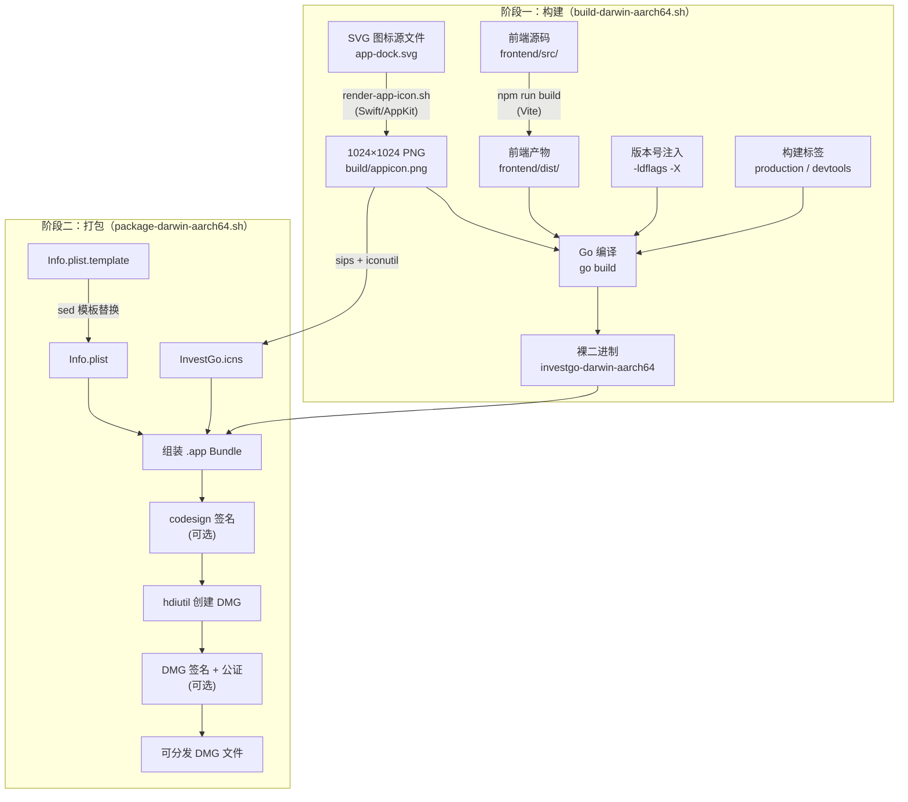

本文详述 InvestGo 在 macOS (Apple Silicon) 平台上的完整构建与打包发布流程。从 SVG 图标渲染、前端资源编译、Go 后端交叉编译，到 macOS `.app` Bundle 组装与 DMG 磁盘镜像分发，每个环节均通过项目内独立脚本自动完成。阅读本文后，你将理解构建流水线的架构设计，并能够执行从源码到可分发 DMG 的全流程操作。

Sources: [build-darwin-aarch64.sh](scripts/build-darwin-aarch64.sh#L1-L75), [package-darwin-aarch64.sh](scripts/package-darwin-aarch64.sh#L1-L259)

## 构建流水线总览

InvestGo 的构建采用**两阶段分离**设计：`build-darwin-aarch64.sh` 负责生成裸二进制文件，`package-darwin-aarch64.sh` 在此基础上组装 macOS 应用 Bundle 并打包为 DMG。这种分离允许开发者单独使用构建脚本进行快速迭代测试，而仅在正式发布时才需要完整的打包流程。



Sources: [build-darwin-aarch64.sh](scripts/build-darwin-aarch64.sh#L1-L75), [package-darwin-aarch64.sh](scripts/package-darwin-aarch64.sh#L1-L259)

## 环境前置要求

在执行构建之前，确保系统满足以下依赖：

| 依赖                         | 用途                             | 检查命令          |
| ---------------------------- | -------------------------------- | ----------------- |
| **Go ≥ 1.24**                | 后端编译                         | `go version`      |
| **Node.js + npm**            | 前端构建                         | `npm --version`   |
| **Swift**                    | SVG→PNG 图标渲染                 | `swift --version` |
| **sips**                     | PNG 多尺寸缩放（macOS 内置）     | `which sips`      |
| **iconutil**                 | PNG→ICNS 转换（macOS 内置）      | `which iconutil`  |
| **hdiutil**                  | DMG 创建（macOS 内置）           | `which hdiutil`   |
| **ditto**                    | 文件拷贝保留元数据（macOS 内置） | `which ditto`     |
| **codesign**（可选）         | 应用签名                         | `which codesign`  |
| **xcrun notarytool**（可选） | Apple 公证                       | `which xcrun`     |

Sources: [package-darwin-aarch64.sh](scripts/package-darwin-aarch64.sh#L218-L244)

## 图标渲染：从 SVG 到 PNG

应用图标采用 SVG 矢量源文件，通过一个 Swift 脚本在构建时渲染为 1024×1024 高分辨率 PNG。这一步确保图标在不同分辨率的 macOS 系统上均保持锐利清晰。

**渲染脚本** `render-app-icon.sh` 的核心逻辑非常简洁：调用 `swift` 执行 `render-svg-icon.swift`，将 `frontend/src/assets/app-dock.svg` 渲染为 `build/appicon.png`。Swift 脚本利用 macOS 原生 `AppKit` 框架的 `NSImage` 直接加载 SVG，随后创建 `NSBitmapImageRep` 位图上下文进行高质量光栅化输出。

```bash
# 默认行为：渲染 1024×1024 PNG
./scripts/render-app-icon.sh

# 自定义源文件和输出路径
SOURCE_FILE=custom.svg APP_ICON_OUTPUT_FILE=output.png ICON_SIZE=512 ./scripts/render-app-icon.sh
```

Swift 渲染脚本的关键实现细节：它将 SVG 加载为 `NSImage`，创建 4 通道（RGBA）、8 位色深的位图表示，设置 `imageInterpolation = .high` 进行高质量插值，最终编码为 PNG 写入磁盘。整个过程完全依赖 macOS 原生 API，无需安装任何第三方图像处理库。

Sources: [render-app-icon.sh](scripts/render-app-icon.sh#L1-L31), [render-svg-icon.swift](scripts/render-svg-icon.swift#L1-L74), [app-dock.svg](frontend/src/assets/app-dock.svg#L1-L74)

## 阶段一：构建二进制

### 构建脚本核心参数

构建脚本 `build-darwin-aarch64.sh` 通过环境变量和命令行参数控制构建行为。以下是完整的参数说明：

| 参数/环境变量              | 默认值                              | 说明                                              |
| -------------------------- | ----------------------------------- | ------------------------------------------------- |
| `VERSION` 或 `APP_VERSION` | `-dev`                              | 注入到二进制的版本号，影响 `main.appVersion` 变量 |
| `OUTPUT_FILE`              | `build/bin/investgo-darwin-aarch64` | 输出二进制文件路径                                |
| `MACOS_MIN_VERSION`        | `13.0`                              | macOS 最低部署目标                                |
| `--dev` 标志               | 关闭                                | 启用开发者工具（F12 Web Inspector）和终端日志     |
| `--help` / `-h`            | —                                   | 显示帮助信息                                      |

Sources: [build-darwin-aarch64.sh](scripts/build-darwin-aarch64.sh#L1-L48)

### 构建流程详解

构建脚本按以下固定顺序执行五个步骤：

**第一步：图标渲染** — 调用 `render-app-icon.sh` 生成 PNG 图标。渲染后的 `build/appicon.png` 会在后续的 Go 编译阶段通过 `//go:embed build/appicon.png` 指令嵌入到二进制中，作为 Wails 应用窗口图标。

**第二步：前端构建** — 执行 `npm run build`，实际调用 `vite build`。Vite 的配置指定了 `root: "frontend"` 和 `outDir: "dist"`，因此前端产物输出到 `frontend/dist/`。Go 编译时通过 `//go:embed frontend/dist` 将整个前端产物嵌入二进制，运行时作为静态资源通过 `application.BundledAssetFileServer` 提供服务。

**第三步：编译环境设置** — 配置 Go 交叉编译工具链：

```bash
CGO_ENABLED=1          # Wails v3 依赖 CGO（macOS WebView 需要）
GOOS=darwin
GOARCH=arm64
MACOSX_DEPLOYMENT_TARGET=13.0
CGO_CFLAGS="-mmacosx-version-min=13.0"   # C 编译器最低版本
CGO_LDFLAGS="-mmacosx-version-min=13.0"  # 链接器最低版本
```

`CGO_ENABLED=1` 是硬性要求——Wails v3 在 macOS 上通过 CGO 调用原生 WebView API。`MACOS_MIN_VERSION` 默认设为 `13.0`（Ventura），同时通过 `MACOSX_DEPLOYMENT_TARGET`、`CGO_CFLAGS`、`CGO_LDFLAGS` 三处统一设定，确保从 C 编译器到链接器的整个工具链都遵守此最低版本约束。

**第四步：链接器标志注入** — 通过 `-ldflags` 在编译时注入版本信息和构建配置：

```bash
# 生产构建
LDFLAGS="-s -w -X main.appVersion=$APP_VERSION"
# -s -w: 剥离符号表和调试信息，减小二进制体积
# -X main.appVersion: 将 main 包的 appVersion 变量设为指定版本

# 开发构建（--dev 标志）
LDFLAGS="$LDFLAGS -X main.defaultTerminalLogging=1 -X main.defaultDevToolsBuild=1"
```

其中 `-X main.appVersion` 直接修改 [main.go](main.go#L26) 中的 `var appVersion = "dev"` 变量，这是运行时在 Store 初始化时使用的版本标识。开发构建额外启用 `defaultTerminalLogging` 和 `defaultDevToolsBuild`，前者让应用直接将日志输出到 stderr，后者启用 F12 开发者工具（参见 [main.go](main.go#L128-L141) 中的 `devToolsBuildEnabled()` 检查）。

**第五步：Go 编译** — 执行最终的 `go build` 命令：

```bash
go build -tags "production" -trimpath -ldflags="$LDFLAGS" -o "$OUTPUT_FILE" .
```

`-trimpath` 移除二进制中嵌入的源码绝对路径，避免泄露构建机器的目录结构。`-tags "production"` 是 Wails v3 的标准构建标签；开发构建会添加 `devtools` 标签变为 `-tags "production devtools"`。

Sources: [build-darwin-aarch64.sh](scripts/build-darwin-aarch64.sh#L50-L74), [main.go](main.go#L24-L31), [vite.config.ts](vite.config.ts#L1-L17)

### 快速构建命令

```bash
# 最简构建（版本显示为 "dev"）
./scripts/build-darwin-aarch64.sh

# 指定版本号的正式构建
VERSION=0.1.8 ./scripts/build-darwin-aarch64.sh

# 带开发者工具的构建（支持 F12 DevTools）
VERSION=0.1.8 ./scripts/build-darwin-aarch64.sh --dev

# 自定义输出路径
OUTPUT_FILE=/tmp/investgo ./scripts/build-darwin-aarch64.sh
```

Sources: [build-darwin-aarch64.sh](scripts/build-darwin-aarch64.sh#L4-L8)

## 阶段二：打包为 macOS 应用

### 打包脚本参数

打包脚本 `package-darwin-aarch64.sh` 是对构建脚法的上层封装，它在内部调用 `build-darwin-aarch64.sh` 完成编译，然后组装完整的 macOS 应用 Bundle 并创建 DMG 安装镜像。

| 参数/环境变量         | 默认值                 | 说明                                  |
| --------------------- | ---------------------- | ------------------------------------- |
| `VERSION`             | `0.1.0`                | 版本号，用于 Info.plist 和 DMG 文件名 |
| `APP_NAME`            | `InvestGo`             | 应用显示名称                          |
| `APP_ID`              | `com.example.investgo` | macOS Bundle Identifier               |
| `BINARY_NAME`         | `investgo`             | 可执行文件名                          |
| `MACOS_MIN_VERSION`   | `13.0`                 | 最低系统版本                          |
| `VOLUME_NAME`         | `$APP_NAME`            | DMG 卷标名称                          |
| `ICON_SOURCE`         | `build/appicon.png`    | 图标源文件路径                        |
| `SKIP_APP_BUILD`      | `0`                    | 设为 `1` 跳过编译，仅打包已有二进制   |
| `SKIP_DMG_CREATE`     | `0`                    | 设为 `1` 跳过 DMG 创建                |
| `APPLE_SIGN_IDENTITY` | 空                     | Apple 代码签名证书标识                |
| `NOTARYTOOL_PROFILE`  | 空                     | Apple 公证 keychain profile           |
| `--dev` 标志          | 关闭                   | 传递给构建脚本的开发者模式            |

Sources: [package-darwin-aarch64.sh](scripts/package-darwin-aarch64.sh#L13-L22)

### 应用 Bundle 结构

打包脚本生成的 `.app` Bundle 遵循 macOS 标准目录布局：

```
InvestGo.app/
├── Contents/
│   ├── Info.plist          # 应用元数据（从模板渲染）
│   ├── PkgInfo             # 类型签名 "APPL????"
│   ├── MacOS/
│   │   └── investgo        # 编译后的 Go 二进制
│   └── Resources/
│       └── InvestGo.icns   # 多分辨率图标集
```

Sources: [package-darwin-aarch64.sh](scripts/package-darwin-aarch64.sh#L24-L35)

### ICNS 图标生成

macOS 应用图标需要 `.icns` 格式，包含从 16×16 到 1024×1024 的全套尺寸。打包脚本通过 `sips`（macOS 内置图像处理工具）从 1024×1024 的 PNG 源文件生成 5 组标准尺寸（16/32/128/256/512）及其 2x Retina 变体，然后使用 `iconutil` 将 `.iconset` 目录转换为单个 `.icns` 文件。

| 尺寸      | 文件名                | 用途                     |
| --------- | --------------------- | ------------------------ |
| 16×16     | `icon_16x16.png`      | Finder 列表视图          |
| 32×32     | `icon_32x32.png`      | Finder 列表视图 (Retina) |
| 128×128   | `icon_128x128.png`    | Finder 图标视图          |
| 256×256   | `icon_256x256.png`    | Finder 图标视图 (Retina) |
| 512×512   | `icon_512x512.png`    | Launchpad / Spotlight    |
| 1024×1024 | `icon_512x512@2x.png` | Mac App Store            |

缓存优化：脚本会检查 ICNS 文件是否已存在且 PNG 源未更新（`"$ICON_SOURCE" -nt "$ICNS_FILE"` 时间戳比较），避免每次打包都重新生成图标。

Sources: [package-darwin-aarch64.sh](scripts/package-darwin-aarch64.sh#L101-L124), [package-darwin-aarch64.sh](scripts/package-darwin-aarch64.sh#L185-L187)

### Info.plist 模板渲染

应用元数据通过 `build/Info.plist.template` 模板生成。模板中使用 `__PLACEHOLDER__` 格式的占位符，打包脚本通过 `sed` 替换为实际值：

| 占位符                  | 替换来源             | 示例值                 |
| ----------------------- | -------------------- | ---------------------- |
| `__APP_NAME__`          | `APP_NAME`           | `InvestGo`             |
| `__BINARY_NAME__`       | `BINARY_NAME`        | `investgo`             |
| `__APP_ID__`            | `APP_ID`             | `com.example.investgo` |
| `__VERSION__`           | `VERSION`            | `0.1.8`                |
| `__ICON_FILE__`         | `ICNS_FILE` basename | `InvestGo.icns`        |
| `__MACOS_MIN_VERSION__` | `MACOS_MIN_VERSION`  | `13.0`                 |

模板中 `NSHighResolutionCapable` 设为 `true`，声明应用支持 Retina 显示。`CFBundlePackageType` 设为 `APPL`，与 Bundle 根目录的 `PkgInfo` 文件内容 `APPL????` 保持一致。

Sources: [Info.plist.template](build/Info.plist.template#L1-L27), [package-darwin-aarch64.sh](scripts/package-darwin-aarch64.sh#L86-L99), [package-darwin-aarch64.sh](scripts/package-darwin-aarch64.sh#L189-L190)

### DMG 磁盘镜像创建

打包的最后一步是创建 DMG 安装镜像。脚本先准备一个临时暂存目录，将 `.app` Bundle 通过 `ditto`（保留 macOS 元数据和扩展属性的拷贝工具）复制进去，并创建指向 `/Applications` 的符号链接，让用户安装时可以直接拖拽。然后使用 `hdiutil` 以 UDZO（压缩）格式创建 DMG：

```bash
hdiutil create \
    -volname "InvestGo" \
    -srcfolder "$STAGING_DIR" \
    -format UDZO \
    -ov \
    "build/bin/investgo-$VERSION-darwin-aarch64.dmg"
```

最终输出文件遵循 `investgo-{版本号}-darwin-aarch64.dmg` 命名规范，放置在 `build/bin/` 目录下。脚本通过 `trap cleanup_temporary_artifacts EXIT` 确保暂存目录在退出时被自动清理。

Sources: [package-darwin-aarch64.sh](scripts/package-darwin-aarch64.sh#L68-L75), [package-darwin-aarch64.sh](scripts/package-darwin-aarch64.sh#L194-L216)

### 快速打包命令

```bash
# 完整打包（构建 + DMG），使用默认版本 0.1.0
./scripts/package-darwin-aarch64.sh

# 指定版本号的正式发布
VERSION=0.1.8 ./scripts/package-darwin-aarch64.sh

# 仅构建 .app Bundle，跳过 DMG
SKIP_DMG_CREATE=1 VERSION=0.1.8 ./scripts/package-darwin-aarch64.sh

# 跳过编译（假设已有二进制），仅打包
SKIP_APP_BUILD=1 ./scripts/package-darwin-aarch64.sh
```

Sources: [package-darwin-aarch64.sh](scripts/package-darwin-aarch64.sh#L4-L11)

## 代码签名与 Apple 公证

对于计划在 macOS 上分发的应用，代码签名和 Apple 公证是避免 Gatekeeper 拦截的必要步骤。打包脚本内置了完整的签名与公证流程，通过环境变量触发。

### 签名流程


**应用签名** — 对整个 `.app` Bundle 执行深度签名（`--deep`），启用 hardened runtime（`--options runtime`）并附加安全时间戳：

```bash
APPLE_SIGN_IDENTITY="Developer ID Application: Your Name (TEAMID)" \
  VERSION=0.1.8 ./scripts/package-darwin-aarch64.sh
```

**DMG 签名 + 公证** — 在应用签名的基础上，对 DMG 文件也进行签名，然后提交 Apple 公证服务。公证需要预先通过 `xcrun notarytool store-credentials` 在 Keychain 中存储 Apple ID 凭据：

```bash
APPLE_SIGN_IDENTITY="Developer ID Application: Your Name (TEAMID)" \
  NOTARYTOOL_PROFILE="my-profile" \
  VERSION=0.1.8 ./scripts/package-darwin-aarch64.sh
```

脚本在运行前会校验环境变量的合理性：`NOTARYTOOL_PROFILE` 要求 `APPLE_SIGN_IDENTITY` 已设置，且 DMG 创建未被跳过。

Sources: [package-darwin-aarch64.sh](scripts/package-darwin-aarch64.sh#L126-L159), [package-darwin-aarch64.sh](scripts/package-darwin-aarch64.sh#L230-L244)

## 版本注入机制

InvestGo 的版本管理采用**编译时注入**而非运行时读取策略。Go 源码中定义了三个通过 `-ldflags -X` 控制的字符串变量：

| 变量                          | 默认值  | 注入方式                           | 运行时用途                                |
| ----------------------------- | ------- | ---------------------------------- | ----------------------------------------- |
| `main.appVersion`             | `"dev"` | `-X main.appVersion=$VERSION`      | Store 初始化时记录版本号，供前端 API 读取 |
| `main.defaultTerminalLogging` | `"0"`   | `-X main.defaultTerminalLogging=1` | 控制是否将日志输出到 stderr               |
| `main.defaultDevToolsBuild`   | `"0"`   | `-X main.defaultDevToolsBuild=1`   | 控制是否允许 F12 打开 Web Inspector       |

这种设计意味着版本号和构建配置完全融入二进制本身，无需额外的配置文件或环境变量。在未指定版本号时，应用显示 `"dev"` 标识，明确区分开发构建和正式发布。

Sources: [main.go](main.go#L24-L26), [build-darwin-aarch64.sh](scripts/build-darwin-aarch64.sh#L65-L70)

## 常见问题排查

| 问题                                              | 原因                              | 解决方案                                                              |
| ------------------------------------------------- | --------------------------------- | --------------------------------------------------------------------- |
| `Missing required command: swift`                 | 未安装 Xcode Command Line Tools   | 执行 `xcode-select --install`                                         |
| `go build` 报 CGO 错误                            | CGO_ENABLED 未启用或缺少 C 编译器 | 确认 Xcode CLI 已安装，脚本已设置 `CGO_ENABLED=1`                     |
| `Generated icns file is empty`                    | PNG 源文件损坏或 sips 执行失败    | 检查 `build/appicon.png` 是否为有效的 1024×1024 PNG                   |
| DMG 无法在 Finder 中打开                          | 签名不一致或 Gatekeeper 拦截      | 配置 `APPLE_SIGN_IDENTITY` 进行正式签名                               |
| 应用闪退、无窗口显示                              | 前端产物未嵌入                    | 确认 `npm run build` 成功生成了 `frontend/dist/`                      |
| F12 无法打开开发者工具                            | 二进制未以 `--dev` 模式构建       | 使用 `VERSION=x.x.x ./scripts/build-darwin-aarch64.sh --dev` 重新构建 |
| `NOTARYTOOL_PROFILE requires APPLE_SIGN_IDENTITY` | 公证需要先签名                    | 同时设置 `APPLE_SIGN_IDENTITY` 和 `NOTARYTOOL_PROFILE`                |

Sources: [package-darwin-aarch64.sh](scripts/package-darwin-aarch64.sh#L77-L82), [package-darwin-aarch64.sh](scripts/package-darwin-aarch64.sh#L235-L241), [build-darwin-aarch64.sh](scripts/build-darwin-aarch64.sh#L57-L63)

## 后续阅读

本文覆盖了从源码到可分发 DMG 的完整构建链路。构建产物的运行时行为由后续架构文档详细描述：

- 了解构建产物的启动初始化逻辑：[应用启动流程与初始化](6-ying-yong-qi-dong-liu-cheng-yu-chu-shi-hua)
- 了解前端构建产物的嵌入与服务机制：[Vue 3 应用结构与 PrimeVue 集成](17-vue-3-ying-yong-jie-gou-yu-primevue-ji-cheng)
- 了解 Wails 运行时如何桥接前后端：[Wails 运行时桥接与浏览器开发兼容](18-wails-yun-xing-shi-qiao-jie-yu-liu-lan-qi-kai-fa-jian-rong)
- 了解运行时状态存储路径与配置：[状态存储路径与运行时配置](30-zhuang-tai-cun-chu-lu-jing-yu-yun-xing-shi-pei-zhi)
