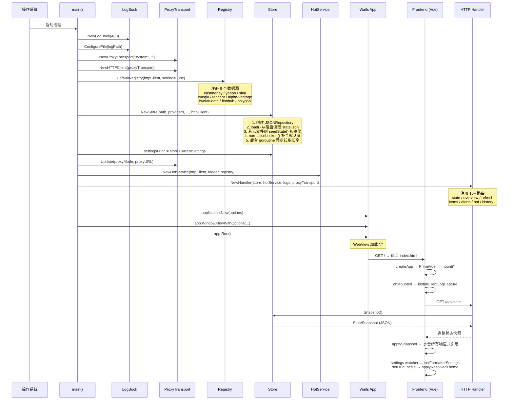
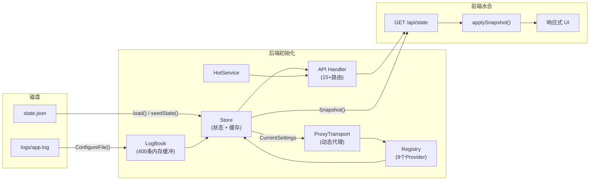

本文档从 Go 后端 `main()` 入口到 Vue 前端 `onMounted` 生命周期，完整拆解 InvestGo 桌面应用的启动初始化链路。理解这条链路是阅读后续 [Store：核心状态管理与持久化](7-store-he-xin-zhuang-tai-guan-li-yu-chi-jiu-hua)、[市场数据 Provider 注册表与路由机制](8-shi-chang-shu-ju-provider-zhu-ce-biao-yu-lu-you-ji-zhi) 和 [HTTP API 层设计与国际化错误处理](14-http-api-ceng-she-ji-yu-guo-ji-hua-cuo-wu-chu-li) 等页面所必需的前置知识。

Sources: [main.go](main.go#L1-L149)

## 启动架构全景

InvestGo 基于 **Wails v3** 框架构建，后端使用 Go 提供 HTTP API 服务，前端以 Vue 3 SPA 形式嵌入 WebView。两者在同一个进程内运行，通过本地 HTTP 通信（而非 IPC 绑定），架构上等同于一个内嵌的 C/S 系统。

下面展示完整的启动时序——从进程入口到用户看到界面为止的全链路：

## 阶段一：日志系统初始化

日志系统是整个启动链路中**最早被创建**的基础设施，因为后续所有组件都依赖它输出诊断信息。

`logger.NewLogBook(400)` 创建一个固定容量的内存环形缓冲区（最多保留 400 条日志），采用**循环覆写**策略防止内存无限增长。LogBook 同时支持三种输出通道：

| 输出通道 | 启用条件 | 目标 |
|---------|---------|------|
| **内存缓冲** | 始终启用 | 前端 `GET /api/logs` 可查询的环形数组 |
| **文件输出** | 始终启用 | `~/Library/Application Support/investgo/logs/app.log` |
| **终端输出** | `-dev` 或 `--dev` 命令行参数 | `os.Stderr` |

Go 标准库的 `log.SetOutput` 被重定向到 LogBook 的 `Writer("backend", "stdlib", ...)` 方法，确保即使是第三方库的 `log.Printf` 调用也会被 LogBook 捕获。文件输出通过 `ConfigureFile` 设置，若目录不存在会自动创建（权限 `0o755`）。

Sources: [main.go](main.go#L39-L48), [logger.go](internal/logger/logger.go#L40-L101)

## 阶段二：网络传输层构建

网络层是第二个被初始化的基础组件，因为几乎所有后续的数据源 Provider 和 Store 都依赖 `http.Client` 进行远程请求。

`platform.NewProxyTransport("system", "")` 构建了一个**动态代理感知的 HTTP Transport**，核心设计要点：

- **TLS 指纹伪装**：使用 `utls` 库模拟 Chrome 浏览器的 ClientHello 指纹（`HelloChrome_Auto`），避免被目标 API 的 JA3/JA4 检测识别为 Go 程序
- **ALPN 强制 HTTP/1.1**：虽然 Chrome 默认协商 HTTP/2，但 Go 的自定义 `DialTLSContext` 只支持 HTTP/1.x，因此主动将 ALPN 限制为 `http/1.1`
- **三级代理模式**：`system`（读取系统代理）、`custom`（用户指定 URL）、`none`（直连）

初始化时代理模式默认为 `"system"`，但 `settingsFunc` 此时返回空值，因此实际代理配置会在 Store 加载完成后通过 `proxyTransport.Update()` 同步。

Sources: [main.go](main.go#L55-L56), [proxy_transport.go](internal/platform/proxy_transport.go#L30-L65)

## 阶段三：市场数据注册表构建

`marketdata.DefaultRegistry(client, settingsFunc)` 一次性注册所有已知的市场数据源。这个函数是了解应用数据能力的核心入口——它定义了**哪些 Provider 可用、它们支持哪些市场、具备哪些能力**：

| 数据源 ID | 行情 | 历史 K 线 | 覆盖市场 |
|-----------|:----:|:--------:|---------|
| `eastmoney` | ✅ | ✅ | CN-A, CN-GEM, CN-STAR, CN-ETF, HK-MAIN, HK-GEM, HK-ETF, US-STOCK, US-ETF |
| `yahoo` | ✅ | ✅ | CN/HK/US 全覆盖 |
| `sina` | ✅ | — | CN/HK/US 全覆盖 |
| `xueqiu` | ✅ | — | CN/HK/US 全覆盖 |
| `tencent` | ✅ | ✅ | CN/HK/US 全覆盖 |
| `alpha-vantage` | ✅ | ✅ | US-STOCK, US-ETF |
| `twelve-data` | ✅ | ✅ | US-STOCK, US-ETF |
| `finnhub` | ✅ | ✅ | US-STOCK, US-ETF |
| `polygon` | ✅ | ✅ | US-STOCK, US-ETF |

`settingsFunc` 参数是一个**惰性求值函数**（`func() core.AppSettings`），在启动初期返回空设置，但在 Store 加载完成后被替换为 `store.CurrentSettings`，使 Provider 在运行时能读取用户的 API Key 配置。Registry 同时构建一个 `HistoryRouter`，用于在历史数据请求时按市场感知的优先级链路进行降级路由。

Sources: [main.go](main.go#L58-L66), [registry.go](internal/core/marketdata/registry.go#L185-L294)

## 阶段四：核心状态 Store 创建

Store 是应用后端的**中枢状态管理器**，它的创建过程包含以下关键步骤：

**1. 持久化后端初始化**：`NewJSONRepository(path)` 创建一个基于 JSON 文件的存储后端，默认路径为 `~/Library/Application Support/investgo/state.json`。存储操作采用**原子写入**策略（先写 `.tmp` 临时文件再 `os.Rename`），避免写入中断导致数据损坏。

**2. 状态加载或种子初始化**：`store.load()` 尝试从磁盘读取 `state.json`。若文件不存在（首次启动），则调用 `seedState()` 生成包含两条示例持仓（阿里巴巴港股 + VOO ETF）和两条告警规则的种子状态，并立即持久化到磁盘。

**3. 状态规范化**：`normaliseLocked()` 确保所有字段具有有效默认值——为空字符串的设置字段补全为 `"system"`（主题）、`"CNY"`（货币）、`"cn"`（涨跌配色）等；缺失 ID 的条目自动生成 `item-xxx` / `alert-xxx` 格式的唯一标识。

**4. 异步汇率预热**：Store 创建完成后立即启动一个后台 goroutine，在 15 秒超时内调用 Frankfurter API 拉取汇率数据。这是**非阻塞操作**——`Snapshot()` 方法不会因网络等待而卡住，而是在汇率就绪后自动更新运行时状态。

Sources: [store.go](internal/core/store/store.go#L50-L102), [state.go](internal/core/store/state.go#L20-L43), [repository.go](internal/core/store/repository.go#L36-L76), [seed.go](internal/core/store/seed.go#L10-L93)

## 阶段五：代理同步与热门服务创建

Store 就绪后，启动流程执行两个依赖 Store 状态的步骤：

**代理配置同步**：读取 Store 中持久化的 `ProxyMode` 和 `ProxyURL`，同步更新 ProxyTransport。若模式为 `"system"`，则调用 `platform.ApplySystemProxy(logs)` 在 macOS 上通过 `scutil --proxy` 读取系统代理设置并注入到进程环境变量（`HTTPS_PROXY` 等），使后续所有 `http.ProxyFromEnvironment` 调用都能正确走系统代理。

**热门榜单服务创建**：`hot.NewHotService(httpClient, logger, registry)` 创建热门榜单服务，注入共享的 HTTP 客户端、Registry 引用和两个 TTL 缓存（搜索缓存 + 响应缓存）。HotService 本身不执行任何预热——数据在实际请求时才按需拉取。

Sources: [main.go](main.go#L74-L91), [proxy.go](internal/platform/proxy.go#L18-L63), [service.go](internal/core/hot/service.go#L42-L56)

## 阶段六：HTTP API 路由注册

`api.NewHandler(store, hotService, logs, proxyTransport)` 创建统一的 API 处理器，内部使用 Go 1.22+ 的增强 `ServeMux` 注册以下路由：

| 方法 | 路径 | 功能 |
|------|------|------|
| `GET` | `/state` | 返回完整状态快照（前端启动数据） |
| `GET` | `/overview` | 投资组合分析（Breakdown + Trend） |
| `POST` | `/refresh` | 全量行情刷新 |
| `POST` | `/items/{id}/refresh` | 单条目行情刷新 |
| `PUT` | `/settings` | 更新应用设置 |
| `POST/PUT/DELETE` | `/items`, `/items/{id}` | 持仓条目 CRUD |
| `POST/PUT/DELETE` | `/alerts`, `/alerts/{id}` | 告警规则 CRUD |
| `GET` | `/hot` | 热门榜单查询 |
| `GET` | `/history` | 历史 K 线数据 |
| `GET/DELETE` | `/logs` | 开发者日志 |
| `POST` | `/client-logs` | 前端日志上报 |
| `POST` | `/open-external` | 打开外部链接 |
| `PUT` | `/items/{id}/pin` | 置顶/取消置顶 |

Handler 的 `ServeHTTP` 方法会剥离 `/api` 前缀后委托给内部 mux。所有响应通过 `X-InvestGo-Locale` 请求头进行**国际化错误消息处理**。

Sources: [http.go](internal/api/http.go#L44-L108), [handler.go](internal/api/handler.go#L1-L200)

## 阶段七：Wails 应用与窗口创建

`application.New(options)` 配置 Wails 桌面应用实例，关键配置项：

- **静态资源**：`frontend/dist` 通过 `go:embed` 嵌入到二进制文件中，由 `application.BundledAssetFileServer` 托管为静态文件服务
- **路由分流**：外层 `http.ServeMux` 将 `/api/` 路由到 API Handler，其余路径（`/`）路由到前端静态文件
- **窗口配置**：默认尺寸 1200×828（同时也是最小尺寸），macOS 使用半透明背景（`MacBackdropTranslucent`），根据 `UseNativeTitleBar` 设置决定是否使用隐藏标题栏（`MacTitleBarHiddenInsetUnified`）
- **生命周期钩子**：`OnShutdown` 回调中调用 `store.Save()` 确保应用退出前状态被持久化
- **Panic 处理**：捕获 panic 并通过 LogBook 记录错误和堆栈
- **DevTools**：F12 快捷键仅在 `DeveloperMode` 启用且编译时 `defaultDevToolsBuild == "1"` 时有效

窗口创建完成后，`app.Run()` 进入 Wails 事件循环，WebView 开始加载 `"/"` 路径。

Sources: [main.go](main.go#L93-L149), [window.go](internal/platform/window.go#L6-L29)

## 阶段八：前端应用初始化

前端启动链路在 WebView 加载 `index.html` 后开始，分为**框架初始化**和**数据水合**两个子阶段。

### 框架初始化（main.ts）

`frontend/src/main.ts` 完成三件事：

1. **Vue 应用创建**：`createApp(App)` 以 `App.vue` 为根组件
2. **PrimeVue 集成**：注入自定义主题预设 `investGoPreset`（基于 Aura 主题，蓝色种子 `#355f96`），暗色模式通过 CSS 类 `.app-dark` 触发
3. **挂载**：`app.mount("#app")` 将 Vue 应用渲染到 DOM

### 数据水合（App.vue onMounted）

Vue 应用挂载后，`onMounted` 钩子执行两个操作：

**安装客户端日志捕获**：`installClientLogCapture()` 劫持 `console.debug/info/log/warn/error`，将所有前端日志推入内存缓冲区（最多 200 条），同时监听 `window.error` 和 `unhandledrejection` 事件。日志通过 `POST /api/client-logs` 镜像到后端 LogBook，实现**前后端统一日志**。

**加载后端状态**：`loadState()` 调用 `GET /api/state` 获取完整的 `StateSnapshot`，然后通过 `applySnapshot()` 水合以下响应式引用：

| 响应式引用 | 来源字段 | 用途 |
|-----------|---------|------|
| `dashboard` | `snapshot.dashboard` | 仪表盘汇总数据 |
| `items` | `snapshot.items` | 持仓/关注列表 |
| `alerts` | `snapshot.alerts` | 告警规则 |
| `settings` | `snapshot.settings`（经 `normaliseSettings` 处理） | 应用设置 |
| `runtime` | `snapshot.runtime` | 运行时状态（版本、行情源、错误） |
| `quoteSources` | `snapshot.quoteSources` | 可用行情源选项列表 |

`settings` 的 `watch` 回调（`immediate: true`）在水合后立即触发，执行三个副作用：`setFormatterSettings`（更新数字格式化器）、`setI18nLocale`（切换语言）、`applyResolvedTheme`（应用系统/亮/暗主题到 DOM）。

Sources: [main.ts](frontend/src/main.ts#L1-L23), [App.vue](frontend/src/App.vue#L207-L254), [devlog.ts](frontend/src/devlog.ts#L17-L65), [api.ts](frontend/src/api.ts#L31-L86), [forms.ts](frontend/src/forms.ts#L4-L25), [format.ts](frontend/src/format.ts#L26-L29)

## 启动时序关键数据流

下图总结了从用户双击图标到看到完整界面过程中，**数据如何从磁盘/网络流向 UI**：

## 首次启动 vs 正常启动行为差异

| 行为 | 首次启动（无 state.json） | 正常启动（有 state.json） |
|------|:----------------------:|:----------------------:|
| 状态来源 | `seedState()` 生成种子数据 | 从磁盘反序列化 JSON |
| 种子数据 | 2 条示例持仓 + 2 条告警 | 用户实际数据 |
| 自动保存 | ✅ 种子数据立即持久化 | — |
| 规范化 | ✅ 补全所有缺失默认值 | ✅ 补全历史版本可能缺失的字段 |
| 日志输出 | `"state file not found, seeding ..."` | `"loaded state from ..."` |
| 汇率拉取 | 后台异步（15s 超时） | 后台异步（15s 超时） |
| 行情数据 | 无（首次展示时价格为种子中的静态值） | 无（首次展示时价格为上次保存的快照值） |

Sources: [state.go](internal/core/store/state.go#L20-L43), [seed.go](internal/core/store/seed.go#L10-L93)

## 构建时变量与运行时标志

后端有三个构建时可注入的变量，通过 `-ldflags` 在编译时设置：

| 变量 | 默认值 | 用途 | 设置方式 |
|------|--------|------|---------|
| `defaultTerminalLogging` | `"0"` | 是否在终端输出日志 | `-ldflags "-X main.defaultTerminalLogging=1"` |
| `defaultDevToolsBuild` | `"0"` | 是否启用 F12 DevTools | `-ldflags "-X main.defaultDevToolsBuild=1"` |
| `appVersion` | `"dev"` | 应用版本号 | `-ldflags "-X main.appVersion=1.0.0"` |

运行时标志：`-dev` 或 `--dev` 命令行参数等效于 `defaultTerminalLogging=1`，用于开发调试时在终端查看实时日志。

Sources: [main.go](main.go#L24-L26), [main.go](main.go#L170-L188)

## 下一步阅读

- [Store：核心状态管理与持久化](7-store-he-xin-zhuang-tai-guan-li-yu-chi-jiu-hua) — 深入了解 Store 的状态管理、缓存策略和持久化机制
- [市场数据 Provider 注册表与路由机制](8-shi-chang-shu-ju-provider-zhu-ce-biao-yu-lu-you-ji-zhi) — 理解 Registry 如何组织 9 个数据源及其能力查询
- [HTTP API 层设计与国际化错误处理](14-http-api-ceng-she-ji-yu-guo-ji-hua-cuo-wu-chu-li) — API Handler 的路由设计、错误处理和国际化机制
- [平台层：系统代理检测与窗口管理](15-ping-tai-ceng-xi-tong-dai-li-jian-ce-yu-chuang-kou-guan-li) — ProxyTransport 的 TLS 指纹伪装和 macOS 系统代理检测