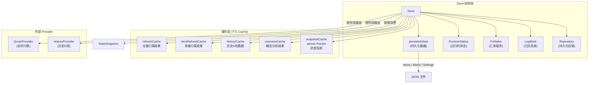
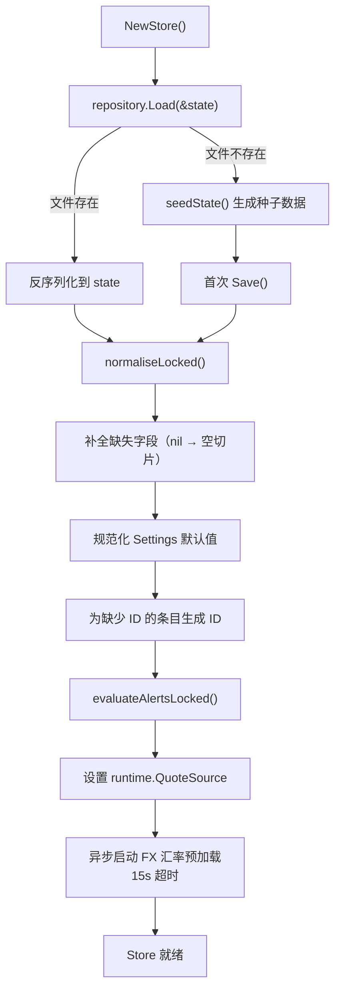
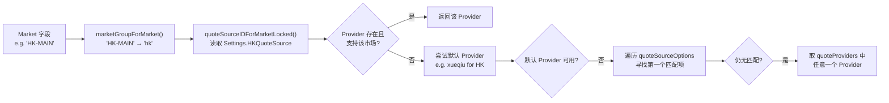
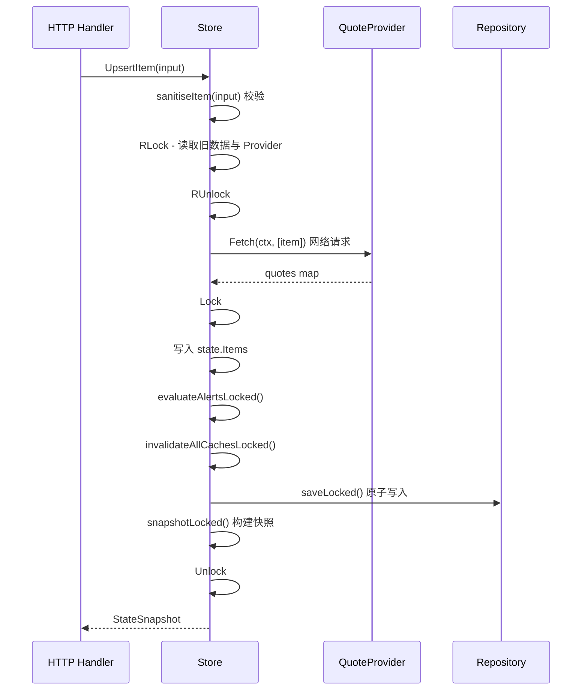

Store 是 InvestGo 后端的**中央状态管理器**——它是前端所有交互数据的唯一权威来源。在一个 Wails 桌面应用的架构中，Store 承担了四项核心职责：**持久化管理**（用户配置与监控数据落盘）、**运行时状态维护**（实时行情、汇率信息与仪表盘聚合）、**依赖协调**（行情 Provider、历史数据 Provider、日志系统之间的数据流转）以及**并发安全**（读写锁保证多线程环境下的一致性访问）。本文将从架构总览出发，逐层拆解 Store 的文件组织、持久化机制、状态加载流程、缓存策略以及公共 API 接口。

Sources: [store.go](internal/core/store/store.go#L17-L48), [model.go](internal/core/model.go#L308-L318)

## 架构总览与文件组织

Store 包位于 `internal/core/store/`，由 14 个文件组成，每个文件职责明确：

| 文件 | 职责 |
|------|------|
| `store.go` | Store 结构体定义、构造函数、Save/Snapshot/CurrentSettings 入口 |
| `state.go` | persistedState 定义、load/normalise/save 流程、行情源路由 |
| `repository.go` | Repository 接口与 JSONRepository 实现（原子写入） |
| `mutation.go` | 写操作：UpsertItem、DeleteItem、SetItemPinned、UpsertAlert、DeleteAlert、UpdateSettings |
| `runtime.go` | 运行时操作：Refresh（全量刷新）、RefreshItem（单条刷新）、ItemHistory、OverviewAnalytics |
| `snapshot.go` | 快照构建：排序、装饰、Dashboard 汇总 |
| `cache.go` | TTL 缓存层定义、失效策略、克隆辅助函数 |
| `enrichment.go` | 数据装饰：DCA 聚合、PositionSummary、MarketSnapshot |
| `validation.go` | 输入校验：标签规范化、Alert 校验、DCA 条目标准化 |
| `settings_sanitize.go` | 设置清洗：字段验证、行情源匹配、代理 URL 校验 |
| `overview.go` | 概览分析计算器：Breakdown 饼图与 Trend 时间序列 |
| `seed.go` | 首次启动种子数据 |
| `helper.go` | 通用工具：applyQuoteToItem、inheritLiveFields、newID |

Sources: [store.go](internal/core/store/store.go#L24-L48)

### 核心结构体关系

下图展示了 Store 的内部组成及其与外部组件的关系：



Store 持有一个 `sync.RWMutex`（字段名 `mu`），**所有对 persistedState 的访问都必须在锁保护下进行**。写操作取写锁（`Lock`），快照与查询取读锁（`RLock`）。值得注意的是，涉及网络请求的操作（如 Refresh）会先在读锁下拷贝必要数据，释放锁后再发起请求，最后在写锁下回写结果——这种"拷贝-释放-网络-重锁-回写"模式确保了网络 I/O 不会长时间阻塞其他访问者。

Sources: [store.go](internal/core/store/store.go#L25-L48), [runtime.go](internal/core/store/runtime.go#L29-L34)

## 持久化层：Repository 接口与原子写入

Store 的持久化通过 `Repository` 接口抽象，使 Store 逻辑不依赖具体存储格式。当前唯一的实现是 `JSONRepository`，将状态序列化为单个 JSON 文件。

```go
type Repository interface {
    Load(target any) (bool, error)
    Save(source any) error
    Path() string
}
```

**Load** 方法的行为遵循"首次启动感知"语义：当文件不存在时返回 `(false, nil)`，而非错误。Store 在 `load()` 中据此判断是否需要生成种子数据。**Save** 方法采用**原子写入**策略——先将序列化结果写入临时文件（`path.tmp`），再通过 `os.Rename` 替换目标文件。这确保了即使在写入过程中应用崩溃，也不会损坏已有数据文件。

Sources: [repository.go](internal/core/store/repository.go#L10-L76)

## persistedState 与状态加载流程

持久化状态由一个简洁的结构体表示：

```go
type persistedState struct {
    Items     []core.WatchlistItem `json:"items"`
    Alerts    []core.AlertRule     `json:"alerts"`
    Settings  core.AppSettings     `json:"settings"`
    UpdatedAt time.Time            `json:"updatedAt"`
}
```

应用启动时，`NewStore` → `load()` 执行如下流程：



`normaliseLocked()` 是关键的**向后兼容层**——历史版本的状态文件可能缺少某些字段（如 `FontPreset`、`ProxyMode`），normaliseLocked 确保每个字段都有合理的默认值，并且为缺少 ID 或 `UpdatedAt` 的 Items 和 Alerts 补全这些字段。这意味着应用可以在不破坏已有用户数据的前提下持续演进数据模型。

Sources: [state.go](internal/core/store/state.go#L12-L121)

## 行情源路由：市场感知的 Provider 选择

Store 不直接与特定行情源耦合，而是通过 `AppSettings` 中的 `CNQuoteSource`、`HKQuoteSource`、`USQuoteSource` 三个字段，按**市场组**路由到对应的 `QuoteProvider`。路由链路如下：



**市场组映射**将 12 个具体市场归类到三个宏观市场：

| 市场组 | 包含市场 | 默认行情源 |
|--------|---------|-----------|
| `cn` | CN-A, CN-GEM, CN-STAR, CN-ETF, CN-BJ | `sina` |
| `hk` | HK-MAIN, HK-GEM, HK-ETF | `xueqiu` |
| `us` | US-STOCK, US-ETF | `yahoo` |

在 `refreshQuotesForItems` 中，Store 会将 watchlist 中的条目按其对应的 `sourceID` 分组，然后对每组批量调用 `provider.Fetch()`——这确保了多市场列表在刷新时不会向不支持的市场发送请求。

Sources: [state.go](internal/core/store/state.go#L206-L321), [runtime.go](internal/core/store/runtime.go#L157-L200), [model.go](internal/core/model.go#L320-L327)

## 写操作：Mutation API

Store 的写操作遵循统一的**校验-执行-失效-持久化-快照**模式。以 `UpsertItem` 为例：



所有 Mutation 方法都遵循这一模式，关键设计决策包括：

- **UpsertItem** 在写入前会**立即获取一次实时报价**，确保新增或编辑的条目始终有最新价格。如果存在旧条目，则通过 `inheritLiveFields` 保留其市场数据（如前收盘价、最高最低价），避免用户编辑操作覆盖已有行情。
- **DeleteItem** 会**同步删除该条目关联的所有 AlertRules**，避免悬空引用。
- **UpdateSettings** 调用 `sanitiseSettings` 进行全面校验（行情源有效性、API Key 必要性、枚举值合法性），通过后才写入状态。
- 每次写操作后都会调用 `invalidateAllCachesLocked()`，确保后续读取看到最新数据。

Sources: [mutation.go](internal/core/store/mutation.go#L20-L107), [mutation.go](internal/core/store/mutation.go#L144-L177), [mutation.go](internal/core/store/mutation.go#L244-L278)

## 缓存策略：多层 TTL Cache

Store 维护一个五层缓存体系，每一层针对不同的数据生命周期：

| 缓存 | Key 类型 | 容量上限 | TTL 来源 | 失效触发 |
|------|---------|---------|---------|---------|
| `refreshCache` | `"all"` | 32 | `HotCacheTTLSeconds` | 全量失效 / 价格失效 |
| `itemRefreshCache` | `itemID` | 32 | `HotCacheTTLSeconds` | 全量失效 / 价格失效 |
| `historyCache` | `"itemID\|interval"` | 512 | 按区间分级 (5m~4h) | 仅全量失效 |
| `overviewCache` | `"all"` | 16 | `HotCacheTTLSeconds` | 全量失效 / 价格失效 |
| `snapshotCache` | — (atomic) | 1 | `state.UpdatedAt` 变化 | 全量失效 / 价格失效 |

### 两级失效策略

Store 区分两种缓存失效场景，这是缓存设计的核心洞察：

- **`invalidateAllCachesLocked()`**：结构变更时调用（Item 增删改、Settings 更新）。清除所有缓存层，因为持仓结构已根本性改变。
- **`invalidatePriceCachesLocked()`**：价格刷新时调用。清除行情缓存和快照缓存，但**保留 historyCache**——历史 K 线数据不受当前价格跳动影响，保留它使得后续 Overview 重建可以复用已加载的历史数据。

### 历史数据分级 TTL

```go
case HistoryRange1h:  return 5 * time.Minute
case HistoryRange1d:  return 10 * time.Minute
case HistoryRange1w, HistoryRange1mo: return 30 * time.Minute
default:             return 4 * time.Hour  // 1y, 3y, all
```

短期区间（1 小时）数据变化频繁，TTL 较短；长期区间（1 年以上）数据几乎不变，TTL 长达 4 小时。这一分级策略在数据新鲜度和网络请求量之间取得了平衡。

### Snapshot 缓存的 atomic 优化

`snapshotCache` 使用 `atomic.Pointer[cachedSnapshot]`，这是一种**无锁读取**优化。`snapshotLocked()` 通过比较 `state.UpdatedAt` 时间戳判断缓存是否命中——如果状态未变，直接返回浅拷贝，跳过排序和装饰步骤。由于 `/api/state` 是前端轮询最频繁的接口，这一优化显著减少了只读请求的开销。

Sources: [cache.go](internal/core/store/cache.go#L1-L98), [snapshot.go](internal/core/store/snapshot.go#L20-L75), [ttl.go](internal/common/cache/ttl.go#L13-L29)

## 快照构建：排序、装饰与 Dashboard 聚合

`snapshotLocked()` 是 Store 最重要的读路径——每次前端请求 `/api/state` 都会触发它。它完成三件事：

**1. 排序**：Items 按"置顶优先，然后按更新时间倒序"排列；Alerts 按"已触发优先，然后按更新时间倒序"排列。排序仅影响输出顺序，不改变内部持久化切片的顺序。

**2. 装饰**：对每个 Item 调用 `decorateItemDerived`，附加服务端计算字段：
- `DCASummary`：聚合所有有效 DCA 条目（总金额、总股数、加权平均成本、盈亏）
- `PositionSummary`：持仓指标（成本基数、市值、未实现盈亏及其百分比）
- `DCAEntries[].EffectivePrice`：每笔买入的有效单价

**3. Dashboard 聚合**：`buildDashboard` 遍历所有 Items，通过 `FxRates.Convert` 将不同币种的成本和市值折算到 `Settings.DashboardCurrency`（默认 CNY），然后汇总为 `DashboardSummary`（总成本、总市值、总盈亏、盈亏比、已触发的 Alert 数量）。

Sources: [snapshot.go](internal/core/store/snapshot.go#L20-L123), [enrichment.go](internal/core/store/enrichment.go#L73-L91)

## 运行时操作：行情刷新与历史数据

### Refresh（全量刷新）

`Refresh` 是前端定时轮询触发的核心方法。其执行流程体现了 Store 对网络 I/O 和锁竞争的精细控制：

1. 检查 `refreshCache`，命中则直接返回（非 force 模式）
2. 在**读锁**下拷贝 `state.Items` 快照，立即释放锁
3. 调用 `refreshQuotesForItems`，按 Provider 分组批量请求行情
4. 同时检查 `fxRates.IsStale()`，若汇率过期则同步刷新
5. 在**写锁**下将行情结果回写到 `state.Items`，更新 `runtime` 状态
6. 评估所有 Alert 触发状态
7. 调用 `invalidatePriceCachesLocked()`（不清除 historyCache）
8. 持久化并构建快照，写入 refreshCache

Sources: [runtime.go](internal/core/store/runtime.go#L22-L89)

### ItemHistory（历史 K 线）

`ItemHistory` 使用 `"itemID|interval"` 作为缓存键，命中时返回带 `Cached: true` 标记的结果。未命中时委托给 `historyProvider.Fetch()`（实际为 `HistoryRouter`），获取结果后附加 `MarketSnapshot`（包含实时代价、振幅、持仓价值等衍生指标），然后写入 historyCache。

Sources: [runtime.go](internal/core/store/runtime.go#L203-L241)

### OverviewAnalytics（概览分析）

概览分析是一个**重量级计算**，涉及多只持仓的历史数据加载和时间序列对齐。Store 使用 `overviewCalculator` 结构体封装计算逻辑，关键设计包括：

- **持仓过滤**：只纳入 `Quantity > 0` 或有有效 DCA 条目的 Items
- **并发加载**：通过信号量（容量 4）并发获取历史数据
- **历史复用**：通过 `s.ItemHistory()` 路由历史请求，复用 historyCache——如果用户已经查看过某只持仓的 K 线图，概览重建不会发起额外的网络请求
- **DCA 回放**：对于有 DCA 记录的持仓，`buildTrendValues` 会逐日回放买入记录，累积持仓数量，使趋势线反映真实的建仓过程
- **币种统一**：所有数值通过 `FxRates.Convert` 折算到 `DashboardCurrency`

Sources: [runtime.go](internal/core/store/runtime.go#L243-L293), [overview.go](internal/core/store/overview.go#L51-L65), [overview.go](internal/core/store/overview.go#L205-L270), [overview.go](internal/core/store/overview.go#L272-L324)

## 输入校验与设置清洗

Store 对所有外部输入执行严格的校验，这一层是防止不一致状态进入持久化数据的最后防线。

**Item 校验** (`sanitiseItem`)：规范化 Symbol/Market/Currency（通过 `ResolveQuoteTarget`），清理 Tags（去重去空），处理 DCA 条目（过滤无效条目、重算加权平均成本），验证数量和价格为非负，对"仅关注"条目清除 AcquiredAt。

**Settings 校验** (`sanitiseSettings`)：覆盖 20+ 个字段的逐一校验，包括：
- 缓存 TTL ≥ 10 秒
- 行情源 ID 必须在已注册的 Providers 中且支持对应市场
- 使用需要 API Key 的行情源时，Key 不能为空
- 枚举字段（ThemeMode、ColorTheme、FontPreset 等）必须在允许值范围内
- 自定义代理 URL 必须是合法 URL（含 scheme 和 host）
- DashboardCurrency 必须为 CNY/HKD/USD 之一

**日志脱敏**：`redactSensitiveLogText` 使用正则匹配 API Key 等敏感信息，在日志输出前将其替换为 `***`。

Sources: [mutation.go](internal/core/store/mutation.go#L280-L331), [settings_sanitize.go](internal/core/store/settings_sanitize.go#L11-L183), [validation.go](internal/core/store/validation.go#L11-L86), [mutation.go](internal/core/store/mutation.go#L359-L375)

## 种子数据与首次启动

当状态文件不存在时（首次启动或数据被删除），`seedState()` 生成包含两只示范持仓（阿里巴巴港股 + VOO 美股 ETF）和两条预警规则的种子状态。这些数据为用户提供了一个直观的起点，所有字段都填充了真实感的值，包括中文投资论点和标签。种子数据在写入后会立即执行 `evaluateAlertsLocked()` 来确定初始触发状态。

Sources: [seed.go](internal/core/store/seed.go#L10-L93)

## 并发安全设计总结

Store 的并发模型可以用一个矩阵来概括：

| 操作类型 | 锁模式 | 网络请求 | 持久化 |
|---------|--------|---------|--------|
| `Snapshot` | RLock | ❌ | ❌ |
| `CurrentSettings` | RLock | ❌ | ❌ |
| `Refresh` | RLock → 无锁 → Lock | ✅ | ✅ |
| `RefreshItem` | RLock → 无锁 → Lock | ✅ | ✅ |
| `ItemHistory` | RLock → 无锁 | ✅ (未命中时) | ❌ |
| `OverviewAnalytics` | RLock → 无锁 | ✅ (未命中时) | ❌ |
| `UpsertItem` | RLock → 无锁 → Lock | ✅ | ✅ |
| `DeleteItem` | Lock | ❌ | ✅ |
| `UpdateSettings` | Lock | ❌ | ✅ |

核心原则是**网络请求永远不在持锁状态下发起**。涉及网络的写操作采用"读锁取数据 → 释放锁 → 网络请求 → 写锁回写"的三段式模式，最大限度减少锁持有时间。纯内存操作（如 DeleteItem、UpdateSettings）直接取写锁执行，因为它们不涉及网络延迟。

Sources: [store.go](internal/core/store/store.go#L104-L130), [mutation.go](internal/core/store/mutation.go#L20-L107), [runtime.go](internal/core/store/runtime.go#L22-L89)

---

**下一步阅读**：了解 Store 如何协调多个行情源，请参阅 [市场数据 Provider 注册表与路由机制](8-shi-chang-shu-ju-provider-zhu-ce-biao-yu-lu-you-ji-zhi)；理解 Store 所操作的核心数据模型，请参阅 [后端核心数据模型（Go）](24-hou-duan-he-xin-shu-ju-mo-xing-go)；了解缓存所用的 TTL 数据结构实现，请参阅 [状态存储路径与运行时配置](30-zhuang-tai-cun-chu-lu-jing-yu-yun-xing-shi-pei-zhi)。