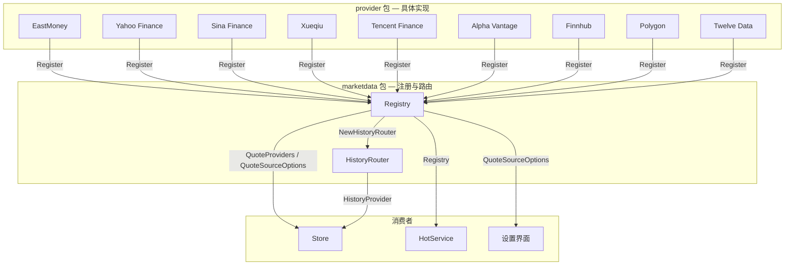
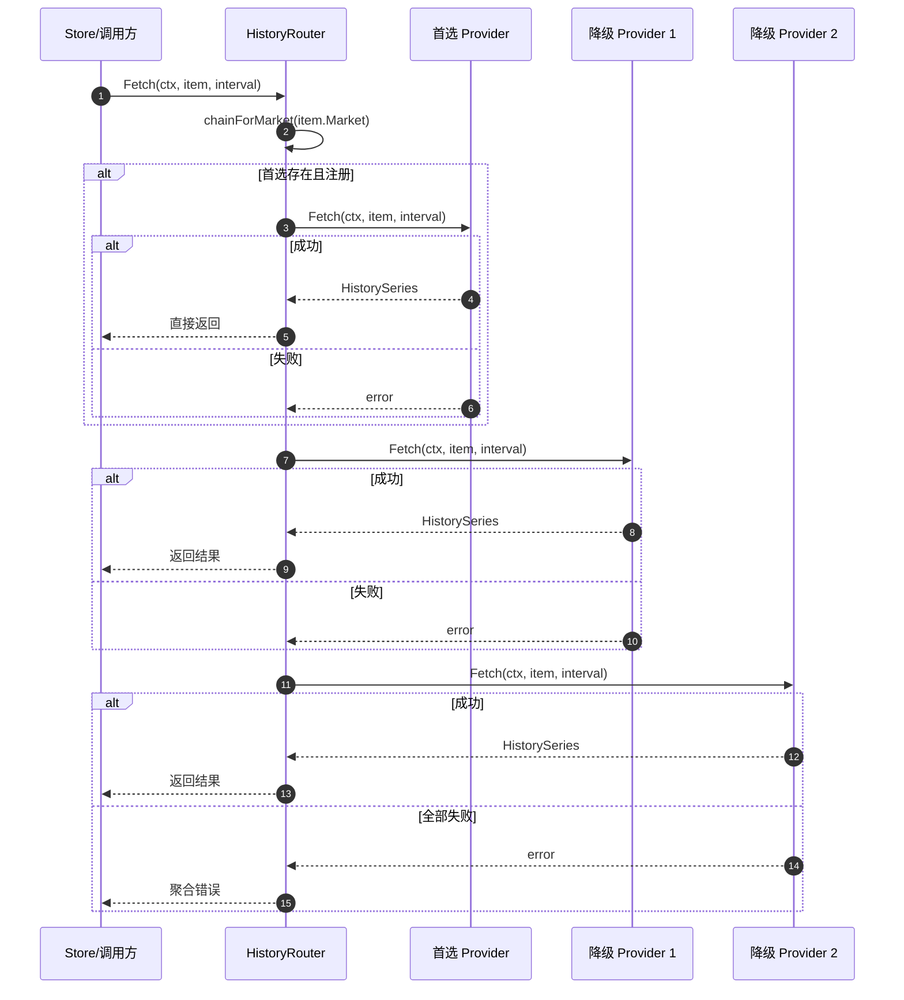
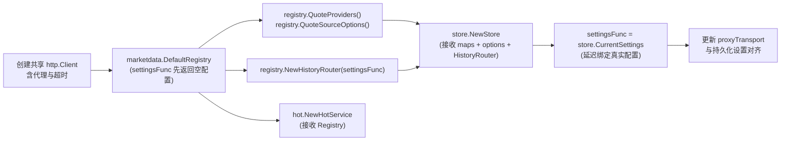

InvestGo 需要同时对接东方财富、Yahoo Finance、Sina、雪球、腾讯以及 Alpha Vantage、Finnhub、Polygon、Twelve Data 等多个市场数据上游，这些源站在覆盖市场、数据维度（实时行情与历史 K 线）以及接入方式（免费公开接口与 API Key）上各不相同。为了不让核心业务层直接依赖任何具体实现，`internal/core/marketdata` 包提供了 **Registry**（Provider 注册表）与 **HistoryRouter**（历史数据路由层）两套基础设施：Registry 在应用启动时将全部 Provider 的能力统一纳管，成为单一可信源；HistoryRouter 则在运行时根据标的所属市场与用户偏好构建多级降级链并自动兜底。本页聚焦这两个组件的结构语义、路由算法与生命周期集成，不涉及具体 Provider 的协议解析细节（参见「行情数据源详解」系列页面），也不展开 Store 的内部状态管理逻辑（相关机制请移步 [Store：核心状态管理与持久化](7-store-he-xin-zhuang-tai-guan-li-yu-chi-jiu-hua)）。

Sources: [model.go](internal/core/model.go#L348-L374)

在 Registry 介入之前，`core` 包先定义了两组最小化接口契约。`QuoteProvider` 要求实现 `Fetch(context.Context, []WatchlistItem) (map[string]Quote, error)` 与 `Name() string`，用于批量拉取实时行情；`HistoryProvider` 要求实现 `Fetch(context.Context, WatchlistItem, HistoryInterval) (HistorySeries, error)` 与 `Name() string`，用于获取单标的的历史序列。Registry 并不直接操作具体 Provider，而是将它们封装进 `DataSource` 结构体——该结构体包含 ID、显示名称、描述、支持市场列表，以及 `quote` 与 `history` 两个能力插槽。由于 `DataSource` 的全部字段均未导出，外部代码只能通过 `NewDataSource` 构造函数生成实例，这意味着一旦注册完成，Provider 的元数据与能力绑定即不可被外部篡改，从而保证了 Registry 内部状态的一致性。

Sources: [registry.go](internal/core/marketdata/registry.go#L15-L73)

`Registry` 本身仅由 `map[string]*DataSource` 与 `order []string` 两个字段构成：前者按 ID 提供 O(1) 查找，后者保留注册顺序以支撑设置界面的下拉列表渲染。`Register` 方法在检测到相同 ID 时会静默覆盖已有实例，但仅在首次注册时将 ID 追加到 `order` 切片，因此 UI 层通过 `QuoteSourceOptions()` 拿到的选项顺序与 `DefaultRegistry` 中的编码顺序完全一致。为了降低消费者耦合，Registry 提供了多组语义化访问器——`QuoteProviders()` 与 `HistoryProviders()` 分别返回能力过滤后的 map，直接适配 `Store` 与 `HistoryRouter` 的构造函数签名；`QuoteSourceOptions()` 生成供前端设置页渲染的源站选项；`Source(id)` 与 `HasQuote` / `HasHistory` 则供 HotService 等组件在运行期做精确的能力探测。在 `DefaultRegistry` 中，所有已知 Provider 在启动时被一次性实例化，并共享同一个已配置代理与超时策略的 `http.Client`，避免了每个 Provider 单独管理传输层的资源浪费。

Sources: [registry.go](internal/core/marketdata/registry.go#L56-L89), [registry.go](internal/core/marketdata/registry.go#L124-L165)

下表汇总了 `DefaultRegistry` 中注册的全部源站及其能力矩阵。可以看到，Sina 与雪球仅支持实时行情，而 Yahoo、EastMoney、Tencent 以及全部第三方 API 源则同时具备历史数据能力；美股专属源（Alpha Vantage、Twelve Data、Finnhub、Polygon）只覆盖 `US-STOCK` 与 `US-ETF`，其余源则横跨中港美三大市场。

| Provider ID | 显示名称 | 实时行情 | 历史 K 线 | 支持市场 |
|---|---|---|---|---|
| `eastmoney` | EastMoney | ✅ | ✅ | CN-A, CN-GEM, CN-STAR, CN-ETF, HK-MAIN, HK-GEM, HK-ETF, US-STOCK, US-ETF |
| `yahoo` | Yahoo Finance | ✅ | ✅ | CN-A, CN-GEM, CN-STAR, CN-ETF, HK-MAIN, HK-GEM, HK-ETF, US-STOCK, US-ETF |
| `sina` | Sina Finance | ✅ | ❌ | CN-A, CN-GEM, CN-STAR, CN-ETF, HK-MAIN, HK-GEM, HK-ETF, US-STOCK, US-ETF |
| `xueqiu` | Xueqiu | ✅ | ❌ | CN-A, CN-GEM, CN-STAR, CN-ETF, HK-MAIN, HK-GEM, HK-ETF, US-STOCK, US-ETF |
| `tencent` | Tencent Finance | ✅ | ✅ | CN-A, CN-GEM, CN-STAR, CN-ETF, HK-MAIN, HK-GEM, HK-ETF, US-STOCK, US-ETF |
| `alpha-vantage` | Alpha Vantage | ✅ | ✅ | US-STOCK, US-ETF |
| `twelve-data` | Twelve Data | ✅ | ✅ | US-STOCK, US-ETF |
| `finnhub` | Finnhub | ✅ | ✅ | US-STOCK, US-ETF |
| `polygon` | Polygon | ✅ | ✅ | US-STOCK, US-ETF |

Sources: [registry.go](internal/core/marketdata/registry.go#L181-L295)

Registry 的产物在消费端呈现出清晰的分层投射。Store 同时接收 `QuoteProviders()` 返回的 map、`QuoteSourceOptions()` 返回的选项列表，以及由 `NewHistoryRouter` 生成的单一 `HistoryProvider`；HotService 则直接持有 `*marketdata.Registry`，以便在渲染热门榜单时按用户配置从注册表中动态选取合适的 Provider 做报价覆盖；前端设置界面仅依赖 `QuoteSourceOptions()` 中的元数据，完全不感知后端的 Provider 类型。这种架构使得新增一个行情源时，只需在 `DefaultRegistry` 中调用 `Register`，Store、HotService 与 UI 均无需修改代码，体现了组合根（Composition Root）模式的核心价值。

Sources: [main.go](main.go#L52-L91), [service.go](internal/core/hot/service.go#L36-L55)

与实时行情不同，历史数据请求面临两个额外挑战：其一，部分行情源（如 Sina、雪球）仅提供实时报价而并无 K 线接口；其二，用户为某个市场设置的「首选报价源」若不具备历史能力，则不能直接用于图表加载，否则会导致所有历史数据请求失败。`HistoryRouter` 被设计为 `core.HistoryProvider` 的一个装饰器实现，它对 Store 暴露为单一历史数据源，内部却维护着完整的 Provider 降级链。它的路由决策依赖两个输入：标的的详细市场标识（如 `US-STOCK`、`HK-MAIN`）决定哪些 Provider 技术上能够服务该市场；用户为对应大市场组（CN/HK/US）配置的 `QuoteSource` 决定优先尝试谁，但只有具备历史能力的源才会被纳入降级链。

Sources: [history_router.go](internal/core/marketdata/history_router.go#L25-L49)

`HistoryRouter.Fetch` 在真正发起网络请求前，会先调用 `chainForMarket` 构建当前标的的 Provider 优先级列表。该过程分为三步：首先通过 `historyMarketGroup` 将详细市场标识归约为 `cn`、`hk`、`us` 三大组；随后 `preferredSourceID` 读取 `AppSettings` 中对应的 `CNQuoteSource`、`HKQuoteSource` 或 `USQuoteSource`，并检查该源是否存在于 `providers` map 中——若用户首选的是 Sina 或雪球等 quote-only 源，则直接返回空字符串，从而被静默跳过；最后将合法的首选源插入队首，其余位置由 `defaultHistoryChain` 按固定顺序填充，并剔除已出现的 ID 以避免重复请求。对于美股，默认链为 `yahoo → finnhub → polygon → alpha-vantage → twelve-data → eastmoney`，确保即便用户未配置任何 API Key，也能从 Yahoo Finance 免费接口获取基础数据；对于中港市场，默认链简化为 `yahoo → eastmoney`。这种「市场分组 + 能力过滤 + 默认兜底」的三层结构，使得 HistoryRouter 在不增加配置复杂度的情况下最大化数据可用性。

Sources: [history_router.go](internal/core/marketdata/history_router.go#L82-L160)

拿到降级链后，`Fetch` 按顺序遍历每个 Provider。一旦某个 Provider 返回成功，结果立即通过短路策略返回给上游，后续 Provider 不再触发；若链上所有 Provider 均失败，则将每个 Provider 的名称与原始错误聚合成一条诊断信息返回，方便在日志中定位是网络超时、限流还是标的本身不被支持。值得注意的是，`HistoryRouter` 本身并不缓存结果，缓存与去重逻辑由 Store 中的 `historyCache` 负责，因此 Router 保持无状态，可安全地在多个并发请求中复用。

Sources: [history_router.go](internal/core/marketdata/history_router.go#L54-L80)

Registry 与 Router 的装配发生在 `main.go` 的启动阶段，其中存在一个微妙的循环依赖：Store 需要从 Registry 获取 HistoryRouter，而 Router 又需要在运行时读取 Store 中的 `AppSettings` 才能知道用户的首选源。打破这一循环的方式是引入一个 `settingsFunc` 闭包——初始化 Registry 时该闭包先返回空的 `AppSettings`，待 `Store` 构造完成、配置从磁盘加载后，再将闭包重新绑定为 `store.CurrentSettings`。此后 HistoryRouter 的每一次 `Fetch` 调用都能读到最新的用户配置，而无需重新实例化。`DefaultRegistry` 创建完成后，其产物被分发到三个消费者：`registry.QuoteProviders()` 与 `registry.QuoteSourceOptions()` 注入 Store；`registry.NewHistoryRouter(settingsFunc)` 作为 Store 的 `historyProvider`；`registry` 本身则注入 `HotService`，用于热门榜单的报价覆盖与元数据查询。

Sources: [main.go](main.go#L52-L91)

实时行情与历史行情在路由哲学上采用了截然不同的策略。Store 在刷新实时行情时，会先将所有待更新标的按市场分组，再依据用户设置的 per-market 首选源，将同一 Provider 的标的聚合成一个批量请求一次性拉取；如果该 Provider 失败，当前批次不会自动降级，而是记录错误留待下次刷新。这种设计保证了同一次刷新内数据源的同质性，也简化了并发控制。相比之下，HistoryRouter 采用单标的顺序尝试，允许同一次请求跨 Provider 降级，因为历史数据对「同源性」的要求低于实时行情，而「可用性」要求更高。下表对两种路由策略进行了系统对比。

| 维度 | 实时行情路由（Store 层） | 历史行情路由（HistoryRouter） |
|---|---|---|
| 决策组件 | Store | HistoryRouter |
| 用户配置依据 | 每市场首选 quote source | 每市场首选 quote source + 历史能力过滤 |
| 请求粒度 | 按 Provider 批量聚合（同一源多个标的） | 单标的顺序尝试 |
| 降级策略 | 无自动降级，失败即记录 | 多级降级链，短路返回 |
| 默认回退链 | Store 内按注册顺序 fallback | `defaultHistoryChain`（美股 6 级，其他 2 级） |
| 接口形态 | `map[string]core.QuoteProvider` | `core.HistoryProvider`（装饰器模式） |
| 并发模型 | 按 Provider 并行批量 Fetch | 单请求内串行尝试 |

Sources: [store.go](internal/core/store/store.go#L51-L68), [runtime.go](internal/core/store/runtime.go#L174-L198)

Registry-HistoryRouter 架构体现了几个关键的设计权衡。首先，**Registry 作为组合根**集中管理所有 Provider 的生命周期，新增一个行情源只需在 `DefaultRegistry` 中注册，Store 与 HotService 完全无感。其次，**接口隔离**将报价与历史能力拆分为两个独立接口，使得 Sina、雪球等 quote-only 源可以无缝接入，而不必为实现空壳历史方法引入额外依赖。第三，**懒加载 settings 闭包**让 Registry 和 Router 在构造期不必持有完整的配置对象，既打破了启动时的循环依赖，也让运行时修改首选项能够即时生效。最后，Registry 中 `Register` 的静默覆盖语义虽然主要用于测试注入，但也为未来动态重载或热插拔 Provider 留下了扩展空间。

Sources: [registry.go](internal/core/marketdata/registry.go#L50-L55), [history_router.go](internal/core/marketdata/history_router.go#L31-L35)

理解 Registry 与 Router 的协作机制后，建议按以下路径深入：若需了解 Store 如何基于 Registry 提供的能力进行实时行情分组拉取、错误处理与缓存策略，请参阅 [Store：核心状态管理与持久化](7-store-he-xin-zhuang-tai-guan-li-yu-chi-jiu-hua)；若对 HistoryRouter 的降级链细节、市场分组规则以及错误聚合策略感兴趣，可继续阅读 [HistoryRouter：历史数据降级链与市场感知路由](10-historyrouter-li-shi-shu-ju-jiang-ji-lian-yu-shi-chang-gan-zhi-lu-you)；Provider 的具体协议实现（如 EastMoney 的 secid 映射、Yahoo 的 Cookie 预热）则分散在「行情数据源详解」章节，例如 [EastMoney Provider：实时行情与历史 K 线](26-eastmoney-provider-shi-shi-xing-qing-yu-li-shi-k-xian) 与 [Yahoo Finance Provider：行情、历史与搜索](27-yahoo-finance-provider-xing-qing-li-shi-yu-sou-suo)。此外，行情路由依赖标准化的市场代码与标的解析，相关逻辑可参考 [行情解析器：多市场代码规范化](9-xing-qing-jie-xi-qi-duo-shi-chang-dai-ma-gui-fan-hua)。