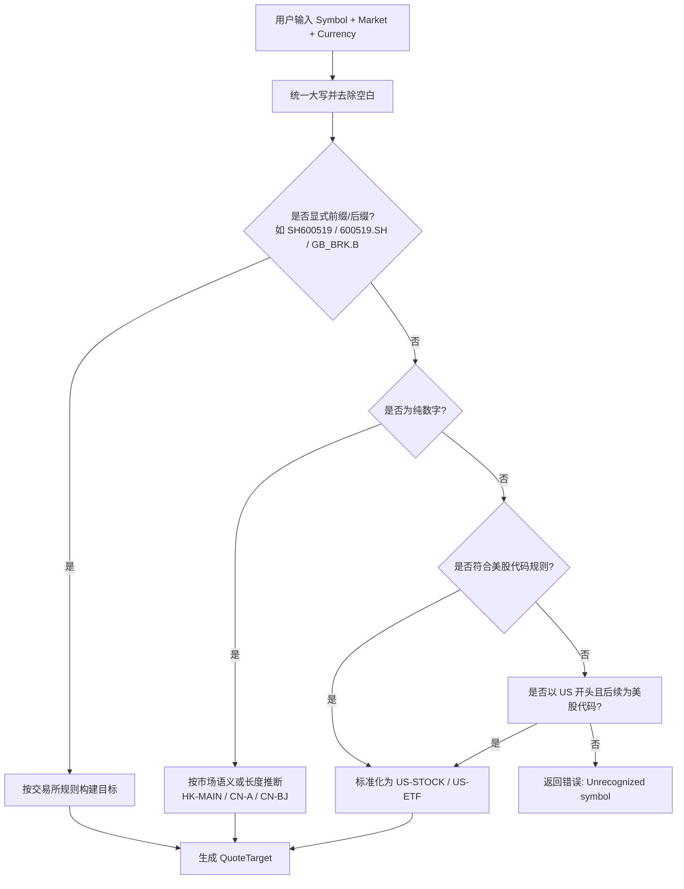

在跨市场投资追踪应用中，用户输入的股票代码格式千差万别：有人写 `hk700`，有人写 `00700.HK`，也有人直接敲 `700`；A 股可能是 `600519.SH`、`sh600519` 或纯数字 `600519`；美股则可能包含点号如 `BRK.B`。如果每个行情数据源（Provider）都独自处理这些格式差异，会导致解析逻辑散落在多处、维护成本激增，且难以保证前后端对同一只股票的标识一致。**行情解析器**（Quote Resolver）正是为了消除这种碎片化而存在的核心组件——它将所有用户输入归一到一个无歧义的规范身份 `QuoteTarget`，作为全系统唯一的行情查找键。

Sources: [quote_resolver.go](internal/core/quote_resolver.go#L28-L59)

## QuoteTarget：规范化的市场身份

`QuoteTarget` 是解析器的最终产物，也是行情 Provider 与状态存储层之间的通用契约。它包含四个字段：

| 字段 | 作用 |
|------|------|
| `Key` | 全局唯一的查找键，例如 `600519.SH`、`00700.HK`、`BRK-B` |
| `DisplaySymbol` | 前端展示用代码，通常与 `Key` 一致 |
| `Market` | 规范化的市场标签，如 `CN-A`、`HK-MAIN`、`US-STOCK` |
| `Currency` | 该市场的默认交易货币（CNY、HKD、USD 等）|

所有下游 Provider（EastMoney、Yahoo、Sina、Tencent 等）都基于 `Key` 来组织批量请求，并在返回的 `map[string]Quote` 中以 `Key` 作为映射键。Store 层在刷新行情或写入持仓时，同样通过 `ResolveQuoteTarget` 将用户原始输入映射到 `Key`，从而精准匹配到对应的报价数据。

Sources: [model.go](internal/core/model.go#L362-L368)

## 解析流水线：从原始输入到规范身份

解析器采用**分层防御式**的设计：先处理最明确的显式格式，再逐步退回到启发式推断。整体流程可以用以下 Mermaid 流程图表示：



Sources: [quote_resolver.go](internal/core/quote_resolver.go#L34-L59)

### 第一层：显式交易所标识

系统维护了两组交易所词缀规则：`quotePrefixRules`（前缀，如 `HK`、`SH`、`SZ`、`BJ`）和 `quoteSuffixRules`（后缀，如 `.HK`、`.SH`、`.SZ`、`.BJ`）。当检测到这些词缀时，解析器会立即剥离词缀，并将剩余部分交给对应市场的专属构建器。此外，系统还特殊处理了 `GB_` 前缀，用于将英国交易格式的美股代码（如 `GB_BRK.B`）归一化为标准美股目标。

Sources: [quote_resolver.go](internal/core/quote_resolver.go#L14-L75)

### 第二层：纯数字代码的语义推断

如果用户输入的是纯数字，解析器会根据代码长度和已知的市场上下文进行推断：

| 输入特征 | 推断逻辑 | 输出示例 |
|---------|---------|---------|
| 5 位数字且 Market 为空 | 默认视为港股主板 | `00700.HK` |
| Market 显式为 `HK-*` | 按港股构建，左补零至 5 位 | `00700.HK` |
| Market 为 `CN-BJ` / `BJ` | 按北交所构建 | `430047.BJ` |
| 6 位数字 | 按 A 股/ETF/北交所前缀规则推断 | `600519.SH` |

Sources: [quote_resolver.go](internal/core/quote_resolver.go#L109-L141)

### 第三层：美股代码规范化

美股代码允许字母、数字、连字符和点号。解析器会先验证字符集合法性（`isUSSymbol`），随后将点号统一替换为连字符、转大写，以消除 `BRK.B` 与 `BRK-B` 之类的差异。如果用户在代码前加了 `US` 前缀（如 `USBRK-B`），系统也会自动剥离。

Sources: [quote_resolver.go](internal/core/quote_resolver.go#L200-L218), [quote_resolver.go](internal/core/quote_resolver.go#L321-L343)

## A 股市场推断的数学基础

对于 6 位数字的 A 股代码，解析器通过**首位前缀规则**推断所属交易所与板块。这是基于中国证监会与沪深北交易所的编码分配规则实现的：

| 代码前缀 | 市场标签 | 交易所 | 说明 |
|---------|---------|--------|------|
| `688` / `689` | `CN-STAR` | SH | 科创板 |
| `6` / `9` | `CN-A` | SH | 沪市主板 |
| `5` | `CN-ETF` | SH | 沪市基金/ETF |
| `3` | `CN-GEM` | SZ | 创业板 |
| `15` / `16` | `CN-ETF` | SZ | 深市基金/ETF |
| `0` / `1` / `2` | `CN-A` | SZ | 深市主板 / 中小板 |
| `4` / `8` | `CN-BJ` | BJ | 北交所 |

当用户已显式指定了 `CN-GEM`、`CN-STAR` 或 `CN-ETF` 等细分板块时，解析器会**尊重用户选择**，仅在交易所层面做必要推断；若用户未指定，则完全依赖前缀规则。

Sources: [quote_resolver.go](internal/core/quote_resolver.go#L248-L288)

## 市场标签的别名归一化

用户在添加自选股时，可能使用各种非标准市场名称。`normaliseMarketLabel` 函数负责将这些别名映射到内部规范标签：

| 用户可能输入 | 规范化结果 |
|-------------|-----------|
| `A-SHARE`、`ASHARE`、`CN`、`A`、`CN-A` | `CN-A` |
| `CN-GEM`、`GEM` | `CN-GEM` |
| `CN-STAR`、`STAR` | `CN-STAR` |
| `CN-ETF`、`CNETF` | `CN-ETF` |
| `HK`、`H-SHARE` | `HK-MAIN` |
| `US`、`NASDAQ`、`NYSE`、`US-NYQ` | `US-STOCK` |
| `US ETF`、`ETF`、`US-ETF` | `US-ETF` |

未被识别的标签会被原样保留，以便后续模块进行兼容性处理。

Sources: [quote_resolver.go](internal/core/quote_resolver.go#L220-L246)

## 与 Provider 和 Store 的集成架构

行情解析器并不直接发起网络请求，而是作为**数据流中的转换层**存在。它在两个关键位置被调用：

```mermaid
flowchart LR
    subgraph Frontend
        F1[用户输入 Symbol/Market]
    end
    subgraph Core
        R[QuoteResolver<br/>生成 QuoteTarget]
    end
    subgraph Provider
        P1[EastMoney/Yahoo/Sina<br/>按 Key 批量请求]
    end
    subgraph Store
        S1[Refresh: 按 Key 匹配报价]
        S2[Upsert: 写入前获取初始行情]
    end
    F1 --> R
    R -->|Key| P1
    P1 -->|map[Key]Quote| S1
    R --> S1
    R --> S2
```

1. **Provider 批量请求前**：`CollectQuoteTargets` 将 `[]WatchlistItem` 转换为 `map[string]QuoteTarget`，并过滤掉解析失败的条目。随后各 Provider 将 `Key` 翻译成自身 API 所需的代码格式（例如 EastMoney 的 `secid`、Tencent 的 `sh600519`）。
2. **Store 刷新行情时**：`runtime.go` 在收到 Provider 返回的 `map[string]Quote` 后，再次调用 `ResolveQuoteTarget` 计算每个持仓的规范 `Key`，从而将报价精准写回对应条目。
3. **Store 新增/更新条目时**：`mutation.go` 在保存用户输入后，立即用解析器获取 `Key`，并尝试从实时报价结果中匹配当前价格，确保新添加的自选股能立刻显示行情。

Sources: [helpers.go](internal/core/provider/helpers.go#L20-L35), [runtime.go](internal/core/store/runtime.go#L45-L55), [mutation.go](internal/core/store/mutation.go#L54-L66)

## 错误处理与边界情况

解析器在以下场景会返回明确错误，供上游 `CollectQuoteTargets` 汇总后统一记录：

| 场景 | 错误信息 | 处理策略 |
|------|---------|---------|
| Symbol 为空或仅空白 | `Symbol is required` | 直接跳过该条目 |
| 6 位数字但前缀无法识别 | `Cannot recognize A-share / ETF symbol` | 跳过，通常意味着用户输入了非标准代码 |
| 纯数字但长度既非 5 也非 6，且市场不明确 | `Cannot infer market for numeric symbol` | 跳过，要求用户补充市场信息 |
| 非数字、非美股格式、无显式交易所词缀 | `Unrecognized symbol: ...` | 跳过 |

Sources: [quote_resolver.go](internal/core/quote_resolver.go#L36-L58), [quote_resolver.go](internal/core/quote_resolver.go#L123-L125)

## 测试覆盖与验证

解析器的核心逻辑由单元测试覆盖，验证场景包括前缀港股（`hk700`）、后缀上海（`600519.sh`）、带市场标签的深市 ETF（`sz159941` / `CN-ETF`）、北交所（`bj430047`）、纯数字港股推断（`00700`）、英股格式美股（`gb_brk.b`）以及空值和非法输入的错误路径。

Sources: [quote_resolver_test.go](internal/core/quote_resolver_test.go#L5-L109)

## 延伸阅读

行情解析器是**市场数据 Provider 注册表与路由机制**的下游前置模块，也是 **Store：核心状态管理与持久化**在刷新行情时的关键依赖。如果你想了解 Provider 如何将 `QuoteTarget.Key` 转换为各平台特有的请求格式，可继续阅读 [EastMoney Provider：实时行情与历史 K 线](26-eastmoney-provider-shi-shi-xing-qing-yu-li-shi-k-xian) 与 [国内行情源（新浪、雪球、腾讯）](29-guo-nei-xing-qing-yuan-xin-lang-xue-qiu-teng-xun)；若想深入了解 Store 如何管理行情刷新生命周期，请参阅 [Store：核心状态管理与持久化](7-store-he-xin-zhuang-tai-guan-li-yu-chi-jiu-hua)。