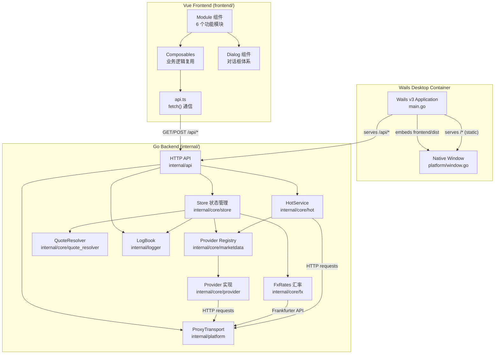
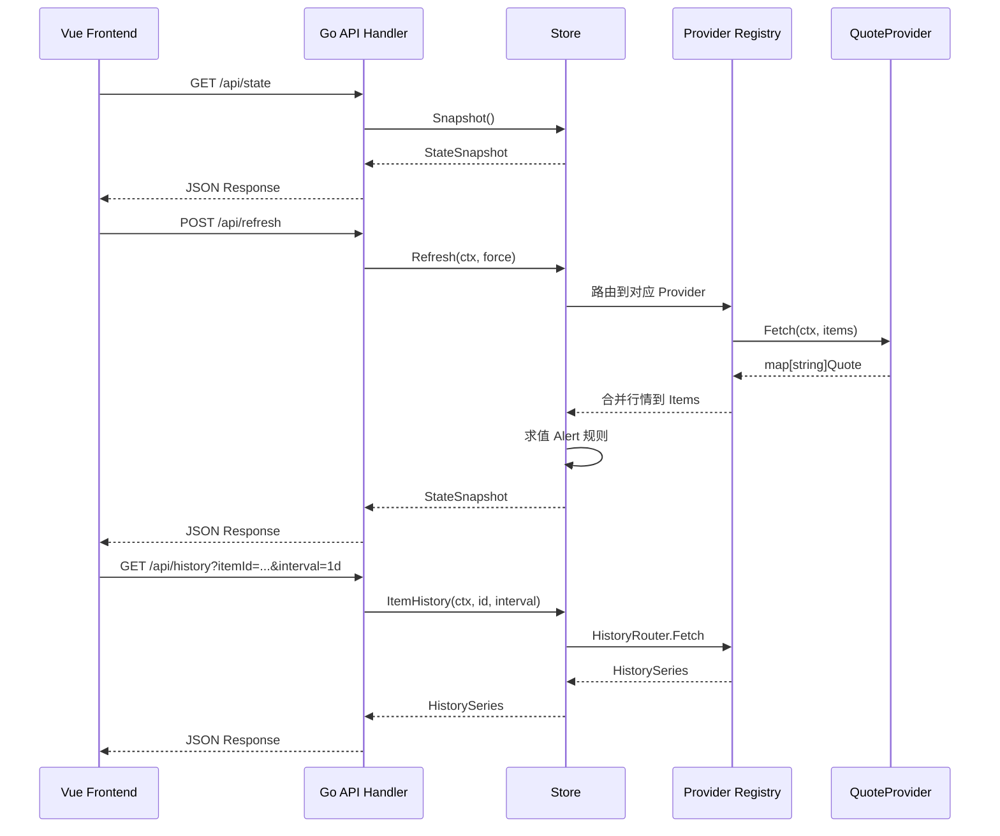

InvestGo 是一个基于 **Wails v3** 的跨平台桌面投资跟踪应用，面向 A 股、港股、美股三大市场的个人投资者。它将 Go 后端和 Vue 3 前端封装在同一个原生桌面窗口中，利用系统 WebView 渲染界面，无需像 Electron 那样内嵌 Chromium 和 Node.js 运行时，因此在应用体积、空闲内存占用和启动速度上具有显著优势。应用核心功能涵盖：自选股与持仓管理、组合概览与汇率换算、热门榜单与多源聚合、历史走势图加载与缓存、以及价格提醒。项目当前基于 Wails v3 alpha.54，主要用于个人使用和学习参考。

Sources: [README.zh-CN.md](README.zh-CN.md#L1-L12), [main.go](main.go#L1-L40)

## 技术栈

InvestGo 的技术选型遵循**后端重计算、前端轻渲染**的分工原则：Go 负责所有行情获取、状态管理、缓存策略和持久化；Vue 3 前端仅负责 UI 呈现和用户交互，通过标准 `fetch()` 调用后端 HTTP API，不依赖 Wails JS bindings 传递应用数据。

| 层级 | 技术选型 | 用途 |
|------|----------|------|
| **桌面框架** | Wails v3 alpha.54 | Go + WebView 原生桌面容器 |
| **后端语言** | Go 1.24 | 业务逻辑、状态管理、网络请求 |
| **HTTP 路由** | Go 1.22+ `http.ServeMux` | API 路由与请求处理（路径参数匹配） |
| **前端框架** | Vue 3 + TypeScript | 响应式 UI 渲染 |
| **UI 组件库** | PrimeVue 4 + PrimeIcons | 组件体系与图标 |
| **图表** | Chart.js 4 | 历史走势图与组合趋势图 |
| **构建工具** | Vite 8 | 前端开发服务器与打包 |
| **汇率数据** | Frankfurter API (ECB) | 多币种汇率换算 |
| **TLS 指纹** | utls | HTTP 请求 TLS 指纹伪装 |
| **macOS 打包** | shell + swift/sips/iconutil/hdiutil | .app + .dmg 生成 |
| **Windows 构建** | PowerShell + Edge WebView2 | .exe 构建 |

Sources: [go.mod](go.mod#L1-L10), [package.json](package.json#L1-L21), [vite.config.ts](vite.config.ts#L1-L18)

## 整体架构

应用的核心架构可以用一个简洁的三层模型来描述：**Wails 桌面容器层** → **Go 后端服务层** → **Vue 前端 UI 层**。`main.go` 是唯一的入口，它创建 Wails 应用实例、初始化所有后端服务（Store、HotService、ProxyTransport、LogBook），并将一个统一的 `http.ServeMux` 注册为 Wails 的静态资源处理器。前端和后端之间不存在 IPC 调用或 Wails JS bindings——所有数据交换都通过 `/api/*` HTTP 路由完成，前端使用标准 `fetch()` 发起请求。这种设计使得前端开发服务器（`npm run dev`，端口 5173）可以脱离 Wails 运行时独立工作，前提是 `wails-runtime.ts` 中的桌面平台 API 保持可空安全。



Sources: [main.go](main.go#L41-L130), [internal/api/http.go](internal/api/http.go#L1-L60), [frontend/src/api.ts](frontend/src/api.ts#L1-L40)

## 目录结构

项目采用**扁平式 Go 模块布局**——Go module 根目录即为仓库根目录，前端代码位于 `frontend/` 子目录。`internal/` 下的每个子包职责明确，遵循 Go 标准的 internal 封装约定。

```
investgo/
├── main.go                          # 应用入口：Wails 初始化、服务组装、窗口创建
├── go.mod / go.sum                  # Go 模块定义
├── frontend/
│   ├── src/
│   │   ├── App.vue                  # 根组件：状态管理中枢、自动刷新调度
│   │   ├── main.ts                  # Vue 应用引导、PrimeVue 主题注入
│   │   ├── api.ts                   # 统一 fetch 封装（超时、取消、错误日志）
│   │   ├── types.ts                 # TypeScript 类型定义（与后端 model.go 对齐）
│   │   ├── wails-runtime.ts         # Wails 运行时桥接（窗口控制、平台检测）
│   │   ├── theme.ts                 # PrimeVue 主题预设与暗色模式切换
│   │   ├── i18n.ts                  # 中英文国际化
│   │   ├── format.ts                # 数字/货币/百分比格式化
│   │   ├── forms.ts                 # 表单默认值与校验
│   │   ├── constants.ts             # 常量定义
│   │   ├── devlog.ts                # 前端开发日志捕获
│   │   ├── composables/             # Vue 3 组合式函数
│   │   ├── components/              # UI 组件（Shell、Sidebar、Modules、Dialogs）
│   │   ├── styles/                  # 全局样式
│   │   └── assets/                  # 静态资源
│   └── index.html                   # SPA 入口
├── internal/
│   ├── api/                         # HTTP API 层（路由 + Handler）
│   │   ├── handler.go               # 各 API 端点的请求处理逻辑
│   │   ├── http.go                  # Handler 结构、路由注册、JSON 编解码
│   │   ├── i18n/                    # API 错误消息国际化
│   │   └── open_external.go         # 系统默认浏览器打开
│   ├── common/
│   │   ├── cache/                   # 泛型 TTL 缓存
│   │   └── errs/                    # 结构化错误类型
│   ├── core/                        # 核心业务逻辑
│   │   ├── model.go                 # 领域模型（WatchlistItem、AlertRule、StateSnapshot 等）
│   │   ├── quote_resolver.go        # 行情符号规范化与市场解析
│   │   ├── endpoint/                # Provider HTTP 端点构造
│   │   ├── fx/                      # Frankfurter 汇率获取与换算
│   │   ├── hot/                     # 热门榜单服务（多源聚合、缓存、排序）
│   │   ├── marketdata/              # Provider 注册表与历史路由
│   │   ├── provider/                # 9 个行情 Provider 实现
│   │   └── store/                   # 核心状态管理（持久化、刷新、概览、缓存）
│   ├── logger/                      # 结构化日志体系（后端 + 前端日志）
│   └── platform/                    # 桌面平台差异隔离（代理检测、窗口配置）
├── scripts/                         # 跨平台构建与打包脚本
└── assets/                          # 应用截图
```

Sources: [main.go](main.go#L1-L10), [internal/core/model.go](internal/core/model.go#L1-L50), [frontend/src/api.ts](frontend/src/api.ts#L1-L10), [internal/core/store/store.go](internal/core/store/store.go#L1-L50)

## 核心功能模块

InvestGo 的用户界面由 **6 个功能模块** 驱动，每个模块对应前端的一个 `*Module.vue` 组件和后端的一组 API 端点。

| 模块 | 前端组件 | 后端 API | 功能说明 |
|------|----------|----------|----------|
| **组合概览** | `OverviewModule.vue` | `GET /api/overview` | 持仓汇总、盈亏统计、资产配置饼图、组合趋势堆叠图 |
| **自选列表** | `WatchlistModule.vue` | `GET /api/state` / `POST /api/items` / `PUT /api/items/{id}` / `DELETE /api/items/{id}` | 股票添加/编辑/删除/置顶、行情刷新、搜索过滤 |
| **热门榜单** | `HotModule.vue` | `GET /api/hot` | 按市场分组的涨跌/成交额/市值排行，支持搜索 |
| **持仓管理** | `HoldingsModule.vue` | 复用 Watchlist API + `GET /api/overview` | 持仓详情、DCA 分批建仓记录、成本/盈亏计算 |
| **价格提醒** | `AlertsModule.vue` | `POST /api/alerts` / `PUT /api/alerts/{id}` / `DELETE /api/alerts/{id}` | 价格上下限提醒规则管理、触发状态展示 |
| **设置** | `SettingsModule.vue` | `PUT /api/settings` | 行情源选择、代理配置、主题切换、国际化、开发者模式 |

Sources: [frontend/src/components/modules/](frontend/src/components/modules), [internal/api/http.go](internal/api/http.go#L38-L62)

## 行情数据源体系

InvestGo 内置 **9 个行情数据源**，通过 `Registry` 统一注册和管理。每个数据源声明自己支持的 `QuoteProvider`（实时行情）和 `HistoryProvider`（历史走势），Store 根据用户在每个市场中配置的行情源偏好来路由请求。免费数据源无需 API Key 即可使用，付费数据源需要在设置中填入对应的 API Key。

| 数据源 ID | 名称 | 行情 | 历史 | 支持市场 | 需要 API Key |
|-----------|------|------|------|----------|-------------|
| `eastmoney` | 东方财富 | ✅ | ✅ | CN/HK/US 全市场 | 否 |
| `yahoo` | Yahoo Finance | ✅ | ✅ | CN/HK/US 全市场 | 否 |
| `sina` | 新浪财经 | ✅ | ❌ | CN/HK/US 全市场 | 否 |
| `xueqiu` | 雪球 | ✅ | ❌ | CN/HK/US 全市场 | 否 |
| `tencent` | 腾讯财经 | ✅ | ✅ | CN/HK/US 全市场 | 否 |
| `alpha-vantage` | Alpha Vantage | ✅ | ✅ | US-STOCK/US-ETF | 是 |
| `twelve-data` | Twelve Data | ✅ | ✅ | US-STOCK/US-ETF | 是 |
| `finnhub` | Finnhub | ✅ | ✅ | US-STOCK/US-ETF | 是 |
| `polygon` | Polygon | ✅ | ✅ | US-STOCK/US-ETF | 是 |

默认行情源配置为：A 股 → 新浪、港股 → 雪球、美股 → Yahoo。用户可在设置中为每个市场独立选择行情源，切换后立即生效。

Sources: [internal/core/marketdata/registry.go](internal/core/marketdata/registry.go#L217-L295), [internal/core/model.go](internal/core/model.go#L320-L327)

## 状态管理与数据流

应用的核心数据流是**前端请求 → 后端处理 → 快照返回**的循环模式。Store 是后端唯一的状态权威，所有前端状态都来源于 `GET /api/state` 返回的 `StateSnapshot`，前端不维护独立的持久化数据。

**StateSnapshot** 是前端获取应用全局状态的唯一入口，它包含以下字段：

| 字段 | 类型 | 说明 |
|------|------|------|
| `dashboard` | `DashboardSummary` | 组合汇总（总成本、总市值、盈亏、触发提醒数） |
| `items` | `[]WatchlistItem` | 自选/持仓列表（含行情、DCA、持仓摘要） |
| `alerts` | `[]AlertRule` | 价格提醒规则 |
| `settings` | `AppSettings` | 应用设置（行情源、代理、主题、国际化等） |
| `runtime` | `RuntimeStatus` | 运行时状态（刷新时间、行情源、版本号、汇率状态） |
| `quoteSources` | `[]QuoteSourceOption` | 可选行情源列表 |
| `storagePath` | `string` | 持久化文件路径 |
| `generatedAt` | `time.Time` | 快照生成时间 |

前端 `App.vue` 在挂载时调用 `loadState()` 拉取初始快照，之后通过定时器驱动 `refreshQuotes()` 自动刷新行情。每次刷新后，前端收到新的完整快照并替换本地引用，触发 Vue 的响应式更新。历史走势图数据则通过 `GET /api/history` 独立获取，带有独立的缓存策略。



Sources: [internal/core/model.go](internal/core/model.go#L296-L318), [internal/core/store/store.go](internal/core/store/store.go#L59-L130), [frontend/src/App.vue](frontend/src/App.vue#L1-L60)

## 持久化与存储

应用状态以 JSON 文件形式持久化到用户配置目录，Store 在启动时加载、在关闭时保存。持久化内容涵盖用户的所有自选/持仓数据、提醒规则和应用设置，但**不包含**实时行情和汇率等运行时数据——这些在每次启动后从 Provider 重新获取。

| 操作系统 | 状态文件路径 | 日志文件路径 |
|---------|-------------|-------------|
| macOS | `~/Library/Application Support/investgo/state.json` | `~/Library/Application Support/investgo/logs/app.log` |
| Windows | `%AppData%\investgo\state.json` | `%AppData%\investgo\logs\app.log` |

后端使用 `sync.RWMutex` 保护 Store 的并发访问，并采用多级 TTL 缓存策略来减少重复网络请求：行情刷新结果缓存、单项刷新缓存、历史数据缓存和组合概览缓存各有独立的容量和过期时间。

Sources: [main.go](main.go#L155-L175), [internal/core/store/store.go](internal/core/store/store.go#L59-L80)

## 行情符号规范化

用户在添加自选股时可能输入多种格式的符号（如 `600519`、`SH600519`、`600519.SH`、`00700`、`AAPL`、`US_AAPL`），系统通过 **QuoteResolver** 将这些自由输入统一规范化为标准的 `QuoteTarget`（如 `600519.SH`、`00700.HK`、`AAPL`），同时推断所属市场和计价货币。这套规范化逻辑覆盖了 A 股（主板、创业板、科创板、北交所）、港股（主板、创业板、ETF）和美股（股票、ETF）的全部识别规则。

Sources: [internal/core/quote_resolver.go](internal/core/quote_resolver.go#L1-L60)

## 代理与网络

应用支持三种代理模式：**直连**（none）、**系统代理**（system）和**自定义代理**（custom）。在 macOS 上，选择系统代理时，应用会通过 `scutil --proxy` 读取系统代理设置并注入到进程环境变量中。所有 HTTP 请求共享同一个 `http.Client`，其 `Transport` 层由 `ProxyTransport` 管理，确保行情请求、汇率请求、热门榜单请求都能尊重用户配置的代理设置。

Sources: [internal/platform/proxy.go](internal/platform/proxy.go#L1-L63), [main.go](main.go#L67-L82)

## 阅读导航

本项目文档按照**从浅入深**的逻辑组织，建议按以下顺序阅读：

1. **快速入门**——搭建环境、运行项目、构建打包
   - [环境搭建与运行](2-huan-jing-da-jian-yu-yun-xing)
   - [桌面应用构建与打包](3-zhuo-mian-ying-yong-gou-jian-yu-da-bao)

2. **后端架构**——理解 Go 后端的设计与实现
   - [应用入口与 Wails v3 集成](4-ying-yong-ru-kou-yu-wails-v3-ji-cheng)
   - [HTTP API 路由与请求处理](5-http-api-lu-you-yu-qing-qiu-chu-li)
   - [Store 核心状态管理与持久化](6-store-he-xin-zhuang-tai-guan-li-yu-chi-jiu-hua)
   - [行情数据 Provider 注册与路由机制](7-xing-qing-shu-ju-provider-zhu-ce-yu-lu-you-ji-zhi)

3. **前端架构**——理解 Vue 3 前端的组件与交互设计
   - [Vue 3 应用结构与根组件编排](14-vue-3-ying-yong-jie-gou-yu-gen-zu-jian-bian-pai)
   - [API 通信层与错误处理](15-api-tong-xin-ceng-yu-cuo-wu-chu-li)
   - [Wails 运行时桥接与平台适配](16-wails-yun-xing-shi-qiao-jie-yu-ping-tai-gua-pei)

4. **领域模型与数据流**——深入理解核心业务
   - [核心领域模型：WatchlistItem、AlertRule 与 StateSnapshot](21-he-xin-ling-yu-mo-xing-watchlistitem-alertrule-yu-statesnapshot)
   - [前后端状态同步与快照机制](22-qian-hou-duan-zhuang-tai-tong-bu-yu-kuai-zhao-ji-zhi)

5. **Provider 实现详解**——各数据源的对接细节
   - [东方财富与新浪行情 Provider](25-dong-fang-cai-fu-yu-xin-lang-xing-qing-provider)
   - [Yahoo Finance 与腾讯财经 Provider](26-yahoo-finance-yu-teng-xun-cai-jing-provider)

6. **工程化与部署**——构建、打包、调试
   - [跨平台构建脚本与版本注入](28-kua-ping-tai-gou-jian-jiao-ben-yu-ban-ben-zhu-ru)
   - [开发模式与调试技巧](30-kai-fa-mo-shi-yu-diao-shi-ji-qiao)