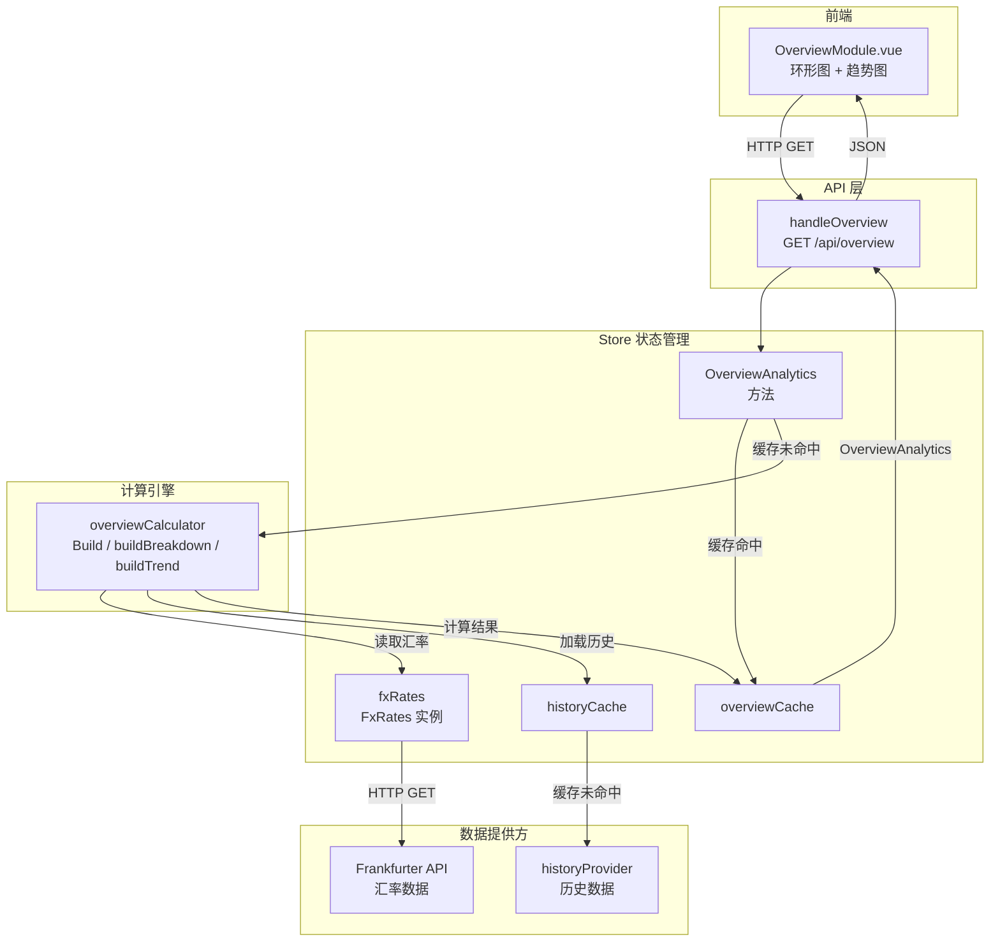
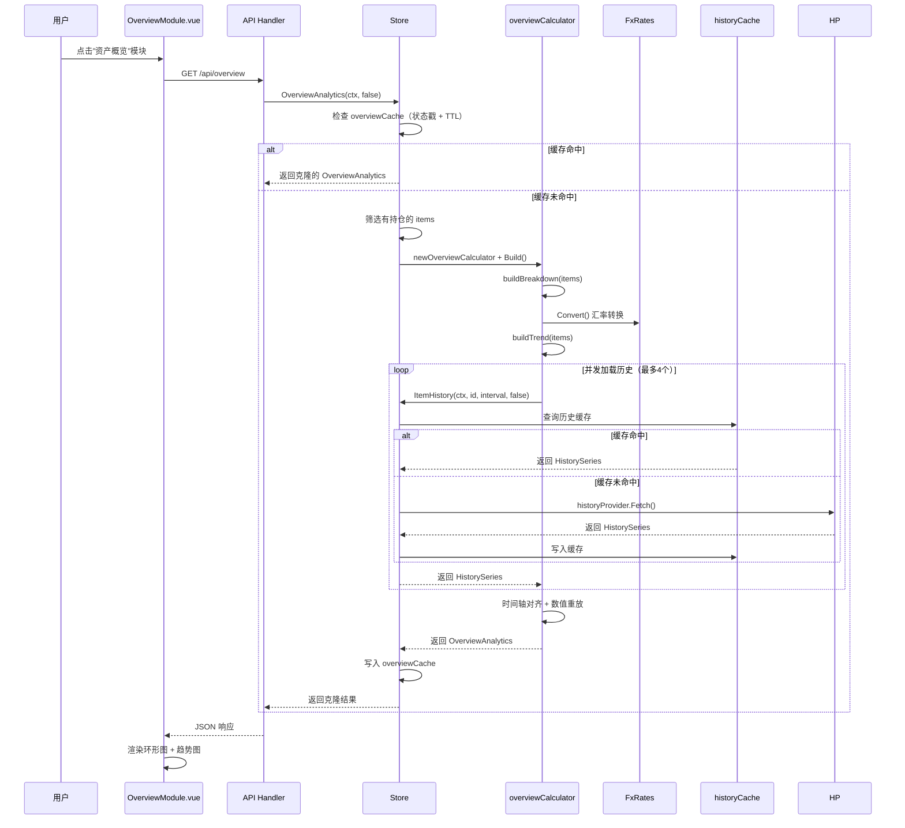

组合概览是 InvestGo 资产看板的核心可视化模块，它将用户分散在不同市场、不同币种的持仓聚合成统一的分析视角。后端通过 `overviewCalculator` 计算引擎将多币种持仓转换为单一展示币种，生成持仓占比环形图与历史趋势堆叠图的数据；`FxRates` 汇率服务则为整个聚合过程提供实时汇率支撑，确保跨币种资产可以在同一标尺下比较。本章将从领域模型、汇率引擎、计算管线、缓存策略到前端渲染，完整拆解这一数据管道的实现逻辑。

## 核心领域模型

组合概览涉及的数据结构集中在 `core` 包中定义，它们分别对应前端的两张核心图表与顶部的汇总卡片。

`OverviewAnalytics` 是后端向前端输出的完整分析载荷，包含 `displayCurrency`（展示币种）、`breakdown`（持仓占比切片数组）和 `trend`（组合趋势时间线）三个核心字段。`OverviewHoldingSlice` 描述单个资产在环形图中的占比数据，其中 `Value` 为转换后的市值，`Weight` 为占总组合的比例。`OverviewTrend` 与 `OverviewTrendSeries` 则构成趋势图的数据骨架：`Dates` 提供统一的时间轴，`Series` 中每个元素的 `Values` 数组与该时间轴逐日对齐，反映该资产在对应日期的持仓市值。`DashboardSummary` 则用于顶部数字卡片，展示总成本、总市值、总盈亏及赢亏标的计数。这些模型之间的关系可以用下表概括：

| 模型 | 用途 | 关键字段 |
|------|------|----------|
| `DashboardSummary` | 顶部汇总卡片 | `totalCost`, `totalValue`, `totalPnL`, `winCount`, `lossCount` |
| `OverviewHoldingSlice` | 环形图（持仓占比） | `symbol`, `name`, `value`, `weight` |
| `OverviewTrendSeries` | 趋势图单资产序列 | `symbol`, `values[]`, `latestValue`, `firstBuyDate` |
| `OverviewTrend` | 趋势图完整数据 | `dates[]`, `series[]`, `totalValue` |
| `OverviewAnalytics` | 后端输出聚合体 | `breakdown`, `trend`, `displayCurrency`, `cached` |

Sources: [model.go](internal/core/model.go#L141-L193)

## 架构总览

组合概览的数据管道横跨汇率服务、状态管理层、计算引擎、HTTP API 和前端图表五个层级。`Store` 持有 `FxRates` 实例与 `overviewCache`，在收到前端请求时，先筛选出带有实际持仓的 `WatchlistItem`，再交由 `overviewCalculator` 进行统一计算。计算过程中需要的历史走势数据不直接调用 `historyProvider.Fetch`，而是复用 `Store.ItemHistory` 方法，从而命中共享的 `historyCache`。最终 `OverviewAnalytics` 经 `GET /api/overview` 返回到前端，由 `OverviewModule.vue` 渲染为 PrimeVue Chart 组件。

Sources: [handler.go](internal/api/handler.go#L14-L22), [http.go](internal/api/http.go#L62), [store.go](internal/core/store/store.go#L33-L37), [runtime.go](internal/core/store/runtime.go#L244-L293)

## 汇率转换引擎

跨市场持仓聚合的首要挑战是币种统一。InvestGo 的 `FxRates` 服务位于 `internal/core/fx` 包中，它以 CNY 为间接基准，实现任意两种币种之间的转换。

### 数据源与报价方式

`FxRates` 使用 Frankfurter API（基于欧洲央行公开数据）获取汇率。为减少请求次数并统一计算逻辑，服务并非分别请求每对货币，而是以 CNY 为 base 货币请求一次最新汇率，然后对返回的数值取倒数，存储为 `1 单位外币 = X CNY` 的映射关系。例如 API 返回 `1 CNY = 0.138 USD`，则内部存储为 `1 USD = 7.246 CNY`。这种以 CNY 为中心的间接报价法使得任意两种外币之间的转换都可以通过 `from → CNY → to` 两步完成，无需维护完整的汇率矩阵。

Sources: [fxrate.go](internal/core/fx/fxrate.go#L14-L18), [fxrate.go](internal/core/fx/fxrate.go#L86-L148)

### 线程安全与缓存策略

`FxRates` 内部维护两层锁机制。`sync.RWMutex` 保护 `rates` 映射、`validAt` 和 `lastError` 的读写操作，确保并发转换时的数据安全。`sync.Mutex`（`fetchMu`）则通过 `TryLock` 防止多个 goroutine 同时发起网络请求：当某个 goroutine 正在拉取汇率时，其他并发调用者会立即返回，复用已有的缓存数据。汇率缓存有效期为 2 小时，由 `IsStale()` 方法判断。

Sources: [fxrate.go](internal/core/fx/fxrate.go#L19-L26), [fxrate.go](internal/core/fx/fxrate.go#L51-L56), [fxrate.go](internal/core/fx/fxrate.go#L89-L93)

### 转换接口

`Convert(value, from, to)` 是外部调用者使用的核心方法。其实现逻辑非常简洁：若币种相同或值为零则直接返回；否则先通过 `rates[from]` 将金额转为 CNY 中间值，若目标币种为 CNY 则直接返回中间值，否则再用 `rates[to]` 除法换算。当源币种或目标币种的汇率缺失时，方法会优雅降级——返回已计算的 CNY 中间值或原始值，避免完全失败。

Sources: [fxrate.go](internal/core/fx/fxrate.go#L157-L183)

## 组合概览计算引擎

`overviewCalculator` 是组合概览的后端计算核心，它接收一组 `WatchlistItem` 和汇率服务实例，输出完整的 `OverviewAnalytics`。计算分为两个正交维度：**持仓占比分析**与**趋势回溯分析**。

### 计算器初始化与入口

计算器通过 `newOverviewCalculator` 工厂函数创建，需要注入 `FxRates` 实例、展示币种和 `overviewHistoryLoader` 历史加载函数。`displayCurrency` 的空值会被防御性地回退为 `CNY`，以确保后续所有数值都在同一币种下可比。`Build` 方法是唯一公开入口，它按顺序调用 `buildBreakdown` 和 `buildTrend`，并将两者封装为 `OverviewAnalytics`。

Sources: [overview.go](internal/core/store/overview.go#L18-L49), [overview.go](internal/core/store/overview.go#L51-L65)

### 持仓占比分析（buildBreakdown）

`buildBreakdown` 遍历所有持仓项目，通过 `item.MarketValue()` 获取当前市值，并调用 `convertValue` 统一转换到展示币种。市值小于等于零的条目会被过滤，避免在环形图中产生无意义的零值切片。转换后的切片按市值降序排列，并计算每项占总组合的权重 `Weight = value / total`。排序规则在市值相同时以 `Symbol` 字典序作为稳定键，确保前端渲染的一致性。

Sources: [overview.go](internal/core/store/overview.go#L67-L101)

### 趋势回溯分析（buildTrend）

趋势分析是计算引擎中最复杂的部分，它需要将历史价格序列与持仓变动（DCA 定投或固定持仓）逐日重放，生成组合市值的时间线。

#### 候选持仓识别

首先，`buildTrend` 从所有项目中识别出“有持仓”的候选者。候选条件分为两种：一是存在有效的 `DCAEntry`（`Amount > 0 && Shares > 0`），二是 `Quantity > 0` 的普通持仓。对于每个候选，算法确定其首次买入日期 `firstBuy`，这决定了后续需要加载的历史数据区间。如果 DCA 记录存在，取最早的条目日期；如果是普通持仓且无 `AcquiredAt`，则 `firstBuy` 保持零值，后续会以历史数据的最早日期作为锚点。

Sources: [overview.go](internal/core/store/overview.go#L103-L137), [overview.go](internal/core/store/overview.go#L337-L345)

#### 历史数据并发加载

候选确定后，`loadTrendSeeds` 以最多 4 个并发 goroutine 加载历史数据。它使用信号量 `sem` 控制并发度，防止对历史数据 Provider 造成过大压力。每个 goroutine 调用注入的 `loadHistory` 函数（实际为 `Store.ItemHistory`），并优先复用 `historyCache` 中已缓存的数据。若 `firstBuy` 仍为零，则以返回的历史序列最早日期作为时间轴起点。加载失败的条目会被记录为 `problems`，不影响其他条目的正常计算。

Sources: [overview.go](internal/core/store/overview.go#L38), [overview.go](internal/core/store/overview.go#L205-L273)

#### 时间轴对齐与数值重放

所有历史数据返回后，`collectTrendDates` 收集所有历史序列中的日期以及各候选的 `firstBuyDate`，去重后排序，形成统一的时间轴。随后，`buildTrendValues` 按照两种模式分别重放每日市值：

1. **普通持仓（`hasPosition = true`）**：持股数量恒定。算法按天遍历历史序列的 `Close` 价格，乘以持仓数量，再转换币种，得到每日市值。
2. **DCA 定投（`hasPosition = false`）**：持股数量随时间累积。算法同时维护 `heldShares` 和 `lastClose` 两个指针，在遍历日期轴时，将当日及之前发生的所有 DCA 条目的 `Shares` 累加，再乘以当日最新收盘价，得到该日市值。

这种重放机制确保了趋势图精确反映“买入行为发生后的真实持仓变化”，而非简单用当前持仓数量反推历史市值。

Sources: [overview.go](internal/core/store/overview.go#L274-L327), [overview.go](internal/core/store/overview.go#L374-L398)

### 历史区间自动推断

`overviewHistoryIntervalFor` 函数根据首次买入日期距今的时长，自动选择历史数据区间：1 年内用 `HistoryRange1y`，1 至 3 年用 `HistoryRange3y`，超过 3 年则用 `HistoryRangeAll`。这使得趋势图既能在短期内提供足够粒度，又能在长期视角下覆盖完整投资周期。

Sources: [overview.go](internal/core/store/overview.go#L351-L360)

## 缓存与性能优化

组合概览的计算涉及大量历史数据查询和逐日数值重放，如果每次前端切换模块都重新计算，将造成显著的性能浪费。InvestGo 通过三层缓存协作来解决这一问题。

### 缓存层级设计

| 缓存 | 位置 | 作用 | 失效时机 |
|------|------|------|----------|
| `overviewCache` | `Store` | 缓存完整的 `OverviewAnalytics` 计算结果 | 价格刷新或结构变更时清空 |
| `historyCache` | `Store` | 缓存 `HistorySeries`（历史 OHLCV 数据） | 按区间独立 TTL 过期 |
| `snapshotCache` | `Store`（atomic.Pointer） | 缓存完整的 `StateSnapshot` | 价格或结构变更时清空 |

`overviewCache` 的键为固定字符串 `"all"`，值由 `cachedOverviewValue` 包装，额外携带 `stateStamp`（即 `holdingsUpdatedAt`）用于检测底层状态是否变化。当用户添加、删除、修改持仓项目或更改设置时，`holdingsUpdatedAt` 会更新，导致下一次 `overviewCache.Get` 即使未过期也会因 `stateStamp` 不匹配而触发重新计算。每次行情刷新后，`invalidatePriceCachesLocked` 会清空 `overviewCache`，确保组合市值反映最新价格；但它会保留 `historyCache`，因为历史 OHLCV 数据不受实时价格跳动影响，从而避免昂贵的网络重复请求。

Sources: [cache.go](internal/core/store/cache.go#L9-L12), [cache.go](internal/core/store/cache.go#L68-L90), [runtime.go](internal/core/store/runtime.go#L244-L260), [store.go](internal/core/store/store.go#L38-L43)

### 统一 TTL 控制

`overviewCache` 与行情刷新缓存、热门榜单缓存共享同一 TTL 策略，由 `derivedCacheTTLLocked()` 根据用户设置的 `HotCacheTTLSeconds` 推导得出，最低不低于 10 秒，默认回退为 60 秒。历史缓存则使用独立的长周期 TTL：1 小时数据 5 分钟、日数据 10 分钟、周/月数据 30 分钟、年及以上数据 4 小时。这种差异化策略在实时性与带宽消耗之间取得了平衡。

Sources: [cache.go](internal/core/store/cache.go#L20-L50), [cache.go](internal/core/store/cache.go#L52-L66)

## API 接口与前端渲染

### 后端 API

组合概览通过 `GET /api/overview` 暴露，支持可选的 `?force=true` 查询参数以绕过缓存强制重新计算。`handleOverview` 直接调用 `Store.OverviewAnalytics`，若计算过程中出现错误（例如大量历史数据加载失败），则返回 502 Bad Gateway。

Sources: [handler.go](internal/api/handler.go#L14-L22), [http.go](internal/api/http.go#L62)

### 端到端数据流

以下时序图展示了用户打开概览模块时，系统从请求到渲染的完整交互过程：

Sources: [runtime.go](internal/core/store/runtime.go#L244-L293), [overview.go](internal/core/store/overview.go#L51-L203)

### 前端图表渲染

`OverviewModule.vue` 接收 `OverviewAnalytics` 后，将其映射为 PrimeVue `Chart` 组件的数据集。环形图（Doughnut）使用 `breakdown` 数组的 `name` 作为标签、`value` 作为数据、`weight` 计算百分比，中心区域显示组合总市值。趋势图（Line）采用双 Y 轴设计：左轴 `y` 绘制组合总价值（所有序列逐日求和），以实线填充并赋予强调色；右轴 `y1` 绘制各资产的独立序列，以 1.4px 虚线展示，便于观察单一资产的相对走势。图表配色通过 CSS 变量动态解析，支持 8 种感知上可区分的色调，并在明暗主题间自动切换。

Sources: [OverviewModule.vue](frontend/src/components/modules/OverviewModule.vue#L1-L120), [OverviewModule.vue](frontend/src/components/modules/OverviewModule.vue#L180-L332)

## 展示币种配置

组合概览与仪表板汇总共用 `AppSettings.DashboardCurrency` 作为统一展示币种，用户可在设置中选择 CNY、HKD 或 USD。当设置变更时，`settings_sanitize.go` 会对输入值进行白名单校验，非法值会被拒绝。`buildDashboard`（生成顶部汇总卡片）与 `overviewCalculator`（生成图表数据）都会读取同一配置项，确保数字卡片与图表在币种口径上严格一致。若汇率服务暂时不可用或目标币种不在缓存中，`Convert` 方法会优雅降级，避免整个概览模块崩溃。

Sources: [settings_sanitize.go](internal/core/store/settings_sanitize.go#L175-L181), [snapshot.go](internal/core/store/snapshot.go#L78-L123), [overview.go](internal/core/store/overview.go#L329-L335)

---

## 相关阅读

组合概览是 InvestGo 状态管理、历史数据与汇率服务的交汇点。理解其周边机制有助于更深入地掌握整体架构：

- 上一篇：[热门榜单服务与多源聚合](9-re-men-bang-dan-fu-wu-yu-duo-yuan-ju-he) — 了解实时行情的多 Provider 聚合机制，这与概览中 `CurrentPrice` 的来源直接相关。
- 下一篇：[代理检测与传输层管理](11-dai-li-jian-ce-yu-chuan-shu-ceng-guan-li) — 了解 `http.Client` 与代理传输层如何为汇率请求（Frankfurter API）和历史数据请求提供统一的网络出口管理。
- 状态同步：[前后端状态同步与快照机制](22-qian-hou-duan-zhuang-tai-tong-bu-yu-kuai-zhao-ji-zhi) — 深入理解 `StateSnapshot`、`snapshotCache` 与 `overviewCache` 的协同失效策略。
- 历史数据：[历史走势图数据加载与缓存](24-li-shi-zou-shi-tu-shu-ju-jia-zai-yu-huan-cun) — `overviewCalculator` 依赖的历史数据缓存与加载逻辑的详细说明。
- 核心模型：[核心领域模型：WatchlistItem、AlertRule 与 StateSnapshot](21-he-xin-ling-yu-mo-xing-watchlistitem-alertrule-yu-statesnapshot) — 本章引用的所有数据结构的完整定义与业务语义。