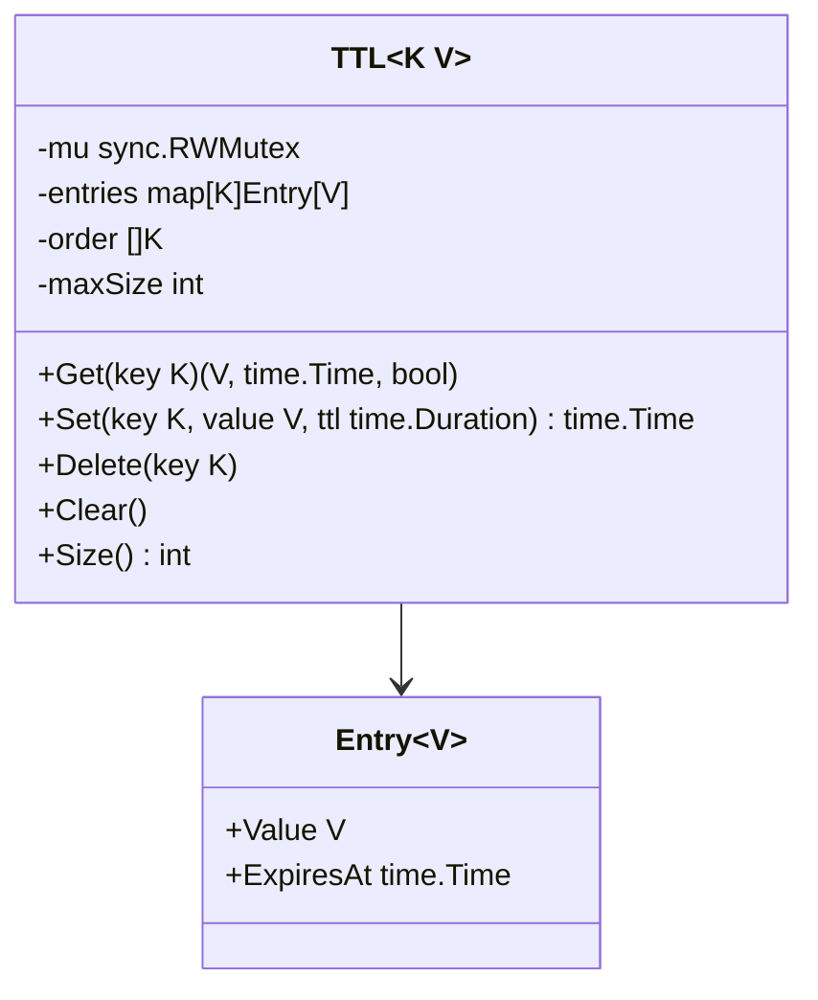
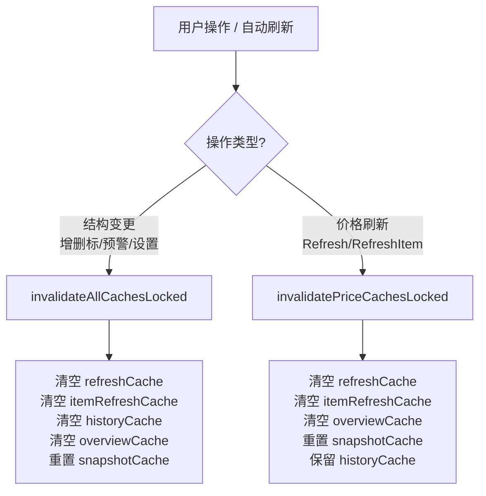

investgo 作为桌面级行情监控应用，需要在网络请求延迟与数据新鲜度之间取得精确平衡。缓存体系贯穿后端核心，从通用 TTL 原语到 Store 与 HotService 的多层缓存，再到结构变更与价格刷新触发的分级失效机制，形成了一套完整的数据一致性保障方案。理解这套体系，是掌握前后端数据流与性能调优的关键前提。

## 通用 TTL 缓存原语

项目所有缓存能力均建立在 `internal/common/cache` 包提供的泛型 TTL 缓存之上。`TTL[K comparable, V any]` 是一个线程安全的键值存储，采用**惰性过期（lazy expiration）**策略：数据在 `Get` 时检查 `ExpiresAt`，若已过期则当场删除并返回未命中，而非依赖后台清理协程。这种设计在桌面应用中尤为重要，因为它避免了额外线程开销，同时保证读取路径始终返回有效数据。

缓存支持可选的容量上限，通过 `NewTTLWithMax` 构造。当容量达到上限时，新写入会按**插入顺序淘汰最老的条目**（FIFO），而非 LRU。这一取舍基于行情数据的访问特征：最新的请求往往代表用户当前关注的标的，老条目自然可以被替换。所有操作均受 `sync.RWMutex` 保护，`Get` 使用读锁，`Set`/`Delete`/`Clear` 使用写锁。

Sources: [ttl.go](internal/common/cache/ttl.go#L13-L117)

## Store 层缓存体系

`Store` 在 `internal/core/store/store.go` 中维护了五层缓存，分别服务于不同生命周期和容量的数据：

| 缓存名称 | 类型 | 容量上限 | TTL 来源 | 主要用途 |
|---------|------|---------|---------|---------|
| `refreshCache` | `TTL[string, StateSnapshot]` | 32 | `HotCacheTTLSeconds` | 全量行情刷新结果 |
| `itemRefreshCache` | `TTL[string, StateSnapshot]` | 32 | `HotCacheTTLSeconds` | 单标的行情刷新结果 |
| `historyCache` | `TTL[string, HistorySeries]` | 512 | 按时间区间分级 | 历史 OHLCV 走势数据 |
| `overviewCache` | `TTL[string, cachedOverviewValue]` | 16 | `HotCacheTTLSeconds` | 组合概览分析与趋势计算 |
| `snapshotCache` | `atomic.Pointer[cachedSnapshot]` | 无 | 无（按状态戳比较） | 只读状态快照的排序与装饰结果 |

`refreshCache` 与 `itemRefreshCache` 的容量设为 32，是因为桌面应用通常只监控有限数量的标的；`historyCache` 容量高达 512，是因为每个标的的每个时间区间都会产生独立缓存条目，且历史数据复用频率极高。`overviewCache` 容量仅 16，是因为组合概览通常只有单一主视图需要计算。`snapshotCache` 最为特殊，它不使用 TTL 缓存，而是基于 `atomic.Pointer` 实现无锁快照复用，以 `state.UpdatedAt` 作为版本戳判断是否需要重新排序与装饰所有标的。

Sources: [store.go](internal/core/store/store.go#L34-L48)

## HotService 层缓存

热门榜单服务在 `internal/core/hot/service.go` 中维护了两层缓存，分别应对"全量搜索"与"分页响应"两种场景：

| 缓存名称 | 类型 | 容量上限 | TTL 来源 | 主要用途 |
|---------|------|---------|---------|---------|
| `searchCache` | `TTL[string, []HotItem]` | 无限制 | `HotCacheTTLSeconds` / `defaultHotCacheTTL` | 某分类下完整可搜索标列表 |
| `responseCache` | `TTL[string, HotListResponse]` | 无限制 | `HotCacheTTLSeconds` / `defaultHotCacheTTL` | 分页后的热门列表响应 |

`searchCache` 存储的是未分页的完整数据（如东方财富全量 A 股排行），供关键字过滤时使用；`responseCache` 存储的是按页码与页大小裁剪后的最终响应，直接服务于前端列表渲染。两层缓存的键设计充分考虑了请求维度：

- `searchCache` 键：`category|sortBy|sourceID`
- `responseCache` 键：`category|sortBy|keyword|page|pageSize|sourceID`

这种分层设计使得"同一分类翻页"走 `responseCache` 直接命中，而"切换排序后再翻页"只需重新走 `searchCache` 过滤与分页，无需再次发起上游网络请求。

Sources: [service.go](internal/core/hot/service.go#L33-L56), [cache.go](internal/core/hot/cache.go#L111-L124)

## TTL 配置策略

项目中存在两条独立的 TTL 控制线。**第一条是统一 TTL**，由 `AppSettings.HotCacheTTLSeconds` 控制，默认 60 秒，最低可配置为 10 秒（低于 10 秒将被校验拒绝）。该统一 TTL 适用于 watchlist 行情刷新、热门榜单、组合概览等实时性要求高的数据。`Store.derivedCacheTTLLocked()` 从当前状态中读取该值并转换为 `time.Duration`，确保所有相关缓存在用户调整设置后即时生效。

**第二条是历史数据分级 TTL**，因为 OHLCV 数据的更新频率远低于实时报价。`historyCacheTTLForInterval` 根据请求的时间区间返回不同的 TTL：

| 时间区间 | TTL |
|---------|-----|
| 1 小时 | 5 分钟 |
| 1 天 | 10 分钟 |
| 1 周 / 1 月 | 30 分钟 |
| 1 年 / 3 年 / 全部 | 4 小时 |

这种分级策略避免了用户反复查看长周期走势时产生不必要的网络请求，同时保证日内短线数据具有足够的新鲜度。

Sources: [cache.go](internal/core/store/cache.go#L44-L66)

## 缓存失效的两级策略

缓存失效是数据一致性的核心。`Store` 实现了两套失效方法，对应两种不同的业务事件：

### 结构变更级失效：`invalidateAllCachesLocked`

当用户执行结构性操作（增删改标的、调整置顶、增删预警规则、修改设置）时，旧缓存已完全不适用于新的持仓结构，因此需要**全量清空**。该方法会调用 `refreshCache.Clear()`、`itemRefreshCache.Clear()`、`historyCache.Clear()`、`overviewCache.Clear()`，并将 `snapshotCache` 置为 `nil`。值得注意的是，historyCache 在此也被清空，因为标的增删可能导致历史数据请求的标的列表发生根本性变化。

触发时机包括：`UpsertItem`、`DeleteItem`、`SetItemPinned`、`UpsertAlert`、`DeleteAlert`、`UpdateSettings`。

Sources: [cache.go](internal/core/store/cache.go#L70-L76), [mutation.go](internal/core/store/mutation.go#L100-L257)

### 价格刷新级失效：`invalidatePriceCachesLocked`

当 `Refresh` 或 `RefreshItem` 完成实时行情抓取后，持仓的当前市值与盈亏已发生变化，因此 `refreshCache`、`itemRefreshCache`、`overviewCache` 与 `snapshotCache` 需要失效。但**`historyCache` 被刻意保留**——历史 OHLCV 数据不受当前价格 tick 影响，且重建概览时可以通过 `ItemHistory` 复用已缓存的历史数据，从而避免昂贵的网络重传。这一设计在 `TestStoreOverviewAnalyticsCachesUntilStateChanges` 测试中被明确验证：状态变更后概览重建时，history provider 调用次数仍为 1。

触发时机包括：`Refresh`、`RefreshItem`。

Sources: [cache.go](internal/core/store/cache.go#L78-L90), [runtime.go](internal/core/store/runtime.go#L77-L90)

## 强制刷新与客户端控制

尽管缓存体系默认提供惰性过期，但用户仍然可以通过前端触发强制刷新。所有相关 HTTP API 端点均支持 `?force=true` 查询参数：

- `GET /api/refresh?force=true` — 强制重新抓取全量行情
- `GET /api/refresh/:id?force=true` — 强制重新抓取单标的行情
- `GET /api/history?itemId=xxx&interval=1d&force=true` — 强制重新获取历史数据
- `GET /api/overview?force=true` — 强制重新计算组合概览
- `GET /api/hot?category=CN-A&force=true` — 强制绕过热门榜单缓存

在 API Handler 中，`parseBoolQuery` 将 `1`、`true`、`yes`、`y`、`on` 均解析为强制标志，随后传递给 Store 或 HotService 的 `force` 参数。当 `force` 为真时，方法体在查询缓存之前直接返回，进入实时数据抓取流程。

Sources: [handler.go](internal/api/handler.go#L46-L52), [runtime.go](internal/core/store/runtime.go#L22-L28)

## 并发安全设计

缓存层在并发安全上采用了**双层锁模型**。TTL 缓存内部通过 `sync.RWMutex` 保护其 `map` 与 `order` 切片，保证自身操作的原子性。而 `Store` 在更 coarse-grained 的层面上使用自身的 `mu sync.RWMutex` 保护状态字段与缓存调用序列。

特别值得关注的是 `snapshotCache`。由于 `Snapshot()` 是前端最频繁调用的端点之一（每次页面切换或轮询都可能触发），如果每次都要对全量标的排序、装饰、构建 Dashboard，开销不可忽视。`snapshotCache` 使用 `atomic.Pointer[cachedSnapshot]` 实现无锁读取：调用方先 `Load()` 检查 `stamp` 是否与 `state.UpdatedAt` 一致，若一致则返回浅拷贝，完全避开 `Store.mu` 的竞争。只有当状态实际变更时，才在写锁保护下重新构建并 `Store()` 新指针。

Sources: [snapshot.go](internal/core/store/snapshot.go#L20-L75)

## 缓存测试验证

`internal/core/store/cache_test.go` 通过三个测试用例精确验证了缓存行为：

1. **`TestStoreItemHistoryCachesAndForceRefresh`**：验证 `historyCache` 在相同 `itemID|interval` 键下仅调用一次 history provider，且 `force=true` 可穿透缓存。
2. **`TestStoreOverviewAnalyticsCachesUntilStateChanges`**：验证 `overviewCache` 在状态戳未变时直接命中；当 `holdingsUpdatedAt` 推进后，概览会重建，但历史数据仍通过 `historyCache` 复用，provider 调用次数保持为 1。
3. **`TestStoreRefreshCachesUntilForced`**：验证 `refreshCache` 在 TTL 有效期内对重复 `Refresh(false)` 仅触发一次 quote provider 调用，`force=true` 时重新抓取。

这些测试不仅是回归防护，更体现了缓存设计的核心契约：**实时数据缓存按 TTL 过期，结构性缓存按状态戳失效，历史缓存按区间 TTL 独立存活**。

Sources: [cache_test.go](internal/core/store/cache_test.go#L12-L108)

## 延伸阅读

缓存策略与失效机制是前后端数据流的关键枢纽。若需深入理解数据如何在 Provider 与 Store 之间流转，可继续阅读 [Store 核心状态管理与持久化](6-store-he-xin-zhuang-tai-guan-li-yu-chi-jiu-hua) 与 [行情刷新与自动刷新流程](23-xing-qing-shua-xin-yu-zi-dong-shua-xin-liu-cheng)；若需了解热门榜单的多源聚合逻辑，可阅读 [热门榜单服务与多源聚合](9-re-men-bang-dan-fu-wu-yu-duo-yuan-ju-he) 与 [历史走势图数据加载与缓存](24-li-shi-zou-shi-tu-shu-ju-jia-zai-yu-huan-cun)。