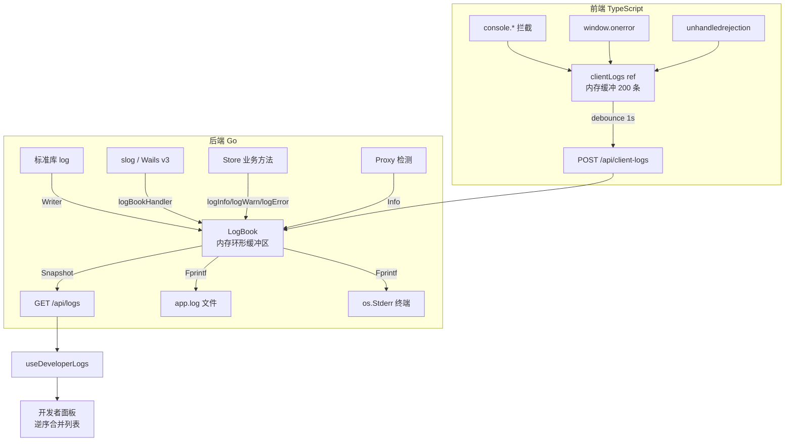

InvestGo 的日志体系并非简单的文本打印，而是一个围绕 `LogBook` 构建的**结构化、多通道、前后端统一**的开发者日志中枢。它以固定容量的内存环形缓冲区为核心，同时向文件系统和可选终端输出纯文本日志；前端通过拦截 `console` 原生方法与全局错误事件，将浏览器端日志实时镜像回后端，最终在设置面板的「开发者」标签页中按时间倒序聚合呈现。整个系统的设计重心在于**问题排查效率**与**敏感信息保护**：所有包含 API Key 的日志在写入前后均会经过正则脱敏，而 Wails 框架日志、`net/http` 传输日志与业务日志被收敛到同一套分级体系中，避免在桌面应用内部维护多套互不兼容的日志设施。

## 架构全景

从宏观视角看，日志体系横跨后端 Go 层与前端 TypeScript 层，以 `LogBook` 实例作为唯一可信源。后端内部存在三条消费路径——内存快照供 HTTP API 查询、文本文件供持久化落盘、`io.Writer` 桥接供标准库与 `slog` 生态使用；前端则通过 `/api/client-logs` 端点将浏览器日志回流，再由 `useDeveloperLogs` 组合式函数将前后端日志合并为统一的逆序列表。

`LogBook` 在 `main()` 中实例化后以依赖注入形式传递给 `Store`、`Handler`、`HotService` 以及 Wails 应用本身，确保全应用共享同一套日志状态。`Sources: [main.go](main.go#L39-L106)`

## LogBook 核心结构

`LogBook` 是一个自包含的线程安全日志聚合器，其数据结构围绕**固定容量**与**顺序自增 ID** 两个约束展开。内部字段 `entries` 为 `[]DeveloperLogEntry` 切片，容量上限由构造函数参数决定（应用层初始化为 400 条）；当写入量达到上限时，采用前移覆盖策略而非扩容，从而避免桌面应用在长时间运行后出现无界内存增长。`sequence` 字段为 `atomic.Uint64`，为每条日志分配形如 `log-000001` 的单调递增标识，便于开发者精确引用某条记录。`mu sync.RWMutex` 保护 `entries`、`file` 与 `console` 三个可变状态，读路径使用 `RLock` 支撑高频的 `/api/logs` 轮询。

`Sources: [internal/logger/logger.go](internal/logger/logger.go#L41-L61)`

单条日志记录 `DeveloperLogEntry` 采用强类型字段而非自由文本，包含 `ID`、`Source`（来源，如 `backend`、`frontend`、`system`）、`Scope`（作用域，如 `quotes`、`storage`、`proxy`）、`Level`（四级分级）、`Message` 与 `Timestamp`。这种结构使前端能够以表格或标签形式对日志进行过滤与着色，而不必解析不规则的文本行。`Sources: [internal/logger/logger.go](internal/logger/logger.go#L25-L38)`

## 三级输出策略

`LogBook` 的每次写入会同步触发**内存、文件、终端**三路输出，但三路并非强制启用，可按环境灵活配置：

| 通道 | 控制方式 | 格式 | 用途 |
|------|----------|------|------|
| 内存 | `NewLogBook(maxEntries)` 固定容量 | 结构化 `DeveloperLogEntry` | HTTP API 查询与前端展示 |
| 文件 | `ConfigureFile(path)` | `RFC3339 [LEVEL] source/scope message` | 持久化排查，默认位于 `$CONFIGDIR/investgo/logs/app.log` |
| 终端 | `EnableConsole(writer)`，仅在 `-dev` 参数或构建标签启用时开启 | 与文件通道相同纯文本 | 开发调试时实时观察 |

文件通道在配置时会自动调用 `os.MkdirAll` 创建父目录，并以追加模式打开日志文件；终端通道通常指向 `os.Stderr`，可通过构建变量 `defaultTerminalLogging` 或命令行参数 `-dev` 激活。两路文本输出均使用统一排版——时间戳、大写级别、来源/作用域与消息体以空格分隔，便于 `grep` 与 `tail` 等 Unix 工具直接处理。`Sources: [internal/logger/logger.go](internal/logger/logger.go#L63-L87)`, `Sources: [internal/logger/logger.go](internal/logger/logger.go#L157-L221)`, `Sources: [main.go](main.go#L39-L48)`

## 标准生态桥接

桌面应用往往面临多日志框架并存的问题：Go 标准库 `log` 被第三方依赖广泛使用，Wails v3 内部采用 `log/slog`，而业务层又需要自定义分级。`LogBook` 通过两个适配器将异构日志流统一收敛。

**`io.Writer` 桥接**：`Writer(source, scope, level)` 返回一个实现了 `io.Writer` 接口的 `logBookWriter`，它将每次 `Write` 的字节载荷按行拆分后转换为对应级别的日志条目。应用在 `main()` 中通过 `log.SetOutput(logs.Writer("backend", "stdlib", logger.DeveloperLogError))` 将标准库日志全部接管，使所有遗留 `log.Printf` 输出进入 `LogBook` 的脱敏与分级体系。`Sources: [internal/logger/logger.go](internal/logger/logger.go#L244-L288)`, `Sources: [main.go](main.go#L43-L44)`

**`slog.Handler` 桥接**：`NewSlogLogger(source, level)` 返回 `*slog.Logger`，其内部 `logBookHandler` 完整实现了 `slog.Handler` 接口的 `Enabled`、`Handle`、`WithAttrs`、`WithGroup` 四个方法。`Handle` 方法将 `slog.Record` 的属性展开为 `key=value` 片段，并用点号连接组层级，最终拼接到消息体中。Wails 框架本身、`HotService` 以及系统组件均通过此接口接入。`Sources: [internal/logger/logger.go](internal/logger/logger.go#L254-L335)`

## Store 层的业务日志与敏感信息脱敏

`Store` 并不直接调用 `LogBook` 的公开方法，而是通过 `logInfo`、`logWarn`、`logError` 三个内部辅助函数写入，这些函数在 `logs != nil` 时才会执行，避免单元测试等无日志场景下出现空指针风险。业务日志的作用域覆盖 `watchlist`、`alerts`、`storage`、`quotes`、`fx-rates` 等核心子系统，使开发者能从日志中直接追踪一次「保存设置→刷新行情→汇率转换→持久化落盘」的完整链路。`Sources: [internal/core/store/mutation.go](internal/core/store/mutation.go#L338-L357)`

由于日志中可能包含用户配置的第三方 API Key（如 Alpha Vantage、Twelve Data），`Store` 在写入前调用 `redactSensitiveLogText` 进行正则脱敏。该函数匹配两类模式：配置项形式的 `key="value"` 以及 URL 查询参数形式的 `key=value`，将值替换为 `***`。前端 `api.ts` 与 `devlog.ts` 也维护了等价的脱敏逻辑，确保前后端任何通道都不会在日志中泄露凭证。`Sources: [internal/core/store/mutation.go](internal/core/store/mutation.go#L14-L17)`, `Sources: [internal/core/store/mutation.go](internal/core/store/mutation.go#L359-L375)`, `Sources: [frontend/src/devlog.ts](frontend/src/devlog.ts#L139-L150)`

## 前端日志捕获与镜像机制

前端日志体系以 `devlog.ts` 为中心，在应用挂载时通过 `installClientLogCapture()` 激活。该方法以非侵入方式保存原始 `console` 方法引用，随后将 `console.debug/info/log/warn/error` 重定向到内部的 `appendClientLog`，既保留了浏览器开发者工具的原有输出，又实现了日志的统一收集。`Sources: [frontend/src/devlog.ts](frontend/src/devlog.ts#L17-L65)`

除控制台拦截外，模块还监听 `window.error` 与 `unhandledrejection` 两个全局事件，将 JavaScript 运行时异常与未处理的 Promise 拒绝自动记录为 `error` 级别，并附带堆栈信息。所有前端日志先进入 `clientLogs` 响应式引用（上限 200 条），同时被放入 `mirrorQueue`；队列通过 1 秒定时器防抖批量刷新到后端 `POST /api/client-logs`，并在 `beforeunload` 事件中强制同步，防止页面关闭导致日志丢失。`Sources: [frontend/src/devlog.ts](frontend/src/devlog.ts#L66-L119)`

## 前后端聚合与开发者面板

用户在前端设置页的「开发者」标签中看到的日志列表，并非单纯来自某一端，而是由 `useDeveloperLogs` 组合式函数将后端内存日志与前端客户端日志按时间戳逆序合并后的结果。该组合式函数向外暴露 `developerLogs` 计算属性，其内部先将 `backendLogs` 与 `clientLogs` 拼接，再按 `timestamp` 降序排序，最终截取前 250 条，给两侧饱和缓冲留足余量。`Sources: [frontend/src/composables/useDeveloperLogs.ts](frontend/src/composables/useDeveloperLogs.ts#L13-L23)`

日志的轮询采用**按需加载**策略：`App.vue` 仅在当前激活模块为 `settings`、当前标签为 `developer`、且 `developerMode` 为真的三重条件下，才以 4 秒间隔静默调用 `loadBackendLogs(true)`；切出标签页后立即清理定时器，避免后台空转。开发者可通过面板按钮执行三条操作：刷新（重新拉取后端快照）、复制（将合并后的日志以纯文本格式写入剪贴板）、清空（同时调用 `DELETE /api/logs` 并清空前端 `clientLogs`）。`Sources: [frontend/src/App.vue](frontend/src/App.vue#L163-L178)`, `Sources: [frontend/src/composables/useDeveloperLogs.ts](frontend/src/composables/useDeveloperLogs.ts#L26-L82)`

## API 接口与数据契约

日志体系暴露三个 HTTP 端点，由 `internal/api/handler.go` 注册到 `http.ServeMux`：

| 方法 | 路径 | 功能 |
|------|------|------|
| GET | `/api/logs?limit={n}` | 返回 `DeveloperLogSnapshot`，包含内存日志切片、日志文件路径与生成时间 |
| DELETE | `/api/logs` | 清空内存日志并截断日志文件 |
| POST | `/api/client-logs` | 接收前端单条日志，字段为 `source`、`scope`、`level`、`message` |

`GET /api/logs` 的 `limit` 参数作用于内存查询；若 `LogBook` 未初始化（理论上不会发生），处理器会返回空条目数组而非 500 错误，保证前端面板的容错性。`POST /api/client-logs` 在写入前通过 `sanitiseDeveloperLogLevel` 将非法级别回退为 `info`，防止前端异常数据污染后端分级统计。`Sources: [internal/api/http.go](internal/api/http.go#L61-L65)`, `Sources: [internal/api/handler.go](internal/api/handler.go#L60-L101)`, `Sources: [internal/api/http.go](internal/api/http.go#L145-L153)`

## 生命周期与清理策略

`LogBook` 的清理分为内存与文件两个维度。`Clear()` 方法在写锁保护下将 `entries` 切片重置为零长度，并对已打开的文件句柄执行 `Truncate(0)` 与 `Seek(0, io.SeekStart)`，确保磁盘日志也被清空。`Close()` 则负责关闭文件描述符，通常在 `main()` 的 `defer` 中调用，保证应用退出时资源释放。`Sources: [internal/logger/logger.go](internal/logger/logger.go#L89-L101)`, `Sources: [internal/logger/logger.go](internal/logger/logger.go#L140-L155)`

在应用整体生命周期中，日志体系按以下时序初始化：首先创建 `LogBook` 并配置终端与文件输出；随后将其注入 `Store` 与 `Handler`；Wails 启动时通过 `PanicHandler` 与 `OnShutdown` 钩子捕获崩溃与优雅关机事件，分别记录为 `error` 与 `info` 级别。这种设计使从启动、运行到退出的全过程都留有可追溯的结构化记录。`Sources: [main.go](main.go#L38-L123)`