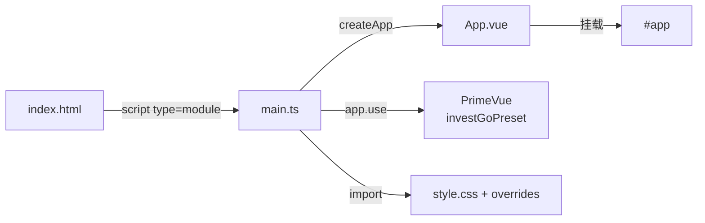
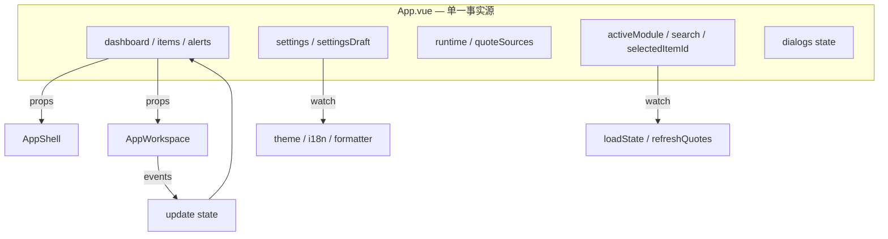
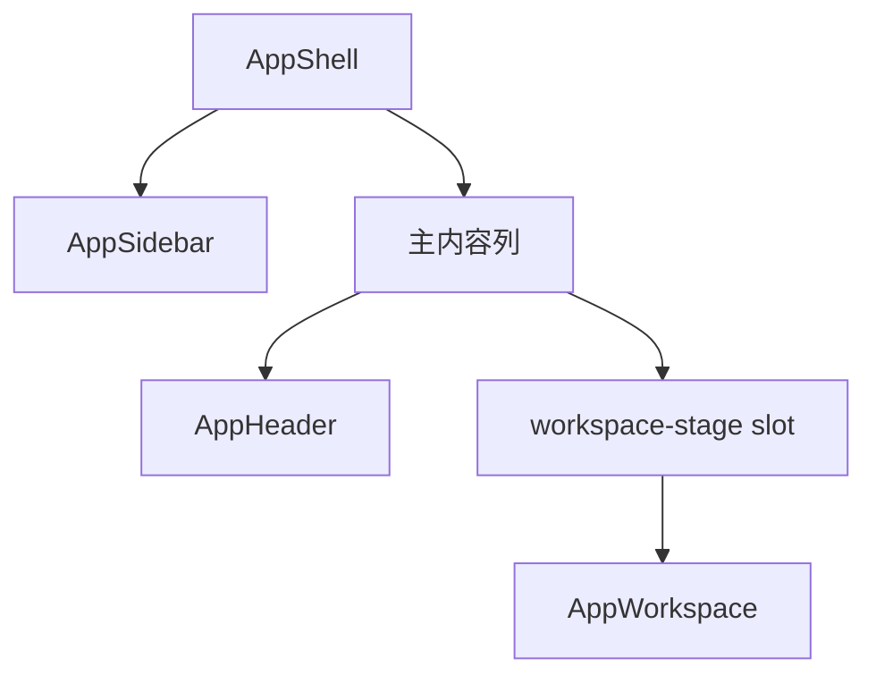
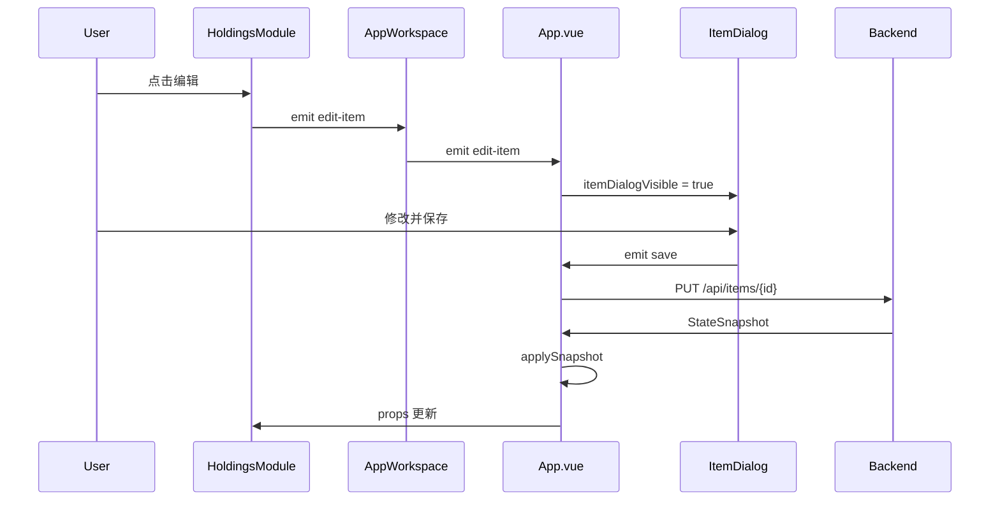

InvestGo 的前端采用 Vue 3 组合式 API 构建，但在状态管理与路由层面选择了一条与主流生态不同的路径：不使用 Vue Router 与 Pinia，而是以根组件 `App.vue` 作为单一状态控制器，通过「 Props 下行、事件上行」的显式数据流驱动六宫格模块体系。本章将剖析这一架构的装配顺序、布局编排以及状态同步机制。

## 应用入口与全局装配

`main.ts` 是标准的 Vue 3 应用启动点，通过 `createApp` 创建实例并挂载 PrimeVue 主题系统，随后挂载到 `index.html` 中的 `#app` 节点。这里没有注册 Vue Router、Pinia 或任何全局状态库，所有全局能力都以插件或直接 import 的形式存在。

Vite 配置将 `frontend` 目录作为项目根，`build.outDir` 输出到 `frontend/dist`，由 Wails v3 后端在桌面壳中加载。开发服务器监听 `5173` 端口，便于浏览器端独立调试。



装配顺序非常精简：先引入基础样式与 PrimeVue 预设主题，再创建应用实例并挂载。主题系统通过 `primevue/config` 注入，暗色模式由 `.app-dark` 类选择器切换而非 PrimeVue 内置暗色模式。

Sources: [main.ts](frontend/src/main.ts#L1-L24), [index.html](frontend/index.html#L1-L13), [vite.config.ts](vite.config.ts#L1-L18)

## 根组件：单一事实源控制器

`App.vue` 是整个前端架构的核心枢纽，承担了传统应用中「Store + Router + Layout Controller」三重角色。它维护所有跨模块共享的响应式状态，包括观察列表、提醒规则、用户设置、运行时状态以及搜索关键词等。

根组件内部通过 `ref` 和 `reactive` 定义了十余个状态片段，并借助 `watch` 实现模块切换时的自动数据加载。例如，当 `activeModule` 从 `overview` 切到 `watchlist` 时， watcher 会触发单标的刷新而非全量刷新，以减少上游 Provider 的压力。



状态变更的入口高度集中：`applySnapshot` 函数是唯一被允许批量改写前端状态的逻辑。它接收后端返回的 `StateSnapshot`，将 `dashboard`、`items`、`alerts`、`settings`、`runtime` 等字段同步到对应的 `ref`，并在标的被删除时自动修复 `selectedItemId`。这种「后端即唯一事实源」的设计保证了前后端状态的一致性。

Sources: [App.vue](frontend/src/App.vue#L1-L100), [App.vue](frontend/src/App.vue#L271-L287), [types.ts](frontend/src/types.ts#L1-L50)

## 布局壳层：三件套协作

视觉布局由 `AppShell`、`AppSidebar`、`AppHeader` 三件组件协同完成，形成稳定的「侧边栏 + 主工作区」桌面应用范式。

**AppShell** 是整个可视区域的 CSS Grid 容器，默认分为 `220px` 侧边栏与剩余主内容区。它通过 `useSidebarLayout` 组合式函数提供侧边栏宽度拖拽调整（`220px–380px` 范围）与显隐切换能力。同时，Shell 根据 `useNativeTitleBar` 设置与当前平台（macOS / Windows / Linux）注入不同的 CSS 类，以适配原生标题栏或自定义标题栏的窗口控制按钮占位。

**AppSidebar** 内部采用三层结构：顶部一级导航（五个模块 Tab）、中部二级上下文导航（在 watchlist 模块下展示标的列表，在 hot 模块下展示市场分组）、底部设置入口。标的列表按「有持仓优先、观察其次」分组渲染，保持原始顺序。

**AppHeader** 承担自定义标题栏职责，包含状态文本、最近刷新时间以及平台相关的窗口控制按钮（最小化、最大化、关闭）。它实现了拖拽移动窗口与双击最大化/还原的鼠标行为，并通过事件委托排除按钮、输入框等可交互元素上的误触发。



Sources: [AppShell.vue](frontend/src/components/AppShell.vue#L1-L50), [AppSidebar.vue](frontend/src/components/AppSidebar.vue#L1-L50), [AppHeader.vue](frontend/src/components/AppHeader.vue#L1-L50), [useSidebarLayout.ts](frontend/src/composables/useSidebarLayout.ts#L1-L30)

## 模块路由：AppWorkspace 的静态分发

由于没有引入 Vue Router，`AppWorkspace` 组件充当了模块路由器的角色。它通过一组 `v-if` / `v-else-if` 条件渲染六个模块组件：`OverviewModule`、`WatchlistModule`、`HotModule`、`HoldingsModule`、`AlertsModule`、`SettingsModule`。

`activeModule` 的类型被严格约束为 `ModuleKey`（`'overview' | 'watchlist' | 'hot' | 'holdings' | 'alerts' | 'settings'`），确保模块切换在编译期即可被类型检查覆盖。每个模块只接收自身需要的 Props 并向上抛出特定事件，形成清晰的契约边界。

| 模块 | 核心职责 | 关键 Props |
|---|---|---|
| OverviewModule | 资产概览与图表 | dashboard, itemCount, livePriceCount |
| WatchlistModule | 单标行情与走势图 | selectedItem, historySeries, historyInterval |
| HotModule | 热门榜单 | trackedHotKeys, marketGroup, autoRefreshToken |
| HoldingsModule | 持仓列表与管理 | filteredItems, search, selectedItemId |
| AlertsModule | 提醒规则 | alerts, items |
| SettingsModule | 应用设置 | settingsDraft, quoteSources, developerLogs |

这种静态分发模式的优点是避免了路由配置的复杂度，模块切换无页面卸载/重建开销，状态天然保留在根组件中；缺点则是所有模块在打包时都会被静态引入，无法做按需懒加载。

Sources: [AppWorkspace.vue](frontend/src/components/AppWorkspace.vue#L1-L80), [types.ts](frontend/src/types.ts#L4)

## 状态流：Props 下行与事件上行

根组件到叶子组件的数据传递采用显式 Props 管道，反向则通过事件回调逐级冒泡。以「编辑持仓」这一用户旅程为例：

1. `HoldingsModule` 内部点击「编辑」按钮，向上 emit `edit-item` 事件；
2. `AppWorkspace` 透传该事件到 `App.vue`；
3. `App.vue` 调用 `useItemDialog` 提供的 `openItemDialog`，设置 `itemDialogVisible` 为 `true`；
4. `ItemDialog` 作为条件渲染的兄弟节点（位于 `AppShell` 插槽之外）接收 `form` 与 `saving` 状态，完成编辑后 emit `save`；
5. `App.vue` 的 `saveItem` 调用后端 API，再用返回的 `StateSnapshot` 调用 `applySnapshot` 刷新全局状态。



这种模式虽然带来了一定的样板代码（AppWorkspace 需要声明大量透传 Props 与事件），但好处是数据流向完全显式，任何状态变更都能在 `App.vue` 的 script 中找到单一入口。

Sources: [App.vue](frontend/src/App.vue#L396-L462), [AppWorkspace.vue](frontend/src/components/AppWorkspace.vue#L53-L76)

## 全局基础设施

### 主题系统

主题不是通过 Vue 响应式对象驱动，而是直接操作 `document.documentElement` 的 `dataset`。`App.vue` 中的 watcher 监听 `settings.colorTheme`、`settings.fontPreset`、`settings.themeMode` 等字段，将值写入 `data-color-theme`、`data-font-preset`、`data-theme` 属性。CSS 利用属性选择器切换大量自定义属性（CSS Variables），实现零 JavaScript 运行时开销的主题切换。

PrimeVue 的预设主题种子通过 `theme.ts` 中的 `definePreset` 基于 Aura 主题定制，并在运行时通过 `updatePreset` 切换主色板，保证组件库与业务样式的色彩一致。

Sources: [App.vue](frontend/src/App.vue#L102-L126), [theme.ts](frontend/src/theme.ts#L1-L44), [style.css](frontend/src/style.css#L1-L75)

### 国际化

前端使用自研的轻量级 i18n 实现（非 vue-i18n），核心为 `i18n.ts` 中的 `messages` 对象与 `translate` 函数。当前 locale 通过 `ref` 持有，`setI18nLocale` 切换后会重新触发依赖 `translate` 的计算属性更新。所有 UI 文本集中维护在 `i18n.ts` 的 `zh-CN` 与 `en-US` 字典树中。

API 请求自动在 Header 中附加 `X-InvestGo-Locale`，让后端能够按用户语言返回错误提示。

Sources: [i18n.ts](frontend/src/i18n.ts#L1-L50), [api.ts](frontend/src/api.ts#L36-L38)

### API 通信

`api.ts` 提供统一的 `fetch` 包装器，具备请求超时（默认 15 秒）、手动取消（`AbortController` 桥接外部 signal）、错误日志脱敏以及 JSON 错误体解析等能力。自定义的 `ApiAbortError` 用于区分「超时」与「主动取消」，使调用方可以决定是否需要静默处理。

Sources: [api.ts](frontend/src/api.ts#L1-L40)

## 前端目录结构

```
frontend/
├── index.html              # 应用挂载点
├── src/
│   ├── main.ts             # Vue 应用入口
│   ├── App.vue             # 根组件 / 状态控制器
│   ├── api.ts              # HTTP 请求封装
│   ├── i18n.ts             # 轻量国际化
│   ├── theme.ts            # PrimeVue 预设与运行时调色
│   ├── types.ts            # 全局 TypeScript 类型
│   ├── constants.ts        # 选项工厂函数与常量
│   ├── style.css           # 全局样式、CSS Variables、主题属性选择器
│   ├── styles/             # 局部样式（forms、tables、overrides）
│   ├── components/
│   │   ├── AppShell.vue           # 布局外壳
│   │   ├── AppSidebar.vue         # 侧边栏
│   │   ├── AppHeader.vue          # 标题栏
│   │   ├── AppWorkspace.vue       # 模块路由器
│   │   ├── ModuleTabs.vue         # 模块标签（辅助）
│   │   ├── SummaryStrip.vue       # 摘要条
│   │   ├── PriceChart.vue         # 价格图表
│   │   ├── DataFreshnessMeta.vue  # 数据新鲜度
│   │   ├── dialogs/               # 全局对话框
│   │   │   ├── ItemDialog.vue
│   │   │   ├── AlertDialog.vue
│   │   │   ├── ConfirmDialog.vue
│   │   │   └── DCADetailDialog.vue
│   │   └── modules/               # 六大业务模块
│   │       ├── OverviewModule.vue
│   │       ├── WatchlistModule.vue
│   │       ├── HotModule.vue
│   │       ├── HoldingsModule.vue
│   │       ├── AlertsModule.vue
│   │       └── SettingsModule.vue
│   ├── composables/        # 可复用业务逻辑
│   │   ├── useSidebarLayout.ts
│   │   ├── useHistorySeries.ts
│   │   ├── useItemDialog.ts
│   │   ├── useAlertDialog.ts
│   │   ├── useConfirmDialog.ts
│   │   └── useDeveloperLogs.ts
│   └── wails-runtime.ts    # Wails v3 桌面运行时桥接
```

Sources: [目录结构](frontend/src/)

## 下一步阅读建议

理解根组件的编排逻辑后，建议继续深入以下主题：

- [API 通信层与错误处理](15-api-tong-xin-ceng-yu-cuo-wu-chu-li) —— 了解 `api.ts` 的超时、取消与错误日志机制。
- [Wails 运行时桥接与平台适配](16-wails-yun-xing-shi-qiao-jie-yu-ping-tai-gua-pei) —— 了解自定义标题栏与窗口控制如何实现跨平台适配。
- [Composables 业务逻辑复用](17-composables-ye-wu-luo-ji-fu-yong) —— 了解 `useHistorySeries`、`useItemDialog` 等组合式函数如何拆分根组件中的复杂逻辑。
- [主题系统与暗色模式](19-zhu-ti-xi-tong-yu-an-se-mo-shi) —— 了解 CSS Variables 与 dataset 驱动的无闪烁主题切换。