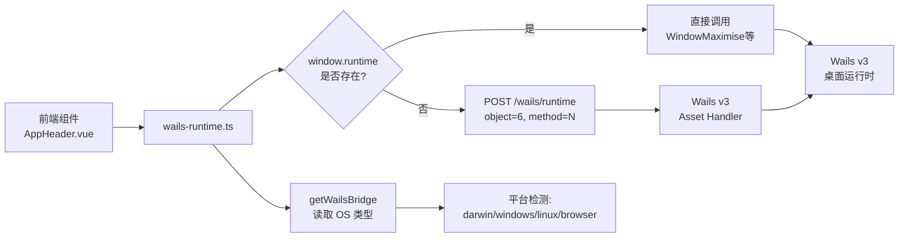

InvestGo 采用 Wails v3 构建跨平台桌面应用，其独特之处在于前端同时支持**桌面运行时**与**浏览器开发服务器**两种环境。本页剖析项目如何在不破坏浏览器开发体验的前提下，建立稳定的前后端桥接，并针对不同操作系统（macOS、Windows、Linux）实施差异化的窗口行为与平台服务封装。

## 运行时桥接的双层架构

Wails v3 在桌面模式下会向前端注入全局对象，但浏览器开发服务器中这些对象并不存在。项目通过 `wails-runtime.ts` 建立了一个**探测优先、降级兜底**的双层桥接层：优先尝试调用 `window.runtime` 上的现代 API，若不存在则回退到通过 HTTP 向 `/wails/runtime` 发送方法调用请求。这种设计使得开发者可以正常使用 `npm run dev` 启动 Vite 开发服务器，而无需启动完整的 Go 后端。

运行时桥接暴露了两类能力：**窗口生命周期控制**（最大化、最小化、关闭、查询状态）与**平台交互**（系统信息读取、原生窗口拖拽）。所有 API 均以异步函数形式暴露，消费者无需关心底层究竟是直接调用绑定方法还是走 HTTP 代理。下图展示了桥接层的调用路径：

Sources: [wails-runtime.ts](frontend/src/wails-runtime.ts#L1-L141)

## 双模式窗口控制策略

窗口控制是桌面应用与浏览器环境差异最大的领域。`wails-runtime.ts` 为每个窗口操作实现了**双模式切换逻辑**：以 `maximiseWindow` 为例，它首先检查 `window.runtime?.WindowMaximise` 是否可用，若可用则直接同步调用；否则通过 `callWailsWindowMethod` 向 `/wails/runtime` 发送带有 `object: 6`（窗口运行时对象）和 `method: 16`（最大化方法常量）的 JSON 负载。这一机制确保在浏览器中运行时不会抛出 `undefined is not a function` 错误，而是静默降级或返回安全默认值。

| 操作 | 现代 API (`window.runtime`) | 降级方法 ID | 返回值 |
|------|---------------------------|------------|--------|
| 查询最大化状态 | `WindowIsMaximised` | `14` | `Promise<boolean>` |
| 最大化 | `WindowMaximise` | `16` | `void` |
| 取消最大化 | `WindowUnmaximise` | `42` | `void` |
| 切换最大化 | — | `39` | `void` |
| 最小化 | `WindowMinimise` | `17` | `void` |
| 关闭窗口 | `WindowClose` | `2` | `void` |
| 拖拽窗口 | `invoke("wails:drag")` | — | `void` |

Sources: [wails-runtime.ts](frontend/src/wails-runtime.ts#L26-L59), [wails-runtime.ts](frontend/src/wails-runtime.ts#L82-L140)

## 平台检测与界面自适应

桥接层不仅负责转发调用，还承担**平台识别**职责。`getDesktopPlatform` 通过读取 `window._wails?.environment?.OS` 判断当前操作系统，若该对象不存在则返回 `"browser"`。基于这一检测，上层组件可以实施精细的界面适配策略。

在 `AppShell.vue` 中，平台检测结果被转化为 CSS 类名：`is-mac-custom-titlebar` 会在 macOS 自定义标题栏模式下为侧边栏顶部预留 `76px` 的左侧内边距，避免与系统交通灯按钮重叠；`is-nonmac-custom-titlebar` 则会在 Windows 和 Linux 下缩小圆角半径，使自定义窗口控件的外观更符合平台审美。`AppHeader.vue` 根据 `shouldShowCustomWindowControls` 的布尔结果条件渲染最小化、最大化与关闭按钮，仅在非 macOS 平台且未使用原生标题栏时显示这些控件。

Sources: [wails-runtime.ts](frontend/src/wails-runtime.ts#L61-L79), [AppShell.vue](frontend/src/components/AppShell.vue#L35-L42), [AppHeader.vue](frontend/src/components/AppHeader.vue#L137-L147)

## 平台特定的后端服务封装

平台适配不仅发生在前端。`internal/platform` 包集中封装了所有与操作系统打交道的底层逻辑，使核心业务代码保持平台无关。

### 窗口选项构建

`BuildMainWindowOptions` 根据 `runtime.GOOS` 和用户对原生标题栏的偏好生成差异化的 `WebviewWindowOptions`。当用户选择自定义标题栏时，macOS 采用 `MacTitleBarHiddenInsetUnified` 实现内嵌式隐藏标题栏，并配合 `MacBackdropTranslucent` 获得原生毛玻璃效果；Windows 和 Linux 则直接启用 `Frameless: true`，完全交由前端绘制标题栏区域。这种分流策略确保每个平台都能获得最贴近原生体验的窗口表现。

Sources: [window.go](internal/platform/window.go#L1-L42)

### 外部链接打开

`openExternalURL` 通过 `runtime.GOOS` 分发到平台默认的打开器：macOS 调用 `open`，Windows 调用 `rundll32 url.dll,FileProtocolHandler`，Linux 回退到 `xdg-open`。该函数由 API handler 在 `/api/open-external` 路由中调用，前端只需发送一个 HTTPS URL，无需关心底层命令差异。

Sources: [open_external.go](internal/api/open_external.go#L1-L27), [handler.go](internal/api/handler.go#L24-L44)

### macOS 系统代理检测

桌面应用在 macOS 上需要尊重系统网络偏好设置。`ApplySystemProxy` 执行 `scutil --proxy` 读取当前系统代理配置，解析出代理主机、端口和例外列表，并将其注入到当前进程的环境变量（`HTTP_PROXY`、`HTTPS_PROXY`、`NO_PROXY`）中。后续所有通过 `http.ProxyFromEnvironment` 解析的网络请求即可透明地使用系统代理。该逻辑仅针对 macOS 生效，其他平台依赖各自的标准机制。

Sources: [proxy.go](internal/platform/proxy.go#L1-L63)

## Wails v3 应用集成与 Asset Handler

`main.go` 是 Wails v3 运行时与业务后端汇合的核心枢纽。它创建一个标准库的 `http.ServeMux`，将 `/api/` 前缀路由到业务 handler，将根路径 `/` 路由到由 `application.BundledAssetFileServer` 包装的前端静态资源。随后，这个 mux 被整体注册为 Wails 的 `AssetOptions.Handler`，意味着桌面窗口中的所有请求——无论是业务 API 还是运行时降级调用——都经由同一个 HTTP 服务器处理。

此外，`main.go` 还在此注册了平台相关的窗口选项与快捷键绑定：F12 被绑定为打开 DevTools，但该行为受两道闸门保护——应用设置中的 `DeveloperMode` 开关与编译时注入的 `defaultDevToolsBuild` 标志。当应用退出时，`OnShutdown` 回调触发状态持久化，确保用户数据在进程结束前完成落盘。

Sources: [main.go](main.go#L98-L148)

## 前端组件中的消费模式

桥接 API 在组件层的使用体现了清晰的职责分离。`AppHeader.vue` 是窗口控制的主要消费者：它通过 `startWindowDrag` 响应标题栏拖拽，通过 `handleBarDoubleClick` 实现双击标题栏切换最大化/还原状态，并在挂载时异步查询一次窗口状态以同步按钮图标。拖拽逻辑还包含一个小位移阈值（4px），防止按钮点击被误识别为拖拽起点。

`AppShell.vue` 则作为布局编排者，利用平台检测函数为不同操作系统注入差异化的 CSS 变量与类名，确保自定义标题栏在各个平台上的视觉和交互一致性。这种**桥接层提供能力、组件层决定行为与样式**的分层架构，使得平台适配代码高度集中，而业务组件保持声明式与可预测。

Sources: [AppHeader.vue](frontend/src/components/AppHeader.vue#L53-L125), [AppShell.vue](frontend/src/components/AppShell.vue#L1-L82)

## 设计权衡与兼容性考量

| 策略 | 优势 | 代价 |
|------|------|------|
| 双模式窗口控制（直接调用 + HTTP 降级） | 浏览器开发服务器零报错，开发体验流畅 | HTTP 降级路径仅覆盖基础窗口操作，高级功能缺失 |
| 前端平台检测（`window._wails.environment.OS`） | 零后端依赖，瞬时响应 | 依赖于 Wails 注入的对象结构，未来版本需回归验证 |
| 后端平台分流（`runtime.GOOS`） | 编译期确定，零运行时开销 | 需要为每个平台维护独立代码路径 |
| Frameless vs. MacTitleBarHiddenInsetUnified | 每个平台使用最合适的原生机制 | 前端需要维护两套 CSS 布局偏移逻辑 |

Sources: [wails-runtime.ts](frontend/src/wails-runtime.ts#L1-L141), [window.go](internal/platform/window.go#L1-L42)

理解这一桥接体系后，下一步可以深入阅读 [Vue 3 应用结构与根组件编排](14-vue-3-ying-yong-jie-gou-yu-gen-zu-jian-bian-pai) 了解组件树的全貌，或查看 [API 通信层与错误处理](15-api-tong-xin-ceng-yu-cuo-wu-chu-li) 掌握业务请求的统一封装模式。