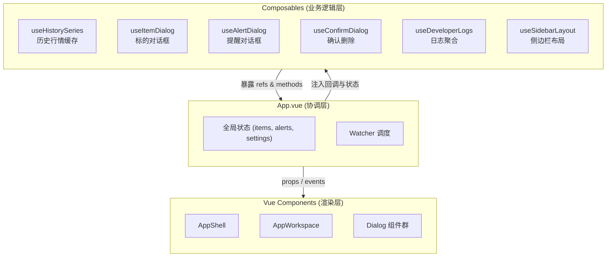
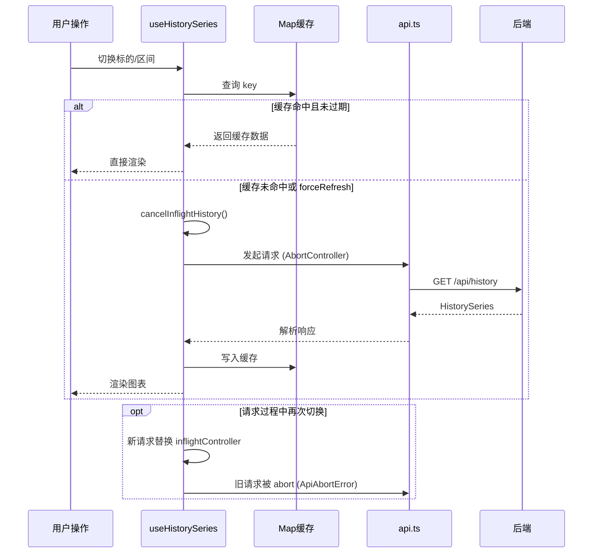

在 InvestGo 的前端实现中，我们采用 Vue 3 Composition API 的 **Composables** 模式将原本散落在根组件 `App.vue` 中的业务逻辑抽取为可测试、可组合的独立单元。整个前端仅包含六个 Composable，总代码量约 640 行，却承载了对话框状态机、历史行情缓存、侧边栏交互、开发者日志聚合等全部非 UI 渲染逻辑。本页将剖析其分层策略、参数注入约定以及彼此协作的边界设计。

Sources: [useAlertDialog.ts](frontend/src/composables/useAlertDialog.ts#L9-L88), [useConfirmDialog.ts](frontend/src/composables/useConfirmDialog.ts#L4-L69), [useDeveloperLogs.ts](frontend/src/composables/useDeveloperLogs.ts#L15-L82), [useHistorySeries.ts](frontend/src/composables/useHistorySeries.ts#L16-L165), [useItemDialog.ts](frontend/src/composables/useItemDialog.ts#L15-L184), [useSidebarLayout.ts](frontend/src/composables/useSidebarLayout.ts#L3-L61)

## 架构定位：根组件的"减负"策略

`App.vue` 作为全局状态汇聚点，原本需要同时处理以下职责：HTTP 请求、快照应用、自动刷新定时器、历史行情缓存、六种对话框的显隐与提交、侧边栏拖拽、开发者日志轮询等。通过 Composables，我们将这些逻辑按 **"数据获取"、"对话框编排"、"UI 交互"、"日志聚合"** 四个维度拆分，使 `App.vue` 仅保留高层协调代码。

Sources: [App.vue](frontend/src/App.vue#L1-L575)

## 六大 Composable 职责速查

| Composable | 核心职责 | 依赖注入方式 | 是否含生命周期清理 |
|---|---|---|---|
| `useSidebarLayout` | 侧边栏宽度、显隐、拖拽调整 | 无外部依赖 | `onBeforeUnmount` 移除事件监听 |
| `useHistorySeries` | 历史 K 线数据获取、缓存、防抖、自动刷新 | `items`, `selectedItem`, `activeModule`, `setStatus` | `onBeforeUnmount` 取消进行中的请求 |
| `useItemDialog` | 标的增删改、从热门列表快速添加、置顶切换 | `applySnapshot`, `clearHistoryCache`, `setStatus` | 无 |
| `useAlertDialog` | 提醒规则增删改 | `applySnapshot`, `setStatus`, `onAlertSaved` | 无 |
| `useConfirmDialog` | 二次确认删除（标的 / 提醒） | `onDeleteItem`, `onDeleteAlert` | 无 |
| `useDeveloperLogs` | 前后端日志合并、轮询、复制、清空 | `setStatus` | 无 |

Sources: [useSidebarLayout.ts](frontend/src/composables/useSidebarLayout.ts#L3-L61), [useHistorySeries.ts](frontend/src/composables/useHistorySeries.ts#L16-L165), [useItemDialog.ts](frontend/src/composables/useItemDialog.ts#L15-L184), [useAlertDialog.ts](frontend/src/composables/useAlertDialog.ts#L9-L88), [useConfirmDialog.ts](frontend/src/composables/useConfirmDialog.ts#L4-L69), [useDeveloperLogs.ts](frontend/src/composables/useDeveloperLogs.ts#L15-L82)

## 状态与对话框编排：useItemDialog 与 useAlertDialog

标的与提醒的编辑流程具有高度相似的结构：**打开对话框 → 填充表单 → 调用 API → 应用快照 → 状态提示 → 回调通知**。`useItemDialog` 和 `useAlertDialog` 将这一流程封装为标准的状态机，使 `App.vue` 只需关注何时调用 `openXxxDialog`，而无需介入表单初始化、HTTP 方法选择（`POST` / `PUT`）等细节。

两个 Composable 均采用 **回调注入** 模式接收外部能力。以 `useItemDialog` 为例，它接收 `applySnapshot`、`clearHistoryCache` 和 `setStatus` 三个回调：保存成功后调用 `applySnapshot` 同步全局状态，同时调用 `clearHistoryCache` 使历史走势图与最新数据对齐，最后通过 `setStatus` 向用户反馈结果。这种设计避免了 Composable 直接依赖全局状态，保持了测试时的可 mock 性。

`useItemDialog` 还额外支持从热门榜单的三种入口：仅观察（`openHotWatchDialog`）、开仓（`openHotPositionDialog`）以及一键快加（`quickAddHotItem`）。其中 `quickAddHotItem` 接收 `isAlreadyTracked` 布尔值而非直接访问全局 `items` 列表，这一参数化设计确保了 Composable 内部不持有对全局状态的隐式引用。

Sources: [useItemDialog.ts](frontend/src/composables/useItemDialog.ts#L15-L184), [useAlertDialog.ts](frontend/src/composables/useAlertDialog.ts#L9-L88)

## 数据获取与生命周期管理：useHistorySeries

`useHistorySeries` 是所有 Composable 中逻辑最复杂的一个，它管理历史走势图的完整生命周期：请求发起、内存缓存、竞态丢弃、错误降级、模块切换自动加载。

其核心设计是一个 **基于 `Map` 的进程内缓存**。缓存键采用 `${itemId}:${interval}` 的组合，命中时直接返回数据并标记 `cached: true`，避免重复请求。缓存上限为 60 组，超出时按插入顺序淘汰最早条目。缓存失效时间优先使用后端返回的 `cacheExpiresAt`，否则回退到 5 分钟本地兜底。

该 Composable 对 **竞态条件** 的处理尤为精细：每次请求前创建新的 `AbortController`，旧请求会被显式 abort。响应返回后，若 `inflightController` 已被替换，则直接丢弃过期结果。此外，在 `silent` 静默刷新模式下，即使请求失败也不会清空当前图表，而是保持已有数据直至用户主动触发新请求。

Sources: [useHistorySeries.ts](frontend/src/composables/useHistorySeries.ts#L16-L165)

## 通用 UI 交互封装：useConfirmDialog 与 useSidebarLayout

并非所有 Composable 都涉及 HTTP 通信。`useConfirmDialog` 和 `useSidebarLayout` 属于 **纯 UI 行为封装**，用于消除组件模板中的命令式逻辑。

`useConfirmDialog` 抽象了"二次确认删除"这一通用交互。它内部维护 `pendingDelete` 对象记录待删除目标的类型（`item` 或 `alert`）和 ID，对外暴露 `requestDeleteItem` 和 `requestDeleteAlert` 两个入口。确认后调用注入的 `onDeleteItem` 或 `onDeleteAlert` 回调。该设计使 `App.vue` 可以将 `useItemDialog` 中的 `performDeleteItem` 和 `useAlertDialog` 中的 `performDeleteAlert` 直接传入，形成职责闭环：`useItemDialog` 负责业务删除逻辑，`useConfirmDialog` 负责交互确认流程。

`useSidebarLayout` 则封装了侧边栏的拖拽调整逻辑。它通过 `appShellRef` 获取容器位置，在 `startSidebarResize` 时注册全局 `mousemove` / `mouseup` 监听器，并将宽度钳制在 220–380 px 区间。`onBeforeUnmount` 钩子确保组件卸载时移除事件监听，防止内存泄漏。该 Composable 被 `AppShell.vue` 直接调用，使布局行为与业务状态完全解耦。

Sources: [useConfirmDialog.ts](frontend/src/composables/useConfirmDialog.ts#L4-L69), [useSidebarLayout.ts](frontend/src/composables/useSidebarLayout.ts#L3-L61), [AppShell.vue](frontend/src/components/AppShell.vue#L1-L218)

## 跨切面日志聚合：useDeveloperLogs

`useDeveloperLogs` 解决了一个典型的跨切面问题：前端运行时日志（通过 `devlog.ts` 捕获）与后端结构化日志需要在一个统一视图中按时间倒序展示。该 Composable 不直接存储前端日志，而是通过 `computed` 实时合并 `backendLogs`（来自轮询 API）和 `clientLogs`（来自 `devlog.ts` 的共享缓冲区），截取最近 250 条排序后返回。

它实现了 **按需轮询** 策略：仅在设置页处于激活状态且开发者模式开启时，每 4 秒轮询 `/api/logs`。当用户离开设置页或关闭开发者模式时，通过 `watch` 清除定时器，避免后台无效请求。复制功能将日志格式化为纯文本并写入剪贴板，失败时还会将错误信息追加到前端日志缓冲区，形成自洽的降级路径。

Sources: [useDeveloperLogs.ts](frontend/src/composables/useDeveloperLogs.ts#L15-L82)

## 设计公约与协作边界

InvestGo 的 Composables 遵循一组一致的设计公约，这些公约确保了六个独立模块在 `App.vue` 中能够被安全地组合。

**回调注入优先于全局状态**。所有需要修改全局状态或触发副作用的 Composable 都通过函数参数接收回调，例如 `applySnapshot`、`setStatus`、`clearHistoryCache`。这使得单元测试时无需模拟 Vue 的响应式系统，仅需传入 jest spy 即可验证行为。

**错误处理统一委托给 `setStatus`**。每个 Composable 内部捕获 HTTP 异常后，将错误信息通过 `setStatus(message, "error")` 上报，由 `App.vue` 统一渲染到顶部状态栏。这一约定消除了各处重复的 Toast / Alert 调用。

**生命周期清理不跨边界**。只有真正注册了全局事件或存在进行中控件的 Composable（如 `useHistorySeries`、`useSidebarLayout`）使用 `onBeforeUnmount`；纯对话框状态的 Composable 不持有外部资源，因此无需清理逻辑。

**Composable 之间允许直接协作，但避免循环依赖**。`useItemDialog` 接收 `clearHistoryCache`（来自 `useHistorySeries` 的导出函数），在标的保存或删除后主动清除缓存。这是一个单向依赖：`useItemDialog` 了解缓存的存在，但 `useHistorySeries` 并不关心对话框逻辑。

Sources: [App.vue](frontend/src/App.vue#L360-L405), [useItemDialog.ts](frontend/src/composables/useItemDialog.ts#L15-L184)

## 下一步

理解 Composables 的业务逻辑拆分后，你可以继续深入以下主题：

- [API 通信层与错误处理](15-api-tong-xin-ceng-yu-cuo-wu-chu-li) — 了解 `api.ts` 的 `ApiAbortError` 与超时机制，这是 `useHistorySeries` 竞态控制的基石。
- [历史走势图数据加载与缓存](24-li-shi-zou-shi-tu-shu-jia-zai-yu-huan-cun) — 从数据流角度进一步解析历史行情的缓存失效策略。
- [模块组件与对话框体系](20-mo-kuai-zu-jian-yu-dui-hua-kuang-ti-xi) — 查看 `ItemDialog`、`AlertDialog` 等组件如何将 Composable 暴露的状态绑定到模板。