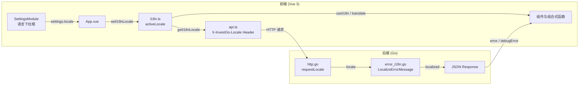

InvestGo 面向中文与英文用户，因此在不引入重型依赖的前提下，实现了一套轻量级的双语支持方案。本文将带你理解这套方案的整体结构：前端如何维护翻译词典与响应式语言状态，后端如何将英文错误信息转换为中文，以及前后端如何通过 HTTP 头部协商当前语言。阅读本文不需要你预先掌握任何国际化框架的经验。

Sources: [i18n.ts](frontend/src/i18n.ts#L1-L1157), [error_i18n.go](internal/api/i18n/error_i18n.go#L1-L217)

## 整体架构

整个国际化体系由**前端翻译引擎**和**后端错误本地化**两条链路组成。前端通过自定义的 `translate` 函数与 `useI18n` 组合式函数，将嵌套字典中的文本渲染到界面；后端则只在出错时，根据请求头中的语言标识，把英文错误信息翻译成中文返回。下面这张图展示了从用户切换语言，到界面文本与后端错误同步更新的完整数据流。

Sources: [App.vue](frontend/src/App.vue#L91-L100), [api.ts](frontend/src/api.ts#L31-L38), [http.go](internal/api/http.go#L176-L188)

## 前端翻译系统

前端没有使用 `vue-i18n` 这类第三方库，而是直接在 `frontend/src/i18n.ts` 中维护了一个双层嵌套的字典对象。字典的顶层键是语言标识 `"zh-CN"` 与 `"en-US"`，内部再按功能模块（如 `common`、`app`、`settings`、`dialogs` 等）分层组织。访问文本时，通过点号路径（例如 `"settings.labels.locale"`）进行查找。这种设计的优势是零依赖、编译时类型安全友好，并且初学者可以像阅读普通对象一样定位任何翻译文本。

Sources: [i18n.ts](frontend/src/i18n.ts#L5-L8), [i18n.ts](frontend/src/i18n.ts#L10-L553)

在运行时，`activeLocale` 是一个 Vue 的 `ref`，默认值为 `normalizeLocale(navigator.language)`，即优先跟随操作系统语言。当用户在设置中选择具体语言或 `"system"` 时，`setI18nLocale` 会更新这个响应式变量。`translate` 函数负责根据当前 `activeLocale` 解析点号路径，如果目标语言缺少某个键，会自动回退到简体中文，避免界面出现空白或裸 key。对于需要动态插值的场景，文本中使用 `{name}` 作为占位符，`translate` 会通过正则替换为传入的参数值。

Sources: [i18n.ts](frontend/src/i18n.ts#L1100-L1113), [i18n.ts](frontend/src/i18n.ts#L1115-L1148)

为了让组件能够便捷地使用翻译，文件导出了 `useI18n` 组合式函数，它返回三个成员：`t`（即 `translate` 的别名）、只读的 `locale`，以及计算属性 `isEnglish`。由于 `locale` 是响应式的，当用户在设置中切换语言时，所有调用了 `t` 的模板文本会在无需刷新页面的情况下自动更新。

Sources: [i18n.ts](frontend/src/i18n.ts#L1150-L1156)

## 在组件与组合式函数中使用

在单文件组件中，标准的用法是引入 `useI18n` 并解构出 `t`，然后在模板中直接调用。以顶部状态栏为例，`AppHeader.vue` 在脚本中初始化 `const { t } = useI18n()`，随后在模板里通过 `t("app.recentRefresh", { time: ... })` 渲染“最近刷新”文本，并通过 `t('windowControls.minimise')` 等为窗口控制按钮提供无障碍标签。

Sources: [AppHeader.vue](frontend/src/components/AppHeader.vue#L5-L16), [AppHeader.vue](frontend/src/components/AppHeader.vue#L135-L144)

对于不处于组件渲染上下文中的逻辑（例如组合式函数、API 层、常量配置），直接引入 `translate` 函数即可。`useConfirmDialog` 组合式函数在打开删除确认框时，通过 `translate("dialogs.confirm.deleteItemTitle")` 和 `translate("dialogs.confirm.deleteItemMessage")` 设置对话框标题与正文。`frontend/src/constants.ts` 中的下拉选项生成函数（如 `getLocaleOptions`）也使用 `translate` 来确保选项标签随语言切换而变化。

Sources: [useConfirmDialog.ts](frontend/src/composables/useConfirmDialog.ts#L1-L22), [constants.ts](frontend/src/constants.ts#L121-L127)

## 后端错误消息本地化

后端并不维护一套完整的界面翻译，只专注于**错误信息的本地化**。当业务层返回英文错误时，`internal/api/i18n/error_i18n.go` 会将其转换为中文。这个模块采用三级匹配策略：首先是**完整精确匹配**，维护了一个从英文句子到中文句子的映射表，适用于常见的固定校验错误，例如 `"Symbol is required"` 对应 `"股票代码不能为空"`；其次是**前缀匹配**，用于处理附带变量后缀的错误，例如 `"Item not found: "` 会被替换为 `"标的不存在: "`，后面的具体 ID 保留原样；最后是**正则匹配**，处理嵌套或结构更复杂的错误，例如 `Did not receive EastMoney quote for ...` 这类包含多个捕获组的句子。

Sources: [error_i18n.go](internal/api/i18n/error_i18n.go#L8-L124), [error_i18n.go](frontend/src/i18n.ts#L178-L216)

一个值得注意的设计是：后端只在用户语言被归一化为 `"zh-CN"` 时才会执行翻译；如果是英文或其他语言，`LocalizeErrorMessage` 仅做分隔符规范化（将中文分号 `；` 统一为英文 `; `），然后原样返回英文消息。这种“中文特化”策略减少了不必要的映射维护，同时保证英文用户看到原始、一致的错误信息。

Sources: [error_i18n.go](internal/api/i18n/error_i18n.go#L136-L157)

对于由多个独立错误拼接而成的复合消息（通常用分号隔开），`LocalizeErrorMessage` 会先将其拆分为多条子消息，逐条本地化后再用中文分号 `；` 重新拼接。测试文件中给出了一个典型示例：`"Item not found: item-1; EastMoney quote request failed: status 503"` 会被转换为 `"标的不存在: item-1；东方财富行情请求失败: 状态码 503"`。

Sources: [error_i18n_test.go](internal/api/i18n/error_i18n_test.go#L5-L13)

## 前后端语言协商

前端与后端并非各自为政，而是通过 HTTP 头部实现语言状态同步。每一次 `fetch` 请求，`frontend/src/api.ts` 都会把 `getI18nLocale()` 的返回值写入 `X-InvestGo-Locale` 请求头。这意味着即使用户在应用运行中途切换了语言，下一次 API 请求就会立即带上新的语言标识，后端返回的错误信息也会随之切换。

Sources: [api.ts](frontend/src/api.ts#L2-L38)

后端在 `internal/api/http.go` 中定义了 `requestLocale` 函数来读取这个头部。如果请求中没有自定义头部，则退而检查标准的 `Accept-Language`，最终保底返回 `"en-US"`。拿到语言标识后，`writeError` 会在构造 JSON 错误响应前调用 `i18n.LocalizeErrorMessage`，使得前端拿到的 `payload.error` 已经是用户可读的中文或英文。此外，`localizeSnapshot` 还会对状态快照中的运行时错误字段（如 `LastQuoteError`、`LastFxError`）以及行情源名称进行同样的本地化处理，确保设置面板上显示的信息与当前语言一致。

Sources: [http.go](internal/api/http.go#L26-L188), [http.go](internal/api/http.go#L190-L199)

## 设置界面与语言切换

语言切换的入口位于设置面板的“语言与区域”区块。`SettingsModule.vue` 提供了一个下拉框，选项由 `getLocaleOptions` 生成，包含“跟随系统”、“简体中文”和 “English (US)” 三项。用户修改后，变更先保存在 `settingsDraft` 中，确认保存才会写回持久化状态。

Sources: [SettingsModule.vue](frontend/src/components/modules/SettingsModule.vue#L373-L381)

根组件 `App.vue` 深度监听了 `settings` 对象，一旦 `locale` 发生变化，会同步执行两件事：一是调用 `setI18nLocale(value.locale)` 更新前端响应式语言状态；二是设置 `document.documentElement.lang`，使屏幕阅读器等辅助技术能够正确识别当前页面语言。当用户选择 `"system"` 时，`setI18nLocale` 内部会再次读取 `navigator.language` 进行归一化，因此界面与系统语言始终保持一致。

Sources: [App.vue](frontend/src/App.vue#L91-L100)

## 如何新增翻译文本

当你需要为某个新功能添加翻译时，按照以下三个步骤操作即可：

| 步骤 | 操作内容 | 涉及文件 |
|------|---------|---------|
| 1 | 在 `i18n.ts` 的 `zh-CN` 与 `en-US` 字典中，同步增加相同的键路径与对应文本 | [i18n.ts](frontend/src/i18n.ts#L10-L1097) |
| 2 | 在组件模板或脚本中使用 `t("your.new.key")`，或在组合式函数中使用 `translate("your.new.key")` | 目标组件 / composable |
| 3 | 若新文本是后端抛出的错误，在 `error_i18n.go` 的精确匹配表或前缀匹配表中补充中英文映射 | [error_i18n.go](internal/api/i18n/error_i18n.go#L8-L117) |

如果文本中包含动态变量，请在字典里使用 `{varName}` 作为占位符，例如 `"最近刷新 {time}"`，调用时传入 `{ time: "14:32" }` 即可。对于后端复合错误，建议用英文分号 `;` 拼接多条原始消息，后端会自动拆分、翻译并重新组合。

Sources: [i18n.ts](frontend/src/i18n.ts#L1127-L1133), [error_i18n.go](internal/api/i18n/error_i18n.go#L159-L162)

## 前端与后端国际化对比

下表从职责、实现方式与适用场景三个维度，对前后端的国际化策略做了简要对比，帮助你在新增功能时快速判断应该把文本放在哪一侧。

| 维度 | 前端 (frontend/src/i18n.ts) | 后端 (internal/api/i18n/error_i18n.go) |
|------|----------------------------|----------------------------------------|
| **职责范围** | 所有可见 UI 文本：按钮、标签、标题、提示 | 仅错误消息与运行时状态描述 |
| **实现方式** | 嵌套对象字典 + 响应式 ref + 组合式函数 | 精确映射表 + 前缀匹配 + 正则替换 |
| **支持语言** | 简体中文、英文（回退到中文） | 仅简体中文做翻译，英文原样返回 |
| **动态插值** | 支持 `{key}` 占位符替换 | 前缀与正则匹配可保留原始变量后缀 |
| **典型调用点** | 组件模板、`api.ts` 错误提示、`constants.ts` 选项 | `writeError`、`localizeSnapshot` |
| **是否需要新增键** | 是，需要同时维护 zh-CN 与 en-US | 是，需要添加到映射表或前缀列表 |

Sources: [i18n.ts](frontend/src/i18n.ts#L1-L1157), [error_i18n.go](internal/api/i18n/error_i18n.go#L1-L217)

## 下一步阅读

国际化与主题、设置项紧密相连。如果你希望了解设置面板如何持久化用户选择的语言，可以继续阅读 [主题系统与暗色模式](19-zhu-ti-xi-tong-yu-an-se-mo-shi)。如果你想进一步理解前端组件如何组织状态与响应式数据，可以参考 [Vue 3 应用结构与根组件编排](14-vue-3-ying-yong-jie-gou-yu-gen-zu-jian-bian-pai)。对 API 请求与错误处理机制感兴趣的读者，则可以前往 [API 通信层与错误处理](15-api-tong-xin-ceng-yu-cuo-wu-chu-li) 深入探讨。