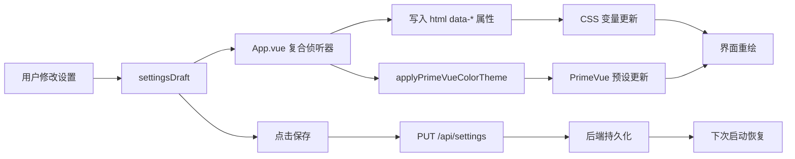

InvestGo 的前端界面采用了一套**双层主题架构**：第一层控制整体明暗外观（系统默认/浅色/深色），第二层控制界面强调色（蓝、石墨、森林等七种配色）。整个系统完全基于 CSS 自定义属性（CSS Variables）驱动，所有颜色、字体、阴影和边框都通过 `--` 前缀的变量声明，使得主题切换无需重新加载页面即可瞬时生效。本章将带你理解这套系统的设计思路、核心代码位置，以及如何在设置面板中实时预览和保存主题偏好。

Sources: [style.css](frontend/src/style.css#L1-L654), [theme.ts](frontend/src/theme.ts#L1-L44), [types.ts](frontend/src/types.ts#L12-L13)

## 核心概念：双层主题架构

主题系统由两个独立维度组合而成。**外观模式（Theme Mode）** 决定界面是浅色、深色，还是跟随操作系统自动切换；**强调色主题（Color Theme）** 决定按钮高亮、选中状态、图表线条等关键视觉元素的颜色倾向。这两个维度在 `AppSettings` 接口中分别由 `themeMode` 和 `colorTheme` 字段表示，类型定义为 `ThemeMode = "system" | "light" | "dark"` 和 `ColorTheme = "blue" | "graphite" | "forest" | "sunset" | "rose" | "violet" | "amber"`。这种分离设计的优势在于，用户可以在任意明暗模式下自由切换强调色，而无需担心颜色冲突或对比度问题。

Sources: [types.ts](frontend/src/types.ts#L12-L13), [forms.ts](frontend/src/forms.ts#L12-L13)

## CSS 变量驱动设计

所有视觉 token 都集中定义在根作用域 `:root` 中，涵盖背景、面板、文字、强调色、涨跌色、阴影、圆角和字体等七大类别。浅色模式的变量作为默认基准，深色模式则通过 `@media (prefers-color-scheme: dark)` 媒体查询覆盖同名变量。例如，浅色背景 `--app-bg` 为 `#fbfcfe`，而深色下自动切换为 `#0f1115`；文字色 `--ink` 在浅色下是 `#1d2735`，深色下则为 `#e7edf6`。除了系统媒体查询，样式表还定义了 `html[data-theme="dark"]` 和 `html[data-theme="light"]` 属性选择器，用于在用户提供显式偏好时覆盖操作系统设置，这种三层优先级（默认浅色 → 系统深色 → 显式覆盖）确保了任何场景下都有确定性的渲染结果。

Sources: [style.css](frontend/src/style.css#L1-L78), [style.css](frontend/src/style.css#L80-L153)

## 外观模式解析流程

实际的主题决策逻辑封装在 `App.vue` 的三个函数中：`resolvedTheme` 负责将用户设置解析为最终的 `"light"` 或 `"dark"` 字符串；`applyResolvedTheme` 将结果写入 `document.documentElement.dataset.theme` 并切换 `.app-dark` 类名；`syncThemeMode` 则作为 `matchMedia` 变化事件的回调，在操作系统主题切换时自动同步。当用户选择 `"system"` 模式时，应用会监听 `window.matchMedia("(prefers-color-scheme: dark)")` 的变化，动态响应系统级别的明暗切换。`.app-dark` 类名的存在不仅仅是为了样式表选择器，它同时也是 PrimeVue 组件库识别深色模式的钩子，这一点在后续组件库集成章节中会详细说明。

Sources: [App.vue](frontend/src/App.vue#L205-L216)

## 强调色主题系统

InvestGo 提供了七种强调色，每种颜色都包含浅色模式与深色模式两套色值。色值定义在 `style.css` 的 `data-color-theme` 属性选择器中，以蓝色为例：浅色模式下 `--accent` 为 `#355f96`，深色模式下提升亮度变为 `#8db5ea`，同时 `--accent-strong` 和 `--accent-soft` 也会相应调整，确保深色背景下的可读性和层次感。这些颜色种子在 `theme.ts` 中同样以 `themeSeeds` 对象维护，用于生成 PrimeVue 的调色板。在 `constants.ts` 中，`COLOR_THEME_SWATCHES` 定义了每种主题在设置面板色块按钮上显示的预览颜色，方便用户直观选择。

Sources: [style.css](frontend/src/style.css#L155-L242), [theme.ts](frontend/src/theme.ts#L5-L12), [constants.ts](frontend/src/constants.ts#L100-L108)

## PrimeVue 主题集成

InvestGo 使用 PrimeVue 作为 UI 组件库，其主题系统通过 `@primeuix/themes` 提供的 `definePreset` 和 `updatePreset` API 与应用的自定义 CSS 变量相衔接。在 `main.ts` 中，应用以 `investGoPreset` 初始化 PrimeVue，该预设继承自 `Aura` 主题，但将语义色 `primary` 映射到 InvestGo 的蓝色种子。`theme.ts` 中的 `applyPrimeVueColorTheme` 函数接收一个 `ColorTheme` 参数，调用 `updatePreset` 动态更新 PrimeVue 的全局主色，从而使按钮、输入框焦点环、开关等组件的强调色与用户选择保持一致。配置项 `darkModeSelector: ".app-dark"` 告知 PrimeVue：当 `<html>` 元素拥有 `.app-dark` 类时，组件内部应自动切换为深色变体样式。

Sources: [main.ts](frontend/src/main.ts#L1-L24), [theme.ts](frontend/src/theme.ts#L14-L43)

## 设置面板中的实时预览

主题切换的体验之所以流畅，关键在于**草稿隔离**机制。当用户进入设置面板的「显示」标签页时，`App.vue` 中的 `activeModule` 侦听器会将当前持久化设置复制到 `settingsDraft` 响应式对象中，此后的所有调整仅作用于草稿，不会污染实际运行状态。同时，一个复合侦听器会追踪 `settingsDraft` 中的 `themeMode`、`colorTheme`、`fontPreset`、`priceColorScheme` 等字段，并即时写入 `document.documentElement` 的 `data-*` 属性。这意味着用户在下拉框中选择「深色」、点击「日落」色块、或切换字体预设时，整个应用界面会在 16 毫秒内完成重绘，提供真正的所见即所得体验。如果用户点击「取消」，草稿会被丢弃，界面立即回退到保存前的状态。

Sources: [App.vue](frontend/src/App.vue#L137-L170), [SettingsModule.vue](frontend/src/components/modules/SettingsModule.vue#L251-L356)

## 扩展定制能力

主题系统还包含两项与色彩相关的辅助定制。**字体预设（Font Preset）** 提供系统字体、紧凑无衬线（IBM Plex Sans）和阅读衬线（思源宋体）三种选择，通过 `html[data-font-preset]` 选择器切换 `--font-ui` 和 `--font-display` 变量。**价格颜色方案（Price Color Scheme）** 则允许用户在「中国习惯」（红涨绿跌）和「国际习惯」（绿涨红跌）之间切换，通过覆盖 `--rise` 和 `--fall` 变量实现。值得注意的是，价格颜色方案在深色模式下也有专门的媒体查询覆盖，确保无论何种颜色组合，在暗色背景上都具有足够的对比度。

Sources: [style.css](frontend/src/style.css#L251-L276), [SettingsModule.vue](frontend/src/components/modules/SettingsModule.vue#L312-L321)

## 架构总览

下图展示了从用户操作到界面渲染的完整数据流：用户在设置面板修改选项 → 草稿状态更新 → `App.vue` 侦听器同步 DOM 属性 → CSS 变量与 PrimeVue 预设同时响应 → 界面即时重绘。保存操作则将草稿通过 PUT 请求持久化到后端，下次启动时从快照恢复。

Sources: [App.vue](frontend/src/App.vue#L137-L170), [theme.ts](frontend/src/theme.ts#L37-L43)

## 关键文件速查

| 文件 | 职责 | 初学者关注重点 |
|---|---|---|
| [style.css](frontend/src/style.css) | CSS 变量定义、明暗色值、属性选择器 | `:root` 变量名与 `data-theme` / `data-color-theme` 的对应关系 |
| [theme.ts](frontend/src/theme.ts) | PrimeVue 预设定义与动态更新 | `themeSeeds` 色值表与 `applyPrimeVueColorTheme` 函数 |
| [App.vue](frontend/src/App.vue#L205-L216) | 主题解析与 DOM 应用 | `resolvedTheme`、`applyResolvedTheme`、`syncThemeMode` 三个函数 |
| [types.ts](frontend/src/types.ts#L12-L13) | 类型定义 | `ThemeMode` 与 `ColorTheme` 联合类型 |
| [constants.ts](frontend/src/constants.ts#L87-L108) | 选项列表与色块预览 | `getColorThemeOptions` 与 `COLOR_THEME_SWATCHES` |
| [forms.ts](frontend/src/forms.ts#L12-L13) | 默认值 | `defaultSettings` 中的 `themeMode` 与 `colorTheme` |
| [main.ts](frontend/src/main.ts) | PrimeVue 初始化 | `darkModeSelector: ".app-dark"` 配置项 |
| [SettingsModule.vue](frontend/src/components/modules/SettingsModule.vue#L251-L356) | 设置面板 UI | 显示标签页中的下拉框与色块按钮布局 |

---

阅读完本章后，你可以继续了解 InvestGo 的组件体系与对话框设计，相关内容请参阅 [模块组件与对话框体系](20-mo-kuai-zu-jian-yu-dui-hua-kuang-ti-xi)。如果你想理解状态如何在前后端之间同步，也可以回溯阅读 [前后端状态同步与快照机制](22-qian-hou-duan-zhuang-tai-tong-bu-yu-kuai-zhao-ji-zhi)。