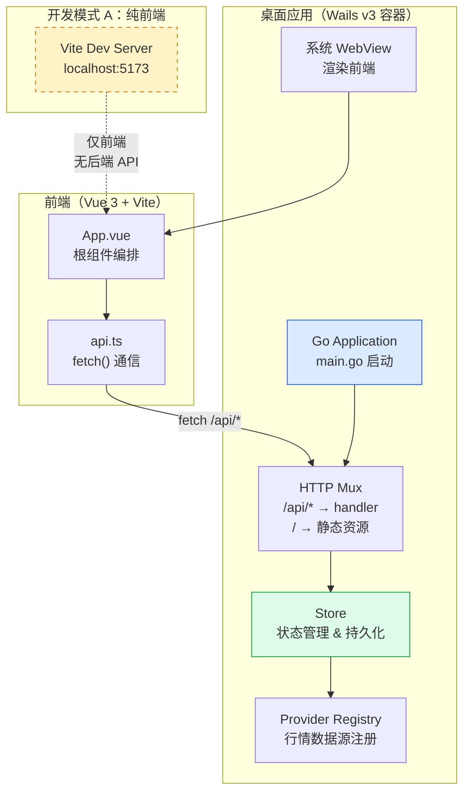
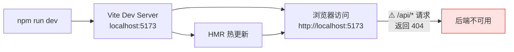
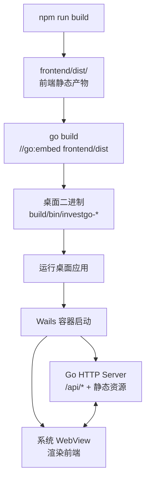

本文档帮助你从零搭建 InvestGo 的开发环境，并成功运行项目的两种开发模式——纯前端开发服务器与完整桌面应用。内容覆盖前置依赖安装、项目结构认知、依赖拉取、开发服务器启动，以及桌面二进制的构建与运行。构建脚本的详细参数与跨平台打包流程请参阅 [桌面应用构建与打包](3-zhuo-mian-ying-yong-gou-jian-yu-da-bao)；调试技巧与 DevTools 使用请参阅 [开发模式与调试技巧](30-kai-fa-mo-shi-yu-diao-shi-ji-qiao)。

## 项目架构总览

InvestGo 采用 **Go 后端 + Vue 前端** 的单仓架构，Go module 根目录即为仓库根目录，前端代码位于 `frontend/` 子目录。项目通过 Wails v3 将 Go 后端和前端产物打包为轻量桌面应用，运行时复用系统 WebView 而非内嵌 Chromium。前后端通过标准 HTTP API 通信（前端 `fetch()` → 后端 `/api/*` 路由），不依赖 Wails JS bindings 传递业务数据。Sources: [README.md](README.md#L29-L39) [main.go](main.go#L1-L32)



如上图所示，存在两种开发运行模式：**模式 A**（纯前端开发服务器）仅启动 Vite Dev Server，适合快速迭代 UI 组件和样式，但无法访问后端 API；**模式 B**（完整桌面应用）构建并运行 Go 二进制，前后端通过 HTTP Mux 完整连通。Sources: [main.go](main.go#L98-L101) [vite.config.ts](vite.config.ts#L1-L17) [frontend/src/api.ts](frontend/src/api.ts#L30-L54)

## 前置依赖

### 必需依赖

| 依赖 | 最低版本 | 用途 | 验证命令 |
|------|---------|------|---------|
| **Node.js** | 20+ | 前端依赖管理与 Vite 构建 | `node --version` |
| **Go** | 1.24+ | 后端编译与运行 | `go version` |
| **npm** | 随 Node.js 安装 | 包管理器 | `npm --version` |

### 平台特定依赖

| 平台 | 额外依赖 | 说明 |
|------|---------|------|
| **macOS** | Xcode Command Line Tools（含 `swift`） | 构建脚本使用 Swift/AppKit 渲染应用图标；macOS 13+ |
| **macOS** | CGO 工具链（Clang） | macOS 构建需 `CGO_ENABLED=1` |
| **Windows** | Microsoft Edge WebView2 Runtime | Windows 11 通常已预装；Windows 10 需手动安装 |

Sources: [README.md](README.md#L53-L58) [scripts/build-darwin-aarch64.sh](scripts/build-darwin-aarch64.sh#L60-L66) [scripts/build-windows-amd64.ps1](scripts/build-windows-amd64.ps1#L86-L88)

### macOS 依赖安装

```bash
# 安装 Xcode Command Line Tools（包含 swift、clang 等）
xcode-select --install

# 验证 Swift 可用
swift --version
```

### Windows 依赖安装

```powershell
# 使用 winget 一键安装全部依赖
winget install OpenJS.NodeJS.LTS
winget install GoLang.Go
winget install Microsoft.EdgeWebView2Runtime

# 安装后需重新打开终端使 PATH 生效
```

Windows 构建脚本会自动检测缺失的 `npm`、`go`、`magick` 命令并打印对应的 `winget install` 提示，无需事先记忆。Sources: [scripts/build-windows-amd64.ps1](scripts/build-windows-amd64.ps1#L13-L29) [README.zh-CN.md](README.zh-CN.md#L60-L66)

## 项目关键目录结构

```
investgo/                     ← Go module 根目录
├── main.go                   ← 应用入口，嵌入前端产物并启动 Wails 应用
├── go.mod                    ← Go 模块定义（Go 1.24, Wails v3 alpha.54）
├── go.sum
├── package.json              ← 前端依赖与 npm scripts
├── vite.config.ts            ← Vite 配置（根目录指向 frontend/，端口 5173）
├── tsconfig.json             ← TypeScript 编译配置
├── frontend/
│   ├── index.html            ← Vite 入口 HTML
│   └── src/
│       ├── main.ts           ← Vue 应用挂载点
│       ├── App.vue           ← 根组件
│       ├── api.ts            ← 后端 API 通信层
│       ├── wails-runtime.ts  ← Wails 运行时桥接（可空安全）
│       ├── i18n.ts           ← 国际化
│       └── ...
├── internal/
│   ├── api/                  ← HTTP 路由与请求处理
│   ├── core/                 ← 核心领域逻辑（store、provider、marketdata 等）
│   ├── logger/               ← 结构化日志
│   └── platform/             ← 平台适配（代理、窗口）
├── scripts/                  ← 构建与打包脚本
│   ├── build-darwin-aarch64.sh
│   ├── build-darwin-x86_64.sh
│   ├── build-windows-amd64.ps1
│   ├── build-windows-amd64.bat
│   └── render-app-icon.sh
└── build/                    ← 构建输出目录（gitignore）
    ├── appicon.png           ← 嵌入的应用图标
    └── bin/                  ← 编译产物输出
```

`build/` 和 `frontend/dist/` 在 `.gitignore` 中被排除，属于本地构建产物。Sources: [.gitignore](.gitignore#L1-L37) [go.mod](go.mod#L1-L9) [vite.config.ts](vite.config.ts#L5-L6)

## 安装依赖

项目根目录的 `package.json` 管理前端依赖（Vue 3、PrimeVue 4、Vite 8、Chart.js 4 等），Go 后端依赖通过 `go.mod` 管理。首次克隆仓库后，执行以下步骤：

```bash
# 1. 进入项目根目录
cd investgo

# 2. 安装前端依赖（npm 会根据 package-lock.json 安装确定版本）
npm install

# 3. Go 依赖会在首次构建时自动下载，也可手动触发
go mod download
```

**注意**：项目同时存在 `package-lock.json` 和 `pnpm-lock.yaml`，但构建脚本统一使用 `npm`。请勿使用 `pnpm install`，以免锁文件不一致。Sources: [package.json](package.json#L1-L20) [scripts/build-darwin-aarch64.sh](scripts/build-darwin-aarch64.sh#L58)

### 依赖版本概览

| 类别 | 包名 | 版本 |
|------|------|------|
| 前端框架 | `vue` | ^3.5.32 |
| UI 组件库 | `primevue` | ^4.5.4 |
| 图标库 | `primeicons` | ^7.0.0 |
| 图表 | `chart.js` | ^4.5.1 |
| 构建工具 | `vite` | ^8.0.7 |
| TypeScript | `typescript` | ^6.0.2 |
| 后端框架 | `wails/v3` | alpha.54 |
| TLS 指纹 | `utls` | v1.8.2 |
| 国际化 | `golang.org/x/text` | v0.33.0 |

Sources: [package.json](package.json#L7-L19) [go.mod](go.mod#L5-L9)

## 开发模式 A：纯前端开发服务器

纯前端模式适用于只修改 UI 组件、样式、国际化文本等不需要后端数据的场景。Vite Dev Server 提供热模块替换（HMR），修改即时生效。

```bash
# 启动前端开发服务器
npm run dev
```

服务器默认监听 `http://localhost:5173`，且 `host: true` 配置允许局域网内其他设备访问（方便手机/平板调试）。Sources: [vite.config.ts](vite.config.ts#L7-L10)



**关键限制**：开发服务器不包含 Wails 运行时，因此 `frontend/src/wails-runtime.ts` 中的所有函数必须保持**可空安全**——当 `window.runtime` 或 `window._wails` 不存在时，函数应优雅降级而非抛出异常。同样，所有 `/api/*` 请求将返回 404，因为后端 HTTP Server 并未启动。Sources: [frontend/src/wails-runtime.ts](frontend/src/wails-runtime.ts#L16-L22) [frontend/src/wails-runtime.ts](frontend/src/wails-runtime.ts#L81-L88) [README.md](README.md#L80)

### 前端类型检查

在开发过程中，建议定期执行 TypeScript 类型检查，以及时发现类型错误：

```bash
npm run typecheck
```

此命令运行 `vue-tsc --noEmit`，不产生编译产物，仅做类型验证。项目当前无前端单元测试，类型检查是最主要的前端质量门禁。Sources: [package.json](package.json#L5)

### 后端测试

```bash
go test ./...
```

使用默认 Go 缓存即可。构建脚本中会覆盖 `GOCACHE` 到临时目录（`/tmp/go-build-cache`）以确保干净构建，但日常开发无需此设置。Sources: [README.md](README.md#L86)

## 开发模式 B：构建并运行桌面应用

当你需要完整的前后端联调——包括行情数据获取、状态持久化、代理配置等——必须构建并运行 Go 二进制。流程分两步：前端产物构建 → Go 编译嵌入。



### macOS 构建

```bash
# Apple Silicon（M1/M2/M3/M4）
./scripts/build-darwin-aarch64.sh

# Intel
./scripts/build-darwin-x86_64.sh
```

macOS 构建脚本会依次执行：1) 调用 `render-app-icon.sh` 用 Swift/AppKit 将 SVG 图标渲染为 `build/appicon.png`；2) 运行 `npm run build` 构建前端产物到 `frontend/dist/`；3) 设置 `CGO_ENABLED=1`、`GOOS=darwin`、`GOARCH=arm64/amd64` 等环境变量；4) 通过 `go build` 编译并注入版本号。Sources: [scripts/build-darwin-aarch64.sh](scripts/build-darwin-aarch64.sh#L53-L77) [scripts/render-app-icon.sh](scripts/render-app-icon.sh#L1-L30)

macOS 构建需要 **CGO**，因此系统必须有 Xcode Command Line Tools（提供 Clang 编译器）。Intel 构建脚本 (`build-darwin-x86_64.sh`) 实际上是 Apple Silicon 脚本的薄包装，通过覆盖 `DARWIN_GOARCH=amd64` 和 `DARWIN_PLATFORM_NAME=x86_64` 环境变量后调用同一脚本。Sources: [scripts/build-darwin-x86_64.sh](scripts/build-darwin-x86_64.sh#L1-L9)

### Windows 构建

```powershell
# PowerShell
.\scripts\build-windows-amd64.ps1

# 或通过 .bat 包装（自动绕过执行策略限制，失败时暂停窗口）
scripts\build-windows-amd64.bat
```

Windows 构建使用 `CGO_ENABLED=0`，纯 Go 编译，不依赖 C 工具链。如果 `build/appicon.png` 不存在，脚本会从 `frontend/src/assets/appicon.png` 复制一份，不需要 ImageMagick。Sources: [scripts/build-windows-amd64.ps1](scripts/build-windows-amd64.ps1#L60-L101)

### 开发构建（启用 DevTools）

常规构建产出的是**生产构建**，不支持 F12 打开开发者工具。如需在桌面应用中调试前端，需使用 `--dev` 标志：

```bash
# macOS
./scripts/build-darwin-aarch64.sh --dev

# Windows PowerShell
.\scripts\build-windows-amd64.ps1 -Dev
```

`--dev` 做了两件事：1) 通过 `-ldflags` 将 `main.defaultTerminalLogging` 和 `main.defaultDevToolsBuild` 设置为 `"1"`，启用终端日志输出和 F12 开发者工具；2) 添加 `devtools` 构建标签。注意 F12 快捷键还需要应用内**开发者模式**设置开启才能生效——这是一个双重开关设计，避免生产版本意外暴露 DevTools。Sources: [scripts/build-darwin-aarch64.sh](scripts/build-darwin-aarch64.sh#L68-L75) [main.go](main.go#L127-L141) [main.go](main.go#L170-L188)

### 版本号注入

构建脚本通过 Go 的 `-X` 链接器标志在编译时注入版本号：

```bash
# 注入特定版本
VERSION=1.0.0 ./scripts/build-darwin-aarch64.sh

# 不设置 VERSION 时，默认为 "dev"
./scripts/build-darwin-aarch64.sh
```

版本号被注入到 `main.appVersion` 变量，Store 初始化时会将其写入运行时快照，前端可通过 API 获取。Sources: [scripts/build-darwin-aarch64.sh](scripts/build-darwin-aarch64.sh#L68) [main.go](main.go#L26) [scripts/build-windows-amd64.ps1](scripts/build-windows-amd64.ps1#L90-L91)

### 运行构建产物

```bash
# macOS
./build/bin/investgo-darwin-aarch64

# Windows
.\build\bin\investgo-windows-amd64.exe

# 传入 --dev 标志可临时启用终端日志（即使非 devtools 构建）
./build/bin/investgo-darwin-aarch64 --dev
```

应用启动后，Wails 容器创建系统原生窗口（默认 1200×828，最小尺寸 1200×828），Go 后端同时启动 HTTP Server 服务 `/api/*` 路由和前端静态资源。Sources: [internal/platform/window.go](internal/platform/window.go#L14-L41) [main.go](main.go#L98-L101)

## 运行时数据路径

应用运行时会自动创建以下路径存储状态和日志：

| 数据类型 | macOS 路径 | Windows 路径 |
|---------|-----------|-------------|
| **持久化状态** | `~/Library/Application Support/investgo/state.json` | `%AppData%\investgo\state.json` |
| **开发日志** | `~/Library/Application Support/investgo/logs/app.log` | `%AppData%\investgo\logs\app.log` |

当 `os.UserConfigDir()` 返回错误时（极少见），应用会回退到项目相对路径 `./data/state.json` 和 `./data/logs/app.log`。`state.json` 包含自选列表、提醒规则、应用设置等全部持久化数据；`app.log` 存储后端和前端开发日志，仅在开发者模式下有实际价值。Sources: [main.go](main.go#L152-L168)

## 两种开发模式对比

| 维度 | 纯前端（`npm run dev`） | 桌面应用（构建运行） |
|------|----------------------|-------------------|
| **启动速度** | 秒级 | 需先编译（1-3 分钟） |
| **热更新** | ✅ Vite HMR 即时生效 | ❌ 修改需重新编译 |
| **后端 API** | ❌ 不可用 | ✅ 完整可用 |
| **Wails 运行时** | ❌ 不可用 | ✅ 窗口控制、平台检测等 |
| **适合场景** | UI 样式、布局、国际化 | 行情数据联调、状态持久化、代理测试 |
| **浏览器访问** | `http://localhost:5173` | 系统原生窗口 |
| **端口** | 5173 | Wails 动态分配 |

Sources: [vite.config.ts](vite.config.ts#L7-L10) [main.go](main.go#L102-L148) [frontend/src/wails-runtime.ts](frontend/src/wails-runtime.ts#L61-L70)

## 常见问题排查

| 问题 | 原因 | 解决方案 |
|------|------|---------|
| `npm install` 失败或依赖冲突 | 锁文件版本不一致 | 删除 `node_modules` 后重新 `npm install` |
| `swift: command not found`（macOS） | 未安装 Xcode CLT | 运行 `xcode-select --install` |
| macOS 构建 `CGO` 编译失败 | 缺少 Clang 编译器 | 确认 Xcode CLT 已安装：`xcode-select -p` |
| Windows 运行白屏 | 未安装 WebView2 Runtime | 安装 `Microsoft.EdgeWebView2Runtime` |
| F12 无法打开开发者工具 | 生产构建或开发者模式未开启 | 使用 `--dev` 构建 + 开启应用内开发者模式 |
| 前端 `typecheck` 报 `wails-runtime` 类型错误 | `vite/client` 类型定义缺失 | 确认 `tsconfig.json` 中 `types` 包含 `"vite/client"` |
| `go build` 提示 `frontend/dist` 未找到 | 未先构建前端 | 先执行 `npm run build`，或直接使用构建脚本 |
| macOS 提示"应用已损坏" | 未签名应用被 Gatekeeper 拦截 | `xattr -dr com.apple.quarantine /path/to/InvestGo.app` |

Sources: [main.go](main.go#L170-L188) [scripts/build-windows-amd64.ps1](scripts/build-windows-amd64.ps1#L13-L29) [README.md](README.md#L214-L222) [tsconfig.json](tsconfig.json#L14)

## 下一步

环境搭建完成后，推荐按以下顺序深入项目：

1. **[桌面应用构建与打包](3-zhuo-mian-ying-yong-gou-jian-yu-da-bao)** — 了解构建脚本的完整参数、macOS DMG 打包流程与版本注入细节
2. **[应用入口与 Wails v3 集成](4-ying-yong-ru-kou-yu-wails-v3-ji-cheng)** — 深入 `main.go` 的启动流程、Wails 应用配置与前端资源嵌入机制
3. **[Vue 3 应用结构与根组件编排](14-vue-3-ying-yong-jie-gou-yu-gen-zu-jian-bian-pai)** — 理解前端初始化链路与组件编排模式
4. **[Wails 运行时桥接与平台适配](16-wails-yun-xing-shi-qiao-jie-yu-ping-tai-gua-pei)** — 掌握 `wails-runtime.ts` 的可空安全设计与桌面平台检测