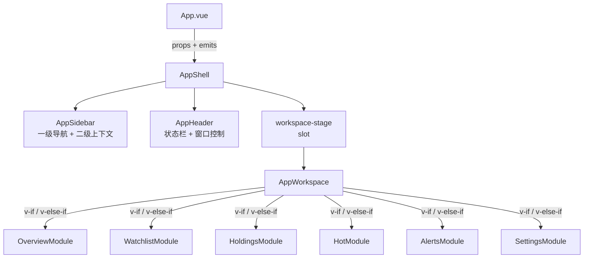
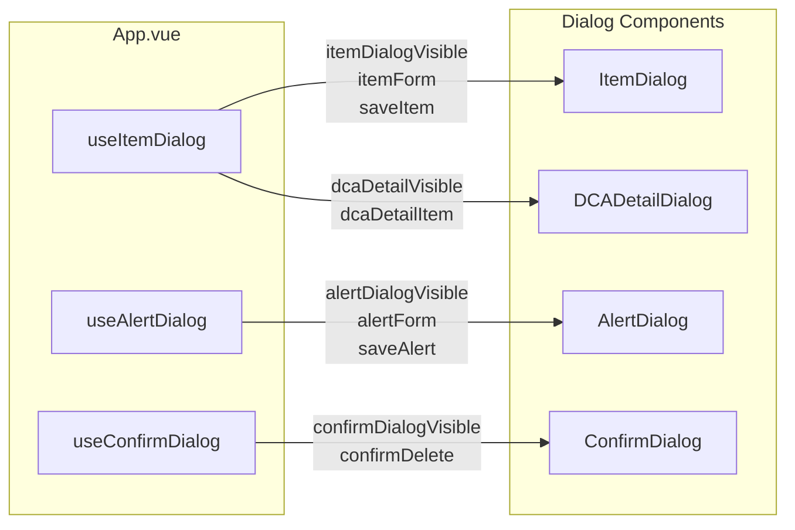

InvestGo 的前端界面采用**模块级路由**与**声明式对话框**相结合的组织方式。整个视图空间被划分为五个业务模块（概览、行情、持仓、热门、预警）与一个设置入口，所有模块共享同一套由 `AppShell` 提供的布局骨架；而所有用户交互产生的创建、编辑、确认操作，则通过一组与 Composable 配对的对话框组件完成。本章将剖析模块注册机制、条件渲染策略、对话框状态管理以及表单数据流，帮助你理解这套体系是如何在避免深层路由嵌套的同时，保持各模块之间的松耦合与视觉一致性。

## 应用壳层的三层布局架构

桌面端的根布局由 `AppShell` 统筹，它通过 CSS Grid 将可视区域切分为**侧边栏列**与**主内容列**。`AppShell` 本身不处理任何业务数据，仅负责接收 `activeModule`、`items`、`statusText` 等顶层状态，并通过插槽将 `AppWorkspace` 注入到主内容区。这种设计让布局壳与业务内容彻底解耦：壳层关心的是窗口控制按钮适配、侧边栏显隐、拖拽调整宽度等桌面级行为，而业务模块只关心自身渲染。

`AppShell` 内部使用 `grid-template-columns: var(--sidebar-width) minmax(0, 1fr)` 定义双列结构，并通过 CSS 变量 `--window-control-inset-left` 为 macOS 原生标题栏留出安全边距。当侧边栏被隐藏时，网格退化为单列，确保在窄屏或用户主动折叠时仍然可用。 Sources: [AppShell.vue](frontend/src/components/AppShell.vue#L89-L105)

`AppSidebar` 作为壳层的子组件，承担了两级导航职责：**一级导航**展示五个业务模块的图标与标签（通过 `getModuleTabs` 读取常量配置），**二级导航**则根据当前活跃模块动态切换内容：在「行情」模块下显示自选股列表，在「热门」模块下显示市场分组（CN/HK/US）。这种上下文敏感的二级导航避免了为每个模块单独维护侧边栏，同时让用户在不同模块间切换时保持空间位置感。 Sources: [AppSidebar.vue](frontend/src/components/AppSidebar.vue#L47-L76)

## 模块路由与条件渲染

InvestGo 前端不使用 `vue-router`，而是采用**中央状态驱动的条件渲染**。`ModuleKey` 联合类型定义了所有合法模块标识：`"overview" | "watchlist" | "hot" | "holdings" | "alerts" | "settings"`。`App.vue` 以 `activeModule` 响应式变量作为唯一路由源，所有模块切换最终都归约为对该变量的赋值。 Sources: [types.ts](frontend/src/types.ts#L4)

`AppWorkspace` 是模块路由的调度层。它接收 `activeModule` 并通过连续的 `v-if / v-else-if` 指令渲染对应模块组件。每个模块组件的 props 接口都经过精确裁剪：例如 `OverviewModule` 只需要 `dashboard` 与 `runtime` 摘要，而 `WatchlistModule` 则需要 `selectedItem`、`historySeries` 等行情专属数据。这种「按需注入」避免了将庞大的全局状态一次性灌入所有子组件，也让每个模块的接口契约清晰可测。 Sources: [AppWorkspace.vue](frontend/src/components/AppWorkspace.vue#L79-L153)

模块切换还附带**生命周期副作用**。`App.vue` 中的 `watch(activeModule)` 监听器负责在进入「行情」模块时触发单品种刷新，在进入「概览」模块时触发全量组合刷新。这意味着模块不只是视觉层面的切换，更是数据加载策略的分发点。 Sources: [App.vue](frontend/src/App.vue#L128-L148)

## 模块组件的设计范式

所有业务模块遵循统一的视觉结构：**顶部工具栏（`panel-header`）+ 可滚动内容区**。工具栏左侧放置模块标题，右侧放置操作按钮（刷新、添加、搜索等）；内容区则根据业务需要采用表格、图表或表单网格。以 `HoldingsModule` 为例，它接收 `search` 与 `filteredItems`，在内部通过计算属性进一步筛选出 `hasPosition` 的持仓项目，并以表格形式展示现价、日内涨跌、持仓盈亏与 DCA 记录入口。 Sources: [HoldingsModule.vue](frontend/src/components/modules/HoldingsModule.vue#L68-L84)

`WatchlistModule` 则展示了更复杂的模块内数据组装模式。它接收原始 `selectedItem` 与 `historySeries`，在计算属性 `marketSnapshot` 中按优先级合并数据：先取历史序列中的实时快照，再回落到品种对象的当前价格字段，最终生成统一的 `livePrice`、`effectiveChange`、`positionPnL` 等派生值。这种「多层 fallback」策略确保了即使某一层数据暂时缺失，界面也不会出现空洞。 Sources: [WatchlistModule.vue](frontend/src/components/modules/WatchlistModule.vue#L38-L75)

`SettingsModule` 是模块体系中的特殊存在：它并非业务视图，而是表单密集的配置中心。它内部使用 `settingsTabProxy` 计算属性代理标签切换，将 `settingsDraft`（临时编辑副本）与持久化 `settings` 隔离。用户在设置页做的修改不会立即生效，只有点击保存并通过后端校验后，`applySnapshot` 才会将草稿合并回主状态。 Sources: [SettingsModule.vue](frontend/src/components/modules/SettingsModule.vue#L51-L55)

## 对话框体系：Composable 与组件的配对架构

InvestGo 的对话框不采用全局命令式调用（如 `this.$dialog.open()`），而是坚持**声明式渲染 + 状态驱动**的 Vue 风格。每个对话框都有对应的 Composable 负责维护 `visible` 标志、表单模型与异步提交逻辑；`App.vue` 在模板中根据这些响应式标志条件渲染对话框组件，并通过 `v-model:visible` 双向绑定控制显隐。这种配对架构的好处是状态流完全透明，对话框生命周期与组件树保持一致，便于调试与测试。

| 对话框 | Composable | 核心职责 | 表单复杂度 |
|--------|-----------|---------|-----------|
| `ItemDialog` | `useItemDialog` | 创建/编辑自选股；支持 DCA 记录与观察模式 | 高（双标签页 + 动态条目表） |
| `AlertDialog` | `useAlertDialog` | 创建/编辑价格预警规则 | 中（下拉关联 + 条件表达式） |
| `ConfirmDialog` | `useConfirmDialog` | 通用删除确认（品种或预警） | 低（只读消息 + 确认按钮） |
| `DCADetailDialog` | 无（直接由 `App.vue` 管理） | 展示定投明细与汇总统计 | 无（只读视图） |

Sources: [App.vue](frontend/src/App.vue#L397-L572)

### 品种编辑对话框（ItemDialog）

`ItemDialog` 是整个应用中表单最复杂的对话框。它采用**双标签页结构**：「基础信息」与「定投记录」。当用户切换到 DCA 标签页时，可以逐条添加买入记录（日期、金额、股数、买入价、手续费、备注）。对话框内部通过计算属性 `dcaSummary` 实时汇总所有有效记录，并推导出总投入、总股数与加权平均成本。一旦存在有效 DCA 记录，基础页中的「数量」与「成本价」字段将自动变为只读，显示由 DCA 推导的值，同时在界面上给出提示文案，防止用户手动输入与 DCA 计算结果冲突。 Sources: [ItemDialog.vue](frontend/src/components/dialogs/ItemDialog.vue#L47-L84)

`ItemDialog` 还支持**观察模式**（`watchOnly`）。当从热门列表执行「仅观察」操作时，对话框以窄版（560px）打开，隐藏 DCA 标签页与所有持仓字段，提交时强制将 `quantity`、`costPrice`、`dcaEntries` 清零，确保后端保存为纯观察条目。 Sources: [ItemDialog.vue](frontend/src/components/dialogs/ItemDialog.vue#L112)

### 预警编辑对话框（AlertDialog）

`AlertDialog` 是一个典型的关联表单对话框。它接收 `itemOptions`（当前所有自选股的下拉列表）与 `alertConditionOptions`（高于/低于），通过 PrimeVue 的 `Select` 组件实现级联选择。表单模型 `AlertFormModel` 包含 `itemId`、`condition`、`threshold` 与 `enabled` 四个核心字段。新建预警时，`App.vue` 会默认传入第一个自选股的 `id` 作为 `defaultItemId`，减少用户的重复选择。 Sources: [AlertDialog.vue](frontend/src/components/dialogs/AlertDialog.vue#L14-L33)

### 确认删除对话框（ConfirmDialog）

`ConfirmDialog` 是唯一的**通用型对话框**。它不绑定特定业务 Composable，而是作为 `useConfirmDialog` 的状态出口。`useConfirmDialog` 内部维护一个 `pendingDelete` 对象，记录待删除的实体类型（`"item"` 或 `"alert"`）与 `id`。当用户触发删除时，`requestDeleteItem` 或 `requestDeleteAlert` 会先写入 pending 状态并弹出对话框；用户点击确认后，`confirmDelete` 根据 `pendingDelete.kind` 分派到对应的实际删除函数。这种「挂起-确认-执行」的三段式流程，确保删除操作在异步等待期间不会被重复触发。 Sources: [useConfirmDialog.ts](frontend/src/composables/useConfirmDialog.ts#L13-L56)

### DCA 明细对话框（DCADetailDialog）

`DCADetailDialog` 是一个**只读详情对话框**，没有对应的独立 Composable，其可见性由 `App.vue` 直接管理。它以宽版（1100px）展示某只股票的完整定投历史，顶部是汇总统计栏（总投入、总股数、加权均价、当前市值、持仓盈亏），下方是逐条记录表格。对话框底部提供「关闭」与「编辑记录」两个操作：点击后者会关闭当前对话框，并以 `initialTab="dca"` 重新打开 `ItemDialog`，实现从「只读浏览」到「编辑修改」的无缝跳转。 Sources: [DCADetailDialog.vue](frontend/src/components/dialogs/DCADetailDialog.vue#L62-L133)

## Composables 中的表单与 API 编排

对话框的 Composable 层不仅管理可见性，还承担**表单序列化、API 调用与状态回放**的完整闭环。

`useItemDialog` 暴露三种打开方式：`openItemDialog`（普通编辑）、`openHotWatchDialog`（热门→观察）、`openHotPositionDialog`（热门→建仓）。每种方式调用 `forms.ts` 中不同的预填充函数（`mapItemToForm`、`hotItemToWatchForm`、`hotItemToPositionForm`），将领域对象转换为表单模型。保存时，`serialiseItemForm` 将前端表单回译为后端 `WatchlistItem` 子集，并过滤掉无效的 DCA 记录，随后通过 `api()` 发送 PUT/POST 请求。成功响应是一个完整的 `StateSnapshot`，`applySnapshot` 将其扩散到全局状态，确保列表、图表与侧边栏同步更新。 Sources: [useItemDialog.ts](frontend/src/composables/useItemDialog.ts#L27-L87)

`useAlertDialog` 遵循相同模式，但额外接受一个 `onAlertSaved` 回调。保存成功后，该回调将活跃模块切回「预警」，让用户立即看到新增或修改的规则。这种「操作完成后的视图导航」由 Composable 的调用方注入，保持了 Composable 本身的中立性。 Sources: [useAlertDialog.ts](frontend/src/composables/useAlertDialog.ts#L28-L48)

`forms.ts` 是整个表单体系的**数据契约中心**。它定义了 `ItemFormModel` 与 `AlertFormModel` 的缺省值、领域对象到表单的映射函数、以及表单到后端载荷的序列化函数。一个值得注意的细节是日期处理：`isoDateToInputValue` 将后端 ISO 8601 字符串转换为 HTML `<input type="date">` 所需的 `YYYY-MM-DD` 格式，而 `serialiseItemForm` 在提交时将其重新包装为 UTC 午夜时间戳的 ISO 字符串，确保前后端对「仅日期」语义的理解一致。 Sources: [forms.ts](frontend/src/forms.ts#L115-L200)

## 侧边栏布局的交互管理

模块组件在视觉上占据主内容区，但它们的可用宽度受到侧边栏状态的直接影响。`useSidebarLayout` Composable 封装了侧边栏的**显隐切换**与**拖拽调整宽度**逻辑。它通过 `appShellRef` 获取壳层 DOM 引用，在 `startSidebarResize` 中监听全局 `mousemove` 事件，实时计算鼠标相对于壳层左边缘的偏移，并将宽度钳制在 220px 到 380px 之间。拖拽过程中，它会临时禁用文本选择并设置 `col-resize` 光标，提供即时的视觉反馈。 Sources: [useSidebarLayout.ts](frontend/src/composables/useSidebarLayout.ts#L1-L60)

侧边栏的隐藏状态会级联到 `AppShell` 的 CSS Grid：当 `sidebarHidden` 为 `true` 时，网格模板退化为单列，主内容区获得全部可用空间。这对 `WatchlistModule` 中的 `PriceChart` 与 `HoldingsModule` 中的宽表格尤为重要，因为它们需要充足的水平像素来展示数据密集视图。

---

模块组件与对话框体系通过「壳层-模块-对话框」三层结构，将桌面级布局、业务视图与瞬时交互分层治理。`AppWorkspace` 的条件渲染避免了路由配置的冗余，Composable 与对话框组件的配对则让状态流始终处于响应式系统的掌控之下。如果你想进一步理解模块内部的数据消费方式，可以继续阅读 [Composables 业务逻辑复用](17-composables-ye-wu-luo-ji-fu-yong)；如果希望深入行情数据是如何驱动 `WatchlistModule` 中图表与指标卡片的，可以前往 [历史走势图数据加载与缓存](24-li-shi-zou-shi-tu-shu-ju-jia-zai-yu-huan-cun)。