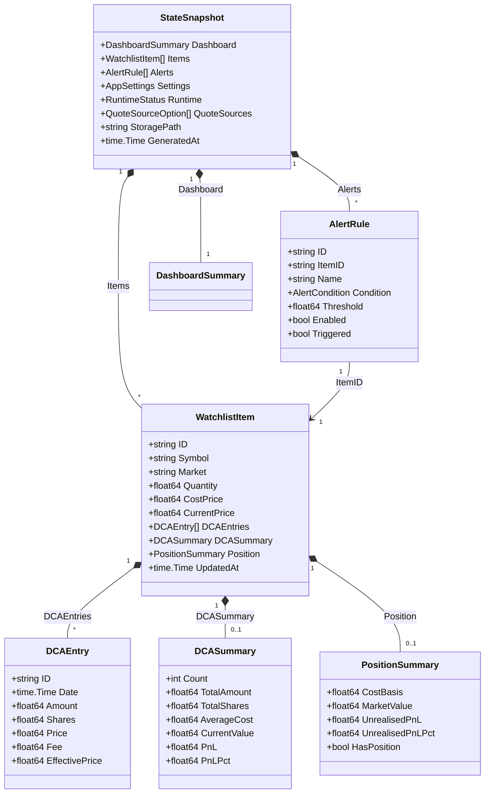

本文档聚焦 InvestGo 的核心领域模型，系统阐述 `WatchlistItem`、`AlertRule` 与 `StateSnapshot` 的设计意图、字段语义及交互关系。这三组模型构成了前后端共享的“单一事实来源”：WatchlistItem 统一表达“自选股/持仓”两种跟踪场景；AlertRule 为任意 Item 附加价格预警；StateSnapshot 则在每次状态变更后将完整的运行时视图打包输送给前端。理解它们的边界——哪些字段落盘持久化、哪些字段运行时派生——是掌握后续状态同步与行情刷新机制的前提。

Sources: [model.go](internal/core/model.go#L50-L318), [types.ts](frontend/src/types.ts#L73-L254)

## WatchlistItem：统一跟踪实体

后端使用单一的 `WatchlistItem` 结构同时承载“仅观察”与“实际持仓”两类业务对象，前端通过是否存在 `position` / `dcaSummary` 等派生数据来区分视图表现。该结构以 `Symbol` + `Market` 作为业务唯一键，内部通过 `Quantity`、`CostPrice` 与 `DCAEntries` 的组合表达持仓深度。

Sources: [model.go](internal/core/model.go#L50-L78)

### 核心字段与职责

`WatchlistItem` 的字段可分为四类：标识与静态信息（`ID`、`Symbol`、`Name`、`Market`、`Currency`、`Tags`、`Thesis`）、用户录入的持仓参数（`Quantity`、`CostPrice`、`AcquiredAt`）、行情运行时数据（`CurrentPrice`、`PreviousClose`、`OpenPrice`、`DayHigh`、`DayLow`、`Change`、`ChangePercent`、`QuoteSource`、`QuoteUpdatedAt`）以及用于排序与交互的元数据（`PinnedAt`、`UpdatedAt`）。其中行情字段由 Quote Provider 在刷新周期内写入，用户修改 Item 时通过 `inheritLiveFields` 保留最近一次行情，防止编辑操作抹除实时数据。

Sources: [model.go](internal/core/model.go#L53-L78), [helper.go](internal/core/store/helper.go#L29-L45)

### 观察模式 vs 持仓模式

虽然底层类型统一，但业务语义上存在明显分界：

| 维度 | 观察模式（Watch-only） | 持仓模式（Holding） |
|---|---|---|
| Quantity | 0 或未填写 | > 0 |
| CostPrice | 可留空 | 必须有意义 |
| DCAEntries | 通常为空 | 可记录多笔定投 |
| Position 衍生 | `HasPosition == false` | 包含 `CostBasis`、`MarketValue`、`UnrealisedPnL` |
| DCASummary 衍生 | nil | 聚合多笔定投后的均价与盈亏 |

这种“同构异用”的设计避免了为观察和持仓维护两套增删改查逻辑，也让用户能够随时将一条观察记录转为持仓，只需补录数量与成本。

Sources: [model.go](internal/core/model.go#L50-L52), [enrichment.go](internal/core/store/enrichment.go#L73-L83)

### 定投记录与 DCASummary

`DCAEntry` 记录单笔定投的日期、金额、股数、价格、手续费与备注。服务端在生成快照时调用 `decorateDCAEntries` 为每条记录补全 `EffectivePrice`：如果用户填写了成交价则直接使用，否则按 `(Amount - Fee) / Shares` 反推。随后 `buildDCASummary` 过滤掉无效记录（金额或股数不大于 0），汇总出总投入、总股数、总费用、平均成本及基于最新行情的市值与盈亏。

Sources: [model.go](internal/core/model.go#L16-L39), [enrichment.go](internal/core/store/enrichment.go#L1-L71)

### 服务端派生装饰

持久化层仅保存原始的 `DCAEntries` 切片，不保存任何汇总结果。每次构建 `StateSnapshot` 时，`decorateItemDerived` 依次为 Item 附加 `DCAEntries`（含有效价格）、`DCASummary` 与 `PositionSummary`。这保证了一旦行情或用户编辑发生变化，前端拿到的派生指标始终是最新的，而无需在每次修改时手动维护冗余字段。

Sources: [enrichment.go](internal/core/store/enrichment.go#L85-L91)

## AlertRule：价格预警规则

`AlertRule` 以“规则-实例”模型依附于 `WatchlistItem`，通过 `ItemID` 建立外键式引用。单条规则包含名称、触发条件（`above` / `below`）、阈值、启用开关与触发标记。

Sources: [model.go](internal/core/model.go#L103-L114)

### 字段语义

| 字段 | 类型 | 说明 |
|---|---|---|
| ID | string | 规则唯一标识 |
| ItemID | string | 关联的 WatchlistItem ID |
| Name | string | 用户自定义规则名称 |
| Condition | AlertCondition | `above` 表示现价 ≥ 阈值触发；`below` 表示现价 ≤ 阈值触发 |
| Threshold | float64 | 触发阈值，必须 > 0 |
| Enabled | bool | 是否启用；禁用后不再参与评估 |
| Triggered | bool | 最近一次评估后的触发状态 |
| LastTriggeredAt | *time.Time | 最近一次触发的时间戳 |
| UpdatedAt | time.Time | 最后更新时间 |

Sources: [model.go](internal/core/model.go#L104-L114)

### 触发评估与级联清理

每次状态变更（增删改 Item/Alert）或行情刷新后，`Store` 会在写锁保护下执行 `evaluateAlertsLocked`。该方法首先以 `ItemID` 为键构建价格索引，随后遍历所有启用的规则，按条件比对当前价与阈值，更新 `Triggered` 与 `LastTriggeredAt`。当用户删除某条 `WatchlistItem` 时，`DeleteItem` 会同步剔除所有 `ItemID` 相等的 `AlertRule`，避免产生悬挂引用。

Sources: [state.go](internal/core/store/state.go#L131-L165), [mutation.go](internal/core/store/mutation.go#L145-L177)

## StateSnapshot：前端消费的完整状态视图

`StateSnapshot` 是后端向前端暴露的“统一状态包”。它并非直接映射磁盘上的持久化结构，而是在每次读取时由 `snapshotLocked` 现场组装、排序、装饰并缓存的结果。

Sources: [model.go](internal/core/model.go#L308-L318)

### 聚合结构

| 字段 | 类型 | 说明 |
|---|---|---|
| Dashboard | DashboardSummary | 组合总览：总成本、总市值、总盈亏、输赢计数、已触发预警数 |
| Items | []WatchlistItem | 全部跟踪项（已按置顶与时间排序，已附加派生字段） |
| Alerts | []AlertRule | 全部预警规则（已按触发状态与时间排序） |
| Settings | AppSettings | 用户设置（行情源、主题、代理、API Key 等） |
| Runtime | RuntimeStatus | 运行时状态：最后行情刷新、错误信息、活跃行情源、App 版本 |
| QuoteSources | []QuoteSourceOption | 当前可用的行情源列表 |
| StoragePath | string | 状态文件持久化路径 |
| GeneratedAt | time.Time | 本次快照生成时间 |

Sources: [model.go](internal/core/model.go#L308-L318), [types.ts](frontend/src/types.ts#L245-L254)

### 快照生成流程

`snapshotLocked` 的执行可分为四个阶段：复制原始状态、排序、派生装饰、构建 Dashboard。首先，它从 `persistedState` 中浅拷贝 `Items` 与 `Alerts` 切片，避免污染内部持久化数组；随后对 Items 执行双重排序——置顶项目按 `PinnedAt` 逆序置顶，非置顶项目按 `UpdatedAt` 逆序；Alerts 则按“已触发优先 + 更新时间逆序”排列，确保前端列表始终呈现最关键的信息。排序完成后，逐条调用 `decorateItemDerived` 补全持仓与定投汇总。最后，`buildDashboard` 遍历所有 Item，在需要时通过 `fxRates.Convert` 将币种转换为统一展示货币，累加总成本与总市值，并统计赢亏个数和已触发预警数。

Sources: [snapshot.go](internal/core/store/snapshot.go#L12-L123)

### 缓存与性能

由于前端每次交互都可能请求完整状态，`snapshotLocked` 引入了基于 `state.UpdatedAt` 时间戳的原子缓存。若自上次生成后底层状态未变，则直接返回缓存副本，跳过排序与装饰的 O(n log n) + O(n) 开销。缓存条目通过 `atomic.Pointer` 保存，保证并发安全；任何写操作（mutation 或行情刷新）都会调用 `invalidateAllCachesLocked` 或 `invalidatePriceCachesLocked` 使缓存失效，确保前端不会读到过期派生数据。

Sources: [snapshot.go](internal/core/store/snapshot.go#L20-L26), [snapshot.go](internal/core/store/snapshot.go#L72-L74), [store.go](internal/core/store/store.go#L44-L48)

### 持久化边界

需要特别强调的是，**只有** `persistedState` 中的 `Items`、`Alerts`、`Settings` 与 `UpdatedAt` 会写入磁盘；`StateSnapshot` 里的 `Dashboard`、`Position`、`DCASummary`、`Runtime`、`QuoteSources` 均为运行时派生。这种“持久化最小化、派生最大化”的策略降低了数据一致性风险，也让不同前端版本能够以各自需要的方式解释同一批原始数据，而无需担心后端 schema 迁移问题。

Sources: [state.go](internal/core/store/state.go#L12-L17)

## 模型交互总览

下图展示了核心领域模型之间的组合与引用关系。`StateSnapshot` 作为聚合根，包含 `WatchlistItem` 与 `AlertRule` 两个核心实体集合；`WatchlistItem` 内部通过 `DCAEntry` 切片表达定投历史，并在快照阶段产出 `DCASummary` 与 `PositionSummary`。

Sources: [model.go](internal/core/model.go#L16-L318)

## 下一步阅读

理解领域模型后，建议继续深入以下主题，以建立从“模型定义”到“数据流转”的完整认知：

- **[前后端状态同步与快照机制](22-qian-hou-duan-zhuang-tai-tong-bu-yu-kuai-zhao-ji-zhi)**：了解 HTTP API 如何将 `StateSnapshot` 推送到 Vue 前端，以及前端如何响应式消费这些数据。
- **[Store 核心状态管理与持久化](6-store-he-xin-zhuang-tai-guan-li-yu-chi-jiu-hua)**：深入 `persistedState` 的落盘格式、加载与种子数据机制，以及 `normaliseLocked` 的数据清洗逻辑。
- **[行情刷新与自动刷新流程](23-xing-qing-shua-xin-yu-zi-dong-shua-xin-liu-cheng)**：探究 `applyQuoteToItem` 与 `evaluateAlertsLocked` 在行情刷新周期中的调用顺序，以及报价更新如何级联影响派生字段和预警状态。