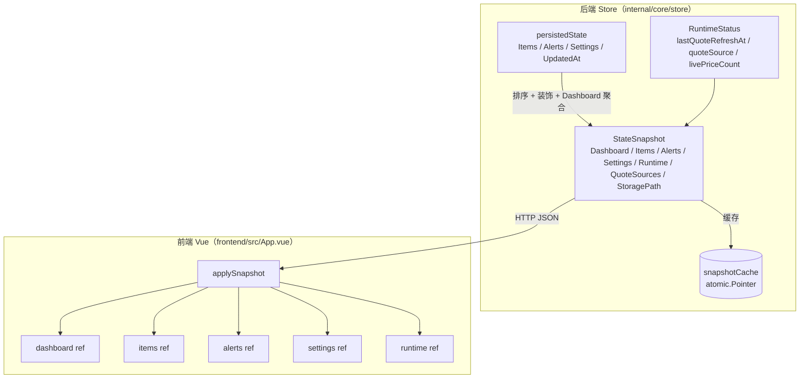
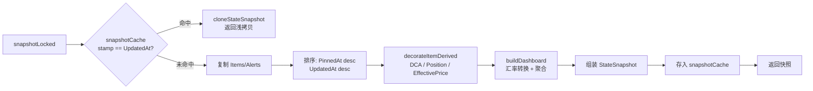
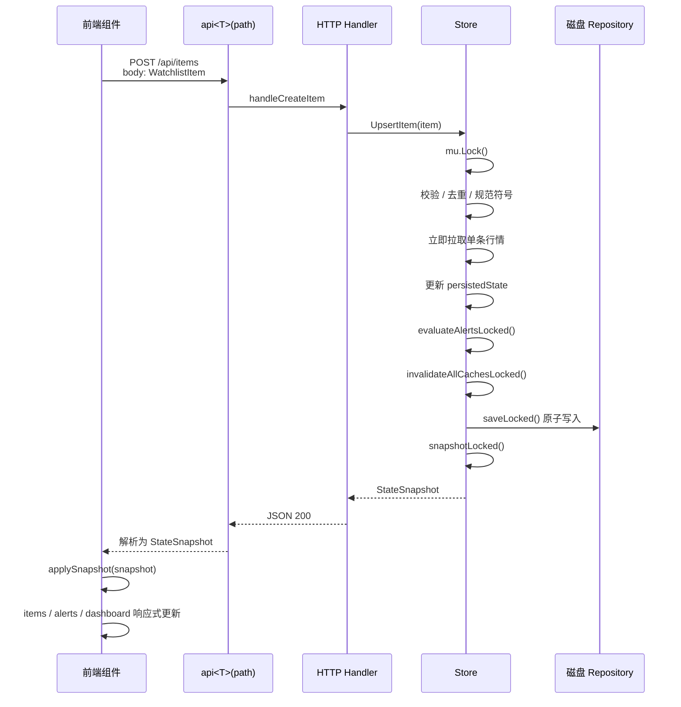

InvestGo 采用**服务端驱动快照（Server-Driven Snapshot）**作为前后端状态同步的核心范式。与典型的 REST API 中“操作成功后由前端自行决定如何更新本地状态”不同，本项目的每一次写操作——无论是新增跟踪标的、修改告警规则还是调整应用设置——后端都会在完成持久化后重新构建一份完整的 `StateSnapshot` 并返回给前端。前端通过单一的 `applySnapshot` 函数将水合到 Vue 响应式状态中。这种设计消除了前后端状态漂移的风险，使得前端可以始终将后端快照视为唯一事实来源。

Sources: [store.go](internal/core/store/store.go#L24-L48), [App.vue](frontend/src/App.vue#L271-L287)

## 状态分层模型：从持久化状态到消费快照

后端 Store 内部维护三层状态，它们之间存在清晰的单向依赖关系。

**第一层 `persistedState`** 是实际写入磁盘的数据结构，仅包含 `Items`、`Alerts`、`Settings` 和 `UpdatedAt`。它不包含任何运行时派生数据，也不参与排序或装饰。这层状态由 `sync.RWMutex` 保护，所有读写操作都必须先获取锁。

**第二层 `RuntimeStatus`** 记录瞬时的运行指标，包括上次行情刷新时间、活跃报价源摘要、实时价格计数、汇率错误等。这类数据无需持久化，但需要在每次快照构建时注入到输出中。

**第三层 `StateSnapshot`** 是面向前端消费的完整视图。它在 `snapshotLocked` 方法中按需构建：对 Items 和 Alerts 进行排序（置顶优先、时间倒序）、为每个 Item 附加派生字段（DCA 摘要、持仓汇总）、基于最新汇率和持仓数据计算 `DashboardSummary`。快照还包含报价源列表、存储路径和生成时间戳。

以下 Mermaid 图展示了这三层状态的关系以及从前端视角看到的数据边界：

Sources: [state.go](internal/core/store/state.go#L12-L17), [model.go](internal/core/model.go#L308-L318), [snapshot.go](internal/core/store/snapshot.go#L12-L75)

## 快照构建引擎：装饰、排序与缓存

`snapshotLocked` 是快照构建的核心方法。它首先检查 `snapshotCache`：如果当前 `state.UpdatedAt` 与缓存中的 stamp 一致，则直接返回缓存的浅拷贝，跳过所有排序和派生计算。这个优化对高频只读端点（如 `GET /api/state`）至关重要。

当缓存未命中时，方法执行以下步骤：复制 Items 和 Alerts 切片以避免修改内部持久化顺序；按置顶状态和时间戳排序；为每个 Item 调用 `decorateItemDerived` 计算 `DCASummary`、`PositionSummary` 和 `EffectivePrice`；调用 `buildDashboard` 基于最新汇率将所有持仓市值统一转换为展示货币后汇总总成本、总市值、盈亏和触发告警数量。最终构建的 `StateSnapshot` 被存入原子指针缓存，供后续请求复用。

Sources: [snapshot.go](internal/core/store/snapshot.go#L12-L75), [enrichment.go](internal/core/store/enrichment.go#L86-L91)

## HTTP 同步契约：写操作即状态

前后端的同步契约体现在路由层和 handler 层的统一模式：所有会改变持久化状态的端点，其成功响应都是一份完整的 `StateSnapshot`。这避免了前端在操作成功后需要再次发起“获取最新状态”的二次请求，也天然保证了原子性——后端事务完成后的快照就是前端应当看到的精确状态。

| 端点 | 方法 | Store 方法 | 返回类型 |
|---|---|---|---|
| `GET /api/state` | 只读 | `Snapshot()` | `StateSnapshot` |
| `POST /api/refresh` | 写（价格刷新） | `Refresh()` | `StateSnapshot` |
| `POST /api/items/{id}/refresh` | 写（单条刷新） | `RefreshItem()` | `StateSnapshot` |
| `POST /api/items` | 写（新增标的） | `UpsertItem()` | `StateSnapshot` |
| `PUT /api/items/{id}` | 写（更新标的） | `UpsertItem()` | `StateSnapshot` |
| `DELETE /api/items/{id}` | 写（删除标的） | `DeleteItem()` | `StateSnapshot` |
| `PUT /api/items/{id}/pin` | 写（置顶切换） | `SetItemPinned()` | `StateSnapshot` |
| `POST /api/alerts` | 写（新增告警） | `UpsertAlert()` | `StateSnapshot` |
| `PUT /api/alerts/{id}` | 写（更新告警） | `UpsertAlert()` | `StateSnapshot` |
| `DELETE /api/alerts/{id}` | 写（删除告警） | `DeleteAlert()` | `StateSnapshot` |
| `PUT /api/settings` | 写（更新设置） | `UpdateSettings()` | `StateSnapshot` |

`handleState` 作为唯一高频只读入口，直接调用 `Snapshot()` 获取快照；而所有 mutation handler（如 `handleCreateItem`、`handleUpdateSettings`）在调用对应的 Store 写方法后，都将返回的快照经过 `localizeSnapshot`（本地化时间格式与数值）后写入响应体。前端侧，`useItemDialog` 和 `useAlertDialog` 两个 composable 在保存成功后均调用由 `App.vue` 注入的 `applySnapshot` 回调，完成状态同步。

Sources: [http.go](internal/api/http.go#L61-L78), [handler.go](internal/api/handler.go#L55-L58), [handler.go](internal/api/handler.go#L193-L208), [useItemDialog.ts](frontend/src/composables/useItemDialog.ts#L51-L87), [useAlertDialog.ts](frontend/src/composables/useAlertDialog.ts#L29-L59)

## 前端状态水合：applySnapshot 的单一入口

前端在 `App.vue` 的根组件中维护了七组与 `StateSnapshot` 字段一一对应的响应式引用：`dashboard`、`items`、`alerts`、`settings`、`runtime`、`quoteSources`、`storagePath` 和 `generatedAt`。`applySnapshot` 是**唯一**被授权修改这些根状态的方法。它的职责不仅是简单赋值，还包含边界修复：当快照中的 Items 不再包含当前 `selectedItemId` 时，自动将选择重置为列表首项或空值，防止 UI 指向已删除的标的。

`loadState` 负责初始加载，它在 `onMounted` 生命周期中被调用，向 `GET /api/state` 请求初始快照。而所有用户触发的刷新操作（如点击刷新按钮、切换模块）则通过 `refreshQuotes` 或 `refreshSelectedItem` 发起 `POST /api/refresh` 或 `POST /api/items/{id}/refresh`，同样以 `applySnapshot` 结束。

Sources: [App.vue](frontend/src/App.vue#L256-L268), [App.vue](frontend/src/App.vue#L271-L287), [App.vue](frontend/src/App.vue#L290-L321), [mutation.go](internal/core/store/mutation.go#L20-L107)

## 多级缓存与精细失效策略

Store 内部实现了五层缓存，分别服务于不同的访问模式和数据特性。

| 缓存 | 类型 | 键类型 | 用途 | 失效时机 |
|---|---|---|---|---|
| `snapshotCache` | `atomic.Pointer[cachedSnapshot]` | 隐式（以 UpdatedAt 为 stamp） | 避免重复构建 StateSnapshot 的排序和装饰开销 | `invalidateAllCachesLocked` / `invalidatePriceCachesLocked` |
| `refreshCache` | `TTL[string, StateSnapshot]` | `"all"` | 批量行情刷新结果，防止短时间内重复请求上游 | `invalidateAllCachesLocked` / `invalidatePriceCachesLocked` |
| `itemRefreshCache` | `TTL[string, StateSnapshot]` | `itemID` | 单条行情刷新结果 | `invalidateAllCachesLocked` / `invalidatePriceCachesLocked` |
| `historyCache` | `TTL[string, HistorySeries]` | `itemID + "\|" + interval` | 历史 OHLCV 数据，按 interval 设定不同 TTL（5分钟到4小时） | `invalidateAllCachesLocked` |
| `overviewCache` | `TTL[string, cachedOverviewValue]` | `"all"` | 组合概览分析（持仓分布、趋势），附带 `stateStamp` 防并发竞争 | `invalidateAllCachesLocked` / `invalidatePriceCachesLocked` |

缓存失效有两个粒度。**`invalidateAllCachesLocked`** 在结构变更后调用：Item 的增删改、Alert 的增删改、Settings 的变更都会触发。这是因为这些操作会改变 Dashboard 的聚合基础、持仓分布的标的集合以及告警规则本身。**`invalidatePriceCachesLocked`** 仅在行情刷新后调用：它清除 `refreshCache`、`itemRefreshCache`、`overviewCache` 和 `snapshotCache`，但**保留** `historyCache`。原因是历史 K 线数据不受当前价格 tick 影响，而 overview 中的持仓权重和当前市值却需要实时反映最新价格。

`overviewCache` 额外使用 `holdingsUpdatedAt` 作为 `stateStamp`。由于 `OverviewAnalytics` 的构建可能在释放读锁后、获取概览结果前发生并发结构变更，`stateStamp` 保证了缓存写入时若检测到 stamp 不匹配即可安全丢弃旧值，下一次请求将自然触发重建。

Sources: [store.go](internal/core/store/store.go#L38-L47), [cache.go](internal/core/store/cache.go#L68-L90), [runtime.go](internal/core/store/runtime.go#L243-L293)

## 自动刷新与按需刷新策略

前端并不被动等待用户操作来同步状态，而是通过多维度触发器保持数据新鲜。

**定时自动刷新** 由 `scheduleAutoRefresh` 管理，刷新间隔直接复用用户设置的 `hotCacheTTLSeconds`（默认 60 秒，最低 10 秒）。`runAutoRefresh` 在每次触发前检查 `autoRefreshInFlight` 标志，防止重叠请求。不同活跃模块采用不同刷新策略：当用户位于 watchlist 模块时，仅刷新当前选中的单条标的，避免向行情上游发送完整的关注列表；当位于 overview 或 hot 模块时，则执行批量刷新。

**模块切换触发刷新** 通过 `watch(activeModule)` 实现。进入 watchlist 时调用 `refreshSelectedItem`，进入 overview 时调用 `refreshQuotes`。这种按需策略使得用户在不同视图之间导航时，总能看到与该视图语义匹配的最新数据，而不必在后台无差别地刷新全部标的。

**行情刷新与历史图表的联动** 也值得注意。`refreshQuotes` 和 `refreshSelectedItem` 在成功应用快照后，如果当前正处于 watchlist 模块且选中了标的，会额外调用 `loadHistory(true, true)` 刷新历史走势图。这是因为行情刷新会更新 `MarketSnapshot` 中的 `livePrice`、`positionValue` 等字段，图表的 overlay 层需要与最新报价对齐。

Sources: [App.vue](frontend/src/App.vue#L222-L253), [App.vue](frontend/src/App.vue#L128-L148), [App.vue](frontend/src/App.vue#L290-L321)

## 设计权衡与边界

InvestGo 的快照同步机制在架构上做出了几项显式取舍。

**选择服务端驱动而非乐观更新**：前端在提交写请求后始终等待后端返回新快照再更新 UI。这会带来轻微的交互延迟，但彻底消除了“前端假设成功而后端实际失败”导致的状态不一致。对于金融类桌面应用，数据正确性优先于交互即时性。

**选择 HTTP 轮询而非 WebSocket**：Wails v3 环境下虽然具备建立双向通道的能力，但项目采用基于 `hotCacheTTLSeconds` 的可配置轮询策略。这降低了运行时复杂度，使缓存层（TTL cache）和 HTTP handler 的语义保持一致，同时让用户能够通过设置控制数据新鲜度与上游请求频率之间的平衡。

**快照包含完整列表而非增量差异**：每次 mutation 返回的都是完整的 Items 和 Alerts 列表，而非 JSON Patch 或事件流。对于 InvestGo 面向的个人投资组合场景（标的数量通常在数十条量级），完整快照的序列化和传输开销远低于增量同步带来的协议复杂度。同时，`snapshotCache` 和 `refreshCache` 的存在确保了高频只读路径不会重复支付排序和装饰的计算成本。