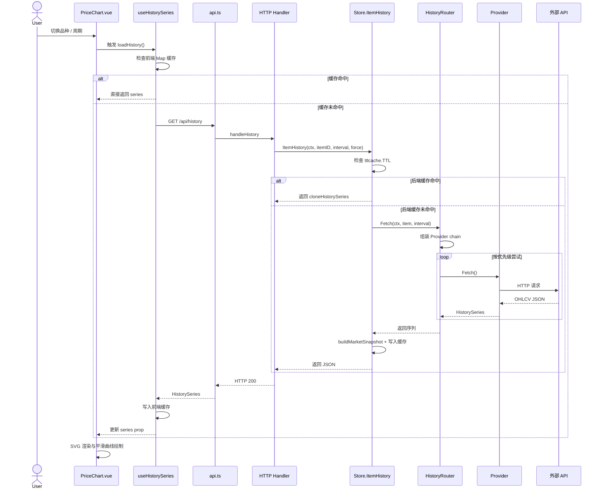

历史走势图（Price Chart）是 InvestGo 中最复杂的端到端数据链路之一：它不仅需要跨越前后端三层缓存，还要在多个行情 Provider 之间进行智能路由，并在用户快速切换品种或周期时保证交互的流畅性。本文将系统拆解从用户点击到 SVG 渲染的完整数据流，重点阐述各层缓存的 TTL 策略、Provider 优先级链的构造规则，以及请求竞态与失效边界的处理机制。

Sources: [useHistorySeries.ts](frontend/src/composables/useHistorySeries.ts#L1-L165), [history_router.go](internal/core/marketdata/history_router.go#L1-L161), [runtime.go](internal/core/store/runtime.go#L203-L241)

## 端到端数据流全景

当用户在自选列表中选中某个品种并切换时间周期（如从“1日”切到“1周”），整个数据链路按以下顺序执行：

1. **前端 Composable** 检测到 `selectedItem` 或 `historyInterval` 变化，调用 `loadHistory()`；
2. **前端内存缓存** 先检查是否已有未过期的 `HistorySeries`，命中则直接返回；
3. 未命中时通过 `/api/history?itemId=xxx&interval=1w` 发起 HTTP 请求，携带 `AbortController` 以便后续取消；
4. **后端 Handler** 将请求委托给 `Store.ItemHistory()`；
5. **Store 层缓存**（`ttlcache.TTL`）再次检查后端是否已有未过期的序列数据；
6. 仍未命中则进入 **HistoryRouter**，根据品种所属市场与用户设置组装 Provider 优先级链；
7. 按链顺序调用具体 Provider（如 EastMoney、Yahoo Finance），直到某个 Provider 成功返回 OHLCV 数据；
8. Store 对原始数据附加 `MarketSnapshot`（持仓盈亏等衍生指标），写入后端缓存后返回 JSON；
9. 前端收到数据后更新 `historySeries` 并写入前端缓存，`PriceChart.vue` 根据 `points` 数组生成 SVG 路径。



Sources: [useHistorySeries.ts](frontend/src/composables/useHistorySeries.ts#L35-L118), [handler.go](internal/api/handler.go#L134-L149), [runtime.go](internal/core/store/runtime.go#L206-L241), [history_router.go](internal/core/marketdata/history_router.go#L60-L80)

## 前端状态管理与内存缓存

前端的历史数据状态集中在 `useHistorySeries` 这一个 Composable 中管理。它对外暴露 `historyInterval`、`historySeries`、`historyLoading`、`historyError` 四个响应式状态，以及 `loadHistory`、`selectHistoryInterval`、`clearHistoryCache` 三个操作接口。该设计遵循“单一数据源”原则：所有与历史走势相关的异步副作用都被封装在同一闭包内，避免组件层级间的不一致。

**请求竞态消除**是前端最核心的健壮性保障。`useHistorySeries` 内部维护一个 `inflightController` 引用，每次调用 `loadHistory()` 时都会为本次请求新建一个 `AbortController`。如果用户在请求尚未返回时再次切换品种或周期，旧请求会被显式 `abort()`，并在 `catch` 块中通过 `ApiAbortError` 类型静默吞掉错误。更关键的是，即使旧请求在网络层晚于新请求返回，第 82 行的控制器身份校验也会丢弃过期结果：

```typescript
if (inflightController !== controller) {
    return;
}
```

**前端缓存**采用基于 `Map` 的内存存储，键格式为 `${item.id}:${historyInterval.value}`（如 `item-1:1d`），最大容量限制为 60 条（约等于 10 个品种 × 6 个周期）。当容量超限时会删除最早插入的键（FIFO 驱逐）。每条缓存记录携带 `expiresAt` 时间戳，命中时前端会强制把 `cached` 字段覆写为 `true`，这样无论后端原始响应是否来自缓存，用户界面都能正确显示“已缓存”标签。另外，当用户执行增删改操作后，`clearHistoryCache()` 会一次性清空整个 Map，防止旧品种 ID 或旧 Symbol 映射残留。

Sources: [useHistorySeries.ts](frontend/src/composables/useHistorySeries.ts#L16-L127), [api.ts](frontend/src/api.ts#L15-L86)

## 后端路由与 Provider 选择

后端的历史数据路由由 `HistoryRouter` 负责，它的职责是将单个品种的请求映射到最合适的外部数据源。与实时行情路由不同，`HistoryRouter` 必须处理一个特殊约束：**部分 Quote Provider 并不提供 K 线接口**（例如新浪、雪球只有实时报价，没有历史走势 API）。因此 `HistoryRouter` 在构造 Provider 链时会自动跳过这些“报价专用”来源。

路由决策分为两步：

1. **首选来源识别**：读取用户在该市场下的报价源设置（如 `USQuoteSource = "polygon"`），如果该来源在 `providers` 映射中存在（即具备历史能力），则将其置于链首；
2. **默认兜底链**：若首选来源不具备历史能力，或用户未做特殊设置，则使用 `defaultHistoryChain` 返回的市场默认顺序。

| 市场分组 | 默认 Provider 优先级链 |
|---------|----------------------|
| US (美股/ETF) | yahoo → finnhub → polygon → alpha-vantage → twelve-data → eastmoney |
| CN/HK (A股/港股/ETF) | yahoo → eastmoney |

`Registry` 在应用启动时统一注册所有数据源，并通过 `HasHistory()` 方法区分能力。目前具备历史数据能力的来源包括：EastMoney、Yahoo Finance、Tencent Finance、Alpha Vantage、Twelve Data、Finnhub、Polygon。`HistoryRouter` 的 `Fetch` 方法会按链顺序逐个尝试，只要有一个 Provider 成功即立即返回；若全部失败，则聚合每个 Provider 的错误信息返回诊断级错误。

Sources: [history_router.go](internal/core/marketdata/history_router.go#L12-L49), [registry.go](internal/core/marketdata/registry.go#L14-L48), [history_router.go](internal/core/marketdata/history_router.go#L92-L147)

## 后端 Store 缓存与 TTL 策略

`Store` 在 `historyCache` 字段中维护一个线程安全的 TTL 缓存，类型为 `ttlcache.TTL[string, core.HistorySeries]`，最大条目数设为 512。该缓存的键格式为 `itemID|interval`（如 `item-1|1d`），与前端缓存的键策略不同，这保证了后端可以在不暴露 Symbol 或市场信息的情况下完成查找。

**分层 TTL 策略**是该系统的关键设计。由于历史 OHLCV 数据的“新鲜度”远低于实时报价，Store 没有复用 `HotCacheTTLSeconds` 这个通用设置，而是为不同周期硬编码了差异化的 TTL：

| 时间周期 | TTL | 设计 rationale |
|---------|-----|---------------|
| 1h | 5 分钟 | 日内数据变化较快，需相对频繁刷新 |
| 1d | 10 分钟 | 日线数据在交易时段内变化中等 |
| 1w / 1mo | 30 分钟 | 周线/月线由日线聚合，变化更慢 |
| 1y / 3y / all | 4 小时 | 长期历史数据几乎不会回溯修正 |

`ttlcache.TTL` 的实现采用读写锁保护：读路径（`Get`）先加 `RLock` 检查过期时间，若已过期则升级为 `Lock` 删除条目；写路径（`Set`）在容量达到 `maxSize` 时按 FIFO 驱逐最老的键。每次从缓存读出后，`cloneHistorySeries()` 会对 `Points` 切片和嵌套的 `Snapshot` 做深拷贝，防止调用方修改污染缓存内的共享数据。

**缓存失效边界**也值得注意。`invalidateAllCachesLocked()` 会在品种增删改或设置变更时清空全部缓存（包括 `historyCache`）；但 `invalidatePriceCachesLocked()`（在普通行情刷新后调用）**刻意保留** `historyCache`，因为价格 tick 不会影响已经收盘的 OHLCV 数据。这一区分显著降低了高频刷新场景下的网络开销。

Sources: [store.go](internal/core/store/store.go#L24-L48), [cache.go](internal/core/store/cache.go#L52-L90), [ttl.go](internal/common/cache/ttl.go#L13-L76)

## Provider 实现与数据标准化

所有历史数据来源都实现了统一的 `core.HistoryProvider` 接口：

```go
type HistoryProvider interface {
    Fetch(ctx context.Context, item WatchlistItem, interval HistoryInterval) (HistorySeries, error)
    Name() string
}
```

`HistoryInterval` 定义了七种标准化周期：`1h`、`1d`、`1w`、`1mo`、`1y`、`3y`、`all`。每个 Provider 需要自行将这一语义周期映射为外部 API 的具体参数。以 EastMoney 和 Yahoo Finance 为例：

| 周期 | EastMoney `klt` | EastMoney 日期窗口 | Yahoo `range` | Yahoo `interval` |
|-----|----------------|-------------------|---------------|------------------|
| 1h | 60 (60分钟) | 前5日 | 1d | 1m |
| 1d | 60 (60分钟) | 前5日 | 1d | 1m |
| 1w | 101 (日线) | 前14日 | 5d | 5m |
| 1mo | 101 (日线) | 前2月 | 1mo | 1d |
| 1y | 101 (日线) | 前13月 | 1y | 1d |
| 3y | 102 (周线) | 前37月 | 5y | 1wk |
| all | 103 (月线) | 全量 | max | 1mo |

Provider 返回原始数据后，通常需要经过两步标准化处理：

1. **TrimHistoryPoints**：按目标周期的时间窗口裁剪多余数据。例如 Yahoo 请求 `1d` 范围时返回的是完整交易日数据，但 `1h` 语义只需要最近 1 小时，因此需要裁剪。
2. **ApplyHistorySummary**：遍历 `Points` 计算整个序列的 `StartPrice`、`EndPrice`、`High`、`Low`、`Change`、`ChangePercent`，使前端无需二次计算即可直接展示周期统计。

在 `Store.ItemHistory` 中，还有一个额外的 enrich 步骤：`buildMarketSnapshot()` 会结合该品种的当前价格、持仓数量与成本价，生成 `MarketSnapshot` 对象并附加到 `HistorySeries` 中。这意味着同一只股票的 `1d` 和 `1y` 走势序列会拥有不同的 `PositionPnL` 等持仓衍生指标，因为它们对应的 `StartPrice`（周期起点收盘价）不同。

Sources: [model.go](internal/core/model.go#L370-L387), [helpers.go](internal/core/provider/helpers.go#L205-L298), [eastmoney.go](internal/core/provider/eastmoney.go#L595-L618), [yahoo.go](internal/core/provider/yahoo.go#L396-L416), [runtime.go](internal/core/store/runtime.go#L230-L240)

## 图表渲染与交互

前端渲染层 `PriceChart.vue` 是一个纯 SVG 实现的走势图表，不依赖任何第三方图表库。它接收 `series`、`loading`、`error` 三个 Props，内部通过计算属性将 `HistoryPoint[]` 投影为 SVG 坐标系。

**几何投影**的核心逻辑位于 `enrichedPoints` 计算属性：先找出整个序列的最低 `low` 与最高 `high` 作为 Y 轴范围，再将每个点的 `close` 映射为 SVG 的 `y` 坐标。X 轴则按数据点索引均匀分布。为了避免数据量较小时折线出现尖锐折角，组件使用二次贝塞尔曲线（Quadratic Bezier）进行平滑：除首尾点外，每个中间控制点都会与其后一个点的中点构成曲线终点。

**交互细节**方面，图表在 SVG 顶层覆盖了一个透明的 `rect` 作为命中区。鼠标移动时，组件根据鼠标 X 坐标与所有数据点投影后的 `x` 坐标做最近邻搜索，而不是依赖固定步长。这种方式在窗口大小变化或数据量不同时也能保持精准的十字准星定位。Tooltip 的内容包括该点的 `timestamp`、`open`、`close`、`high`、`low`，其中时间格式会根据 `series.interval` 自动切换为“仅日期”或“日期+时分”。

**响应式适配**通过 `ResizeObserver` 实现。当容器尺寸变化时，组件读取 `contentRect` 并借助 `requestAnimationFrame` 延迟写入响应式 `width` / `height`，避免在同帧内触发观测回调循环。

Sources: [PriceChart.vue](frontend/src/components/PriceChart.vue#L1-L507)

## 缓存失效与边界情况

历史走势数据链路涉及三个缓存层级（前端 Map → 后端 TTL → 无 Provider 缓存），因此失效策略需要分层设计：

| 场景 | 前端缓存 | 后端 `historyCache` | 触发位置 |
|-----|---------|-------------------|---------|
| 切换品种 / 周期 | 按 key 命中或缺失 | 按 key 命中或缺失 | `useHistorySeries.loadHistory` / `Store.ItemHistory` |
| 用户点击“强制刷新” | 跳过缓存 (`forceRefresh=true`) | 跳过缓存 (`force=true`) | 前端传入 `force=1` Query Param |
| 品种增删改 | `clearHistoryCache()` 全量清空 | `invalidateAllCachesLocked()` 清空 | `Store` 突变方法 |
| 定时行情刷新 | 保留 | **保留**（`invalidatePriceCachesLocked` 不清理） | `Store.Refresh` |
| 应用重启 | 丢失（内存） | 丢失（内存） | — |

**静默刷新（Silent Refresh）**是另一个重要的边界处理。当用户已经看过某图表并切走，再次切回时，`useHistorySeries` 会执行一次 `silent=true` 的刷新。此时如果请求失败，组件会**保留旧图表**而非清空，因为第 106 行的 `keepCurrentSeries` 保护逻辑会在出错时直接 `return`，避免闪白。如果请求成功，则在后台平滑替换数据。

**请求取消与竞态**在前后端都有体现。前端通过 `AbortController` 取消 HTTP 请求；后端 `HistoryRouter` 的 `Fetch` 方法接收 `context.Context`，当用户快速切换导致前端取消请求时，Go 的 HTTP Client 同样会收到取消信号，从而避免浪费 Provider 调用。

Sources: [useHistorySeries.ts](frontend/src/composables/useHistorySeries.ts#L35-L117), [cache.go](internal/core/store/cache.go#L68-L90), [runtime.go](internal/core/store/runtime.go#L206-L241)

## 小结与延伸阅读

历史走势图的数据链路体现了 InvestGo 在“多源聚合”与“缓存效率”之间的精密权衡：前端通过 `AbortController` 和内存 Map 保证交互响应，后端通过 `HistoryRouter` 的优先级链实现无感降级，而 `ttlcache.TTL` 的分周期 TTL 策略则让长期历史数据几乎零成本复用。如果你对更底层的 Provider 实现细节感兴趣，可以继续阅读：

- 若要了解 EastMoney 与 Yahoo Finance 的 K 线 API 差异与符号解析规则，请参阅 [东方财富与新浪行情 Provider](25-dong-fang-cai-fu-yu-xin-lang-xing-qing-provider) 与 [Yahoo Finance 与腾讯财经 Provider](26-yahoo-finance-yu-teng-xun-cai-jing-provider)。
- 若要了解实时行情刷新如何触发状态同步但又不污染历史缓存，请参阅 [行情刷新与自动刷新流程](23-xing-qing-shua-xin-yu-zi-dong-shua-xin-liu-cheng)。
- 若要了解通用 TTL 缓存的实现原理及与其他缓存层的对比，请参阅 [缓存策略与失效机制](12-huan-cun-ce-lue-yu-shi-xiao-ji-zhi)。