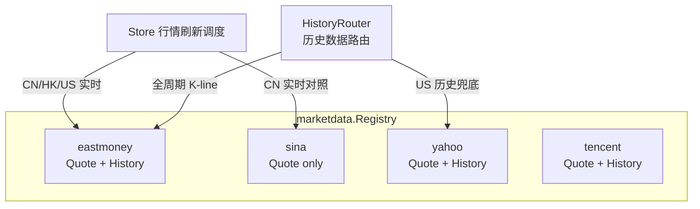
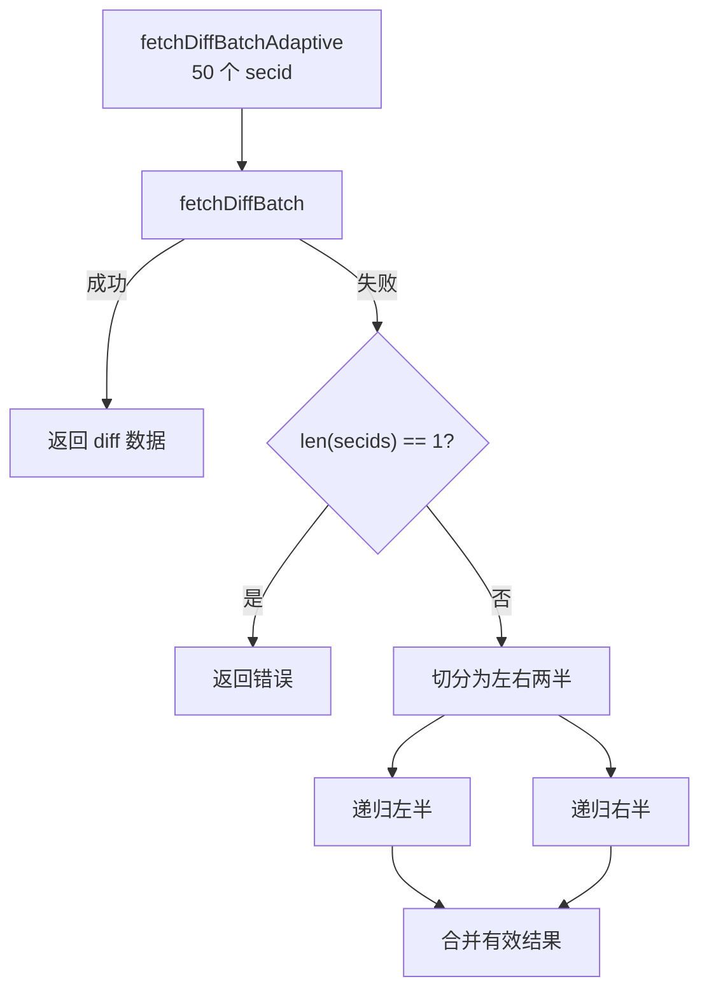
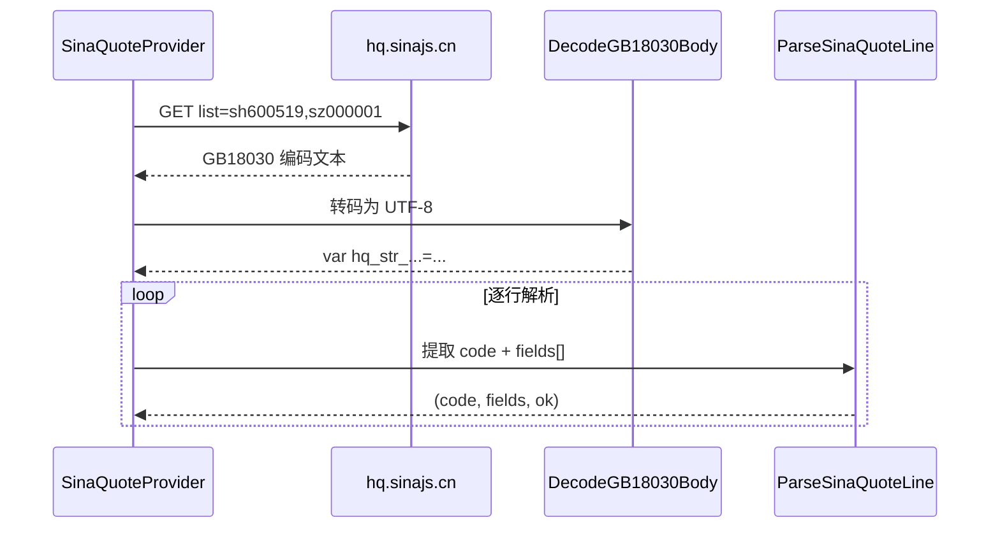

东方财富（EastMoney）与新浪财经（Sina Finance）是 investgo 内置的两组免费中文行情数据源，分别承担「统一历史数据主干」与「轻量实时行情对照」的角色。二者均覆盖 A 股、港股与美股，但在协议格式、批量策略、错误降级与数据标准化路径上存在本质差异。本文从源码层面拆解 `EastMoneyQuoteProvider`、`EastMoneyChartProvider` 与 `SinaQuoteProvider` 的实现机理，帮助高级开发者在调试、扩展或替换 Provider 时建立精确的心智模型。

## 架构定位与职责边界

在系统的 [行情数据 Provider 注册与路由机制](7-xing-qing-shu-ju-provider-zhu-ce-yu-lu-you-ji-zhi) 中，所有 Provider 通过 `marketdata.Registry` 统一注册为 `DataSource`。东方财富同时挂载了 `QuoteProvider` 与 `HistoryProvider`，是全局唯一同时覆盖实时与历史数据的免费源；新浪仅挂载 `QuoteProvider`，历史数据由其 Provider 链中的下游节点承接。

上图展示了二者在数据链路中的分工。`Store` 根据用户设置的 `CNQuoteSource`、`HKQuoteSource`、`USQuoteSource` 选择实时 Provider；`HistoryRouter` 则优先将历史请求路由至东方财富，失败时才回退到其他源。

Sources: [registry.go](internal/core/marketdata/registry.go#L185-L203) [registry.go](internal/core/marketdata/registry.go#L218-L229)

## 东方财富实时行情 Provider

`EastMoneyQuoteProvider` 是系统中逻辑最复杂的免费实时行情实现。它并非调用单一端点，而是根据目标市场自动在「批量 diff 接口」与「单股详情接口」之间切换，并内置了多层降级机制。

### 批量 diff 接口与 secid 映射

东方财富实时批量接口为 `push2.eastmoney.com/api/qt/ulist.np/get`，请求参数通过 `secids` 批量传入。由于东方财富内部使用 `market.code` 的 secid 体系，Provider 需要先将标准化的 `QuoteTarget` 转换为对应 secid。`ResolveAllEastMoneySecIDs` 函数实现了这一映射：A 股上海市场前缀为 `1.`、深圳为 `0.`、港股为 `116.`；美股则因为同一代码可能在 NASDAQ、NYSE 或 NYSE Arca 上市，会一次性返回 `105.`、`106.`、`107.` 三个候选 secid，由调用方逐个尝试。

批量请求按 `eastMoneyBatchSize = 50` 进行分片，同时 `ChunkSecIDs` 还会监控编码后查询字符串长度，避免 URL 超限。这种双重分片策略在持有大量 A 股或港股的自选股场景中尤为重要。

Sources: [eastmoney.go](internal/core/provider/eastmoney.go#L67-L119) [eastmoney.go](internal/core/provider/eastmoney.go#L401-L438) [helpers.go](internal/core/provider/helpers.go#L314-L345)

### 自适应二分批处理

东方财富服务器在批量请求中若包含无效或已下市的 secid，可能直接拒绝整批请求。为了隔离坏数据点，`fetchDiffBatchAdaptive` 实现了递归二分降级：当一批 secid 请求失败时，将其对半切分，分别重试；若某一半仍然失败，则继续二分，直到定位到最小失败单元或成功获取其余有效数据。

这种设计使得用户在自选股中混有停牌或退市代码时，不会因为个别坏数据导致全部行情缺失。

Sources: [eastmoney.go](internal/core/provider/eastmoney.go#L309-L347)

### 美股特殊处理：单股接口与 Yahoo 兜底

东方财富的批量 diff 接口对美股支持不稳定，因此 `Fetch` 方法将 `US-STOCK` 与 `US-ETF` 从批量流程中排除，改为走 `fetchUSQuote` 单股接口（`api/qt/stock/get`）。该接口同样使用 secid 查询，会依次尝试 NASDAQ、NYSE、NYSE Arca 三个交易所变体，直到获得非零返回。

若单股接口也全部失败，则东方财富会将这些美股项目标记为缺失，并在方法末尾通过 `NewYahooQuoteProvider(p.client).Fetch` 发起 Yahoo Finance 兜底请求。这意味着即使用户将东方财富设为美股行情源，底层仍隐式依赖 Yahoo Finance 的可用性，开发者在做网络隔离测试时需特别注意这一隐式耦合。

Sources: [eastmoney.go](internal/core/provider/eastmoney.go#L84-L229)

### 数据标准化：EmFloat 与价格缩放

东方财富的 JSON 响应中，数值字段在数据缺失时可能返回字符串 `"-"` 而非数字。为此系统定义了自定义类型 `EmFloat`，其 `UnmarshalJSON` 方法在遇到解析失败时静默回退为 `0`，避免整批反序列化崩溃。此外，东方财富的价格字段（如 `f43` 当前价、`f60` 昨收）实际存储的是「元 × 1000」的整数形式，涨跌幅字段（如 `f170`）存储的是「百分比 × 100」的整数形式，因此需要通过 `scaleEastMoneyPrice` 与 `scaleEastMoneyPercent` 进行还原。

Sources: [helpers.go](internal/core/provider/helpers.go#L177-L188) [eastmoney.go](internal/core/provider/eastmoney.go#L37-L48) [eastmoney.go](internal/core/provider/eastmoney.go#L301-L307)

## 东方财富历史 K-line Provider

`EastMoneyChartProvider` 是 investgo 的**默认且唯一免费历史数据主干**，通过 `push2his.eastmoney.com/api/qt/stock/kline/get` 获取 K-line 数据，支持从 1 小时到全部历史共七种周期。

### 周期映射与请求参数

`eastMoneyHistorySpecFor` 函数将前端传入的 `HistoryInterval` 映射为东方财富专有的 `klt` 参数与日期窗口。`klt` 的语义为：`60` 表示 60 分钟线，`101` 表示日线，`102` 表示周线，`103` 表示月线。对于分钟级请求（1h、1d），接口返回的是近 5 个交易日的 60 分钟数据，Provider 会在解析后通过 `TrimHistoryPoints` 按 `trimWindow` 截断到用户所需时间窗口，而非依赖接口精确返回。

| 前端周期 | klt | beg 策略 | lmt | intraday | trimWindow |
|---------|-----|---------|-----|----------|------------|
| 1h | 60 | 近 5 日 | 50 | true | 1h |
| 1d | 60 | 近 5 日 | 50 | true | 24h |
| 1w | 101 | 近 14 日 | 10 | false | — |
| 1mo | 101 | 近 2 月 | 35 | false | — |
| 1y | 101 | 近 13 月 | 270 | false | — |
| 3y | 102 | 近 37 月 | 160 | false | — |
| all | 103 | 最早 | 999 | false | — |

Sources: [eastmoney.go](internal/core/provider/eastmoney.go#L595-L618)

### K-line 解析与后处理

东方财富返回的 K-line 数据为字符串数组，每条记录格式为 `日期,开盘,收盘,最高,最低,成交量,成交额`。`parseEastMoneyKlines` 按逗号分割后映射到 `core.HistoryPoint`，并统一使用中国时区 `chinaLocation` 解析时间戳。解析完成后，`ApplyHistorySummary` 会遍历全序列计算起止价格、区间高低点以及总涨跌幅，这些汇总字段最终随 `HistorySeries` 返回给前端用于走势图头部摘要展示。

Sources: [eastmoney.go](internal/core/provider/eastmoney.go#L620-L675) [helpers.go](internal/core/provider/helpers.go#L205-L229)

## 新浪行情 Provider

`SinaQuoteProvider` 代表了一种更传统、更轻量的行情抓取范式。它直接请求 `hq.sinajs.cn/list=`，服务端返回纯文本 JavaScript 变量赋值语句，而非结构化 JSON。

### 纯文本 JavaScript 响应格式

新浪接口的返回体形似 `var hq_str_sh600519="贵州茅台,1760.00,...";`，每行对应一个代码。`ParseSinaQuoteLine` 负责从这种格式中提取变量名（即代码标识）与字段数组。由于响应体采用 GB18030/GBK 编码，`FetchTextWithHeaders` 会调用 `DecodeGB18030Body` 进行转码，并去除可能存在的 BOM 头。

Sources: [sina.go](internal/core/provider/sina.go#L123-L139) [helpers.go](internal/core/provider/helpers.go#L122-L162)

### 代码映射规则

`ResolveSinaQuoteCode` 将内部标准化的 `QuoteTarget.Key` 转换为新浪接口所需的代码格式。规则如下：上海股票加 `sh` 前缀，深圳加 `sz`，北交所加 `bj`，港股加 `rt_hk`，美股则加 `gb_` 并将代码转为小写（如 `AAPL` 变为 `gb_aapl`）。与东方财富不同，新浪的美股代码**不区分交易所**，因此不存在多交易所尝试逻辑，但也意味着若新浪内部映射错误，将无降级路径。

Sources: [sina.go](internal/core/provider/sina.go#L106-L121)

### 多市场字段解析差异

同一份 `BuildSinaQuote` 函数需要根据代码前缀识别市场，并按不同字段索引提取数据，因为新浪各市场的字段顺序并不一致。

- **A 股（sh/sz/bj）**：字段 0 为名称，1 为开盘，2 为昨收，3 为最新价，4 为最高，5 为最低；成交量在字段 8。
- **港股（rt_hk）**：字段 1 为名称，2 为开盘，3 为昨收，4 为最高，5 为最低，6 为最新价；成交量在字段 12；字段 17+18 组合成更新时间戳。
- **美股（gb_）**：字段 0 为名称，1 为最新价，2 为涨跌幅百分比，4 为涨跌额（字段 3 为日期时间字符串），5 为开盘，6 为最高，7 为最低；成交量在字段 10，市值在字段 12。

这种字段硬编码是新浪 Provider 的核心维护点：一旦服务端调整字段顺序，必须同步修改 `BuildSinaQuote` 中的索引常量。

Sources: [sina.go](internal/core/provider/sina.go#L141-L205)

### 批量分片与编码处理

新浪批量请求同样受 URL 长度限制，`sinaBatchSize = 50` 将代码列表切分为多批顺序执行。请求头中必须携带 `Referer: https://finance.sina.com.cn/` 与模拟浏览器的 `User-Agent`，否则服务端可能直接拒绝连接。每批失败时，错误被收集到 `problems` 切片中，继续处理下一批，而非中断整个流程，这保证了部分可用性。

Sources: [sina.go](internal/core/provider/sina.go#L15-L104)

## 两 Provider 核心差异对比

| 维度 | 东方财富 EastMoney | 新浪 Sina |
|------|-------------------|-----------|
| **协议格式** | JSON（`application/json`） | 纯文本 JavaScript（`var hq_str_...`） |
| **字符编码** | UTF-8 | GB18030/GBK，需显式转码 |
| **批量上限** | 50 个 secid，同时限制编码后 URL 长度 | 50 个代码，限制 URL 长度 |
| **A 股映射** | secid：`1.`(SH) / `0.`(SZ) | 前缀：`sh` / `sz` / `bj` |
| **港股映射** | secid：`116.` | 前缀：`rt_hk` |
| **美股映射** | 多交易所尝试：105/106/107 | 前缀：`gb_` + 小写，不区分交易所 |
| **批量失败策略** | 自适应二分降级，隔离坏数据 | 逐批容错，错误收集后继续 |
| **美股降级** | 单股接口失败 → Yahoo Finance 兜底 | 无内置降级 |
| **历史数据** | 完整 K-line API（系统默认历史源） | 无历史 API |
| **价格精度** | 整数存储（×1000），需除以 1000 | 直接返回浮点字符串 |
| **缺失值处理** | 自定义 `EmFloat` 类型兼容 `"-"` | `ParseFloat` 安全解析空串与 `-` |
| **请求头** | 完整浏览器指纹（UA/Accept/Referer） | Referer + UA 即可 |

Sources: [eastmoney.go](internal/core/provider/eastmoney.go) [sina.go](internal/core/provider/sina.go) [helpers.go](internal/core/provider/helpers.go)

## 错误处理与降级策略

东方财富的错误处理呈现出「分层防御」的特征：第一层是 `fetchDiffBatchAdaptive` 的批内二分隔离；第二层是美股单股接口的多交易所轮询；第三层是 `Fetch` 方法末尾对缺失美股项目的 Yahoo Finance 兜底。三层降级的副作用是错误信息可能延迟到方法尾部才汇聚，调试时需要查看 `problems` 切片的完整内容。

新浪则采用更简单的「逐批容错」模型：每一批请求独立成败，失败的批次仅追加错误字符串，不影响其他批次。由于没有历史 API 与美股降级路径，新浪 Provider 的失败模式更透明，但也更依赖单点可用性。

在 [行情刷新与自动刷新流程](23-xing-qing-shua-xin-yu-zi-dong-shua-xin-liu-cheng) 中，`Store` 会将 Provider 返回的 `error`（由 `errs.JoinProblems` 拼接）写入 `RuntimeStatus.LastQuoteError`，开发者可通过前端状态面板或日志追踪具体是哪一层降级触发了异常。

Sources: [eastmoney.go](internal/core/provider/eastmoney.go#L84-L229) [sina.go](internal/core/provider/sina.go#L34-L104) [helpers.go](internal/core/provider/helpers.go#L20-L58)

## 相关阅读

- 若需理解 Provider 如何被注册到系统并在运行时切换，请参阅 [行情数据 Provider 注册与路由机制](7-xing-qing-shu-ju-provider-zhu-ce-yu-lu-you-ji-zhi)。
- 若需了解 `QuoteTarget` 的符号规范化逻辑（本文中 `ResolveQuoteTarget` 与 `ResolveAllEastMoneySecIDs` 的输入来源），请参阅 [行情符号规范化与市场解析](8-xing-qing-fu-hao-gui-fan-hua-yu-shi-chang-jie-xi)。
- 若需对比 Yahoo Finance、腾讯财经等替代 Provider 的实现，请参阅 [Yahoo Finance 与腾讯财经 Provider](26-yahoo-finance-yu-teng-xun-cai-jing-provider)。
- 若需查看历史数据在 Store 中的缓存与路由逻辑，请参阅 [历史走势图数据加载与缓存](24-li-shi-zou-shi-tu-shu-ju-jia-zai-yu-huan-cun)。