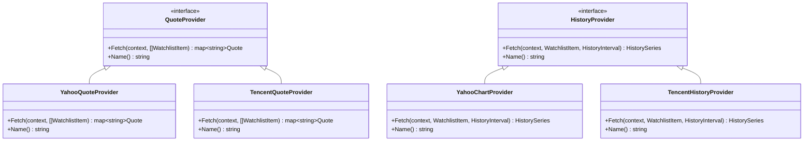
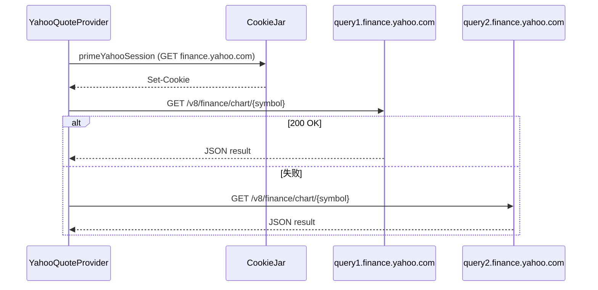
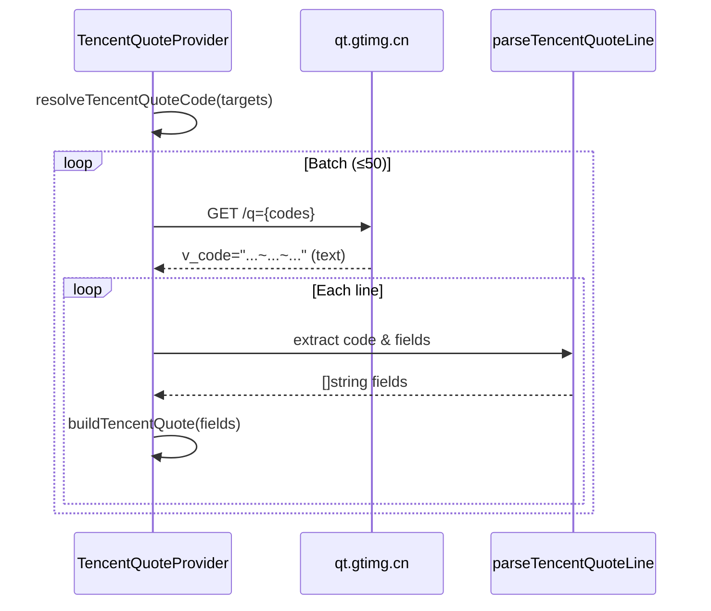

**Yahoo Finance** 与 **腾讯财经**（Tencent Finance）是 investgo 中两个同时覆盖中国 A 股、港股与美股的全能型行情 Provider。它们均实现了 `core.QuoteProvider` 与 `core.HistoryProvider` 接口，既能提供实时报价，也能返回历史 K 线数据；在 `marketdata.Registry` 中分别注册为 `yahoo` 与 `tencent`，并被 `Store` 与 `HistoryRouter` 统一调度。对于美股场景，Yahoo Finance 还是系统默认的初始行情源，而腾讯财经则以其轻量级的复权历史接口作为重要补充。

Sources: [registry.go](internal/core/marketdata/registry.go#L205-L216), [registry.go](internal/core/marketdata/registry.go#L244-L255), [model.go](internal/core/model.go#L323-L327)

## 整体架构与接口契约

`YahooQuoteProvider`、`YahooChartProvider`、`TencentQuoteProvider` 与 `TencentHistoryProvider` 四个具体类型均位于 `internal/core/provider` 包中，分别对接口层 `core.QuoteProvider` 和 `core.HistoryProvider` 进行了完整实现。**QuoteProvider.Fetch** 接收一批 `WatchlistItem`，按内部 `QuoteTarget` 的 `Key` 返回标准化的 `Quote` 映射；**HistoryProvider.Fetch** 则针对单只标的返回 `HistorySeries`。这种接口隔离使得上层 `Store` 在刷新行情时无需关心底层 HTTP 细节，而 **HistoryRouter** 在构建降级链时只需按 Provider ID 进行调度即可。

Sources: [model.go](internal/core/model.go#L348-L374)

在应用启动阶段，`marketdata.DefaultRegistry` 会将上述四个对象与共享的 `*http.Client` 一起封装为 **DataSource** 并注册到 **Registry** 中。`DataSource` 内部同时持有 `quote` 和 `history` 字段，因此 Registry 可以为每个市场同时暴露实时报价与历史数据能力。对于美股历史数据，`HistoryRouter` 的默认降级链将 `yahoo` 置于首位，确保即便用户未配置付费 API，也能优先通过 Yahoo Finance 获取 K 线。

Sources: [registry.go](internal/core/marketdata/registry.go#L185-L216), [history_router.go](internal/core/marketdata/history_router.go#L140-L147)

## Yahoo Finance Provider 详解

### HTTP 基础设施与会话保鲜

Yahoo Finance 的 Chart API 对请求头与 Cookie 会话有严格的反爬校验，因此 `yahoo.go` 单独维护了一套 HTTP 基础设施。`getYahooCookieJar` 通过 **sync.Once** 保证全局唯一 CookieJar；`cloneYahooClient` 在共享 Client 的基础上注入该 Jar 并设置 10 秒超时；`setYahooBrowserHeaders` 则补齐了 Safari 风格的 `User-Agent`、`Origin`、`Referer` 与 `Sec-Fetch-*` 等头域，模拟真实浏览器行为。在正式请求数据前，`primeYahooSession` 会先向 `finance.yahoo.com` 发起一次预热 GET，以便服务端种下必要的会话 Cookie，后续 Chart 请求才能通过 200 校验。

Sources: [yahoo.go](internal/core/provider/yahoo.go#L53-L113), [endpoint.go](internal/core/endpoint/endpoint.go#L31-L44)

为了应对单点故障与 IP 限速，`fetchYahooChart` 实现了 **双主机轮询** 机制：依次尝试 `query1.finance.yahoo.com` 与 `query2.finance.yahoo.com`，返回首个成功的响应；若全部失败，则通过 `errs.JoinProblems` 将各主机的错误信息聚合成一条可追踪的异常。`fetchYahooChartFromHost` 负责拼装路径 `/v8/finance/chart/{symbol}`，对非 200 状态码会优先解析 JSON 中的 `chart.error.description`，再回退到纯 HTTP 状态码报错。

Sources: [yahoo.go](internal/core/provider/yahoo.go#L115-L188), [errs.go](internal/common/errs/errs.go#L10-L31)

### 实时行情抓取

`YahooQuoteProvider` 并未使用传统的“quote”端点，而是直接调用 Yahoo Finance Chart API，请求参数固定为 `range=5d&interval=1d`。这样做的原因是 Chart 端点返回的 `meta` 与 `indicators.quote` 数组中既包含了最新价，也包含了前收盘价，数据结构统一且字段完整。`fetchChartSnapshot` 收到响应后，通过 `buildHistoryPoints` 将 `timestamp`、`open`、`high`、`low`、`close` 与 `volume` 对齐为 `[]core.HistoryPoint`；随后取最后一个数据点作为当日实时价格，并以前一个有效交易日的 `close` 作为 **PreviousClose**（若前一日数据缺失，则回退到当日 `open`）。最终调用 `BuildQuote` 生成标准化的 `core.Quote`，同时补充 `Symbol`、`Market` 与 `Currency` 等元信息。

Sources: [yahoo.go](internal/core/provider/yahoo.go#L210-L289)

### 历史 K 线抓取

`YahooChartProvider` 遵循同样的 Chart API，但将 `range` 与 `interval` 参数交由 `historyQuerySpecFor` 根据用户选择的时间跨度进行映射。例如 **1h** 映射为 `1d/1m` 后再通过 `TrimHistoryPoints` 截取最近 1 小时，**1y** 映射为 `1y/1d`，**all** 映射为 `max/1mo`。`buildHistoryPoints` 在解析时会对 Yahoo 返回的 `*float64` 做空指针保护（`derefFloat`），并过滤掉 `close <= 0` 的无效点，保证下游绘图与计算不会因脏数据而崩溃。`ApplyHistorySummary` 随后基于清洗后的点位自动计算 `StartPrice`、`EndPrice`、`High`、`Low` 与区间涨跌幅，完成 `HistorySeries` 的聚合摘要。

Sources: [yahoo.go](internal/core/provider/yahoo.go#L295-L364), [yahoo.go](internal/core/provider/yahoo.go#L397-L462), [helpers.go](internal/core/provider/helpers.go#L205-L278)

### 符号映射规则

Yahoo Finance 对 A 股与港股的代码格式有特定要求，`resolveYahooSymbol` 负责将系统内部标准化的 `DisplaySymbol` 转换为 Yahoo 可识别的格式。上海 A 股的后缀 `.SH` 需要转换为 `.SS`；深圳 A 股保持 `.SZ` 不变；港股则需去除前导零后补齐至 4 位再拼回 `.HK`（例如 `700.HK` 变为 `0700.HK`）；美股代码直接透传。若目标市场不在支持列表内，则返回明确的错误信息，阻止无意义的网络请求。

Sources: [yahoo.go](internal/core/provider/yahoo.go#L366-L394)

| 市场 | 内部 DisplaySymbol | Yahoo Symbol | 转换说明 |
|---|---|---|---|
| CN-A / CN-GEM / CN-STAR / CN-ETF | 600000.SH | 600000.SS | 上海后缀 `.SH` → `.SS` |
| CN-A / CN-GEM / CN-STAR / CN-ETF | 000001.SZ | 000001.SZ | 深圳后缀保持不变 |
| HK-MAIN / HK-GEM / HK-ETF | 0700.HK | 0700.HK | 去除前导零后补足 4 位，再加 `.HK` |
| US-STOCK / US-ETF | AAPL | AAPL | 直接透传，不做修改 |

## 腾讯财经 Provider 详解

### 实时行情抓取

腾讯财经的实时行情接口 `qt.gtimg.cn/q=` 采用类 JavaScript 文本返回，每行形如 `v_sh600000="...";`，字段之间以波浪号 `~` 分隔。**TencentQuoteProvider** 首先通过 `CollectQuoteTargets` 将 `WatchlistItem` 解析为 `QuoteTarget`，再经由 `resolveTencentQuoteCode` 生成 `sh`、`sz`、`hk` 或 `us` 前缀的查询代码。为避免 URL 过长，查询代码按每批 50 个（`tencentBatchSize`）通过 `ChunkStrings` 切分后依次请求。`FetchTextWithHeaders` 负责发起 GET 并携带 `Referer` 与 `User-Agent` 伪装头。

Sources: [tencent.go](internal/core/provider/tencent.go#L86-L143), [helpers.go](internal/core/provider/helpers.go#L21-L256), [endpoint.go](internal/core/endpoint/endpoint.go#L17-L19)

返回的文本通过 `parseTencentQuoteLine` 逐行解析：提取 `v_` 前缀后的代码与等号右侧的引号内容，再按 `~` 分割为字符串数组。**buildTencentQuote** 按照固定字段索引映射价格数据，其中名称在索引 1、现价在 3、昨收在 4、开盘价在 5、最高价在 33、最低价在 34、更新时间在 30、涨跌额在 31、涨跌幅在 32。针对 A 股市场，成交量字段（索引 36）单位为“手”，需要乘以 100 转换为股；市值字段（索引 44）单位为“亿”，需要乘以 1e8 还原为原值。当 `CurrentPrice > 0` 时，该条数据才被认定为有效并写入结果映射。

Sources: [tencent.go](internal/core/provider/tencent.go#L268-L324)

### 历史 K 线抓取

腾讯财经的历史数据接口 `web.ifzq.gtimg.cn/appstock/app/fqkline/get` 支持日线、周线、月线以及前复权（**qfq**）数据，返回格式为 JSON 对象，其 `data[code]` 下包含 `day`、`week`、`month` 与 `qfqday` 四个数组。**TencentHistoryProvider** 在处理美股历史时，`resolveTencentHistoryCodes` 会生成两个候选代码：`usSYMBOL.OQ`（纳斯达克）与 `usSYMBOL.N`（纽交所），依次尝试直至成功，从而解决单一代码可能因市场归属不匹配而返回空数据的问题。

Sources: [tencent.go](internal/core/provider/tencent.go#L345-L363), [tencent.go](internal/core/provider/tencent.go#L175-L200), [endpoint.go](internal/core/endpoint/endpoint.go#L18-L19)

`resolveTencentHistoryParams` 将用户选择的时间区间映射为腾讯接口参数：**1w**、**1mo**、**1y** 请求 `day` 周期，**3y** 与 **all** 请求 `week` 周期，起始与结束日期按当前时间动态生成，固定请求 500 条数据。请求成功后，`selectTencentHistoryRows` 优先取 `qfqday`（若存在且请求的是日线前复权），否则按周期取 `week`、`month` 或 `day`。每个 K 线元素通过自定义的 `tencentKlineRow.UnmarshalJSON` 解析，该实现能够兼容腾讯接口中数字与字符串混排的同构数组（例如 `[date, "16.88", 16.90, ...]`），利用 `tencentParseRawFloat` 统一转换为 `float64`。

Sources: [tencent.go](internal/core/provider/tencent.go#L365-L389), [tencent.go](internal/core/provider/tencent.go#L27-L69)

最终，`parseTencentHistoryRows` 将 `tencentKlineRow` 转换为 `core.HistoryPoint`，并同样经过 `ApplyHistorySummary` 补全区间摘要。若所有候选代码均失败，错误信息会按 `errs.JoinProblems` 聚合后返回，方便上层 `HistoryRouter` 继续尝试下一个 Provider。

Sources: [tencent.go](internal/core/provider/tencent.go#L391-L418), [helpers.go](internal/core/provider/helpers.go#L205-L229)

### 符号映射规则

腾讯财经的代码体系以市场前缀为核心，且美股历史接口需要在代码后追加市场后缀。`resolveTencentQuoteCode` 与 `resolveTencentHistoryCodes` 分别负责实时与历史场景下的符号转换。

Sources: [tencent.go](internal/core/provider/tencent.go#L326-L363)

| 市场 | 内部 DisplaySymbol | Quote Code | History Code(s) | 转换说明 |
|---|---|---|---|---|
| CN-A / CN-GEM / CN-STAR / CN-ETF | 600000.SH | sh600000 | sh600000 | 上海加 `sh` 前缀 |
| CN-A / CN-GEM / CN-STAR / CN-ETF | 000001.SZ | sz000001 | sz000001 | 深圳加 `sz` 前缀 |
| HK-MAIN / HK-GEM / HK-ETF | 0700.HK | hk00700 | hk00700 | 香港加 `hk` 前缀 |
| US-STOCK / US-ETF | AAPL | usAAPL | usAAPL.OQ, usAAPL.N | 代码中 `-` 替换为 `.`，历史追加交易所后缀 |

## 公共工具函数与数据标准化

Yahoo 与腾讯的 Provider 共享 `helpers.go` 中的多项工具函数，避免重复实现。**CollectQuoteTargets** 统一将 `[]WatchlistItem` 转换为 `map[string]core.QuoteTarget`，并收集解析失败的错误信息；**BuildQuote** 根据现价、昨收、开盘价、最高价与最低价计算涨跌额与涨跌幅，生成标准化的 `core.Quote`；**FetchTextWithHeaders** 为所有需要自定义请求头的 Provider 提供通用 GET 封装，并可选地通过 `simplifiedchinese.GB18030` 解码中文响应；**ChunkStrings** 与 `ChunkSecIDs` 分别用于按数量或 URL 长度切分批处理数组；**TrimHistoryPoints** 根据时间窗口裁剪历史点位，保留最近 N 天的数据；**ApplyHistorySummary** 则在 `HistorySeries` 层面计算区间统计指标。

Sources: [helpers.go](internal/core/provider/helpers.go#L21-L312)

## 注册信息与市场覆盖

在 `marketdata.DefaultRegistry` 中，Yahoo Finance 与腾讯财经的注册信息如下表所示。两者均声称覆盖 A 股、港股与美股，且同时提供实时报价与历史数据能力。需要特别指出的是，系统常量 **DefaultUSQuoteSourceID** 将 `yahoo` 设为美股默认行情源，这意味着新用户或在未手动更改设置的情况下，美股持仓的实时刷新会优先走 Yahoo Finance。

Sources: [registry.go](internal/core/marketdata/registry.go#L205-L255), [model.go](internal/core/model.go#L323-L327)

| Source ID | 显示名称 | 覆盖市场 | 实时报价 | 历史数据 | 默认场景 |
|---|---|---|---|---|---|
| `yahoo` | Yahoo Finance | CN-A, CN-GEM, CN-STAR, CN-ETF, HK-MAIN, HK-GEM, HK-ETF, US-STOCK, US-ETF | ✅ | ✅ | 美股默认行情源 |
| `tencent` | Tencent Finance | 同上 | ✅ | ✅ | — |

## 错误处理与降级策略

Yahoo Finance Provider 的容错主要体现在网络层。除了前文提到的 **query1** / **query2** 双主机轮询外，`fetchYahooChartFromHost` 对 200 与非 200 响应均尝试解析 JSON 错误体，以便将服务端返回的业务错误（如 `No data found`）直接透出，而非仅抛出无意义的 HTTP 状态码。会话保鲜机制（`primeYahooSession`）则显著降低了因 Cookie 缺失导致的 401/403 概率。`errs.JoinProblems` 在聚合多主机错误时会自动去重并剔除空字符串，保证错误信息的可读性。

Sources: [yahoo.go](internal/core/provider/yahoo.go#L92-L188), [errs.go](internal/common/errs/errs.go#L10-L31)

腾讯财经 Provider 的容错则集中在批处理与多候选代码策略上。实时报价接口按 50 只为一批请求，若某一批失败，错误会被追加到 `problems` 中，后续批次仍继续执行，最大程度保证可用数据的返回量。历史数据接口在面对美股时，通过 `.OQ` 与 `.N` 两个候选代码依次尝试，解决同一代码在不同交易所归属下的空响应问题。若全部候选均失败，同样通过 `errs.JoinProblems` 返回聚合异常，便于 `HistoryRouter` 降级到下一个 Provider（如 EastMoney）。

Sources: [tencent.go](internal/core/provider/tencent.go#L104-L171), [tencent.go](internal/core/provider/tencent.go#L345-L363)

## 历史数据能力对比

下表从时间跨度、数据粒度、复权支持以及容错维度，对两个 Provider 的历史数据能力进行了直观对比。Yahoo Finance 支持更细粒度的分钟级数据（1m/5m），且通过 `events=div,splits` 参数可控制盘前盘后及除权除息事件；腾讯财经则胜在提供 A 股与港股的前复权（`qfq`）日线，且接口轻量、响应速度快。

Sources: [yahoo.go](internal/core/provider/yahoo.go#L397-L416), [tencent.go](internal/core/provider/tencent.go#L365-L389)

| 能力项 | Yahoo Finance | 腾讯财经 |
|---|---|---|
| 1小时 (1h) | ✅ (`1d/1m`) | ❌ |
| 1天 (1d) | ✅ (`1d/1m`) | ❌ |
| 1周 (1w) | ✅ (`5d/5m`) | ✅ (`day`) |
| 1月 (1mo) | ✅ (`1mo/1d`) | ✅ (`day`) |
| 1年 (1y) | ✅ (`1y/1d`) | ✅ (`day`) |
| 3年 (3y) | ✅ (`5y/1wk`) | ✅ (`week`) |
| 全部 (all) | ✅ (`max/1mo`) | ✅ (`week`) |
| 复权支持 | 通过 `events=div,splits` 传递除权信息 | 前复权 `qfq` 日线 |
| 分钟级粒度 | 支持 | 不支持 |
| 网络容错 | `query1` / `query2` 双主机 | 美股多交易所后缀候选 |

Yahoo Finance 与腾讯财经作为 investgo 中两条最重要的免费行情通道，前者以数据粒度细、美股覆盖稳定见长，后者以轻量批处理与 A 股复权历史见长。理解它们的符号映射、批处理策略与降级链路，有助于在二次开发或问题排查时快速定位数据缺失的根因。若需深入了解 Provider 的注册机制与 `HistoryRouter` 的降级链编排，可继续阅读 [行情数据 Provider 注册与路由机制](7-xing-qing-shu-ju-provider-zhu-ce-yu-lu-you-ji-zhi)；若关注实时行情如何在 Store 中聚合与持久化，请参阅 [Store 核心状态管理与持久化](6-store-he-xin-zhuang-tai-guan-li-yu-chi-jiu-hua)；历史数据的缓存与前端走势图加载逻辑则在 [历史走势图数据加载与缓存](24-li-shi-zou-shi-tu-shu-ju-jia-zai-yu-huan-cun) 中有详细说明。