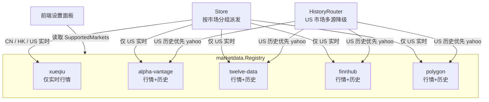
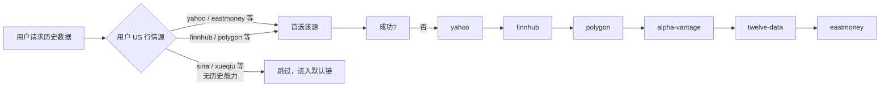

本文档深入解析 InvestGo 中五类特殊行情数据源的实现细节：雪球作为覆盖中港美三地、无需 API Key 的免费聚合源，以及 Alpha Vantage、Twelve Data、Finnhub、Polygon 四家面向美股/美 ETF 的付费 API 提供商。与东方财富、新浪等大众源不同，这五个 Provider 在符号映射、请求批次策略、历史数据粒度和认证机制上各有鲜明的工程特征。理解它们的内部实现，有助于高级开发者进行故障排查、二次扩展或评估新增数据源的接入成本。

## 整体架构与注册关系

在 InvestGo 的架构中，所有行情 Provider 统一通过 `Registry` 注册，Store 在运行时按市场分组将 `WatchlistItem` 派发给对应 Provider，而历史数据则由独立的 `HistoryRouter` 负责多源降级。雪球与四家付费 API 在注册时的关键差异体现在：**雪球仅注册 QuoteProvider，不提供历史数据能力；四家付费 API 同时注册 QuoteProvider 与 HistoryProvider，但仅覆盖 US-STOCK 与 US-ETF 市场**。这种能力与市场的矩阵关系，决定了前端设置面板中的可选范围与历史走势图的回退策略。

下图展示了这五家 Provider 在整个行情数据管线中的位置与交互关系：



Sources: [registry.go](internal/core/marketdata/registry.go#L231-L291)

## 雪球（Xueqiu）—— 跨市场批量行情源

雪球是 InvestGo 默认的港股行情源（`DefaultHKQuoteSourceID = "xueqiu"`），同时也可供 A 股与美股选用。其核心特征是大批量的符号请求能力：单次 HTTP 调用最多可携带 **50 个代码**，通过 `symbol=SH600519,SZ000001,HK00700,AAPL` 形式提交到 `https://stock.xueqiu.com/v5/stock/realtime/quotec.json`。

### 符号映射策略

雪球对 A 股与港股的符号格式有严格要求，不能直接使用内部的 `.SH` / `.SZ` / `.HK` 后缀形式。`resolveXueqiuQuoteSymbol` 函数负责将 `QuoteTarget` 转换为雪球协议格式：**上海代码去掉 `.SH` 并加 `SH` 前缀，深圳代码去掉 `.SZ` 并加 `SZ` 前缀，港股去掉 `.HK` 并加 `HK` 前缀，美股代码保持原样**。北京交易所（`.BJ`）不在雪球的支持范围内，遇到时会直接返回错误。

Sources: [xueqiu.go](internal/core/provider/xueqiu.go#L169-L184)

### 请求头与批次控制

由于雪球接口带有反爬虫校验，`Fetch` 方法必须设置完整的浏览器请求头，包括 `User-Agent`、`Referer`（`https://xueqiu.com/`）和 `Origin`（`https://xueqiu.com`）。整个 `Fetch` 流程先将目标代码按 `xueqiuBatchSize = 50` 切分，再逐批发送。如果某一批次失败，错误会被收集到 `problems` 切片中，而成功的批次继续解析，最终通过 `errs.JoinProblems` 返回部分成功、部分失败的聚合错误。

Sources: [xueqiu.go](internal/core/provider/xueqiu.go#L82-L159)

### 数据解析与容错

雪球返回的 JSON 结构中，价格字段均为 `*float64` 指针类型，允许服务端在缺失时省略字段。`derefFloat64` 辅助函数将 `nil` 安全降级为 `0`。此外，时间戳字段为 Unix 毫秒级整数，解析后转为 `time.Time`。若解析后的 `CurrentPrice <= 0`，该条报价会被丢弃，避免将无效数据写入 Store。

Sources: [xueqiu.go](internal/core/provider/xueqiu.go#L121-L152)

## 付费 API Provider 的共性设计模式

Alpha Vantage、Twelve Data、Finnhub 与 Polygon 在代码结构上遵循高度一致的模板，这种统一性使得新增同类付费 API 时可以直接套用现有骨架。它们的共性可归纳为以下四点：

**1. 懒加载 Settings 与 API Key 校验**

四家 Provider 的构造函数均接收 `func() core.AppSettings` 而非静态字符串。这样在 `Fetch` 执行时才能读取用户最新的 API Key，避免应用启动后修改设置需要重启。若 Key 为空字符串，`Fetch` 会立即返回错误，提示用户前往设置面板配置。

**2. 逐符号串行请求**

与雪球的批量接口不同，这四家付费 API 均对单个 `symbol` 发起独立 HTTP 请求。在 `Fetch` 循环内部，每处理一个 `WatchlistItem` 就调用一次内部函数（如 `fetchAlphaVantageQuote`）。这种设计虽然增加了 RTT，但符合大多数付费 API 的速率限制模型，也便于逐条收集错误。

**3. 严格的市场过滤**

四家 Provider 都显式拒绝非美股标的：`if target.Market != "US-STOCK" && target.Market != "US-ETF"` 时直接追加错误并 `continue`。这意味着即使用户在设置面板误将它们选为中概股或港股源，运行时也不会发起无效请求。

**4. 统一的 Quote 组装**

所有 Provider 都调用 `BuildQuote` 辅助函数，将原始价格字段转换为标准化的 `core.Quote` 结构。该函数会自动计算 `Change` 与 `ChangePercent`，并统一填充 `Source` 与 `UpdatedAt` 字段。

Sources: [alphavantage.go](internal/core/provider/alphavantage.go#L38-L84) [twelvedata.go](internal/core/provider/twelvedata.go#L65-L111) [finnhub.go](internal/core/provider/finnhub.go#L49-L95) [polygon.go](internal/core/provider/polygon.go#L72-L118)

## Alpha Vantage —— 经典 REST 分级接口

Alpha Vantage 是四家付费源中历史数据接口最丰富的一家，支持从日内到月线的完整分级体系。其实时行情端点采用 `GLOBAL_QUOTE` 函数，返回扁平的键值对结构，键名带有数字前缀（如 `05. price`、`08. previous close`）。历史数据端点则根据 `HistoryInterval` 动态选择函数名与时间序列键：

| 前端区间 | Alpha Vantage 函数 | 序列键 |
|---|---|---|
| 1h / 1d | TIME_SERIES_INTRADAY (60min) | Time Series (60min) |
| 1w / 1mo / 1y | TIME_SERIES_DAILY | Time Series (Daily) |
| 3y | TIME_SERIES_WEEKLY | Weekly Time Series |
| all | TIME_SERIES_MONTHLY | Monthly Time Series |

历史数据解析使用 `map[string]json.RawMessage` 进行二次反序列化，这样可以先检查 `Error Message`、`Information`、`Note` 等顶层错误字段，再提取具体的时间序列数据。时间序列内部再次反序列化为 `map[string]map[string]string`，最终按时间戳排序后通过 `TrimHistoryPoints` 截取目标窗口。

Sources: [alphavantage.go](internal/core/provider/alphavantage.go#L191-L265)

## Twelve Data —— 结构化元数据与输出控制

Twelve Data 的响应格式比 Alpha Vantage 更为规整。实时行情返回 `twelveDataQuoteResponse`，字段均为普通字符串（如 `close`、`previous_close`、`percent_change`），可直接通过 `ParseFloat` 转换。历史数据返回 `twelveDataSeriesResponse`，包含 `meta` 对象（符号、名称、币种）与 `values` 数组。

Twelve Data 的显著特点是**粒度与输出量可精确控制**：

| 前端区间 | interval | outputsize |
|---|---|---|
| 1h | 5min | 24 |
| 1d | 15min | 120 |
| 1w | 1day | 10 |
| 1mo | 1day | 40 |
| 1y | 1day | 260 |
| 3y | 1week | 170 |
| all | 1month | 120 |

`outputsize` 的精确控制减少了网络传输量，对于移动端或高延迟网络场景尤为友好。历史数据同样通过 `TrimHistoryPoints` 做二次裁剪，保证前端只拿到精确时间窗口内的数据。

Sources: [twelvedata.go](internal/core/provider/twelvedata.go#L257-L289)

## Finnhub —— 紧凑数组型 K 线

Finnhub 的实时行情接口极为紧凑：`/api/v1/quote` 返回 JSON 对象仅包含 `c`（当前价）、`h`（最高价）、`l`（最低价）、`o`（开盘价）、`pc`（昨收）、`t`（时间戳）六个字段。这种极简结构解析速度快，适合高频轮询场景。

历史数据则采用**并行数组（parallel arrays）**设计：`finnhubCandleResponse` 中的 `o`、`h`、`l`、`c`、`v`、`t` 分别是长度相同的切片，而非对象数组。`fetchFinnhubHistory` 通过 `MinInt` 计算各切片的最小长度，再按索引逐条组装为 `core.HistoryPoint`。这种格式在数据量大时比对象数组更节省带宽，但需要开发者自行保证数组对齐。

| 前端区间 | resolution | 说明 |
|---|---|---|
| 1h | 5 | 5 分钟线 |
| 1d | 15 | 15 分钟线 |
| 1w / 1mo / 1y / 3y | D | 日线 |
| 3y | W | 周线 |
| all | M | 月线 |

Sources: [finnhub.go](internal/core/provider/finnhub.go#L144-L249)

## Polygon —— 快照与聚合双端点

Polygon 是目前体系中功能最完整的付费源之一，其报价与历史数据分别使用两个完全不同的端点体系。实时行情调用 **Snapshot API**（`v2/snapshot/locale/us/markets/stocks/tickers/{symbol}`），返回嵌套结构 `ticker`，内部包含 `lastTrade`（最新成交价）、`day`（当日 OHLCV）与 `prevDay`（昨收）。解析逻辑做了多层降级：若 `lastTrade` 缺失，则回退到 `day.close`；若 `day` 缺失，则回退到 `min`（分钟级聚合）字段。

历史数据调用 **Aggregates API**（`v2/aggs/ticker/{symbol}/range/{multiplier}/{resolution}/{from}/{to}`），这是典型的 RESTful 聚合查询接口：

| 前端区间 | multiplier | resolution |
|---|---|---|
| 1h | 5 | minute |
| 1d | 15 | minute |
| 1w / 1mo / 1y | 1 | day |
| 3y | 1 | week |
| all | 1 | month |

Polygon 返回的 `results` 是对象数组，每个对象包含 `t`（时间戳）、`o`、`h`、`l`、`c`、`v`。由于 Polygon 的时间戳精度不固定（可能是秒、毫秒或纳秒），`polygonTimestamp` 函数通过阈值判断自动选择 `time.Unix`、`time.UnixMilli` 或 `time.Unix(0, value)`，避免时区与精度错误。

Sources: [polygon.go](internal/core/provider/polygon.go#L167-L298)

## 历史数据路由与降级链

雪球不提供历史数据能力，因此在 `HistoryRouter` 的 `providers` 映射中不存在 `xueqiu` 键。四家付费 API 均注册了 `HistoryProvider`，但在 US 市场的默认降级链中处于特定优先级。`defaultHistoryChain` 对美股历史的回退顺序为：

```
yahoo → finnhub → polygon → alpha-vantage → twelve-data → eastmoney
```

这意味着：当用户将美股行情源设为雪球（无历史能力）或某个付费 API（网络故障或限流）时，`HistoryRouter` 会自动按上述链式顺序尝试，直到某一源成功返回数据。如果用户明确将某个支持历史的付费 API（如 Polygon）选为美股源，且该源在 `providers` 映射中存在，则该源会被置于链首，优先尝试。



Sources: [history_router.go](internal/core/marketdata/history_router.go#L140-L147)

## 配置模型与 API Key 校验

四家付费 Provider 的 API Key 存储在 `core.AppSettings` 中，字段分别为 `AlphaVantageAPIKey`、`TwelveDataAPIKey`、`FinnhubAPIKey`、`PolygonAPIKey`。`sanitiseSettings` 在保存设置时执行严格校验：如果用户将某个市场的行情源选为对应的付费 Provider，但对应 Key 为空，则整个设置保存会被拒绝并返回明确错误（如 `"Alpha Vantage API key is required"`）。这一校验在前端体现为设置面板中的即时提示。

雪球作为免费源，无需 API Key，也不参与 Key 校验逻辑。其默认地位体现在 `core.DefaultHKQuoteSourceID = "xueqiu"`，即新用户或未明确配置港股源时，系统会自动回退到雪球。

| Provider | Settings 字段 | 必填 Key | 支持市场 | 历史数据 |
|---|---|---|---|---|
| Xueqiu | — | 否 | CN, HK, US | 否 |
| Alpha Vantage | `AlphaVantageAPIKey` | 是 | US-STOCK, US-ETF | 是 |
| Twelve Data | `TwelveDataAPIKey` | 是 | US-STOCK, US-ETF | 是 |
| Finnhub | `FinnhubAPIKey` | 是 | US-STOCK, US-ETF | 是 |
| Polygon | `PolygonAPIKey` | 是 | US-STOCK, US-ETF | 是 |

Sources: [model.go](internal/core/model.go#L131-L134) [settings_sanitize.go](internal/core/store/settings_sanitize.go#L88-L105)

## 扩展建议与注意事项

对于计划新增其他付费行情源（如 IEX Cloud、MarketData）的开发者，建议遵循以下工程约定：构造函数接收 `*http.Client` 与 `func() core.AppSettings`；`Fetch` 内部先校验 API Key，再逐符号请求；仅支持的市场返回 `Quote`，不支持的市场收集到 `problems` 切片；历史数据通过 `ApplyHistorySummary` 统一计算区间统计；最后将新源同时注册到 `Registry` 的 `quote` 与 `history` 字段，并根据其稳定性在 `defaultHistoryChain` 中安排合适位置。

如需了解 Provider 如何被 Store 按市场分组调度，请参阅 [行情数据 Provider 注册与路由机制](7-xing-qing-shu-ju-provider-zhu-ce-yu-lu-you-ji-zhi)。如需了解符号解析器如何将用户输入转换为 `QuoteTarget`，请参阅 [行情符号规范化与市场解析](8-xing-qing-fu-hao-gui-fan-hua-yu-shi-chang-jie-xi)。历史缓存与走势图的加载策略在 [历史走势图数据加载与缓存](24-li-shi-zou-shi-tu-shu-ju-jia-zai-yu-huan-cun) 中有详细说明。