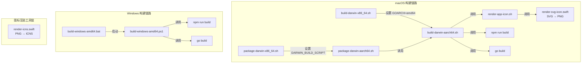

InvestGo 的构建体系需要同时支持 macOS（Apple Silicon 与 Intel）和 Windows 两个桌面平台，并在编译阶段将版本号、开发标志等元数据注入最终二进制。项目没有采用单一的构建工具链抽象层，而是为每个目标平台编写了原生脚本——macOS 使用 Bash 结合 Swift 工具链，Windows 使用 PowerShell 配合批处理包装器。这种设计让各平台脚本能够直接调用系统原生工具，避免了跨平台构建抽象层带来的复杂性和遮蔽效应。本文档聚焦于构建脚本的组织架构、版本注入的编译时机制，以及各平台构建行为的差异与配置方式。

Sources: [README.zh-CN.md](README.zh-CN.md#L95-L148)

## 构建脚本体系架构

项目将所有构建相关的脚本统一放置在 `scripts/` 目录下，按平台与职责分层。核心设计原则是**统一入口、差异隔离、环境驱动**：Darwin 的 `x86_64` 构建并非独立脚本，而是通过复用 `aarch64` 脚本并覆盖架构相关环境变量来实现；同理，`package-darwin-x86_64.sh` 也是 `package-darwin-aarch64.sh` 的薄包装。Windows 则采用 PowerShell 作为核心构建引擎，再用 `.bat` 包装器解决命令提示符与资源管理器双击执行时的窗口保持问题。

从架构图可以看出，macOS 构建链路明显更长，因为它需要在构建阶段生成 `appicon.png`，并在打包阶段通过 `render-icns.swift` 生成 macOS 应用 bundle 所需的 `.icns` 图标文件。Windows 构建链路则更短，图标处理仅在缺失 `build/appicon.png` 时执行一次简单的文件复制或 ImageMagick 转换。

Sources: [scripts/build-darwin-x86_64.sh](scripts/build-darwin-x86_64.sh#L1-L10), [scripts/package-darwin-x86_64.sh](scripts/package-darwin-x86_64.sh#L1-L10), [scripts/build-windows-amd64.bat](scripts/build-windows-amd64.bat#L1-L23)

## 编译时版本注入机制

InvestGo 的版本号并非硬编码在源码中，而是通过 Go 链接器的 `-ldflags "-X main.appVersion=$APP_VERSION"` 在编译时注入到 `main` 包的包级变量。`main.go` 中定义了三个可被 `-X` 覆盖的字符串变量：`appVersion`（应用版本，默认 `"dev"`）、`defaultTerminalLogging`（终端日志开关，默认 `"0"`）、`defaultDevToolsBuild`（开发者工具支持，默认 `"0"`）。

当用户执行 `VERSION=0.1.0 ./scripts/build-darwin-aarch64.sh` 时，脚本将 `APP_VERSION` 解析为 `0.1.0`，并拼接成 `-ldflags "-s -w -X main.appVersion=0.1.0"` 传递给 `go build`。`-s` 和 `-w` 分别剥离符号表和 DWARF 调试信息，以减小编译产物体积。如果同时传入 `--dev` 参数，脚本还会追加 `-X main.defaultTerminalLogging=1 -X main.defaultDevToolsBuild=1`，使得编译出的二进制默认开启终端日志输出，并在开发者模式开启时支持 F12 唤起 Web Inspector。

这种链接时注入的优势在于：同一套源代码可以无差别地编译出带有不同版本标识和调试能力的二进制，无需修改任何 `.go` 文件或引入代码生成步骤。`main.go` 中的 `terminalLoggingEnabled()` 和 `devToolsBuildEnabled()` 函数在运行时读取这些变量的值，决定日志行为和开发者工具的可用性。

Sources: [main.go](main.go#L24-L26), [main.go](main.go#L170-L188), [scripts/build-darwin-aarch64.sh](scripts/build-darwin-aarch64.sh#L68-L75), [scripts/build-windows-amd64.ps1](scripts/build-windows-amd64.ps1#L90-L97)

## 构建流程与平台差异

尽管所有平台的构建脚本都遵循"渲染图标 → 构建前端 → 编译 Go 二进制"的三阶段流程，但各平台在 CGO 配置、架构变量、输出路径和图标处理上存在显著差异。下表对比了 macOS 与 Windows 构建脚本的核心行为：

| 维度 | macOS (Darwin) | Windows |
|---|---|---|
| **核心脚本** | `build-darwin-aarch64.sh`（被 x86_64 脚本复用） | `build-windows-amd64.ps1`（由 `.bat` 包装） |
| **CGO 启用状态** | `CGO_ENABLED=1`（Wails v3 macOS 需要） | `CGO_ENABLED=0` |
| **目标架构** | `GOARCH=arm64` 或 `amd64` | `GOARCH=amd64` |
| **最小系统版本** | `MACOSX_DEPLOYMENT_TARGET=13.0`，并通过 `CGO_CFLAGS` / `CGO_LDFLAGS` 注入 `-mmacosx-version-min` | 不涉及 |
| **图标渲染** | 通过 `render-app-icon.sh` 调用 Swift 脚本将 SVG 渲染为 PNG | 仅复制或缩放 `frontend/src/assets/appicon.png` |
| **版本注入格式** | `-X main.appVersion=$APP_VERSION` | `-X main.appVersion=$AppVersion` |
| **开发标志注入** | `--dev` 时追加 terminalLogging 与 devToolsBuild | `-Dev` 开关时同样追加 |
| **构建标签** | `production` 或 `production devtools` | `production` 或 `production devtools` |
| **输出路径** | `build/bin/investgo-darwin-{aarch64\|x86_64}` | `build/bin/investgo-windows-amd64.exe` |

macOS 脚本之所以必须启用 CGO，是因为 Wails v3 在 macOS 上依赖原生 Cocoa API 进行窗口管理和 WebView 渲染，需要通过 CGO 调用 Objective-C 运行时。Windows 版本则使用纯 Go 编译配合系统 Edge WebView2 Runtime，因此可以关闭 CGO 以简化交叉编译和依赖管理。

Sources: [scripts/build-darwin-aarch64.sh](scripts/build-darwin-aarch64.sh#L60-L76), [scripts/build-windows-amd64.ps1](scripts/build-windows-amd64.ps1#L86-L97)

## 构建标签与开发模式

构建脚本通过 Go 的构建标签（build tags）控制编译条件。生产构建使用 `-tags production`，开发构建则追加 `devtools` 标签为 `-tags "production devtools"`。在 `main.go` 中，虽然源码层面没有显式的 `//go:build devtools` 条件编译指令，但 `defaultDevToolsBuild` 变量的值由构建脚本通过 `-ldflags` 注入，从而实现了"构建标签 + 链接器标志"的双重控制机制。

`--dev`（macOS）或 `-Dev`（Windows）模式的核心价值在于：它允许开发者从同一个代码基编译出支持 F12 打开 Web Inspector 的二进制，而无需修改源代码。当用户在应用中按下 F12 时，`main.go` 首先检查 `store.Snapshot().Settings.DeveloperMode` 设置项，再检查 `devToolsBuildEnabled()`——即当前二进制是否是在 devtools 模式下编译的。这种双重校验防止了正式版应用被意外打开开发者工具，同时让调试版本的构建过程完全脚本化、可复现。

Sources: [scripts/build-darwin-aarch64.sh](scripts/build-darwin-aarch64.sh#L69-L73), [main.go](main.go#L128-L141)

## 环境变量与可配置参数

构建脚本设计为"环境变量驱动"，几乎所有关键路径和版本信息都可以通过外部环境变量覆盖，而不需要修改脚本本身。这种设计使得 CI/CD 流水线可以方便地注入版本号、自定义输出路径或覆盖缓存目录。以下是各平台构建脚本支持的核心环境变量与参数：

| 变量 / 参数 | 平台 | 默认值 | 用途 |
|---|---|---|---|
| `VERSION` / `APP_VERSION` | 全部 | `dev` | 注入到 `main.appVersion` 的版本号 |
| `OUTPUT_FILE` | 全部 | 平台相关 | 编译产物的输出路径 |
| `--dev` / `-Dev` | 全部 | 关闭 | 启用开发者工具与终端日志支持 |
| `DARWIN_GOARCH` | macOS | `arm64` / `amd64` | Go 目标架构 |
| `DARWIN_PLATFORM_NAME` | macOS | `aarch64` / `x86_64` | 输出文件名中的平台标识 |
| `MACOS_MIN_VERSION` | macOS | `13.0` | 最小支持的 macOS 版本 |
| `MACOSX_DEPLOYMENT_TARGET` | macOS | 同 `MACOS_MIN_VERSION` | 系统部署目标 |
| `CGO_CFLAGS` / `CGO_LDFLAGS` | macOS | `-mmacosx-version-min=13.0` | CGO 编译与链接标志 |
| `GOCACHE` | 全部 | `/tmp/go-build-cache`（macOS）/ `%TEMP%/go-build-cache`（Windows） | Go 构建缓存目录 |
| `ICON_SOURCE` | Windows | `frontend/src/assets/appicon.png` | 图标源文件路径 |
| `APP_ICON_OUTPUT_FILE` | Windows | `build/appicon.png` | 图标输出路径 |
| `ICON_SIZE` | Windows | `1024` | 图标渲染尺寸 |

在 macOS 上，如果仅需构建二进制而不打包 `.app` 或 `.dmg`，直接调用对应的 `build-darwin-*.sh` 脚本即可；若需要完整的应用分发包，则应调用 `package-darwin-*.sh`，后者会在内部调用构建脚本并传递一致的版本参数，确保二进制版本与 `Info.plist` 中的版本保持同步。

Sources: [scripts/build-darwin-aarch64.sh](scripts/build-darwin-aarch64.sh#L14-L20), [scripts/build-windows-amd64.ps1](scripts/build-windows-amd64.ps1#L1-L53), [scripts/package-darwin-aarch64.sh](scripts/package-darwin-aarch64.sh#L13-L40)

## 打包脚本与构建脚本的协作关系

打包脚本 `package-darwin-aarch64.sh` 并不独立执行编译，而是通过调用构建脚本完成二进制生成，并将 `OUTPUT_FILE` 指向 `.app` bundle 内部的 `MacOS/investgo` 路径。这种职责分离意味着：构建脚本专注于"生成单个可执行文件"，打包脚本专注于"组装符合 macOS 规范的 `.app` 目录结构、生成 `.icns` 图标、渲染 `Info.plist`、以及可选的代码签名与 DMG 创建"。

打包脚本在调用构建脚本时，会确保 `MACOS_MIN_VERSION` 环境变量一致传递，使得编译时的 `CGO_CFLAGS` / `CGO_LDFLAGS` 与最终 `Info.plist` 中的 `LSMinimumSystemVersion` 完全匹配。版本号 `VERSION` 则同时被注入到二进制（通过 `-ldflags`）和 `Info.plist`（通过 `CFBundleVersion` 与 `CFBundleShortVersionString`），保证应用关于对话框和系统层面显示一致。

由于打包与 DMG 生成的详细流程属于独立的交付阶段，其完整机制将在 [macOS 应用打包与 DMG 生成](29-macos-ying-yong-da-bao-yu-dmg-sheng-cheng) 中展开说明。

Sources: [scripts/package-darwin-aarch64.sh](scripts/package-darwin-aarch64.sh#L173-L208), [build/Info.plist.template](build/Info.plist.template#L1-L27)

## 相关阅读

完成构建与版本注入的理解后，你可以继续深入以下主题：

- 若需要生成可分发的 macOS 应用与安装镜像，请参阅 [macOS 应用打包与 DMG 生成](29-macos-ying-yong-da-bao-yu-dmg-sheng-cheng)。
- 若需要了解 InvestGo 的入口架构与 Wails v3 集成方式，请参阅 [应用入口与 Wails v3 集成](4-ying-yong-ru-kou-yu-wails-v3-ji-cheng)。
- 若需要了解桌面应用的整体构建与打包指引，请参阅 [桌面应用构建与打包](3-zhuo-mian-ying-yong-gou-jian-yu-da-bao)。