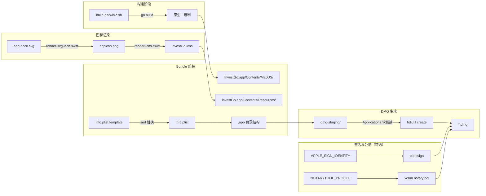

本文档聚焦 InvestGo 桌面端在 macOS 平台上的最终交付环节：将跨平台构建脚本产出的原生二进制文件，与图标、元数据及 plist 配置一起组装为符合 macOS 规范的 `.app` Bundle，并最终压缩生成可供分发的 `.dmg` 安装镜像。这一流程与前置的构建阶段紧密衔接，如果你在阅读前尚未了解版本注入与编译过程，建议先回顾 [跨平台构建脚本与版本注入](28-kua-ping-tai-gou-jian-jiao-ben-yu-ban-ben-zhu-ru)。

Sources: [package-darwin-aarch64.sh](scripts/package-darwin-aarch64.sh#L1-L39), [package-darwin-x86_64.sh](scripts/package-darwin-x86_64.sh#L1-L10)

## 打包流程全景

InvestGo 的 macOS 打包并非单一脚本的一次性操作，而是由「构建编译」「图标渲染」「Bundle 组装」「DMG 生成」以及可选的「签名公证」五个阶段组成的管道。整个管道以 `package-darwin-aarch64.sh` 为主控脚本，Intel 架构的打包则通过 `package-darwin-x86_64.sh` 注入平台变量后复用同一套逻辑，形成简洁的**主控-委托**模式。



Sources: [package-darwin-aarch64.sh](scripts/package-darwin-aarch64.sh#L173-L232), [build-darwin-aarch64.sh](scripts/build-darwin-aarch64.sh#L1-L78)

## 构建前置与二进制产出

打包脚本在执行自身逻辑之前，首先会调用对应架构的构建脚本完成前端资源编译与 Go 二进制文件链接。`build-darwin-aarch64.sh` 负责设置 `GOARCH=arm64`、`CGO_ENABLED=1` 以及 macOS 最低版本相关的 `CGO_CFLAGS` 与 `CGO_LDFLAGS`；`build-darwin-x86_64.sh` 则仅覆写 `GOARCH=amd64` 和 `DARWIN_PLATFORM_NAME` 后委托给前者执行。这种设计确保了两套架构的编译差异被收敛到环境变量层面，而编译逻辑本身完全复用。

构建阶段还会完成两个对打包至关重要的动作：一是通过 `-ldflags "-X main.appVersion=$APP_VERSION"` 将版本号注入到 `main.go` 中的 `appVersion` 变量，使最终应用在关于页面或日志中呈现正确的发布版本；二是在启用 `--dev` 时追加 `devtools` 构建标签，并注入 `defaultTerminalLogging` 与 `defaultDevToolsBuild` 标志位，为打包后的应用保留 F12 唤起 Web Inspector 的能力。这些注入点直接决定了 Bundle 内二进制文件的行为特征。

Sources: [build-darwin-aarch64.sh](scripts/build-darwin-aarch64.sh#L13-L78), [build-darwin-x86_64.sh](scripts/build-darwin-x86_64.sh#L1-L10), [main.go](main.go#L24-L36)

## 图标渲染与 ICNS 生成

macOS 应用图标需要以 `.icns` 格式置于 Bundle 的 `Resources` 目录中。InvestGo 的图标链路从 `frontend/src/assets/app-dock.svg` 出发，经过两道 Swift 脚本处理：首先由 `render-svg-icon.swift` 调用 AppKit 将矢量 SVG 渲染为 1024×1024 像素的 `appicon.png`；随后 `render-icns.swift` 读取该 PNG，利用 `CGImageDestination` 按 macOS 规范生成包含 16、32、64、128、256、512、1024 七种分辨率的 ICNS 文件。

为了在无 Swift 环境或渲染失败时保持鲁棒性，打包脚本在 `generate_icns` 函数中实现了优雅降级：若 `swift` 命令不可用或 `render-icns.swift` 执行后未产出有效文件，则退而使用 `sips` 命令逐尺寸缩放 PNG，生成标准的 `.iconset` 目录，再调用 `iconutil --convert icns` 完成格式转换。降级路径虽然依赖更多命令行工具，但保证了构建环境的最大兼容性。

Sources: [render-app-icon.sh](scripts/render-app-icon.sh#L1-L31), [render-svg-icon.swift](scripts/render-svg-icon.swift#L1-L74), [render-icns.swift](scripts/render-icns.swift#L1-L82), [package-darwin-aarch64.sh](scripts/package-darwin-aarch64.sh#L105-L136)

## App Bundle 目录结构组装

macOS `.app` 本质上是一个遵循特定目录结构的文件夹。`build_app_bundle` 函数在 `build/macos/InvestGo.app` 下创建标准的三层结构：

| 路径 | 内容 | 来源 |
|---|---|---|
| `Contents/MacOS/investgo` | 可执行二进制文件 | 构建脚本输出的原生二进制 |
| `Contents/Resources/InvestGo.icns` | 应用图标 | `generate_icns` 产出的 ICNS 文件 |
| `Contents/Info.plist` | Bundle 元数据 | 由模板经 `sed` 变量替换生成 |
| `Contents/PkgInfo` | 包类型标识 | 固定写入 `APPL????` |

`Info.plist` 的生成采用模板替换策略。`build/Info.plist.template` 中预留了 `__APP_NAME__`、`__BINARY_NAME__`、`__APP_ID__`、`__VERSION__`、`__ICON_FILE__`、`__MACOS_MIN_VERSION__` 六个占位符，打包脚本通过 `render_info_plist` 函数调用 `sed` 完成一次性替换。这种方式避免了在脚本中内嵌冗长的 XML，同时让元数据修改一目了然。

Sources: [package-darwin-aarch64.sh](scripts/package-darwin-aarch64.sh#L173-L208), [build/Info.plist.template](build/Info.plist.template#L1-L27)

## DMG 安装镜像生成

DMG 的生成遵循 macOS 原生的 `hdiutil` 工作流。脚本首先创建 `build/dmg-staging` 临时目录，使用 `ditto` 将已组装好的 `.app` Bundle 复制进去，随后在该目录内建立一个指向 `/Applications` 的符号链接。这一经典布局使得用户在打开 DMG 后，只需将应用拖拽到 Applications 文件夹即可完成安装。

完成目录编排后，脚本执行 `hdiutil create` 并指定 `-format UDZO` 格式，即使用 zlib 压缩的只读 DMG 镜像。`-ov` 参数允许覆盖已有同名文件，保证重复构建时的幂等性。最终产物按 `investgo-<VERSION>-darwin-<PLATFORM>.dmg` 的命名规则输出到 `build/bin/` 目录，与跨平台构建产物保持统一存放。

Sources: [package-darwin-aarch64.sh](scripts/package-darwin-aarch64.sh#L210-L232)

## 代码签名与公证

面向最终用户分发的 macOS 应用通常需要经过 Apple 的代码签名与公证流程才能通过 Gatekeeper 检查。InvestGo 的打包脚本将这两个环节设计为**可选且显式**的，仅在对应环境变量存在时才会触发，避免对本地开发或内部测试造成阻碍。

签名环节分为两步：`sign_app_if_configured` 在 Bundle 组装完成后使用 `codesign` 对 `.app` 目录进行深度签名（`--deep --options runtime --timestamp`）；`sign_dmg_if_configured` 则在 DMG 生成完成后对镜像本身追加签名。如果设置了 `NOTARYTOOL_PROFILE`，脚本还会调用 `xcrun notarytool submit` 将 DMG 提交至 Apple 公证服务，并在成功后通过 `xcrun stapler staple` 将公证凭证附加到镜像中，实现离线验证。

Sources: [package-darwin-aarch64.sh](scripts/package-darwin-aarch64.sh#L138-L171)

## 环境变量与行为控制

打包脚本支持丰富的环境变量覆盖，下表汇总了常用配置项及其默认值：

| 环境变量 | 默认值 | 说明 |
|---|---|---|
| `VERSION` | `0.1.0` | 应用版本号，同时影响 Info.plist 与 DMG 文件名 |
| `APP_NAME` | `InvestGo` | 应用显示名称 |
| `BINARY_NAME` | `investgo` | 可执行文件名 |
| `APP_ID` | `com.example.investgo` | Bundle Identifier |
| `MACOS_MIN_VERSION` | `13.0` | 最低支持的 macOS 版本 |
| `APPLE_SIGN_IDENTITY` | 未设置 | Apple Developer 签名证书标识，未设置则跳过签名 |
| `NOTARYTOOL_PROFILE` | 未设置 | notarytool 钥匙串配置名，需配合签名证书使用 |
| `SKIP_APP_BUILD` | `0` | 设为 `1` 则跳过构建，直接打包已有二进制 |
| `SKIP_DMG_CREATE` | `0` | 设为 `1` 则只生成 `.app` Bundle，不创建 DMG |

此外，`--dev` 命令行选项会向下游构建脚本传递开发模式标志，使产出的应用支持 F12 唤起开发者工具。此选项仅影响二进制行为，不会改变 Bundle 结构。

Sources: [package-darwin-aarch64.sh](scripts/package-darwin-aarch64.sh#L13-L70)

## 典型使用示例

针对 Apple Silicon 设备构建并打包正式版：

```bash
VERSION=0.2.0 ./scripts/package-darwin-aarch64.sh
```

针对 Intel Mac 构建并打包，同时启用开发调试能力：

```bash
VERSION=0.2.0 ./scripts/package-darwin-x86_64.sh --dev
```

仅组装 Bundle 用于本地测试，跳过构建与 DMG：

```bash
SKIP_APP_BUILD=1 SKIP_DMG_CREATE=1 ./scripts/package-darwin-aarch64.sh
```

完成打包后，你可以在 `build/macos/InvestGo.app` 找到可直接运行的应用，在 `build/bin/` 下找到形如 `investgo-0.2.0-darwin-aarch64.dmg` 的分发镜像。

Sources: [package-darwin-aarch64.sh](scripts/package-darwin-aarch64.sh#L234-L275), [package-darwin-x86_64.sh](scripts/package-darwin-x86_64.sh#L1-L10)

## 故障排查速查

| 现象 | 可能原因 | 排查方向 |
|---|---|---|
| 提示 `Missing required command: swift` | 系统未安装 Xcode Command Line Tools | 安装 Xcode 或单独安装 Command Line Tools |
| `Generated icns file is empty` | 图标源文件损坏或 `sips`/`iconutil` 异常 | 检查 `build/appicon.png` 是否存在且有效 |
| `Missing Info.plist template` | 模板文件缺失 | 确认 `build/Info.plist.template` 存在于仓库中 |
| DMG 打开后无法拖拽安装 | 未在 staging 目录创建 Applications 软链接 | 检查打包脚本中的 `ln -s /Applications` 步骤 |
| 签名后应用仍被 Gatekeeper 拦截 | 仅签名了 `.app` 但未公证 DMG | 确认 `NOTARYTOOL_PROFILE` 已设置且公证流程成功 |
| `--dev` 模式下 F12 无效 | 应用设置中未开启开发者模式 | 在应用偏好设置中启用 Developer Mode |

Sources: [package-darwin-aarch64.sh](scripts/package-darwin-aarch64.sh#L72-L86), [main.go](main.go#L128-L141)

## 延伸阅读

打包是 InvestGo 工程化闭环的最后一步。如果你在调试打包产物时遇到运行期问题，或希望深入了解开发模式下调试能力的实现原理，可以继续阅读 [开发模式与调试技巧](30-kai-fa-mo-shi-yu-diao-shi-ji-qiao)。若你需要回朔构建阶段的技术细节，请参阅 [跨平台构建脚本与版本注入](28-kua-ping-tai-gou-jian-jiao-ben-yu-ban-ben-zhu-ru)。